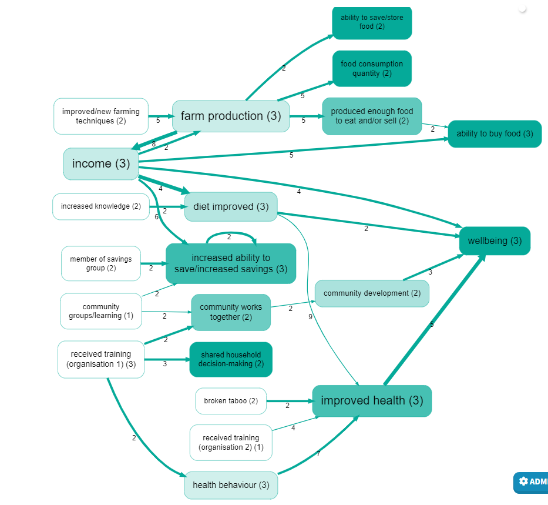
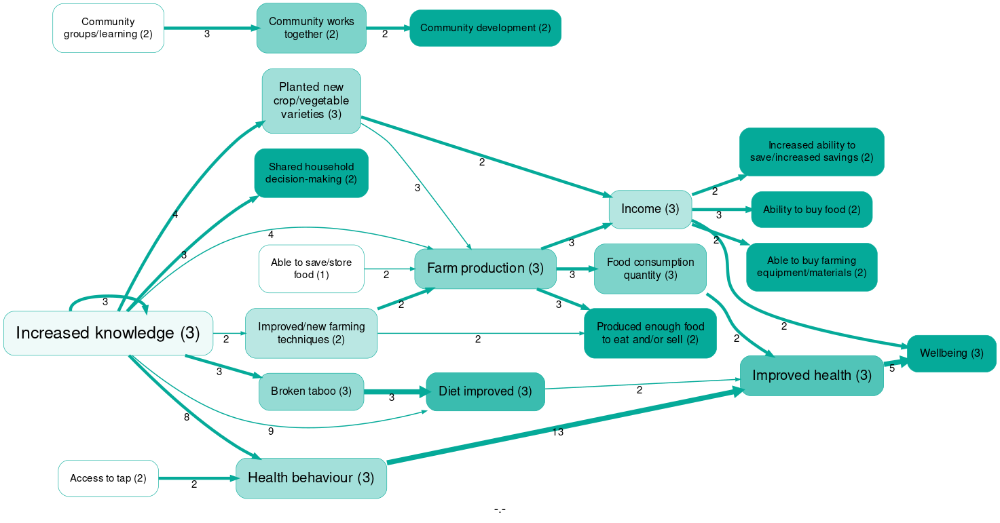

**AI-assisted causal mapping: a validation study

How well does an untrained AI assistant perform in identifying and labelling causal links within a corpus of stories told by recipients of international development aid, compared with human experts? 

[Steve Powell](mailto:steve@pogol.net)

[Gabriele Caldas Cabral](mailto:gabrielecaldasc@gmail.com)

# Abstract

People doing causal systems mapping are often interested in harvesting claims about causal links from text sources, for example from interview transcripts with experts: a task which used to be time-consuming. In this paper, we show how to use generative AI as a low-level assistant to exhaustively and transparently identify and then summarise causal claims. We use techniques from causal mapping [(Axelrod, 1976)](https://www.zotero.org/google-docs/?JxDOTw). We do not try to model the system or assess the strength of causal links, but rather to assess the strength of the evidence for each causal link or pathway: an approach which is comparatively easy to automate. 

We ask: Is the ability of LLMs to identify causal claims within texts of sufficient quality to be useful, and what can we say about reliability or validity? The results are encouraging. We conclude by discussing risks and ethical issues, as well as suggesting some areas for further research.

Keywords: Causal mapping; Generative AI; LLM; Validation.

# Introduction

People doing causal systems mapping are often interested in harvesting claims about causal links from text sources, like interview transcripts. Extracting causal claims from documents using traditional Qualitative Data Analysis (QDA) approaches can reveal deep meanings, but they are extremely time-consuming and influenced by the positionality of individual researchers. New Large Language Models (LLMs) have changed the picture. 

In this paper, we demonstrate a simple, generic way to use generative Artificial Intelligence (AI) as a low-level assistant to exhaustively and transparently identify large numbers of individual causal claims within texts such as stakeholder interviews and then to summarise them rapidly and at scale. 

## Causal mapping

One key part of our approach is that we use techniques from the field of causal mapping [(Ackermann & Eden, 2004; Axelrod, 1976; Eden et al., 1992; Hodgkinson & Clarkson, 2005; Laukkanen & Wang, 2016; Powell et al., 2023)](https://www.zotero.org/google-docs/?sgDmH1). Causal mapping (or “cognitive mapping”) can be seen as a type of causal systems mapping, or vice versa, or they can be seen as overlapping disciplines [(Powell et al., 2023)](https://www.zotero.org/google-docs/?zf5qf8). The difference is that in systems mapping, an edge from X to Y usually means:

X has some causal influence on Y 

whereas in causal mapping it means:

There is evidence that X has some causal influence on Y

or 

Stakeholder S believes or claims that X has some causal influence on Y. 

Causal mapping is particularly interested in understanding how people (as citizens, stakeholders) understand the "causal landscape" of their everyday lives and the larger systems they are part of: what do they see as the most important current issues, what are the immediate and underlying causes, via which causal pathways. 

The fact that there is strong evidence that X has some causal influence on Y does not imply that there is evidence for a strong influence: the causal mapping approach we apply tries to model the evidence about the system and does not try to model the system itself. It is not well-suited to capturing information about the size or strength of a link. Some schools of causal mapping do at least try to capture the polarity of a causal claim (“positive” or “negative”). Modelling the strength or the polarity of links opens the door to making more sophisticated statements and calculations about the system, including making predictions about future states. Our approach is simpler. We are not trying to model the system but only beliefs about the system. We do not encode beliefs about polarity, relying instead on the labels themselves (e.g. “unemployment” versus “employment”). (A consequence of this is that although we can encode beliefs about a negative feedback loop, such as a heater switching on when the temperature drops, it is not immediately visible as a loop without further manipulation, which we will not cover here.)

## Our “naive” approach to causal coding

Defining what makes a causal link is notoriously challenging. Philosophical discussions on this topic have continued intensely for centuries without a consensus. We found that adopting a “naive”, pragmatic, minimalistic approach to causation [(Powell et al., 2023)](https://www.zotero.org/google-docs/?fK8tFG) simplifies the task. By naive, we mean an approach that deliberately avoids the complexities and differing perceptions of philosophical debates. Instead, we simplify this by not asking for details about causation, such as the size or strength of the effect or sufficient conditions for a particular outcome. We focus merely on identifying undifferentiated causal links: identify evidence that a causal influence exists between two factors without trying to categorise or qualify the nature of the influence. Working with everyday texts becomes significantly more straightforward than it might otherwise seem. Instead, we lean on a wide variety of causal mapping algorithms to extract meaning from an otherwise undifferentiated heap of causal links without attempting to model the causal system itself. This approach, although naive, has been successfully used by the third author and colleagues in over 70 real-life Qualitative Impact Protocol (QuIP) impact evaluation studies.

Systems modellers are often implicitly or explicitly interested in causal inference, reasoning about causal effects: for example, given the link B → C and C → D, what can we deduce about the causal effect of B on D? Whereas causal mapping approach we apply is primarily interested in reasoning about causal evidence, for example asking questions like “Are the sources who mentioned the link B → C the same as those who mentioned the link C → D? Did any sources mention both links?”

Despite these moderate differences in focus and method, the possibility of automated extraction of causal claims from text should be of significant interest to both (overlapping) disciplines. 

The simple, lowest-common-denominator approach to causal link extraction, which we propose, is easy enough that the details of the process can be almost completely automated (apart from critical high-level directions to the AI about what exactly we want to find out).

This kind of causal coding can be understood as a form of QDA, but with a very specific, predefined template which vastly reduces the degrees of freedom facing the analyst when coding a text. Rather than “what should I code and how?” the analyst has to decide only “where are the causal claims in this text; and in each case, what is influencing what?” 

## Automated thematic coding

Recent advancements in AI, particularly with Large Language Models like GPT 4.0, have opened new avenues for researchers in the field of textual analysis. Notably, recent studies such as De Paoli [(2023)](https://www.zotero.org/google-docs/?uip8a9) and Dunivin [(2024)](https://www.zotero.org/google-docs/?lFfh2k) have demonstrated the potential of LLMs in thematic coding. De Paoli concludes that “There is no denying that the model can infer codes and relevant themes, and provide descriptions which are meaningful and even identify patterns which researchers did not consider relevant and ultimately contribute to better qualitative analysis.” [(2023, p. 18)](https://www.zotero.org/google-docs/?0lv4FE).

These studies suggest that LLMs, when instructed appropriately, can "understand" and interpret text for qualitative coding tasks at a level comparable to that of a human analyst. 

## Automated causal coding

Attempts to use LLMs specifically for causal claim extraction from large volumes of text, see Zhang et al. [(2023)](https://www.zotero.org/google-docs/?rmXDcG) and Hooper et al. [(2023)](https://www.zotero.org/google-docs/?H54bxJ), have mostly involved complex sets of instructions and a sophisticated understanding of causality, attempting to quantify the polarity and magnitude of these relationships, with an eye to causal inference and predictive modelling. 

The present paper applies the naive approach to causal coding outlined above to the challenge of using LLMs to extract causal claims from text at scale, and then applies causal mapping techniques to make sense of the data, to construct not models of causal relationships but models of evidence for causal relationships. We hypothesise that the combination of our naive approach to identifying causal claims with generic AI represents a sweet spot for making qualitative sense of large amounts of text because it is simple, generic and can provide useful summaries. 

The rest of the paper gives details of the method and its Variants and overall percentages of correct codings, and discusses the implications for practical application of these techniques, especially with regard to the good results for the higher-level summary causal maps. Finally, we discuss the risks and ethical issues involved with using this kind of AI, as well as suggest some areas for further research.

# Research question

We ask: Is the ability of LLMs to identify causal claims within texts of sufficient quality to be useful, and what can we say about reliability or validity? 

# Method

## The test dataset and the criterion study

The text corpus is from a QuIP study [(Copestake et al., 2019)](https://www.zotero.org/google-docs/?kmMZRA) commissioned by an organisation (in the text we call it Organisation 1 for anonymity purposes) in 2019 to evaluate the organisation’s ‘Agriculture and Nutrition Programme’. The programme included various interventions like WASH & Nutrition advice, agricultural training through farmer field schools, and financial support via Village Saving and Loan Associations, alongside initiatives to promote gender equality. These interventions were implemented across several communities, specifically chosen based on project duration, activities commenced, and geographic diversity. The study targeted households with children under five, analysing impacts over an eighteen-month recall period.

Human analysts in Bath Social & Development Research had previously causally coded this dataset by hand for another purpose, and this is one of the reasons why we chose it. Another reason is that this dataset was relatively “easy” for the AI as it was made up specifically of interviews, which were designed to have a causal focus and which contain relatively straightforward narratives. We call the human-coded dataset the “criterion study”.

## Selecting a subset of the data

As the entire dataset was quite large, we decided to focus on a more homogeneous subset. We picked 3 sources at random, totalling 163 chunks of text or "statements", representing about 15 pages of A4.

## Coding procedure

Our coding procedure is to take a dataset – existing documents, or transcripts of semi-structured or unstructured interviews – and then instruct the AI to identify causal claims within the text. The coding was carried out using the web application Causal Map, which, at the time, used the OpenAI API for GPT-4.0.  

The AI was instructed to conduct qualitative causal coding based on a set of instructions. The final coding instructions were completely human-readable and could have been given to a human assistant - say, a senior undergraduate student of social sciences; instead, we gave these instructions to the app, which coded the transcripts one small section at a time, providing a detailed list of each of the causal links mentioned in the transcripts, plus the associated quotes.

Each claim is defined by four parameters: 

1. The ID of the text section (“statement”)
    
2. The actual quote which expresses the causal claim
    
3. The influence factor (“cause”)
    
4. The consequence factor (“effect”)
    

(We prefer the words “influence” and “consequence” to “cause” and “effect” respectively to underline that we are merely looking for expressions of causal influence, not of any kind of total determination). The instructions were prepended to sections of the interview transcripts to guide the qualitative causal coding: the instructions plus the transcript section constitute a “prompt” for the AI. Our coding always sets the temperature to 0 to have a more deterministic model [(De Paoli, 2023)](https://www.zotero.org/google-docs/?qg86vX). Temperature is a setting used when interacting with LLMs like GPT-4.0, and it controls the randomness, or creativity, of the AI’s responses [(OpenAI, 2023)](https://www.zotero.org/google-docs/?Zk1hZ6). Setting the temperature to 0 means that the model's responses will be less creative, more deterministic, because the model will consistently choose the most probable next word. So the results will be more predictable and reproducible. 

We told the AI to focus solely on presenting a comprehensive and verifiable compilation of each and every claim in the text without requiring it to make subjective judgments about their significance. We refrain from asking for synthesised overviews because we know we can apply straightforward causal mapping algorithms later for synthesis and simplification, minimising further AI involvement. This strategy is designed to maintain the researcher’s role in making evaluative judgments, using generative AI's capabilities as an assistant to this role in a clear and accountable manner. We also instruct the AI to ignore hypothetical claims (e.g., "if we had more resources, we could achieve more") and to document both minimal chains (with just a cause and effect) and more complex sequences. The AI was told to format these findings using a standard notation (Label X >> Label Y). Further processing by the Causal Map app involves checking that each quote is indeed contained within the original text. 

There are endless ways to use AI for this kind of task. Testing each against all of the others would be impossible because of the unstable/unpredictable way in which AI responses are sensitive to small changes in the initial parameters. Selecting the approach and prompt is more of an art than a science.

## The validation process

The AI codings were produced from the dataset using two methods: (Variant 1: "radical zero-shot") first, our preferred method of open coding without any codebook, followed by (Variant 2: “zero-shot”) closed coding using suggested labels from the original coding set (human-coded). The quality of each set of coding was assessed against the original coding by the human raters, using criteria adapted to the type of coding. 

Finally, we also evaluated the overall utility of the coding set by creating a high-level causal map of the 20 most frequently mentioned nodes or “causal factors” and the 25 most frequently mentioned overall causal links from Variant 2 and comparing this map with a reference high-level causal map from the human-coded criterion study. 

## Variant 1: open coding (“radical zero-shot”)

This was a "radical zero-shot" instruction [(Y. Wang et al., 2021)](https://www.zotero.org/google-docs/?1SfOcG) in the sense that we did not provide any kind of codebook: no lists of possible causal factors nor examples of how to code. However, in this case, we wanted to match the work of the human coders, so it was important to supply their research context to the AI. [De Paoli (2023)](https://www.zotero.org/google-docs/?tGvH2l) compares AI-powered inductive thematic coding with pre-existing human coding and notes that sometimes codes identified by the humans were not picked up by the AI, but that these were mostly cases of themes which were particularly salient in the original research context, something which the humans knew but which the AI was not told. So we made sure to tell the AI that we were interested in narratives in which some intervention (someone or some organisation intervening or trying to provide help in some way) is at (or near) the beginning of the chain, and in which important outcomes (like people's lives getting better or worse) are at (or near) the end of the chain: the kind of link in which the human researchers were particularly interested. We added this information, which we call the “orientation”, to the zero-shot prompt. These instructions, developed over time working on similar projects, were quite detailed, over 700 words. 

[Gamieldien et al. (2023)](https://www.zotero.org/google-docs/?ZQDO2J) argue that developing a detailed coding manual or framework that defines themes and codes can help reduce subjectivity. However, we adopted this “radical-zero-shot” approach for two reasons:

1. If this approach is successful, it means it is easier to automatically code large text datasets because little adaptation is needed.
    
2. It is more open to unexpected and emerging causal factors, which might be ignored if the codebook is defined in advance: identifying such emerging factors is often among the most valuable outputs of this kind of analysis.
    

In addition, we did not submit only one prompt but actually a set of three prompts. The first was as described above, the second and third told the AI to successively review, refine and correct the set of links. For details, see the Appendix.

To assess the effectiveness and accuracy of the AI in this open coding Variant, we implemented two primary measures of validation: recall and precision.

Recall: Does the AI find “all” the causal links?

Recall, in this context, refers to the AI's ability to detect “all” the causal links within the dataset and whether the AI overlooks any significant causal links. It is defined as the proportion of true positive cases out of all positive cases. However, there is no “ground truth” [(Krig, 2016)](https://www.zotero.org/google-docs/?qYKNZE), no absolute answer to how many positive cases there are: how many links are actually present in the text. For example, how to code the following sentence?

Thanks to the training we understood how to plant our crops in rows, this was such a step forward for us. 

Like this:

Training was held → Respondent attended training → Respondent understood how to plant crops in rows → Respondent experienced step forward in agriculture production (3 links)

Or like this: 

Respondent attended training → Step forward in respondent’s understanding of how to plant crops (1 link)

… there are endless possibilities. 

Instead, we decided simply to compare the number of links found by the AI with the number found in hand-coding. This is not the usual measure of recall, but a substitute for it. Of course, recall on its own means nothing, as the AI might be producing heaps of incorrect or meaningless links. That is the role of the other criterion, precision. 

Precision: Verifying the correctness of causal links identified

Precision assesses the accuracy of the connections the AI identifies as causal. This metric evaluates the proportion of correctly identified causal links among all identified links, distinguishing between true causal links (true positives) and incorrectly identified links (false positives). Precision thus reflects the extent to which the causal links identified by the AI are correct [(Fernández et al., 2018)](https://www.zotero.org/google-docs/?YUmI0x).  While in broader statistical contexts "precision" often refers to the reproducibility/consistency of results (e.g., getting similar results repeatedly, even if they are consistently wrong), and "accuracy" refers to how close a result is to the true value, here, these terms are used in a more specific and complementary way. In this study, "precision" directly addresses the question: "Of all the causal links the AI claimed to find, how many were actually correct?". This pair of criteria, precision and recall, is frequently used in machine learning validation, with their harmonic mean, the F1 score, serving as a single measure of overall performance, underlining that both quantity (recall) and quality (precision) are necessary for a satisfactory result [(Manning et al., 2008)](https://www.zotero.org/google-docs/?eSYjU5).

### Step 1: Writing and testing the prompt

From the 19 sources in the dataset, one source (MSY-3) and seven statements (1-7) were selected for the initial test to refine the final instruction. The maximum number of characters of text for each instruction was set at 4.000, resulting in just one batch of coding, i.e. one single request to the AI with all the entirety of the source text included in the prompt. 

### Step 2: Coding the dataset

After assessing that the instruction provided good results, a bigger dataset was used to see if the AI would continue to produce good results. In this step, 3 sources were chosen, totalling 163 statements (sources: MSY-3, MNY-1, TWX-1). The statements were coded using the same autocoding settings as the first step, and 180 links were found.   

### Step 3: Analysing the results 

Our primary quality measure was precision: the ratio of correctly identified links based on informal criteria evaluated by one of the researchers. There were four sub-criteria:

1. Correct Themes and Codes: both causal factors at each end of the link must accurately reflect the content presented in the text.
    
2. Correct Causal Claim: the link must accurately represent the causal claim stated in the text.
    
3. Not a Wish or Hypothetical: the link itself must not be merely a wish or a hypothetical statement.
    
4. Correct Direction: the link must be coded in the correct direction, from cause to effect.
    

In assessing these criteria, particularly the first two, we allowed the AI the “benefit of the doubt”, scoring the given criterion for the link as correct if it was one possible correct coding without trying to decide which would be a perfect coding. 

The table below shows a summary of the ratings given to the 163 statements analysed, within which the autocoding identified 180 links. In the judgment of the human rater, 63.6% of the links were accurately labelled without any errors, while 36.4% received a tentative rating because at least one label was partially correct. Of the 180 links, 167 (92.77%) met the criterion for correct causation.

|   |   |   |   |   |
|---|---|---|---|---|
|Criterion|Passed|Failed|Not sure|Total Links|
|Correct Themes and Codes|155|0|25|180|
|Correct Causal Claim|167|2|11|180|
|Not a Wish or Hypothetical|177|3|0|180|
|Correct Direction|180|0|0|180|

Table 1: Precision - how many of each of the 180 causal links identified by the AI passed or failed each of the four criteria? “Not sure” = the result was unclear, debatable or correct to some extent.

In the example below, the AI got the consequence factor wrong but identified the correct influence factor. In this case, we would say that the themes and codes are half correct (scoring 1 point), the causal claim is incorrect (scoring 0 points), and the direction of the causal link is correct (scoring 2 points). (One could also argue that the AI has overlooked a step in this causal chain where government support would also be an influencing factor leading to financial stability, a problem where precision and recall overlap.)

Example of incorrect link found by the AI: 

Farming; income generation → financial stability; government support 

Quote: “i plant flower seeds which is my means of income besides everything that I plant i receive money from the government”

Table 2 below combines the criteria mentioned above and shows that more than 80% of the links had a perfect score and only 2% dropped more than 2 of the 8 points. 

The mistakes we noted are relatively infrequent and appear to occur randomly, although they happen more often in transcripts that are conceptually challenging. 

|   |   |   |   |   |   |   |   |   |
|---|---|---|---|---|---|---|---|---|
|Total score|8|7|6|5|4|3|2|1|
|Number with this score|151|16|10|2|1|0|0|0|
|Percentage with this score|84%|9%|6%|1%|1%|0%|0%|0%|

Table 2: Counting how many links have each total score. Each link was given a score on each of the four criteria: 2 = “passed”, 1 = “not sure/correct to some extent” and 0 = “failed”. A score of 8 means that a link passed all four criteria.

The other crucial validation measure is recall or sensitivity: What percentage of the total causal links present in the text were successfully identified?

As mentioned, we used the number of links in the pre-existing hand-coded “criterion study” as our comparison for assessing recall.

We first compared each source individually against the human coding and found that the AI demonstrated a good recall percentage (see the full table in the appendix). In one of the initial sources, the AI even identified more correct links than the human coders. This does not mean that the AI generated false links; rather, it found additional links missed by the human coders or used a different coding style that resulted in a higher link count.

## Variant 1 recall table

|   |   |   |   |
|---|---|---|---|
|Source_id|N statements|Coding type|N links|
|MSY-3|39|Human|34|
|AI|43|
|MNY-1|44|Human|42|
|AI|35|
|TWX-1|80|Human|95|
|AI|73|

Table 3: Comparing the number of correct links found by the human and the AI in each source. 

Overall, the AI identified 180 links, 151 being correct (links with perfect scores in the criteria analysis). Comparing the correct links rate against the human coding (171 links), the AI achieved a recall rate of 88%. 

## Variant 2: closed coding - with derived codebook 

After analysing the results from Variant 1, we wanted to find out how much the coding could be improved by suggesting factor labels for the AI. Could the precision results go higher than 84%? 

We instructed the AI to conduct the same hierarchical style of coding (see more about this approach in the Appendix) used by the human coders in the criterion study, in which a more abstract concept is followed by a semi-colon and then a more specific concept, following this template: 'general concept; specific concept'. For example: “improved health behaviour; more frequent hand-washing”.

We instructed the AI to use a codebook consisting of the labels created by the human coding, which went through a process of iterations and refining before reaching the final list. We used the same basic structure of the first Variant instructions, just adding the 29 most-used factor top-level labels (“general concepts”) from the hand-coding. This number was chosen in order to give the AI a variety of labels without making the prompt too long or complex. The AI was invited to create additional specific concepts to add more detail to the causal links. If a causal claim could not be coded with the suggested top-level labels, the AI was instructed not to code it at all. The same validation measures were used here to analyse the improvement of the autocoding. 

In this round, the AI identified 172 links, which is one more link than identified by human coding, but fewer links overall compared to Variant 1. This focus seems to have led to higher precision and a more refined set of coded links, as seen in Table 4.

|   |   |   |   |   |   |   |   |   |
|---|---|---|---|---|---|---|---|---|
|Total score|8|7|6|5|4|3|2|1|
|Number with this score|150|17|4|1|0|0|0|0|
|Percentage with this score|87%|10%|2%|1%|0%|0%|0%|0%|

Table 4: Counting how many links have each total score. Each link was given a score on each of the four criteria: 2 = “passed”, 1 = “not sure/correct to some extent” and 0 = “failed”. A score of 8 means that a link passed all four criteria.

There was a 3% improvement in links with a perfect score and a decrease in scores below 7. In the first Variant, links with 6 points or less accounted for 7%  of all links, and in this Variant, they have decreased to 3%. 

|   |   |   |   |   |
|---|---|---|---|---|
|Criterion|Passed|Failed|Not sure|Total Links|
|Correct Themes and Codes|154|0|18|172|
|Correct Causal Claim|166|2|4|172|
|Not a Wish or Hypothetical|170|0|2|172|
|Correct Direction|172|0|0|172|

Table 5: Precision: how many of each of the 172 causal links identified by the AI passed or failed each of the four criteria. “Not sure” means that the result was unclear, debatable or was correct to some extent.

Just like the previous Variant, the ‘Correct Themes and Codes’ was the criterion with the lowest pass rate (see Table 5). Some of the errors may have been due to the AI “trying too hard” to apply the codes provided in the codebook. In other cases, it improvised well to apply the codes it was given (example link below). This quote talks about how the person used to have poor conservation techniques, and it brought crop losses, which implies that now they have better storage which reduces losses. One can argue that the AI did a very good job of interpreting implicit causal claims and expressing them as causal links using the suggested codebook. In these kinds of cases, to judge correctness, it is often necessary to look at the broader context and preceding text beyond the quote itself.

Example of a correctly coded implicit causal claim:

Quote: “the way we used to conserve the crops brought us a lot of losses.”

improved/new farming techniques; better storage → farm production; reduced losses

### Comparing top-level maps between AI coding and human coding 

If we compare the complete causal map with all the links from Variant 2 with the map for the same 3 sources from the criterion study, there are many differences in detail, not least because in Variant 2, we only gave the AI the top-level labels from the criterion study - to avoid giving the AI the full list of over 100 complete labels. But maybe expecting exact equivalence is too strong a criterion, as in practice, causal mapping studies hardly ever use complete maps. Instead, they often “zoom-out”, using only the general part of the factor labels, and usually only show the most frequently mentioned factors and links. We hypothesised that if a certain amount of noise (a certain proportion of errors) in the AI codings were happening merely at random, then the higher-level maps should be more similar to one another than the original detailed maps showing all the raw codings, suggesting that a somewhat larger proportion of error in AI coding could be compensated for by using larger datasets.

With this in mind, we created overview maps for the AI results and the criterion study. We used the Causal Map application for this, applying the same filters to both maps. We first filtered only the 3 sources used for this study, then we zoomed in to the top-level labels, then filtered for the 20 factors most mentioned by the three sources and finally applied a filter to show the 25 most mentioned links (by citation count). 

  

Figure 1: AI-coded Map from Variant 2 

Citation coverage 58%: 99 of 172 total citations and 3 of 3 total coded sources are shown here. Link sizes: citation count. Numbers on factors: source count. Factor sizes: citation count. Factor colours: darker means greater outcomeness, i.e. high ratio of incoming to outgoing links . Zooming in to level 1 of the hierarchy. Top 20 factors by source count. Top 25 links by citation count. Numbers on links show citation count.

  
  

Figure 2: Human-coded Map

Citation coverage 57%: 97 of 171 total citations and 3 of 3 total coded sources are shown here. Other details as above. 

Both maps have similar citation coverage (the proportion of all links actually included in the map), with the AI-coded map including 58% (99 out of 172 citations) and the human-coded map including 57% (97 out of 171 citations). The most important difference lies in the use of specific factors. The AI showed a preference for using the label "training received (organisation 1)", while the human analyst used "Increased knowledge" more often, despite both being suggested in the codebook list. Indeed, in many cases, either label would fit. 

The map for the human-coded study presents a more consolidated view than the AI-coded map. However, this cannot be considered a mistake by the AI. For example, cases where the AI preferred "training received (organisation 1)" over "Increased knowledge" are, on closer examination, perfectly reasonable alternatives. Human coders are good at telling a coherent and consistent story across the whole dataset, whereas the AI coded the same data in separate batches, without any mechanism to ensure that coding choices were consistent between batches. 

# Discussion

## Potential

We use a naive approach to causal coding, which produces good results with an almost standard, generic prompt, providing only orientation about the background and aim of the study. 

This approach identified approximately as many links ("recall") as the human-coded criterion study. The radical zero-shot coding approach in which the AI was given only some information about the research context, but no expected labels, produced causal links which were 84% accurate (“precision”) according to a human rater. Providing a small set of expected labels increased this to 87%. Newer models, such as Gemini 2.5 Pro, which were not available at the time of this study, can provide substantially better performance. While further work is needed to define what we mean by a perfect causal coding of a text, we are encouraged that even with an older model like GPT 4.0 we were able to get quite close to human performance.  

When we compared overview maps for the two studies ("AI-coding" and "criterion"), we found broadly similar maps which differed a lot in detail. However, it was not obvious that the AI-coding version was inferior to the criterion study, just different.    

These procedures have the potential to help researchers make sense of stakeholders' causal maps of the systems that surround them: projects, programmes and policies. Does "their" theory of change match "ours"? Is this different for different subgroups of stakeholders? Do they mention our intervention, and if so, how do they see it working?

Although the procedures harness AI, they remain thoroughly qualitative, approaching the stakeholder stories as far as possible without preconceived templates, to remain open to emerging changes in causal landscapes. We do not treat the AI as a black box; we instruct it to follow precise, ordinary-language guidelines, and we can check its work just as we would check the work of a human qualitative interviewer or analyst. We use the power of generative AI in a transparent way, as a low-level but tireless coding assistant who follows detailed instructions, so that the responsibility for making evaluative judgements (such as “which are the most important links here?”) remains as far as possible with the evaluator. 

## Caveats 

Informal evaluation. Our test of coding precision was limited to an assessment by a single researcher on a short set of texts from one domain. A more thorough evaluation would involve multiple assessors and a range of different test cases.

Complexity. The test dataset was relatively straightforward. This approach will certainly be less successful with more sophisticated causal claims or more complex webs of interconnected claims. Our “statement-by-statement” approach may miss higher-level narratives which stretch across pages or even between documents.

Language support. This test was in English. Results will certainly be somewhat worse in other languages [(Deck, 2023)](https://www.zotero.org/google-docs/?ikjfJP), although support for other languages in LLMs is improving all the time [(OpenAI, 2024)](https://www.zotero.org/google-docs/?WoCxJU). 

Cost. The use of the OpenAI API is not cheap. Costs for this study were around $50 due to the large amount of preliminary experimentation. 

Biassed. The way the AI codes reflects a version of “how the internet thinks” [(Ashwin et al., 2023; Bender et al., 2021)](https://www.zotero.org/google-docs/?Hif2Tb). Although we cannot see obvious bias on inspecting the results, the AI may be subject to some kinds of other biases which are hard to see [(Hofmann et al., 2024)](https://www.zotero.org/google-docs/?uZySQ1). 

Imperfect. The AI coding is not perfect. Although it is possible to reduce errors by incrementally engineering the prompt (actually, the set of prompts, see Appendix), in practice, researchers may prefer to simply stop and correct any remaining errors by hand. Or they may decide that errors are at random and, with a large dataset, can simply be ignored. 

Explorative, not definitive. This kind of causal mapping is well-suited to revealing “how people think” at scale: what are the kinds of factors they mention and how do they influence one another? It is not so well suited (at least, not yet, without substantial intervention from human analysts) to high-stakes questions about individual causal links or chains, for example, what exactly is the effect of Intervention X on Outcome Y? And it is not at all suited for estimating the strength of causal effects. It can reveal the strength of the evidence for the influence of X on Y, but this is not to be confused with the strength of the effect itself. (There can be strong evidence for a weak link and vice versa.)

Conclusion

In this study, we evaluated the ability of an LLM to assist in causal mapping by identifying causal claims from qualitative data, such as interviews, reports and other text-based data. We found that a naive approach to causal coding allows an AI to identify causal links with high precision: 84% in a radical zero-shot approach and 87% when provided with a top-level codebook. We used a previously human-coded study as a basis for our validation, and when the AI-generated maps were compared against the human-generated maps, we noticed a differentiation in details, but the high-level overview maps were broadly similar, which showed us that the two styles of coding differed but were still both valid. This is a common situation when coding qualitative data, even between two human analysts; the reasoning, interpretation and coding styles can often differ, but they are still valid. 

## Our findings show that generative AI can be used as a transparent and effective low-level assistant to help with the time-consuming task of the initial coding, while the researcher remains in control of evaluative judgments and interpretation. 

There are many ways to enhance this AI-assisted causal mapping approach. Based on insights from this validation study, we foresee two crucial areas for the most significant developments:

1. Refining the prompt engineering: Our results show that further improvements to the instructions given to the AI (the prompt) hold significant potential. This includes not only refining the basic prompt to increase precision but also experimenting with additional, more targeted prompts within our multi-pass coding approach. Iteratively refining the instructions is proven as an efficient way to optimise the AI's performance [(Madaan et al., 2023)](https://www.zotero.org/google-docs/?z8ooOo).
    
2. Human-AI collaboration: Our approach emphasises maintaining the researcher’s evaluative and decision-making roles while using AI as a low-level assistant. A more explicitly hybrid approach combining iterations of LLM assistance and human correction may offer a better solution in complex or ambiguous data contexts (De Paoli, 2023; Resnik and Lin, 2010).
    

Beyond these core priorities, other areas include experimenting with more extensive codebooks and explicitly providing examples of correct coding (few-shot learning) [(Y. Wang et al., 2021)](https://www.zotero.org/google-docs/?broken=zoQeJC) to improve precision. Further technical improvements could involve "soft-recoding" labels by automatically clustering them using NLP embeddings  [(B. Wang et al., 2017)](https://www.zotero.org/google-docs/?UZ4d6z) and exploring other ways to distinguish factor labels with differing polarity, such as 'income' versus 'lack of income' (see the Appendix).

-   
    

# References

[Ackermann, F., & Eden, C. (2004). Using Causal mapping: Individual and group; traditional and new. Systems Modelling: Theory and Practice, 127–145.](https://www.zotero.org/google-docs/?9PWLTR) 

[Ashwin, J., Chhabra, A., & Rao, V. (2023). Using Large Language Models for Qualitative Analysis can Introduce Serious Bias (No. arXiv:2309.17147). arXiv. https://doi.org/10.48550/arXiv.2309.17147](https://www.zotero.org/google-docs/?9PWLTR) 

[Axelrod, R. (1976). The Analysis of Cognitive Maps. In Structure of Decision: The Cognitive Maps of Political Elites.](https://www.zotero.org/google-docs/?9PWLTR) 

[Bender, E. M., Gebru, T., McMillan-Major, A., & Shmitchell, S. (2021). On the Dangers of Stochastic Parrots: Can Language Models Be Too Big? 🦜. Proceedings of the 2021 ACM Conference on Fairness, Accountability, and Transparency, 610–623. https://doi.org/10.1145/3442188.3445922](https://www.zotero.org/google-docs/?9PWLTR) 

[Braun, V., & Clarke, V. (2006). Using thematic analysis in psychology. Qual. Res. Psychol., 3(2), 77–101.](https://www.zotero.org/google-docs/?9PWLTR) 

[Copestake, J., DAVIES, G., & REMNANT, F. (2019). Generating credible evidence of social impact using the Qualitative Impact Protocol (QuIP): The challenge of positionality in data coding and analysis. Myths, Methods, and Messiness: Insights for Qualitative Research Analysis, 17.](https://www.zotero.org/google-docs/?9PWLTR) 

[De Paoli, S. (2023). Can Large Language Models emulate an inductive Thematic Analysis of semi-structured interviews? An exploration and provocation on the limits of the approach and the model. arXiv Preprint arXiv:2305.13014.](https://www.zotero.org/google-docs/?9PWLTR) 

[Deck, A. (2023, September 6). We tested ChatGPT in Bengali, Kurdish, and Tamil. It failed. Rest of World. https://restofworld.org/2023/chatgpt-problems-global-language-testing/](https://www.zotero.org/google-docs/?9PWLTR) 

[Dunivin, Z. O. (2024). Scalable Qualitative Coding with LLMs: Chain-of-Thought Reasoning Matches Human Performance in Some Hermeneutic Tasks (No. arXiv:2401.15170). arXiv. http://arxiv.org/abs/2401.15170](https://www.zotero.org/google-docs/?9PWLTR) 

[Eden, C., Ackermann, F., & Cropper, S. (1992). The Analysis of Cause Maps. Journal of Management Studies, 29(3), 309–324.](https://www.zotero.org/google-docs/?9PWLTR) 

[Fernández, A., García, S., Galar, M., Prati, R. C., Krawczyk, B., & Herrerra, F. (2018). Learning from Imbalanced Data Sets. Springer International Publishing. https://link.springer.com/book/10.1007/978-3-319-98074-4](https://www.zotero.org/google-docs/?9PWLTR) 

[Gamieldien, Y., Case, J. M., & Katz, A. (2023). Advancing Qualitative Analysis: An Exploration of the Potentials of Generative AI and NLP in Thematic Coding. https://dx.doi.org/10.2139/ssrn.4487768](https://www.zotero.org/google-docs/?9PWLTR) 

[Goertz, G. (2020). Social science concepts and measurement (New and completely revised edition). Princeton University Press.](https://www.zotero.org/google-docs/?9PWLTR) 

[Hodgkinson, G. P., & Clarkson, G. P. (2005). What have we learned from almost 30 years of research on causal mapping? Methodological lessons and choices for the information systems and information technology communities. In V. K. Narayanan & D. J. Armstrong (Eds.), Causal mapping for research in information technology (pp. 46–80). Idea Group Publishing. https://www.igi-global.com/chapter/have-learned-almost-years-research/6745](https://www.zotero.org/google-docs/?9PWLTR) 

[Hofmann, V., Kalluri, P. R., Jurafsky, D., & King, S. (2024). Dialect prejudice predicts AI decisions about people’s character, employability, and criminality (No. arXiv:2403.00742). arXiv. https://doi.org/10.48550/arXiv.2403.00742](https://www.zotero.org/google-docs/?9PWLTR) 

[Krig, S. (2016). Computer Vision Metrics. Springer International Publishing. https://doi.org/10.1007/978-3-319-33762-3](https://www.zotero.org/google-docs/?9PWLTR) 

[Laukkanen, M., & Wang, M. (2016). Comparative causal mapping: The CMAP3 method. Routledge.](https://www.zotero.org/google-docs/?9PWLTR) 

[Madaan, A., Tandon, N., Gupta, P., Hall, K., Wiegreffe, S., Alon, U., Drizi, N., Prabhumoye, S., Yang, Y., Gupta, S., Bodhisattwa, P., Hermnann, K., Welleck, S., Yazdanbakhsh, A., & Clark, P. (2023). Self-Refine: Iterative Refinement with Self-Feedback. arXiv. https://doi.org/10.48550/arXiv.2303.17651](https://www.zotero.org/google-docs/?9PWLTR) 

[Manning, C. D., Raghavan, P., & Schütze, H. (2008). Introduction to Information Retrieval. Cambridge University Press. https://doi.org/10.1017/CBO9780511809071](https://www.zotero.org/google-docs/?9PWLTR) 

[OpenAI. (2023). API reference. https://platform.openai.com/docs/api-reference](https://www.zotero.org/google-docs/?9PWLTR) 

[OpenAI. (2024, May 13). Announcing GPT-4o in the API! - Announcements. OpenAI Developer Forum. https://community.openai.com/t/announcing-gpt-4o-in-the-api/744700](https://www.zotero.org/google-docs/?9PWLTR) 

[Powell, S., Copestake, J., & Remnant, F. (2023). Causal Mapping for Evaluators. Evaluation.](https://www.zotero.org/google-docs/?9PWLTR) 

[Rory Hooper, Nihit Goyal, Kornelis Blok, & Lisa Scholten. (2023). A semi-automated approach to policy-relevant evidence synthesis: Combining natural language processing, causal mapping, and graph analytics for public policy. https://doi.org/10.21203/rs.3.rs-3285731/v1](https://www.zotero.org/google-docs/?9PWLTR) 

[Wang, B., Zhang, J., Ding, F., & Zou, Y. (2017). Multi-document news summarization via paragraph embedding and density peak clustering. 2017 International Conference on Asian Language Processing (IALP), 260–263. https://ieeexplore.ieee.org/abstract/document/8300593/](https://www.zotero.org/google-docs/?9PWLTR) 

[Wang, Y., Yao, Q., Kwok, J. T., & Ni, L. M. (2021). Generalizing from a Few Examples: A Survey on Few-shot Learning. ACM Computing Surveys, 53(3), 1–34. https://doi.org/10.1145/3386252](https://www.zotero.org/google-docs/?9PWLTR) 

[Zhang, C., Bauer, S., Bennett, P., Gao, J., Gong, W., Hilmkil, A., Jennings, J., Ma, C., Minka, T., & Pawlowski, N. (2023). Understanding causality with large language models: Feasibility and opportunities. arXiv Preprint arXiv:2304.05524.](https://www.zotero.org/google-docs/?9PWLTR) 

# Appendix

## Coding instructions

### Three-pass approach 

We used a three-pass approach to instruct the AI to code the data. The first instruction simply asked the AI to identify the causal network implicit in the text, to understand the whole story: Which factors influence which other factors? What are the longest causal chains and networks? This “statement-by-statement” approach helped to create more coherent and consistent causal networks than asking the AI to code sentence-by-sentence. (The statements are present in the original dataset as answers to specific interviewer questions and consist of a maximum of a few paragraphs each.)

In the second instruction, we asked the AI to look back at the results and correct some errors in terms of the precision of the labels. We didn't point out any specific errors in order to have a reproducible set of coding instructions. Instead, we just asked the AI to edit the labels to make them as clear as possible to someone who has never read the text, distinguishing between positive and negative factors. This had a positive impact on the coding results, as the AI produced clearer labels.

However, we were still facing a problem with the recall results, in which the AI found fewer links than the human coding, duplicated links, or invented or assumed causes/effects. So we wrote a third set of instructions, in which we asked the AI to go back to the results and exclude links for which there wasn't enough evidence in the text and correct links with errors. The housekeeping task of submitting each step in turn can be automated using the OpenAI API.

## Preprocessing and housekeeping

In this dataset, the statements are mostly very short, so it doesn't make sense to send them as individual queries to the API, and that would be very expensive. So we grouped them into sets, as also discussed by [(De Paoli, 2023)](https://www.zotero.org/google-docs/?SVLKAo). It is important to realise that each set is submitted separately to the AI, which has no knowledge of the content of or response to the other sets. Therefore, if no codebook is provided, the final result will inevitably include a heterogeneous set of labels with a lot of overlap in meaning. 

Automatically coding texts in this way, even using the API, involves a lot of housekeeping: Joining together short transcripts, splitting longer transcripts, prepending the standard instruction to each one, submitting queries in parallel (to speed up the process), monitoring for failures and repeating failed requests, parsing (sometimes incorrectly formatted) output, applying three different prompts one after the other, etc. This housekeeping was all done for us by the Causal Map app. 

Breaking up longer texts runs a small risk of making it impossible for the AI to code causal claims which happen to spread across the point at which the break is made, and combining smaller texts should be done with a clear indication to the AI where appropriate that these are separate statements without a common context and thus claims cannot be spread across their boundaries. This could be mitigated with a “sliding window” approach but we did not go down that route. 

LLMs are very good at dealing with messy and poorly structured or misspelt data, which reduces the need for “cleaning” the data in the ordinary sense. Indeed it can make good sense of texts which human coders would balk at reading.

The quality of the results is higher when the text is broken up into shorter sections (around 2000 characters). Giving the AI longer texts seems to result in cherrypicking (it identifies some but not all of the links, often concentrated in the first part of the text) which suggests that the AI made evaluative judgements about what to leave out, which is just what we are trying to avoid. 

## Our hierarchical coding approach

This approach can also be seen as reflecting the themes/codes hierarchy implicit in standard thematic coding [(Braun & Clarke, 2006)](https://www.zotero.org/google-docs/?eCdunb).

Each factor (cause or effect or intermediate step) was labelled by the AI following this template: 'general concept; specific concept' so that a more abstract concept is followed by a semi-colon and then a more specific concept. The AI was told also to provide a corresponding verbatim quote for each causal chain. This was an essential part of the process: ensuring that every claim identified by the AI could be verified.

So for each causal chain it identified, the AI provided information like this:

agricultural practices; diversified crops → income generation; more sales 

Quote: "with a lot of good product, we are now able to sell more."

This short (minimal) chain can be understood as a link from 

Agricultural practices (general concept); diversified crops (specific concept) 

To

Income generation (general concept); more sales (specific concept).

## Polarity of factor labels

There are challenges with coding and validating concepts which on the one hand could be seen to have polarity from a quantitative point of view and on the other hand may have positive or negative sentiment associated with them. Quantitative polarity and subjective sentiment often overlap in confusing ways. When coding, distinguishing between opposites like employment and unemployment is usually important: they can be viewed as opposites, but each pole has a distinct meaning which is more than just the absence of the other. We can call these "bipolar" concepts after [(Goertz, 2020)](https://www.zotero.org/google-docs/?Ut0IBG). 

However, though employment and unemployment can be seen as opposites from a "close level" view, at a more general or abstract level, they could both fall under a category like economic issues. Their NLP embeddings may have surprisingly high cosine similarity.

For other pairs like not having enough to eat, and having too much to eat, there are multiple opposites (which may appear frequently as a causal factor) with an intervening zero (which may not be mentioned very often). 

Coding these different kinds of concept pairs can be difficult and depends on use and context. For these and other reasons, our naive approach codes employment and unemployment as well as not having enough to eat, and having too much to eat separately.**