Slide 1

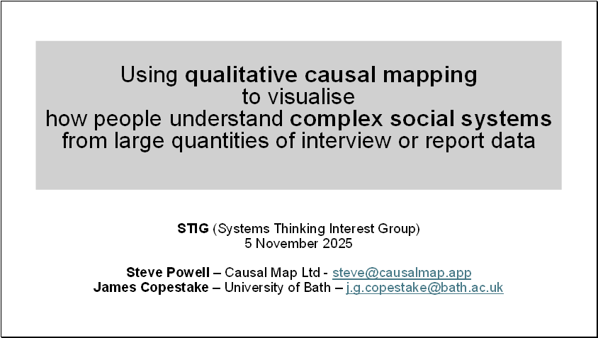

  

Slide 2

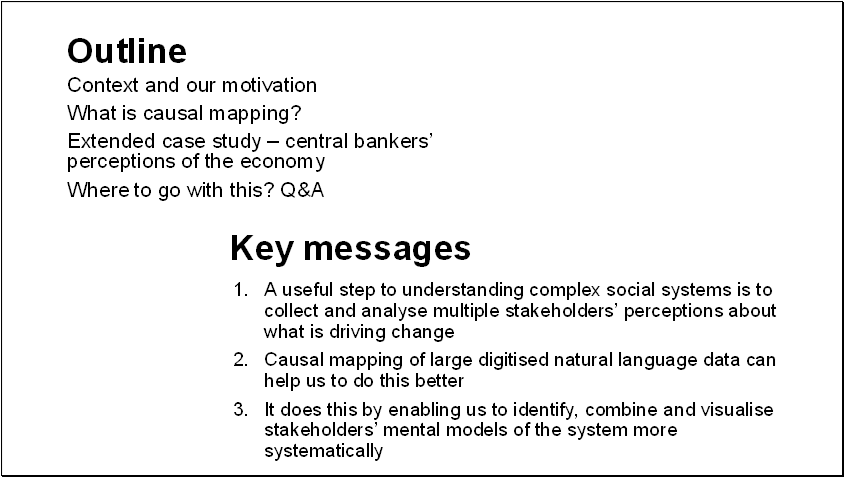

  

Slide 3

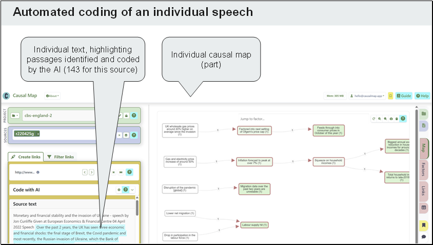

  

Slide 4

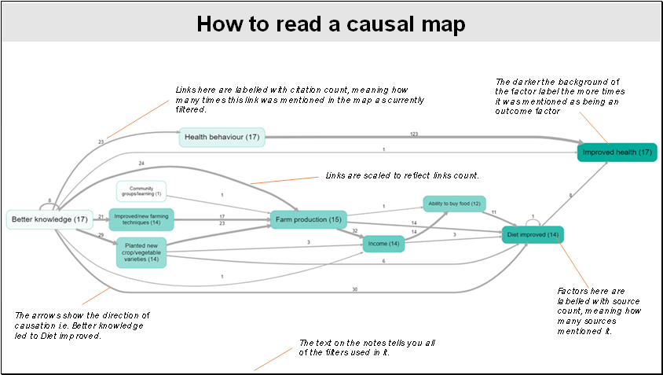

  

Slide 5

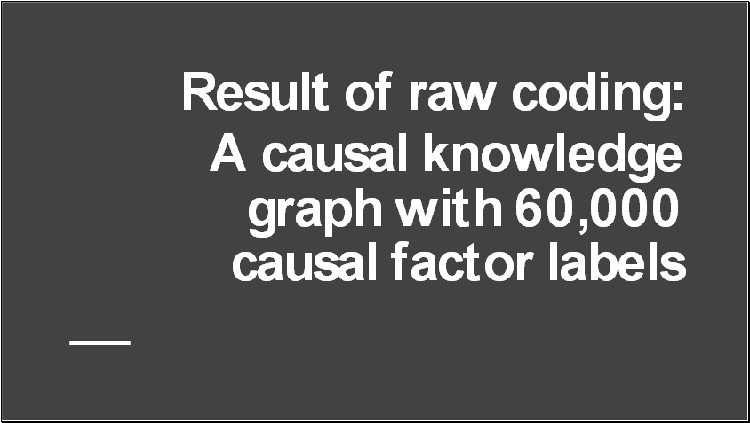

**Causal mapping identifies the factors people use in explanations: often difficult to reconcile with statistical variables  
  
**

  

Slide 6

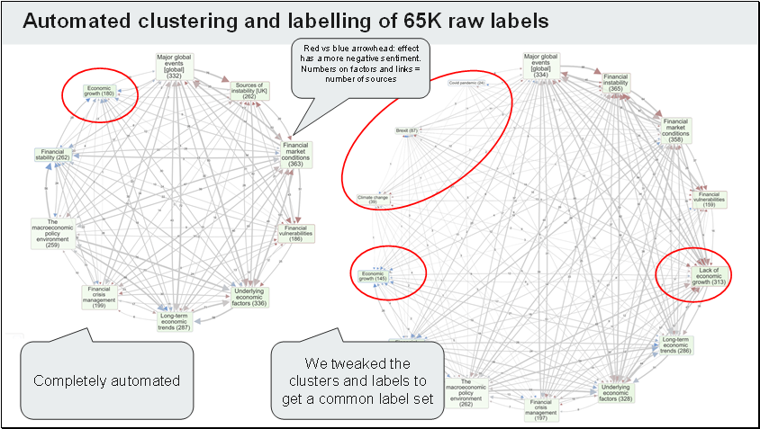

  

Slide 7

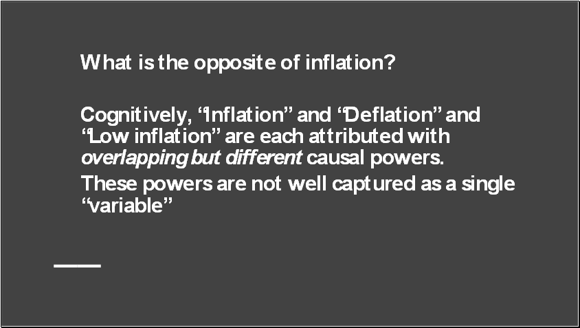

**Causal mapping identifies the factors people use in explanations: often difficult to reconcile with statistical variables  
  
**

  

Slide 8

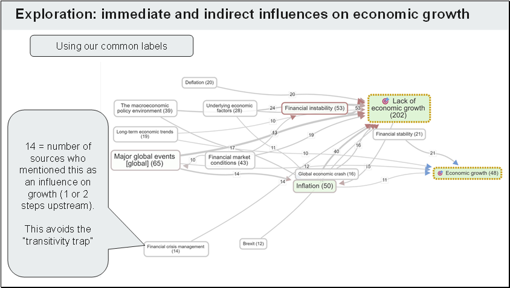

  

Slide 9

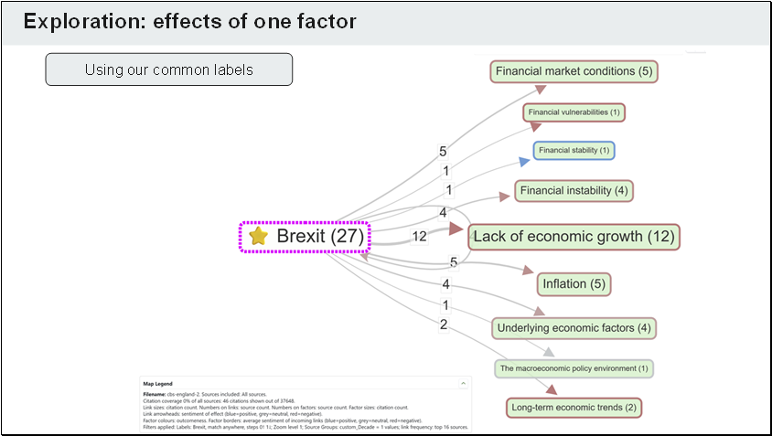

  

Slide 10

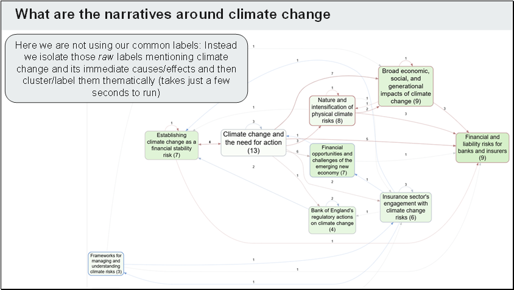

  

Slide 11

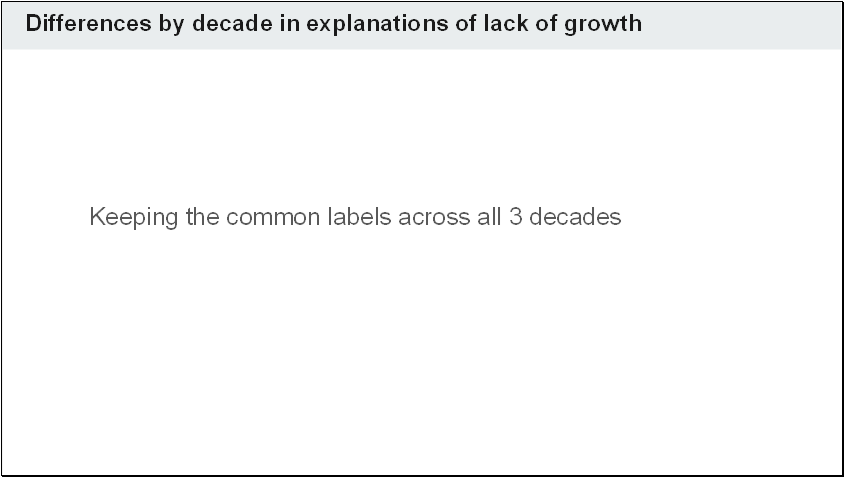

  

Slide 12

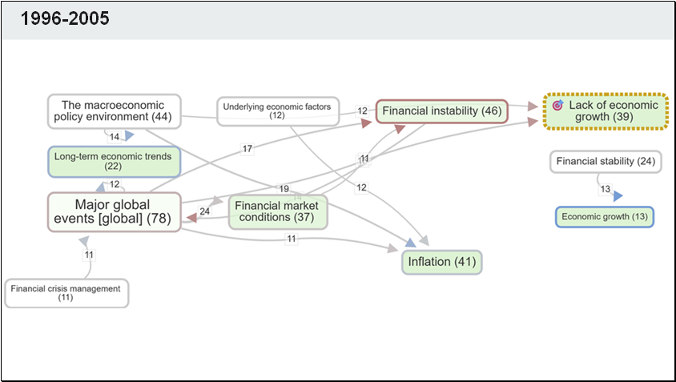

  

Slide 13

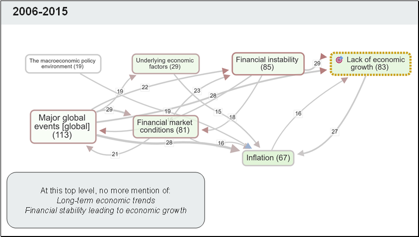

  

Slide 14

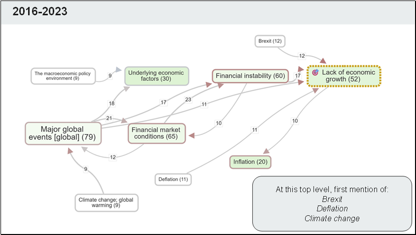

  

Slide 15

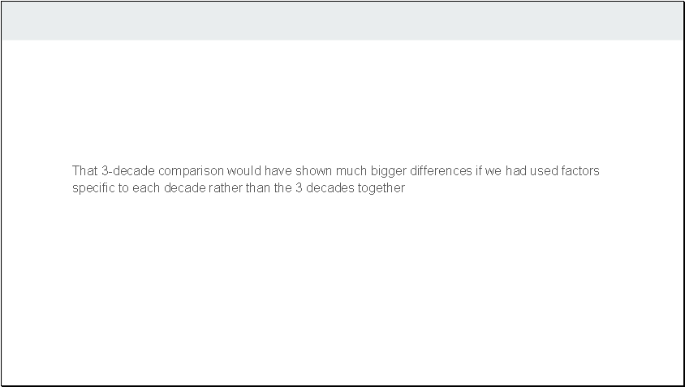

  

Slide 16

  

Slide 17

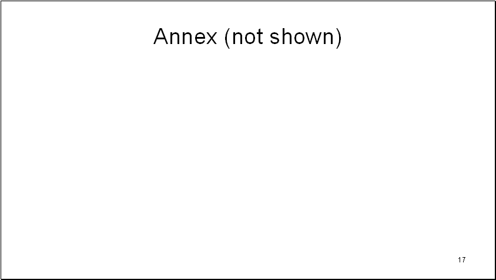

  

Slide 18

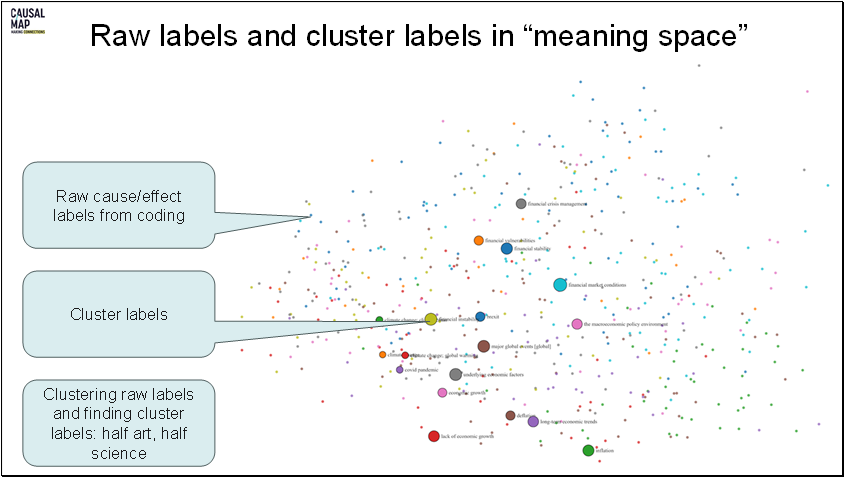