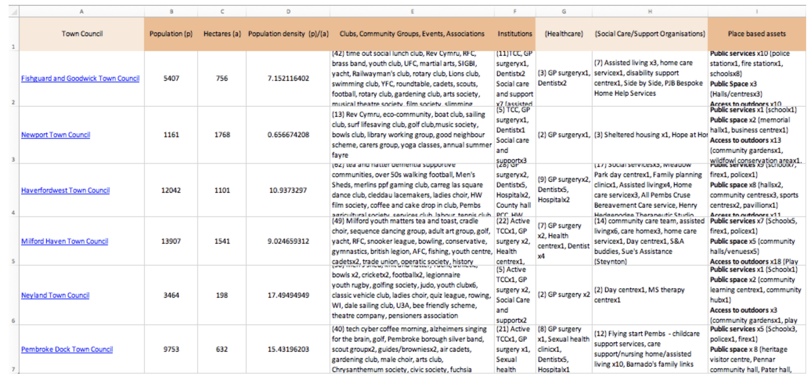
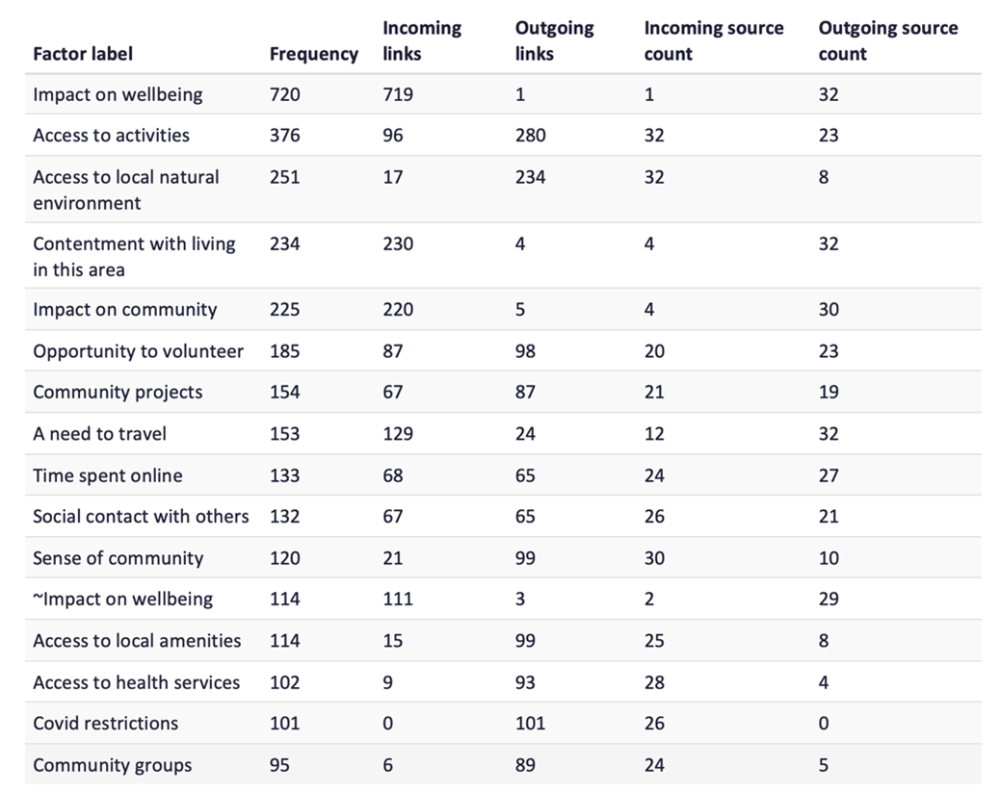
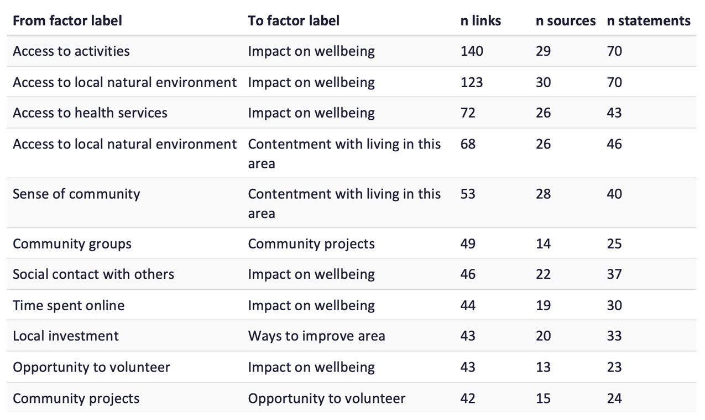
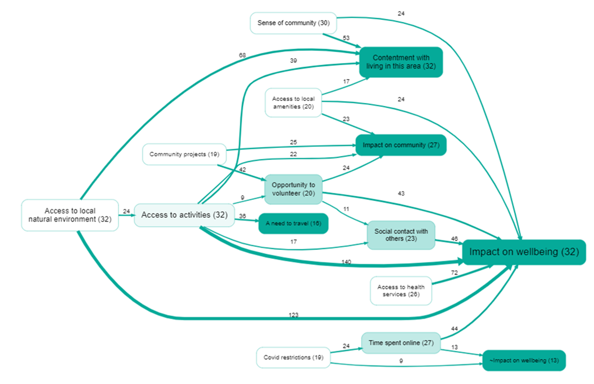
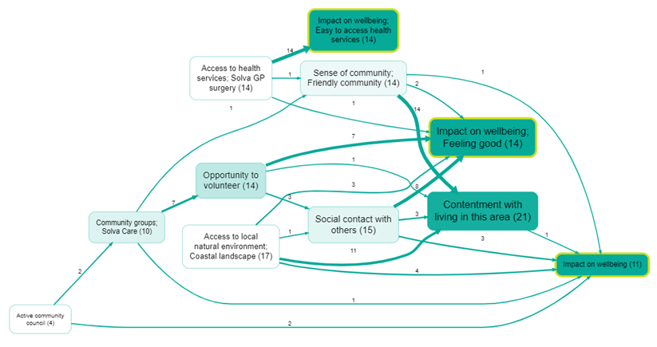
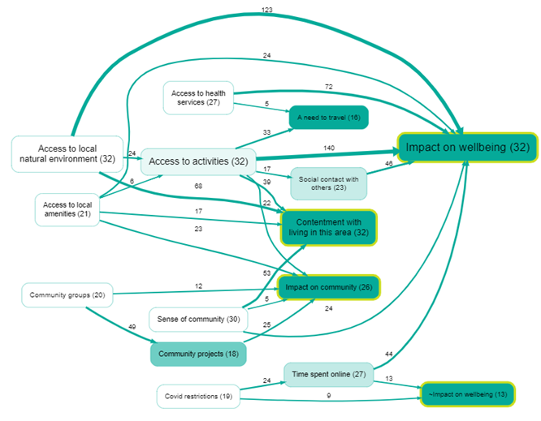

# Identifying community assets that impact on wellbeing – an exploratory Project on the utility of causal mapping and the Causal Map application

## Authors

[Insert author names and affiliations here.]

## Abstract

### 1. Objective

The **main** aim was substantive: to identify the connections between, and relative importance of, causal factors that determine wellbeing in two communities of place in the county of Pembrokeshire, Wales (semi structured interviews in Solva and Haverfordwest). **Secondary** aims were methodological: to see whether **causal mapping** as a way of handling qualitative material, and the **Causal Map** application in particular, were useful and workable for partners for that task.

### 2. Method

Data on community place based assets were collated for each community and town council area in the county and used to inform the selection of two contrasting communities - a rural seaside village, Solva, and an electoral ward in the town of Haverfordwest. Community leaders were approached to help select respondents. Thirty-two interviews were successfully conducted: twenty four in the coastal village and eight in the town. The interview data were coded and analysed in **Causal Map** to generate causal relationships and visual representations.

### 3. Key findings

#### Substantive

The key drivers of wellbeing were found to be – access to nature; a sense of community; access to activities; community projects and volunteering opportunities; and access to health services. In Causal Map, the material was summarised using the most **frequent factors** and **frequent links** (by citation and again by source), an **overview map** at hierarchical level 1, **paths** threaded toward **Impact on wellbeing**, and a wider view threading toward **Impact on wellbeing**, **Impact on community**, and **Contentment with living in this area**. **Illustrative quotes** from Solva and Haverfordwest respondents are given under location and nature, sense of community (e.g. shared venues under COVID rules), and access to activities as life-enhancing social opportunities.

#### Methodological — causal mapping

Causal mapping allowed many causal claims from 32 interviews to be reduced to comparable factors and links, inspected by frequency and hierarchy, and traced forward into wellbeing-related outcome labels—giving a structured view of dominant themes and pathways, with finer comparison across Solva and Haverfordwest still largely read off maps rather than spelled out in prose.

#### Methodological — Causal Map **application**

The technical aspects of coding and inputting the data in this version of the software presented a time consuming challenge for the researchers. This led to the conclusion that the **application**, as then used, was too impractical to recommend for adoption by the multisectoral partnerships that were interested to use it to better understand communities for informing policies and strategies.

However, AI has addressed many of the concerns that led to closure of the Project and it has been now been recommenced to more fully explore its utility.

### 4. Conclusion

The paper gives an example of the analysis and sets out how timing and wider drivers (COVID-era partnership working and interest in community assets in Pembrokeshire) shaped the exploratory study.

[Key implications: (a) A relatively small set of community assets — access to nature, sense of community, activities, volunteering, and health services — drives wellbeing, community cohesion, and contentment with place simultaneously, suggesting that targeted investment in these assets could yield broad returns. (b) Causal mapping as an approach proved well suited to organising qualitative data about place-based wellbeing, capturing the relational structure that asset inventories miss; however, manual coding in the **Causal Map** application was too labour-intensive for non-academic partnership teams to sustain. (c) The recent introduction of AI-assisted coding in Causal Map has substantially reduced the coding burden, and the project has been reopened to test whether this makes the approach practical for the multisectoral partnerships that need it most.]

---

## 1. Objective

The **primary** purpose of our project was substantive: to explore the factors that people associated with their wellbeing and to see if connections could be made that would point to discrete factors that are common to people at place based level, e.g. is the village hall important to the majority of the residents in the village, and, if so, how important when compared for example to the local shop?

**Secondary** purposes were methodological: to see whether **causal mapping** could organise those interview claims in a disciplined way, and whether the **Causal Map** software, developed by Causal Map Ltd, was a practical option for partners. Before the present project started in January 2021, the Causal Map software had not been used to explore causal connections in relation to variables associated with wellbeing in the UK.

## 2. Method

### Setting and rationale

[Consider restructuring this section. It currently join three threads — (a) the COVID context, (b) the Welsh policy landscape, and (c) the local Pembrokeshire partnership history — in a largely chronological way. it may work better to lead with the general gap (community assets are listed but their causal connections to wellbeing are not mapped), then bring in the Welsh/Pembrokeshire context as the specific setting, and keep the COVID narrative shorter. The partnership history (the xxx Group, the Ten Point Plan, the two open meetings) might not be so relevant to the journal reader???.]

The project [cut: to test the Causal Map software] took place during the COVID pandemic. This period saw community groups and organisations mobilising quickly to support a struggling public sector in protecting the wellbeing of their populations. Pre-existing community organisations were well placed to react quickly but new organisation rapidly emerged too, with their leaders successfully recruiting volunteers to help in those geographical areas where community groups had not previously existed.

The crisis resulted in a marked improvement in the relationship between the public and third sector organisations, and the creation of partnerships that brought the sectors together on a more equal basis to pursue a common purpose. [Provide the full Locality reference — e.g. Locality (2020) *We were built for this*.]

This period saw new and enduring labels being attached to communities –'resourceful', 'resilient' and 'strong' and 'empowered' – which subsequently formed the overarching goal of supporting community action and maintained interest in the role that assets play.

The spotlight on communities of place and health inequalities led to questions among local partnerships on the nature of assets in communities, how equally those assets are distributed and how sustainable they are. The Pembrokeshire partnerships wanted answers to those questions to enable them to be more effective in targeting resources during the pandemic and the foreseeable future. Coupled with the value placed on research involving lived experience in national strategies, and innovation, [provide the full Regional R&D strategy reference] there was thus a strong interest in the Causal Map application and in exploring its utility and possible adoption.

Wellbeing is determined by a wide range of factors which interact in complex ways. Genetics and lifestyles play a part alongside the economy, the environment, and social factors. This complexity poses a challenge and partnership solutions, yet policy, in the UK, tends to be organised in siloes at macro levels of governance. [how does this paragraph fit?]

'Community', defined here as people living in a specific geographical location or 'place' is increasingly thought to be an important determinant of wellbeing. Villages, and town and city neighbourhoods can be a positive influence if their communities possess and draw on their assets. The assets may be: people with knowledge, skills and time to volunteer; group activities that bind people together; local services and amenities that are people centred and accessible; buildings and land, and a local economy that benefits the local population. A community will build wellbeing if their assets are harnessed in a positive way. External organisations can lever substantial benefits too through their policies, procedures and processes. Furthermore, building on the strengths of communities, rather than the deficits, an approach called asset based community development (ABCD) is also helpful. [Provide full Russell reference  e.g. Russell, C. (2020) *Rekindling Democracy*. Consider also citing Kretzmann & McKnight (1993) as the foundational ABCD source.] The approach has gained traction in Wales and was used to inform this Project.

In Wales most services have policies which highlight the important role of communities in supporting wellbeing. The most significant national policy, however, is the ground breaking Well Being of Future Generations (Wales) Act 2015 which takes a cross sectoral approach and specifies wellbeing goals, cohesive communities, and ways of working that encompass long term planning, and a focus on prevention, integration, and collaboration. [Confirm reference??Davidson, J. (2020) *#futuregen*?] The Act requires each county in Wales to have statutory partnerships in place called Public Sector Boards (PSBs). These Boards bring together public and third sector organisations to collaborate on developing wellbeing strategies that improve the social, economic, environmental and cultural well-being of their areas.

Pembrokeshire PSB's first wellbeing plan (2018-2023?) [confirm dates] drew on routine data sources and surveys of the public. It included the workstream - community participation, understanding our communities and community engagement, with Together for Change involved in its delivery. [Pembrokeshire Public Services Board: Annual Report 2020-21 - Pembrokeshire County Council](https://www.pembrokeshire.gov.uk/public-services-board/pembrokeshire-public-services-board-annual-report-2020-21). The wellbeing plan drew on data from three geographical areas covering the county which were considered subsequently to be too large for establishing a useful view of assets and needs. To address this shortcoming the refreshed plan for the period 2023-8 [provide full reference to the Wellbeing Plan of Pembrokeshire] defined community geography as Mid Layer Super Output Areas (MSOAs). [Provide full reference to the Pembrokeshire Wellbeing Assessment.] MSOAs have the advantage of reasonably consistent population totals of approximately 7,000. However, the approach still presented a disadvantage in that it split towns and included peripheral villages.

PSBs continued to meet during the pandemic but an agile and flexible operational group was needed to react quickly and flexibly to the needs of communities at the time. To meet this imperative the xxx Group was set up and chaired by Pembrokeshire County Council. The members were chosen on the basis of their detailed knowledge and connections with communities. Their collective knowledge enabled community assets to be informally mapped and gaps in community groups and organisations to be identified. This successful group continued post pandemic as the renamed Community Coordination Recovery group and later became an operational arm of Pembrokeshire PSB.

An additional source of place based data which various organisations and partnerships have supported sporadically in Pembrokeshire is community profiling. This approach is embedded in community development. Based on the approach of ABCD community members are taken through an exercise to reflect on the strengths and needs of their communities as a spring board to action planning. Community profiling is usually facilitated by community development workers who find it useful for relationship building in communities mobilised to improve their circumstances. The approach is dependent on community sign up, and volunteers willing the engage and can be a useful data source. [Provide full Twelvetrees reference — e.g. Twelvetrees, A. (2017) *Community Development, Social Action and Social Planning*, 5th edn.]

[Consider adding a sentence here that about the limitation of community profiling for the present purpose: it captures opinions and lists assets, but does not capture causal relationships between factors — which is what causal mapping addresses. This would strengthen the bridge to the causal mapping sections.]

Soon after 'lock down' Together for Change convened two community and multisector online open meetings which were designed to reach consensus on the broad strategy for a way forward in partnership working and to improve and forge cross sectoral relationships. Consensus was reached on the following:

- The need for build trust, common understandings and a joint strategy, for wellbeing centred on communities of place

- The importance of improving and building the evidence base of community action, in particular drawing on the voice of communities; and transferring such knowledge to influence policy and practice

- And, ensuring action – doing and not just talking

[Provide references to the two reports.]

The Ten Point Plan that resulted from the meetings served to guide a strategic approach to partnership work centring on communities. [Provide reference to the Ten Point Plan.]

[Consider whether theextra detail about the open meetings etc is needed for the journal audience, or whether a single sentence summarising the partnership mandate would suffice.]

Thus a combination of factors created the environment which demonstrated the essential role of communities of place and accelerated the need to better understand their assets to inform community focused strategies. Together for Change and partners took the opportunity to bring the voice of communities into decision making forums by launching the Causal Map Project with Bath University. The Project is ongoing and is a part of a broader mapping programme run in partnership with Higher Education Institutions in Wales.

### Site selection and collation of assets by Town and Community Council

#### Stage 1 – Collation of Assets by Town and Community Council

Whilst the term 'asset' can have many different meanings, for the purposes of this work, the term 'asset' refers to the following three groups:

- Associations: small informal groups such as clubs, coming together around a common interest, and civic events such as festivals

- Institutions: structured formal organisations, professional bodies in communities

- Place based assets: land, buildings, heritage, public and green spaces

These categories were included because they represent the assets within an asset-based approach to community development that are tangible and readily quantified. Less tangible assets that are more subjective or difficult to establish such as strong community leaders or alliances between certain groups have not been included. An exploration of the relative influence of these more qualitative assets upon the wellbeing of individuals at a place-based level is the subject of a separate research study. [Provide the QuIP reference.]

Online searches of databases and websites were undertaken of the assets. The following statutory websites, regulated national databases, search engines, third sector websites and listings were used:

- National databases: NOMIS: population and geography; Office of National Statistics

- Statutory websites: Pembrokeshire County Council to establish place-based assets; NHS Local Services; Mid and West Wales Fire service; Town and Community Councils website

- Google maps – to clarify place-based assets

- Town and Community Councils area websites

- CareHome.co.uk search: local residential homes and day centres

- Infoengine: listings of clubs, groups, events and associations

- Connect Platform: community activities, networks

- Website of Pembrokeshire Halls: meeting places

- Activities and information search engines: VisitPembrokeshire; Pembrokeshire Inspired

[maybe move this list to appendix]

Information was tabulated in Microsoft Excel; one document for Community Councils and one for Town Councils. The figure below shows an extract from the list of assets for Town Councils. Column A lists the Town Councils. Columns E, F and I represent the three groups of assets that formed the basis of the searches. Column F (Institutions) was subdivided to create columns G (Healthcare) and H (Social care/Support organisations). The calculations for population density are shown in columns B, C and D.

Following the online searches, colleagues in partner organisations were consulted in order to include additional assets, fill gaps and check on the accuracy of the lists. Discussions were held with the Connected Communities and CWBR teams. The additions included:

- Listings of all Health and Wellbeing Networks

- Listing of all community newsletters

- Map of noticeboards

- Active church services

- People in paid roles (such west wales housing) [xx?]

- Disused BT phone boxes for things like seed swaps, etc

- Digital facilities in communit [xx]

Our searches showed that the information available about each of the TCC geographic areas varies enormously. For example, whilst some Town or Community Councils have dedicated websites containing extensive information, others have a limited online presence. Listings of assets were at times not complete, an example being the search engine Infoengine that lists some community clubs, groups, events and associations, but not all. Determining the reliability of some online sources was also at times difficult due to websites being out of date or there being incomplete information available.

A further consideration is in terms of format and how information is displayed. The current format simply lists assets and whilst this offers a valuable overview in tabulated form of each of the TCC areas, a Geographic Information System (GIS) for example would greatly expand the function of this compilation.

Notwithstanding the above limitations, the data had utility for understanding the distribution of assets across parish boundaries and interest has been shown in them by organisations working with and within communities in the data [xx]

### Interviews

#### Stage 2 – The interviews

Using these data on assets as a framework two contrasting communities were selected – a coastal village with a population of eight hundred people and a town with a population of twelve thousand people. Both were selected on account of their high concentration of assets relative to their population density, and also their interest in the study. Community leaders were contacted to approach and select the respondents. The target number of interviews was 40, with twenty in each community. Thirty-two interviews were successfully conducted: twenty four in the coastal village and eight in the town. The fieldwork was carried out by the Project Coordinator and Project Officer, who led on recruitment, data collection and the initial analysis of findings.

[adding a sentence explaining why only 8 were completed in Haverfordwest ?.]

Asset based Community Development (ABCD) was used as the framework to develop the semi-structured interview schedule. ABCD identifies five types of assets: the individual, associations, institutions, place based assets, and connections. [Provide the ABCD reference  e.g. Kretzmann & McKnight (1993).]

The interview schedule explored what it was like to live in the community or neighbourhood with respect to: transport links; the natural environment; things to do in the home and outside the home (including volunteering); services and access to them; and local organisations active in the locality. The questionnaire was open ended to enable the respondents to raise issues outside this framework. [Insert reference to the full questionnaire — e.g. "see Appendix A". .] Each interview took approximately 30 mins to conduct and was undertaken individually by the Project Coordinator or Project Officer.

The interviews were conducted following consent and were recorded with the permission of the interviewees. Nineteen respondents gave their gender as female and thirteen as male. The median age of the interviewees was sixty-one.

The recordings were transcribed using Otter AI and further checked by the Project Officer to remove errors. The transcriptions were downloaded from Otter AI and the information was transferred to a specially formulated proforma with space for metadata, statements and question text.

### Causal mapping as an approach

Causal mapping is a qualitative research technique for collecting, coding, analysing and displaying claims about causal connections. A researcher reads through narrative material — in this case, interview transcripts — and identifies passages where a respondent claims that one thing influences another. Each such claim is coded as a directed **link** between an **influence factor** and a **consequence factor**. When many claims from many sources are coded in this way, the result is a structured database of causal links that can be filtered, counted, and visualised as a map (Powell, Copestake & Remnant, [2024](https://journals.sagepub.com/doi/10.1177/13563890231196601)).

The approach differs from standard thematic analysis in an important respect. Where thematic coding assigns a single code to a passage, causal coding assigns a *pair* of codes — influence and consequence — preserving the directional, relational structure of the claim. This makes it possible to trace causal pathways: not just "respondents talked about nature" and "respondents talked about wellbeing", but "respondents said that access to nature contributes to their wellbeing".

Causal mapping also differs from approaches that ask researchers or stakeholders to draw a single consensus diagram of how a system works. Instead, it assembles many individual causal claims from multiple sources, each retaining its provenance (who said it, in what context). The resulting map is an index of evidence, not a model of the analyst's own beliefs. This makes it possible to ask questions such as: how many respondents independently cited this connection? Do respondents in Solva and Haverfordwest cite the same or different pathways to wellbeing?

The technique has been used since the 1970s (Axelrod, 1976) in fields including political science, management, and operational research. Its application in evaluation and community research is more recent, and the present study represents one of the first uses in the context of place-based wellbeing in the UK.

### The Causal Map application

The coding and analysis were carried out using the [Causal Map application](https://www.causalmap.app/causal-mapping/), a web-based tool designed for this kind of work. Together for Change subscribed to the application, with remote support from the Causal Map team.

#### Data preparation and upload

Interview transcripts were uploaded in Microsoft Excel format. As well as texts, divided into separate "statements" with source IDs, two additional sheets were added: one giving source-level metadata (source_id, interviewer, age, gender, household composition, and area), and one giving question-level metadata (question ID, question text, and questionnaire section: Activities, Natural Environment, Public Sector, or Wellbeing).

#### Coding process

Within the application, statements were presented one at a time. For each statement, the coder read the text and, where a causal claim was present, highlighted the relevant passage and assigned an influence factor and a consequence factor. Each such annotation created a **link** in the project database, tied back to the original quote and its source metadata.

Factor labels were developed inductively. Early in the coding, new factors were created frequently; as the codebook stabilised, coders increasingly reused existing labels. The final codebook comprised 15 top-level factors, each with multiple sub-factors, organised in a hierarchy (e.g. *Activities; Activities; Volunteering*). This hierarchical structure made it possible to analyse the data at different levels of granularity — for instance, examining all claims about *Activities* in aggregate, or drilling down to *Volunteering* specifically.

The initial coding was undertaken by the Together for Change team. More detailed analysis was carried out by the Causal Map team.

#### Analysis tools

The Causal Map application provides several tools for exploring a coded dataset:

- **Filtering**: selecting subsets of links by source characteristics (e.g. area, gender), by factor, or by question section
- **Counting**: tallying links by citation count (how many times a connection was coded) or by source count (how many distinct respondents mentioned it)
- **Hierarchical roll-up aka "Zooming out"**: aggregating sub-factors such as "Impact on wellbeing; feeling more at ease with life" to their parent level such as "Impact on wellbeing" to produce simplified overview maps
- **Path tracing**: following chains of links from upstream factors through to specified outcome factors (e.g. *Impact on wellbeing*)

These tools were used to generate the maps and tables presented in the findings below.

## 3. Key findings

### Substantive findings

The five most prominent drivers of wellbeing, as identified through the causal mapping, were: access to nature; a sense of community; access to activities; community projects and volunteering opportunities; and access to health services. The following sections present the evidence for these findings through a series of maps and frequency tables generated in Causal Map, together with illustrative quotes from respondents.

### Most frequent factors

The table below shows the factors most frequently mentioned across all 32 interviews. Frequency is measured by citation count (the number of individual causal claims coded to each factor).

### Most frequent links

The table below shows the most frequently cited causal connections (pairs of influence and consequence factors that respondents linked together most often), based on the "zoomed out" data in which more detailed labels are "rolled up" into their parent labels such as "Impact on wellbeing".

### Overview map

The overview map aggregates factors to the top level of the hierarchy and displays the 15 most frequently mentioned factors and 25 most frequently mentioned links (by citation count). This provides a high-level picture of the causal structure that respondents described.

### Paths to impact on wellbeing

The map below traces causal pathways that lead to the outcome factor *Impact on wellbeing*. It shows the 15 most frequently mentioned factors and 25 most frequently mentioned links (by source count rather than citation count, to avoid over-weighting respondents who made the same point repeatedly), also filtered to display only those factors and links that lie on a path toward *Impact on wellbeing*.

### Drivers of wellbeing, community and contentment

The map below broadens the view by tracing paths toward three outcome factors: *Impact on wellbeing*, *Impact on community*, and *Contentment with living in this area*. Again, the 15 most frequent factors and 25 most frequent links are shown (by source count). This wider lens reveals that many of the same upstream factors - access to nature, community activities, volunteering - feed into all three outcomes, suggesting a common set of assets that sustain both individual wellbeing and community cohesion.

### Illustrative quotes

The following quotes illustrate three of the key themes that emerged from the causal mapping.

#### Location and nature

> "[Nature] gives you a sense of inner peace and a sense of balance in life. I have never been more aware of the seasons than here, and just aware of birds and wildflowers and creatures in the sea. It's just absolutely lovely, and I think it's a really important part of feeling well."
>
> (Female, 66, Solva, St_44)

#### Sense of community

> "Thinking about keeping the community hall and the football club as various venues for the art club, for example, meet up at the football club, so the refurbishment and maintenance of that and being able to use it under COVID restrictions and rules means that the Community Council is doing their job. It's a safe place for us to go and meet."
>
> (Female, 66, Solva, St_195)

#### Access to activities

> "I like being able to do these activities with friends and my partner as well. All of those things are an opportunity to socialise… There's a consistent benefit. There's never been a time when I thought I regret doing that activity. I think it's life enhancing."
>
> (Female, 41, Haverfordwest, St_1177)

### Methodological findings - causal mapping as an approach

Causal mapping proved well suited to this kind of material. The interview transcripts contained a large number of causal claims - respondents readily described what influenced their wellbeing and why - and causal coding captured the directional structure of these claims in a way that standard thematic analysis would not. The hierarchical factor system allowed the data to be examined at different levels of detail, and the path-tracing tools made it possible to identify which factors lay upstream of the key outcomes.

The approach also made it straightforward to compare across the two communities, by filtering links by area and examining whether the same pathways appeared in both Solva and Haverfordwest. The maps above draw on the combined dataset; community-specific analysis could be carried out using the same tools.

A limitation is that causal mapping captures what respondents *claimed* influenced their wellbeing, not what objectively does so. The maps should be read as structured summaries of respondents' perceptions and experiences, not as some kind of causal truth.

### Methodological findings - the Causal Map application

The technical process of coding the data manually in the application (which was at version 1 at the time) was time-consuming. The coding required close reading of each statement and careful assignment of factor labels, a process that demanded sustained concentration and familiarity with the growing codebook. For the Together for Change team, practitioners rather than academic researchers, this represented a substantial investment of time and effort. The team concluded that the application, as then used with entirely manual coding, was too labour-intensive to recommend for routine adoption by the multisectoral partnerships that had expressed interest in it.

Since then, however, the Causal Map application is at version 4 and has introduced AI-assisted coding, which substantially reduces the time needed to code interview transcripts. The project has been recommenced to explore whether this makes causal mapping a practical option for partnership settings.

## 4. Conclusion

This study set out to identify the community assets that residents of two Pembrokeshire communities connect to their wellbeing, and to assess whether causal mapping, and the Causal Map application specifically, could serve as a practical tool for that purpose.

On the substantive question, the causal mapping identified access to nature, sense of community, access to activities, volunteering opportunities, and access to health services as the principal drivers of wellbeing. The path-tracing analysis showed that many of these factors feed into multiple outcomes: individual wellbeing, community cohesion, and contentment with place, suggesting that a relatively small set of community assets underpins a broad range of benefits. These findings are consistent with the asset-based community development literature but add a narrative dimension: rather than listing assets in isolation, the causal maps show how respondents perceive those assets as connected to outcomes.

On the methodological question, causal mapping proved a productive approach for organising and analysing qualitative data about place-based wellbeing. It preserved the directional structure of respondents' claims, allowed systematic comparison across communities, and produced visual summaries that were accessible to partnership audiences. The Causal Map application supported this analysis effectively, but the manual coding process was too time-consuming for non-academic partners to sustain. The recent introduction of AI-assisted coding may address this barrier, and the project has been reopened to test this.

The study has limitations. The sample was small (32 interviews) and unevenly distributed between the two communities (24 in Solva, 8 in Haverfordwest). The causal maps represent respondents' perceptions, not objectively verified causal relationships. And the analysis reported here draws on the combined dataset; a fuller comparison between the two communities remains to be completed.

Despite these limitations, the study demonstrates that causal mapping can move community wellbeing research beyond static asset inventories toward a more relational understanding of how assets connect to outcomes — and that, with appropriate tooling, this approach may be within reach of the partnerships that most need it.
