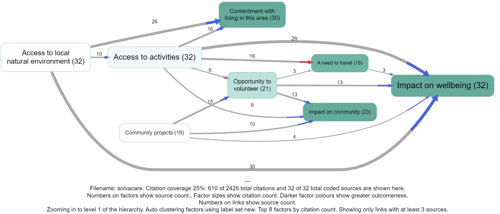

## Abstract

> This guide addresses a cluster of **tricky but practical problems** in causal coding: how to represent **oppositeness**, **sentiment/valence**, and **“despite” constructions** in a way that stays close to ordinary language and remains auditable.

> Many causal mapping and systems traditions address these issues by quickly “variablising”: treating factor labels as variables, and links as signed (and sometimes weighted) relationships. That can be powerful, but it also introduces strong extra commitments (about polarity, scales, functional form, and what counts as “more/less”) that are often not warranted by ordinary narrative text.

Instead we take a **piece-by-piece approach**:

1. We start with **combining opposites** as a conservative label convention plus an explicit transform over a links table.
2. We then “turn 45 degrees” to the different-but-overlapping problem of **sentiment**, which becomes especially useful/necessary when doing AI-assisted coding and embedding-based aggregation. Sentiment and opposites are hard to combine cleanly.
3. We then introduce **“despite” coding** for countervailing conditions (“E happened despite Z”) without pretending that Z “caused” E in the ordinary way.

We end by noting some hard cases where these systems collide.

See also: [[005 Minimalist coding for causal mapping ((minimalist))]]; [[006 A formalisation of causal mapping ((formalisation))]]; [[900 Magnetisation ((magnetisation))]]; [[900 A simple measure of the goodness of fit of a causal theory to a text corpus ((goodness-of-fit))]].

**Intended audience:** practitioners doing causal coding from narrative text (especially at scale / with AI assistance) who keep running into polarity/valence edge cases.

**Unique contribution (what this guide adds):**

- A conservative **opposites convention + transform** (combine opposites while retaining flip status).
- A clear separation between **oppositeness** and **sentiment** (why they overlap in practice but don’t collapse cleanly).
- A scalable encoding for **“despite”** clauses as a link type/tag, rather than mis-coding them as ordinary causes.

## Introduction

In the first part of this guide we dealt only with undifferentiated causal links which simply say “C influenced E”, or more precisely: “Source S claims/believes that C influenced E.” This is the **minimalist** representation: a links table whose rows are individual causal claims with provenance (source id + quote) and whose columns include at minimum `Cause` and `Effect` labels.

Minimalist-style causal links are commonly used in (at least) two ways:

- **Event-claim reading (QuIP-style)**: interpret a link as a claim about a past episode (“C happened; E happened; C made a difference to E”), with an open question of how far it generalises.
- **Factor-relation reading**: treat links as claims about influence relations among factors, without committing to what happened in any specific case.

In Part 1 we also introduced **hierarchical factor labels** using the `;` separator, where `C; D` can be read as “D, an example of / instance of C”, and can later be **rewritten** (zoomed) to a higher level by truncating the label.

This guide (Part 2) adds three extensions that remain compatible with minimalist link coding:

- **Opposites conventions** in factor labels (a label-level device).
- **Sentiment/valence** as an additional annotation layer (useful especially with AI coding).
- **Despite coding** to capture countervailing conditions without misrepresenting them as ordinary causes.

We will describe the conventions in app-independent terms. (The Causal Map app happens to implement these ideas as part of a standard “filter pipeline”, but the logic is not app-specific.)

## Combining opposites

### The problem

In everyday coding, we often end up with “opposite” factors like:

- `Employment` vs `Unemployment`
- `Good health` vs `Poor health`
- `Fit` vs `Not fit`

If we keep these as unrelated labels, we make downstream analysis harder. For example:

- When we query for “health”, we may miss evidence coded as “illness”.
- We cannot easily compare (or combine) evidence for `Fit -> Happy` with evidence for `Not fit -> Not happy` without manually re-aligning them.

Many causal mapping traditions solve this by treating factors as variables with signed links. Here we describe a simpler alternative that stays close to ordinary language and avoids variable semantics “by default”.

### The convention: mark opposites in labels

To signal that two factor labels are intended as opposites, use the `~` prefix:

- `Y` and `~Y`

We talk about **opposites** rather than plus/minus because this avoids implying valence or sentiment. For example:

- `Smoking` is the opposite of `~Smoking` (not smoking), but which one is “good” depends on context.

Non-hierarchical opposites are straightforward:

- `Eating vegetables`
- `~Eating vegetables`
- `Smoking`
- `~Smoking`

### The useful part: apply a transform/filter to a links table (and/or a map view)

The convention above is only a convention until we do something with it. The next step is to apply an explicit **transform** to a links table (and then to whatever views are derived from it).

The transform is:

1. Detect opposite pairs that are present (both `Y` and `~Y` appear in the current dataset).
2. Rewrite any occurrence of `~Y` to `Y`.
3. Record, for each link endpoint, whether it was flipped (e.g. `flipped_cause`, `flipped_effect`).

After this transform:

- We can aggregate evidence for `Y` and `~Y` under a single canonical factor label `Y` **without losing the original meaning**, because we still know which endpoints were flipped.
- A link has two local “polarities”: whether the cause label was flipped, and whether the effect label was flipped.
  - If **exactly one** end is flipped, the overall relationship direction is “reversed” in the intuitive sense (compared to the unflipped link).
  - If **both** ends are flipped, the overall relationship direction is not reversed, but the evidence is still distinct (it came from the opposite-on-both-ends claim).

Crucially: **no information is lost** by the transform, because flip-status remains attached to the evidence. You can always reconstruct the original statement-level content from the transformed table.

This general “apply transforms to a links table; then render a map/table view of the transformed data” is the same idea as the filter pipeline described in the user-guide material: filters are operations over a links table, and maps are derived views of the filtered/transformed links.

## Opposites coding within a hierarchy

When using hierarchical labels (with `;`), the `~` sign may appear:

- at the very start of the whole label, and/or
- at the start of any component within the label.

The same transform idea applies: to “combine opposites” we flip components so that opposites align at each hierarchical level.

### Opposites within components of a hierarchy

Sometimes we need `~` within components, e.g.:

- `Healthy habits; eating vegetables`
- `~Healthy habits; ~eating vegetables`

and:

- `Healthy habits; ~smoking`  (not smoking is a healthy habit)
- `~Healthy habits; smoking`  (smoking is an unhealthy habit)

After combining opposites, these pairs can be aligned under shared canonical labels while retaining flip status per component (so we do not collapse “healthy” into “unhealthy” or vice versa by accident).

## Bivalent variables?

Opposites coding is **not** the same as assuming that every factor is a bivalent variable (present vs absent). We are not claiming exhaustiveness: it is not the case that everything must be either `Wealthy` or `Poor`, and it is often wrong to treat “absence” as having causal powers.

Opposites coding is a practical device used only where:

- both poles occur naturally in the text and therefore in the coding, and
- it would usually be incoherent to apply both poles simultaneously in the same sense.

### Which pairs of factors should we consider for opposites coding?

Use opposites coding for a pair of factors X and Y (i.e. recode Y as `~X` or recode X as `~Y`) when both occur in the data and are broadly opposites.

If in doubt about which member to treat as the canonical label, we usually pick X as the “primary” member if it is:

- usually considered as positive / beneficial / valuable, and/or
- usually associated with “more” of something rather than “less” of something.

## Alternative convention (explicit opposite pairing)

Sometimes you may have pairs that are conceptually opposite but do **not** share a clean string form like `Y` vs `~Y` (e.g. `Wealthy` vs `Poor`).

In that case, use an explicit pairing tag so that a deterministic transform can combine them later. For example:

- `Wealthy [1]`
- `Poor [~1]`

This makes the pairing unambiguous: `Poor [~1]` is declared to be the opposite of `Wealthy [1]`. A “combine opposites” transform can then rewrite the opposite-labelled item to the canonical label while recording flip status (exactly as described above). This is the same general idea as the “transform filters temporarily relabel factors” pattern in the filter pipeline documentation (see `content/999 Causal Map App/080 Analysis Filters  Filter links tab ((filter-link-tab)).md`), but the logic is independent of any particular software.

## What can we *do* with opposites once we have them?

Once opposites are marked (and optionally combined via an explicit transform), we can apply ordinary operations to a links table and then render useful views:

- **Querying**: searching for `Y` can intentionally retrieve both `Y` and `~Y` evidence (depending on whether you search pre- or post-transform).
- **Aggregation without collapse**: you can summarise evidence under a canonical label `Y` while still distinguishing which claims involved the opposite sense via flip flags.
- **Visualisation**: you can render a map from the transformed links table and style links differently depending on whether the cause and/or effect endpoint was flipped, so viewers can see “this includes opposite-evidence” rather than mistaking it for ordinary evidence.

This “links table → transforms → map/table view” pattern is the same general idea as a filter pipeline (implemented in many tools; the Causal Map app is one).

# Adding sentiment

## Polarity of factor labels

There are challenges with coding and validating concepts which on the one hand could be seen to have polarity from a quantitative point of view and on the other hand may have positive or negative sentiment associated with them. Quantitative polarity and subjective sentiment often overlap in confusing ways. When coding, distinguishing between opposites like employment and unemployment is usually important: they can be viewed as opposites, but each pole has a distinct meaning which is more than just the absence of the other. We can call these "bipolar" concepts after [@goertzSocialScienceConcepts2020]. 

However, though employment and unemployment can be seen as opposites from a "close level" view, at a more general or abstract level, they could both fall under a category like economic issues. Their NLP embeddings may have surprisingly high cosine similarity.

For other pairs like not having enough to eat, and having too much to eat, there are multiple opposites (which may appear frequently as a causal factor) with an intervening zero (which may not be mentioned very often). 

Coding these different kinds of concept pairs can be difficult and depends on use and context. For these and other reasons, our naive approach codes employment and unemployment as well as not having enough to eat, and having too much to eat separately.**

### How to add sentiment?

You can now auto-code the sentiment of the consequence factor in each link. 

You only have to do this once, and it takes a little while, so wait until you’ve finished coding all your links.

When you are ready, click on the File tab, and under the ‘About this file’, there’s the ‘ADD SENTIMENT’ button. You just have to click on it and wait for the magic to happen 

.png)

So each claim (actually, the consequence of each claim) now has a sentiment, either -1, 0 or 1. 

Many links are actually a bundle of different claims. We can calculate the sentiment of any bundle, as simply the average sentiment. So an average sentiment of -1 means that all the claims had negative sentiment. An average of zero means there were many neutral sentiments and/or the positive and negative sentiments cancel each other out.

Only the last part is coloured, because the colour only expresses the sentiment of the effect, not the cause. 

Once you have autocoded sentiment for your file, you can switch it on or off using [🎨 Formatters: Colour links](%F0%9F%8E%A8%20Formatters%20Colour%20links%208094b307a2284aa7a95e2d392d689362.md).

## Tip

When displaying sentiment like this, reduce possible confusing by making sure that you either use only neutral factor labels like Health rather than Good health or Improved Health: an exception is if you have *pairs* of non-neutral labels like both Poor health alongside Good health. You can do this either in your raw coding or using [✨ Transforms Filters: 🧲 Magnetic labels](%E2%9C%A8%20Transforms%20Filters%20%F0%9F%A7%B2%20Magnetic%20labels%209452d8de42e2466ca14c68ff0a67b6bb.md) or [**🗃️ Canonical workflow**](%F0%9F%97%83%EF%B8%8F%20Canonical%20workflow%2038ec32c8ce5546f780e4c79a7ad6caf8.md) 

# Adding some colour: a discussion of the problem of visualising contrary meanings

## The problem

We’ve already described our approach to making sense of texts at scale by almost-automatically coding the causal claims within them, encoding each claim (like “climate change means our crops are failing”) as a pair of factor labels (“climate change” and “our crops are failing”): this information is visualised as one link in a causal map. We use our “coding AI” to code most of the causal claims within a set of documents in this way. We have had good success doing this quickly and at scale without providing any kind of codebook: the AI is free to create whatever factor labels it wants.

There is one key remaining problem with this approach. Here is the background to the problem: if the coding AI is provided with very long texts, it tends to skip many of the causal claims in fact contained in the documents. Much shorter chunks of text work best. As we work without a codebook, this means that the AI produces hundreds of different factor labels which may overlap substantially in meaning. In turn this means that we have to cluster the labels in sets of similar meaning (using phrase embeddings and our “Clustering AI”) and find labels for the sets. This all works nicely.

But the problem is that, when we use phrase embeddings to make clusters of similar labels, seeming opposites often have high cosine similarity. Unemployment and employment vectors are similar – they would for example often appear on the same pages of a book – and both are quite different from a phrase like, say, "climate change". But this is unsatisfactory because if in the raw text we had a link describing how someone lost their job, coded with an arrow leading to a factor unemployment alongside another piece of text describing how someone gained work, represented by an arrow pointing to employment if these two labels are combined, say into employment or employment issues the items look very similar and we seem to have lost some essential piece of information.

## Can’t we use opposites coding?

In ordinary manual coding (see [➕➖ Opposites](%E2%9E%95%E2%9E%96%20Opposites%2053401812ec144ec48107a45a72ac9f62.md)) we solve this problem by marking some factors as contrary to others using our `~` notation (in which ~Employment can stand for Unemployment, Bad employment, etc)  and this works well. However while it is possible to get the coding AI to code using this kind of notation, it is not part of ordinary language and is therefore not understood by the embeddings API: the ~ is simply ignored even more often than the difference between Employment and Unemployment. In order to stop factors like employment and unemployment ending up in the same cluster it is possible to exaggerate the difference between them by somehow rewriting employment as, say, “really really crass absence of employment” but this is also unsatisfactory (partly because all the factors like really really crass X tend to end up in the same cluster).

## New solution

So our new solution is simply to accept the way the coding-AI uses ordinary language labels like employment and unemployment and to accept the way the embedding-AI clusters them together. Instead, we recapture the lost “negative” meaning with a third AI we call the “labelling AI”. This automatically codes the sentiment of each individual causal claim so that each link is given a sentiment of either +1, 0 or -1. For this third step we use a chat API. The instruction to this third AI is:

> "I am going to show you a numbered list of causal claims, where different respondents said that one thing ('the cause') causally influenced another ('the effect') together with a verbatim quote from the respondent explaining how the cause led to the effect.
> 

> The claims are listed in this format: 'quote ((cause --> effect))'.
> 

> The claims and respondents are not related to one another so treat each separately.
> 

> For each claim, report its *sentiment*: does the respondent think that the effect produced by the cause is at least a bit good (+1), at least a little bad (-1) or neutral (0).
> 

> Consider only what the respondent thinks is good or bad, not what you think.
> 

> If you are not sure, use the neutral option (0).
> 

> NEVER skip any claims. Provide a sentiment for every claim."
> 

The previous solution coloured the whole link which was fine in most cases but led to some really confusing and incorrect coding where the influence factor was involved in the opposite sense, as in Access to activities below. One might assume that the red links actually involve some kind of negative (or opposite?) access to activities, but we don't actually know that because it wasn't coded as such. Other alternatives would be to also automatically separately code the sentiment of the first part of the arrow, but this doesn't work because sometimes the sentiment is not in fact negative. We would have to somehow automatically code whether the influence factor is meant in an opposite or contrary sense but this is hard to do. 

**

# Worked example: short interview

See this [example](https://app.causalmap.app/?bookmark=1561).

The short interview excerpt below is designed to yield the causal claims used in the examples above: enough to illustrate opposites coding inside a hierarchy of healthy habits and good health.

## Interview: Priya

> I used to smoke about ten a day all through my twenties and I never really thought about vegetables. Honestly I was unfit then. I would get out of breath walking up the hill to my flat, and I was low quite a lot of the time, although I did not really join the dots back then.

> Things changed when I turned thirty-five. I gave up smoking and started cooking properly with lots of greens. Within about six months I was a different person. The fitness came back quite quickly once the cigarettes were out of the way, and I was in a much better mood for it. Being fit just lifts you, you feel capable.

## The claims, coded hierarchically

Two hierarchies are used: `Healthy habits` groups the diet and smoking claims, and `Good health` groups fitness and mood. The six claims become:

- `~Healthy habits; smoking` causes `~Good health; physical fitness`
- `~Healthy habits; ~eating vegetables` causes `~Good health; physical fitness`
- `Healthy habits; ~smoking` causes `Good health; physical fitness`
- `Healthy habits; eating vegetables` causes `Good health; physical fitness`
- `~Good health; physical fitness` causes `~Good health; positive mood`
- `Good health; physical fitness` causes `Good health; positive mood`

Combine opposites then aligns labels at each level of the hierarchy. `~Healthy habits; ~eating vegetables` pairs with `Healthy habits; eating vegetables`, and `~Good health; physical fitness` pairs with `Good health; physical fitness`. The transform preserves the flip status of each link end, so the original wording of every claim stays visible. Zoomed out to the top level, the diet and smoking claims collapse onto a single canonical bundle from `Healthy habits` to `Good health`.
