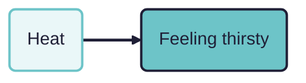
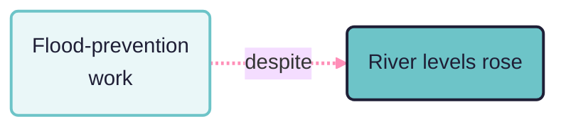
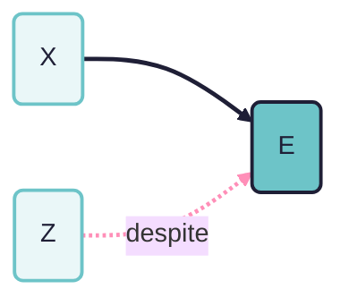
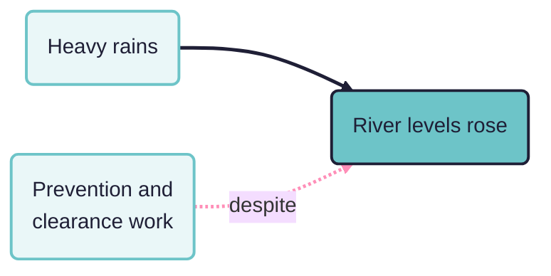
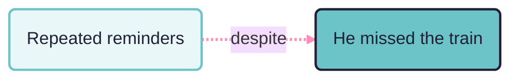

## "Despite" coding

### Start with minimalist causal mapping

Causal mapping is a way of analysing what people say about causes. We read a text, an interview, a report, an open survey answer, and wherever someone claims that one thing influences another, we code that claim as a link. If a respondent says that the heat made them thirsty, we write down a link from `Heat` to `Feeling thirsty`, together with a note of where it came from. That is the whole basic move, and it is easy: find a causal claim, record the cause, the effect, and the source. (See [[minimalist-bare-causation]] and [[for-outsiders]].)

A single coded link looks like this: a box for the cause, a box for the effect, and an arrow from one to the other.

Gather many such links from many sources and they join into a causal map.

This short paper is about the formal coding part. The question is not why "despite" matters, but how to record these near-misses and failures so they mean something inside the coding system, rather than as a handwavy line with a funny arrow on it. 

Our [[minimalist]] approach codes only bare cause-to-effect links and leaves most detail off the link. "Despite" is an example of an hue of causation that we can't capture in our basic system. But it is an idea we don't want to do without: it's frequently asserted and it seems to have a strong causal meaning and relevance. So, as reluctant as we always are when adding extra bits to a very minimal system,  we add a "despite extension" to a small set of extensions to the base (alongside opposites and sentiment, see [[combining-opposites]]) . We declare this type of link as a special type that the app or any other causal link database can store, filter and count, as just another row in the table of links, but with some special marker.

### The puzzle: an influence that could have worked, but did not

Narratives do not only tell us what worked. Sometimes they tell us about an influence that could have worked but did not. Someone says:

> "The river still rose, despite the flood-prevention work."

The flood-prevention work is the kind of thing that pushes against rising water. It had some causal power to hold the river down. In realist terms (see [[realist]]) it was a real influence with a real tendency to work against the outcome. But on this occasion it was not enough: maybe something pushed harder the other way, and the river rose anyway.

This sentence names only the prevention work, not whatever drove the river up. The dashed pink arrow records the influence that was present but failed.

"Despite" claims come in two flavours, depending on which way the failed influence was meant to push. Basically it's the same thing, but we tend to express them a bit differently in words.

**A blocking influence that failed.** Z was the sort of thing expected to prevent or reduce E, but E happened anyway. The flood-prevention work above is this kind: it should have held the river down, and the river rose all the same.

**A helping influence that failed.** Z was the sort of thing expected to bring about or increase E, but E did not happen. For example:

> "Despite the extra coaching, her grades did not improve."

The coaching had the causal power to lift her grades. It was a real, relevant influence. But the improvement did not come.

Either way, the despite clause carries two pieces of information at once:

1. A relevant influence was present. Z had the causal power to push the outcome one way, whether to block it or to help it.
2. On this occasion it failed. Z was insufficient, absent or overridden, so the outcome went the other way.

### Why the obvious options both fail

What should a coder do with the "despite" clause?

- If we code an ordinary link `Flood-prevention work -> River rose`, we assert the opposite of what the speaker meant, namely that the prevention work made the river rise.
- If we ignore the clause and code nothing, we throw away both pieces of information above: that a countervailing influence was present, and that on this occasion it failed, and the other thing happened (or failed to happen).

Neither is satisfactory. We want to keep the speaker's meaning and keep the information.

### But couldn't you just use opposing arrows like in systems modelling?

A systems modeller will say there is no problem here. Code two arrows into the outcome: a positive one from the rains, which raise the river, and a negative one from the prevention work, which lowers it. Whichever is stronger wins, and the river's level is the net result. For systems modelling that is a reasonable move, and it is roughly how signed, weighted influence diagrams already work.

But look at what it takes to make those arrows say what the speaker said. To record that the prevention work lost and the river rose anyway, the modeller has to put magnitudes on the two arrows and compute a resultant, or add further codes for "this one prevailed". The opposing-arrows picture on its own does not tell you which side won, or whether the outcome actually happened.

The real difference is that we are not building a model of the river system. We are encoding what people say and think: claims, cognitions, something much closer to language than to a quantitative model of forces (see [[factors-not-variables]] and [[actually-say]]). When someone says "in spite of", "although" or "even though", they are expressing an idea with a particular flavour [see @talmyForceDynamicsLanguage1988]: they name an influence that was real and relevant, then set it aside as having failed. It is open to question whether two opposing arrows, one a little larger than the other, captures that idea at all.

So despite-coding is an extension we add to capture, in the language of claims, something a systems modeller can arguably get out of the box from signed and weighted arrows. The trade is straightforward: we stay close to what people say and pay for it with one extra link type, where the systems modeller pays for the net-result calculation with numbers and machinery which as humble causal mappers we do not have or want.

### The convention: a "despite" link type (or tag)

We therefore treat "despite" as a special **link type**.

A minimal encoding is:

- **Main link** (ordinary): `Heavy rain -> River rose`
- **Despite link** (typed or tagged): `Flood-prevention work -despite-> River rose`

Equivalently, in a plain links table, we keep the same `Cause` and `Effect` columns but add either:

- a `link_type` column with values like `normal` and `despite`, or
- a `link_tags` column holding a tag like `#despite`.

This is the same idea as attaching other metadata to a link (see [[link-metadata]]). The point is that `-despite->` does **not** mean "Z caused E". It means one of the two flavours above:

> "Z was presented as a countervailing influence against E, in virtue of its causal power to work against E, but E occurred anyway." (the blocking case)

or

> "Z was presented as an influence in favour of E, in virtue of its causal power to do so, but E failed to occur anyway." (the helping case)

In a map, the ordinary link and the despite link both point at the same effect, but they look different: the solid arrow is the ordinary influence, the dashed pink arrow is the despite link.

### What can we do with "despite" links?

Because the distinction is explicit in the links table, we can decide, per analysis, how to treat these links:

- **Visualise** them distinctly, with a different colour or line style, so the map shows the tension rather than dropping it or misreading it.
- **Filter** to show only `despite` links, to see what people present as failed protections, resistances or mitigations.
- **Compare**: for similar outcomes, do some sources describe Z as effective, an ordinary preventive claim written `Z -> ~E` (the tilde `~` marks the opposite of a factor, so `~E` means E did not happen, or the opposite of E; see [[combining-opposites]]), while others describe a "despite" failure (`Z -despite-> E`)? That contrast can matter analytically.
- **Count separately**, under their own counter (for example `Despite_Citation_Count`), so you do not accidentally inflate the evidence for "Z causes E" (on counting evidence, see [[counting-influences]] and [[assessing]]).
- **Count together**, so we can at least see how often this causal power was present regardless of whether it was effective or not.

### Worked examples

Text:

> "The heavy rains made the river levels rise, despite the prevention and clearance work."

Coding:

- `Heavy rains -> River levels rose`
- `Prevention and clearance work -despite-> River levels rose`

This keeps the main mechanism while also recording that a mitigation was present but insufficient.

As a map, the two links sit side by side on the same outcome. The solid arrow is the ordinary influence; the dashed pink arrow is the despite link.

Sometimes the speaker gives no positive cause at all, only the countervailing one that failed:

> "Despite me reminding him several times, he still missed the train."

Here the only thing to code is the despite link. The reminders had the power to prevent the missed train, but did not.

### Optional background: force dynamics

You do not need any theory to use `-despite->` coding. But it helps to know why "despite" claims feel different from ordinary causal claims.

Leonard Talmy's "force dynamics" [@talmyForceDynamicsLanguage1988] treats much of our causal talk as patterned talk about forces: an **Agonist** with a tendency, towards motion or rest, and an **Antagonist** that counters it. Talmy analyses "causing" into finer ideas that include "letting", "hindering" and "helping", and notes that the same pattern runs from the physical through to the psychological and social. "Despite" is a canonical force-dynamics marker: it signals a countervailing force that failed to stop the outcome. "The ball kept rolling despite the long grass" has the ball as Agonist and the grass as the Antagonist that did not prevail.

This is why "despite" is worth capturing explicitly: it shows that a causal power was present and was overcome, which is information about how the world works, not just noise to discard.

### Despite links inside packages

Often the narrative names both the influence that failed and the influence that overcame it: "the fan failed to cool him down because the sun was too strong". The despite link (`Fan -despite-> Feeling cooler`) and the ordinary link (`Strong sun -> Feeling hot`) tell one story, and we can record that by giving both the same package code with type `DESPITE`. See the sister paper [[017 Coding packages of links ((packages))]] for the package convention.

### Hard cases (brief notes)

- **"Despite" plus opposites**: should `Z -despite-> E` count as evidence for `Z -> ~E`? Usually no. Treat it as its own link type, or at most as weaker evidence, depending on the analysis goal. See [[combining-opposites]] for how opposites and sentiment interact with this.
- **Bipolar concepts**: some pairs (employment and unemployment) are mentioned in very similar contexts but are opposite in ordinary talk. This is why also coding sentiment often becomes very useful when doing AI-assisted clustering and aggregation.

### A more formal picture

This puts despite-coding into the grammar of [[006 A formalisation of causal mapping ((formalisation))]]. There, an ordinary link is read with rule COD-ATOM as "Source S claims that X causally influenced Y in virtue of its causal power to do so", and rule INF-FACT lets us deduce from any link that S claims X happened and Y happened. A despite link adds another link type to that grammar.

**Semantics (the blocking case).** A row `X -despite-> Y` from source S is read as:

> Source S claims that X happened, and Y happened, and X had some causal power to make `~Y` (to work against Y), but X did not prevail.

**Three deductions, three lists.** From that one row we can deduce three things, each feeding a different query (compare INF-FACT):

- **X occurred (with caveats).** S claims X happened. So when listing claims that the Xs happened, include despite links, with the caveat that "despite" sometimes frames X as only partly realised or as what should have been done.
- **Y occurred.** S claims Y happened. So when listing cases where Y happened, include despite links on the same footing as ordinary links.
- **X had countervailing power (with caveats).** S claims X had some causal power to make `~Y`. So when listing cases where X is claimed to have had the power to prevent or reduce Y, include despite links, with the caveat that this is the speaker's claim about a power that did not, in the event, carry the outcome.

**The helping case.** When the despite clause is of the helping kind ("despite the coaching, the grades did not improve"), the same row is read with Y negated:

> Source S claims that X happened, and Y did not happen, and X had some causal power to make Y, but X did not prevail.

The three deductions mirror the blocking case: read "Y did not happen" for the second, and "power to make Y" for the third.

**What a despite link is not.** On its own it is never evidence for an ordinary `X -> Y`. It is closer to evidence about `X -> ~Y`, but we keep it as its own type rather than folding it into the opposites machinery (rule FIL-OPP in the formalisation; see also the hard case above and [[combining-opposites]]).
