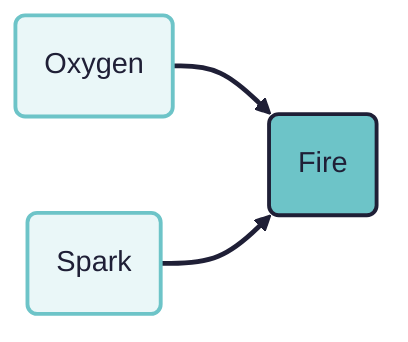
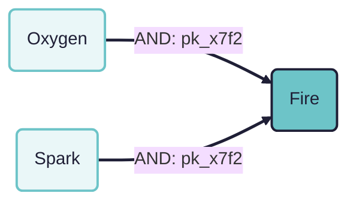
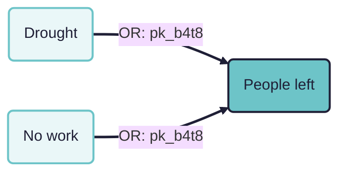
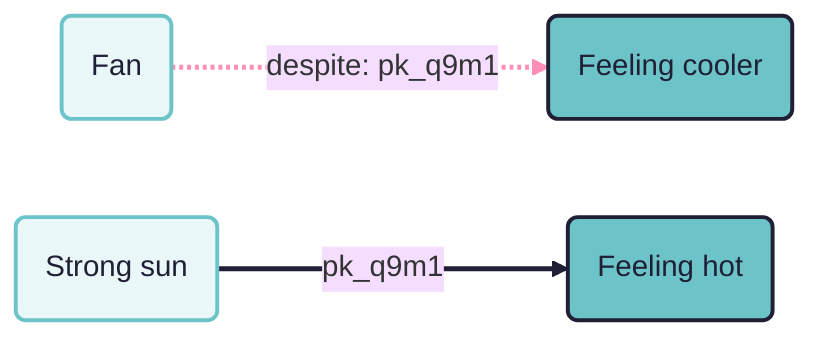

## Coding packages

### Start with minimalist causal mapping

Causal mapping is a way of analysing what people say about causes. Wherever someone claims that one thing influences another, we code that claim as a link: a cause, an effect, a quote and a source ID. That is the whole basic move (see [[005 Minimalist coding for causal mapping ((minimalist))|minimalist coding]]).

Our [[005 Minimalist coding for causal mapping ((minimalist))|minimalist]] approach codes only bare cause-to-effect links and leaves most detail off the link. Like [[016 Despite-claims ((despite-claims))|despite coding]], what follows is a small extension we add reluctantly, because it captures something people say often enough, and clearly enough, that throwing it away feels wasteful. As with despite links, the extension is just another marker on ordinary rows in the links table: nothing about the core coding move changes.

### The puzzle: causes that are claimed to work together

Sometimes a source does not present two influences as independent. They present them as a team:

> "You need both oxygen and a spark to make fire."

Minimalist coding gives us two links:

- `Oxygen -> Fire`
- `Spark -> Fire`

Each link on its own is fine. But together they have quietly dropped the speaker's central point: that neither influence works alone. Oxygen without a spark gives you nothing; a spark without oxygen gives you nothing. The claim was about a *combination*, and two separate rows in a links table cannot say so.

This is the problem of causal packages or conjunctions, familiar from realist evaluation, from INUS conditions in the philosophy of causation [@mackieCementUniverseStudy1980], and from everyday talk. It is one of the recognisable ways that pure minimalist coding runs out (see the discussion in [[005 Minimalist coding for causal mapping ((minimalist))|the minimalist paper]]).

### Why the obvious options both fail

- **Code the two links separately** and the conjunctive structure is  lost without trace. Worse, each link now reads as an independent claim of influence, which is subtly more than the speaker said.
- **Code one combined factor** such as `Oxygen and a spark -> Fire`, and the label is no longer parsable: it cannot be related to other claims about oxygen, or sparks, on their own. Clustering, recoding and label search all degrade.

We want to keep the individual factors as individual factors, and still record that on this occasion they were claimed to work as a team.

### The convention: a shared package code

We give the links that belong together a shared, otherwise meaningless code, plus a name for *how* they belong together. Concretely, each link in a links table can carry two extra pieces of metadata:

- `package`: an arbitrary unique code (say `pk_x7f2`) shared by all the links in one package and by nothing else in the dataset.
- `package_type`: the named connective, most commonly `AND` or `OR`, sometimes `DESPITE` (below), and `?` where the speaker grouped the causes without saying which. The vocabulary is open: these four cover most of what we meet, but a coder can write anything.

So the fire claim is coded:

- `Oxygen -> Fire` (package: `pk_x7f2`, type: `AND`)
- `Spark -> Fire` (package: `pk_x7f2`, type: `AND`)

The two links are still ordinary links: they appear in maps, they carry quotes, they can be filtered and counted like any others. The package code is the only thing tying them together, and the type says what the tie means.

Both fields sit on the link, not on some separate package object. For `package` that is just bookkeeping, since the code is the same on every member. For `package_type` it is a real choice, and we say more about it under [asymmetric packages](#asymmetric-packages) below: usually every member of a package carries the same type, but they need not, and the cases where they differ are interesting.

#### AND packages

The commonest case: a claimed conjunction. Each factor is presented as needed; the effect follows from the combination. "The training only worked because the community already trusted the facilitators" can be coded as two links into the outcome sharing an `AND` package.

#### OR packages

The source presents alternatives: "people left because of the drought, or because there was no work"; "either the pension or the remittances would have kept them afloat".

`OR` is less well defined than `AND`, and it is fair to ask whether it needs a package at all. In several coding traditions, alternative sufficient causes are exactly the case where no extra structure is wanted: if either influence would have done the job on its own, the two links really are independent claims, and coding them separately loses nothing. On that view an `OR` package is redundant by definition.

We keep it anyway, for a weaker reason: the package records that the speaker *mentioned the influences together as alternatives*. That is itself information about the claim. "Either would have done it", "sometimes one, sometimes the other", "one or other of these was always the reason": these are not the same as two separate unqualified claims of influence, and a coder reading one link later may want to know that the speaker was hedging between alternatives rather than asserting each outright. The `OR` package carries that, and nothing more. As with the rest of the convention, we do not pin down which flavour of "or" was meant (exclusive or inclusive, alternation over occasions, uncertainty between explanations); if that matters for an analysis, the quote is on each link.

In practice we treat `OR` packaging as really optional. People do not often speak or write in true either-would-have-done alternatives, so the case arises rarely, and when it does, coding two plain links is usually an adequate record. Use an `OR` package only when the togetherness of the alternatives seems worth keeping.

#### `?` packages

Often a speaker gives two or more causes in the same breath without saying whether both were needed or either would have done: "we got there because of the funding and because the new manager pushed it through". Forcing a choice between `AND` and `OR` here puts words in the speaker's mouth. The honest connective is `?`: the package records that the causes were presented together as one claim, and stays silent on how they combine. In coding practice `?` is the default for same-breath groupings, with `AND` reserved for causes presented as needed together and `OR` for explicit alternatives.

#### DESPITE packages

[[016 Despite-claims ((despite-claims))|Despite links]] record an influence that was present and relevant but failed. Often the narrative names both the failed influence and the influence that overcame it:

> "The fan failed to cool him down because the sun was too strong."

Coding:

- `Fan -despite-> Feeling cooler` (the failed helping influence)
- `Strong sun -> Feeling hot` (the influence that prevailed)

These two links tell one story, and a package records that: both get the same package code with type `DESPITE`. The package says "these belong to a single episode of one influence overcoming another", which neither link says alone.

#### Packages of effects

The same move works in the other direction. A speaker can fan one cause into several effects in a single claim: "the programme raised awareness and changed behaviour". Coding two links and giving them a shared package records that this was one claim with two outcomes rather than two separate claims, using the same connectives (`AND` where both outcomes are asserted, `?` where the grouping is looser).

A package of effects matters less for analysis than a package of causes. Two effect links read separately rarely overstate what the speaker said, whereas a single link quoted out of an `AND` package of causes does. But it is arguably the more natural reading of such sentences, which present one claim fanned out, and allowing it keeps the convention symmetrical: a package groups the links of one joint claim, whichever end the conjunction is on. (Until July 2026 the convention grouped causes only; effect packages were admitted as a simplification.)

### Asymmetric packages: the type belongs to the link {#asymmetric-packages}

Because `package_type` is a column on the link, the members of one package can in principle carry *different* types. Most of the time they do not: an `AND` package is `AND` all the way through, and that is what the app fills in for you. But the possibility is not an accident, and it is worth seeing what it buys.

Take the despite pair again ("the fan failed to cool him down because the sun was too strong"). You could describe it as an asymmetric package: one member is the influence that failed, the other is the influence that prevailed, and those are plainly not the same kind of membership. We do not in fact code it that way. The failure is a property of the link itself, so we mark the failed link as a failure (see [[016 Despite-claims ((despite-claims))]]) and let the shared package code do nothing more than tie the episode together. Recording the asymmetry twice, once in the link's own failure marker and again in a pair of contrasting package types, would be redundant and would invite the two records to disagree.

The case that asymmetric types are genuinely *for* is different, and more interesting: **claims about how one causal link affects another**. Suppose a source says that factor A, acting through link A, changes whether factor B can work through link B at all. This is the enabler and blocker problem, the second-order causal claim discussed in [[005 Minimalist coding for causal mapping ((minimalist))]]: an arrow pointing at an arrow, rather than at a factor. A package can hold the two links together, and asymmetric types can then say which is which: one link is the mechanism, the other is the thing acting on that mechanism. Something like a meta-mechanism, coded without inventing a new object in the data structure.

We flag this as a possibility rather than a settled convention. We have not fixed a vocabulary for these types, and until we have coded enough real examples to know what recurs, we would rather leave the field open than standardise something premature. The minimalist instinct applies here as everywhere: the extension exists because the data structure permits it cheaply, and it should stay unused until the texts demand it.

### The semantics: weak by design

A package is a *claim of joint working*, nothing more. Reading a package of links `{L1, L2, ...}` with type T from source S:

> Source S presents the influences coded in L1, L2, ... as working together in the manner named by T to affect the outcome(s) they point to.

We go no further, on purpose. In particular we do not commit to:

- **Truth tables or INUS structure.** An `AND` package does not assert that the factors are individually necessary and jointly sufficient. It asserts that the speaker presented them as a combination.
- **Interaction effects or functional form.** No claim about how the combined influence scales.
- **Completeness.** The package contains the co-causes the speaker mentioned, not all the co-causes there are.

This mirrors the minimalist stance for ordinary links: we record the surface shape of the claim, with provenance, and defer stronger modelling to the analyst. The deductions that ordinary links license still hold for each link in a package (the factors happened, the source claimed influence), with the caveat for `AND` packages that the influence claimed for each factor is influence *as part of the combination*, so a single link from an `AND` package quoted on its own slightly overstates what the speaker said. Keeping the package code on the row is what lets a careful analyst notice this.

### What can we do with packages?

Because the package structure is explicit in the links table, we can:

- **Filter** to show only links that are in any package (where `package` is not empty), to review all the conjunctive coding in a project at once.
- **Show a single package** (where `package` equals a given code) to see one claimed combination in isolation, with its quotes.
- **Filter by type**, for example all `DESPITE` packages, to see every episode where one influence was claimed to overcome another.
- **Count** packages separately from ordinary links, so conjunctive claims are not silently inflated into independent evidence.
- **Visualise** packaged links distinctly if wanted, though the default map view simply shows the ordinary links.

### How this is coded in the Causal Map app

The [Causal Map app](https://app.causalmap.app) stores `package` and `package_type` as standard columns on every link.

- **While coding**: when a statement gives several causes for one effect, enter the FROM factors as usual, switch on the package toggle, and pick or type the package type (`AND`, `OR` and `DESPITE` are offered). The app mints the shared package code itself; you never type or track codes by hand.
- **After coding**: select several rows in the links table and package them (a fresh shared code) or unpackage them (clear their codes) in one action. The packaging dialog lists each selected link and gives it its own type field, so the usual single-type package is one click while an [asymmetric package](#asymmetric-packages) remains possible.
- **For analysis**: the Everything Filter can select on `package` and `package_type` like any other link field: show only packaged links, only one package, or only one type.

The filter engine behind these selections is also published as a standalone open-source package, [`@causalmap/filter-engine`](https://www.npmjs.com/package/@causalmap/filter-engine), so the same `package`/`package_type` filtering runs on a links table outside the app.

### Hard cases (brief notes)

- **Don't package the merely co-mentioned.** Two causes in one sentence are not automatically a package. Package only when the speaker presents the combination itself as doing the work ("both... and...", "only because... together with...", "either... or...").
- **Packages versus bundles.** A *bundle* is our name for co-terminal links (same cause, same effect) collapsed for display; it is a display-time aggregation. A package is a coded claim tying *different* links together. The two are unrelated mechanisms.
- **One link, one package.** In this convention a link carries at most one package code. Truly nested combinations ("A and either B or C") are rare in ordinary talk; when they matter, handle them in the write-up.
- **Counting.** Whether an `AND` package of three links counts as one piece of evidence or three depends on the question being asked; the package code is what makes either count possible.

### A more formal picture

In the grammar of [[006 A formalisation of causal mapping ((formalisation))]], a package adds one rule on top of the atomic coding rule COD-ATOM: a set of links sharing a package code is read with the joint-working semantics above (call it COD-PACK), parameterised by the type each member carries (usually one type throughout; see [asymmetric packages](#asymmetric-packages)). The factual deductions of INF-FACT still apply per link. No new inference rules are licensed by default: in particular, we do not license inferring the effect from the presence of all `AND` members, because packages record claims about combinations, not verified mechanisms.
