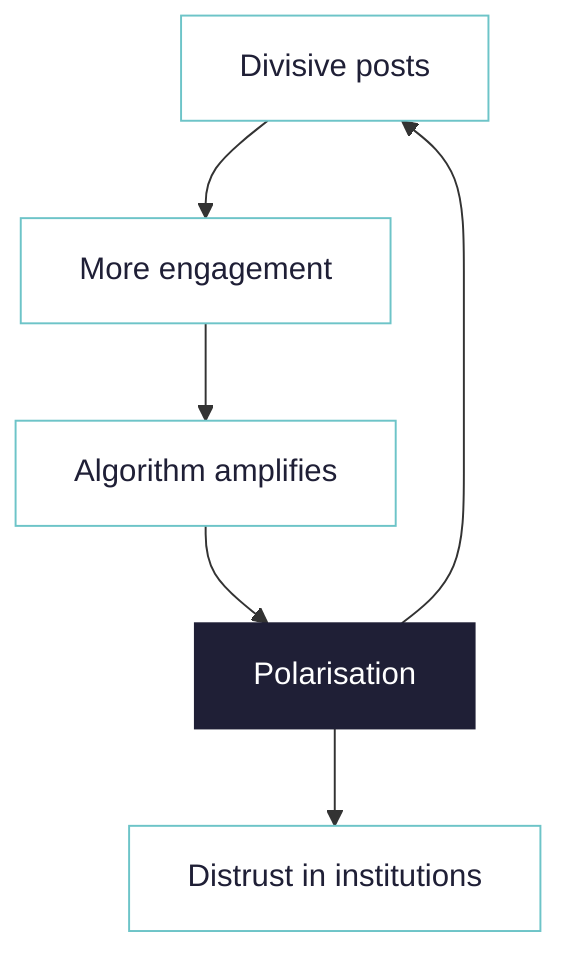
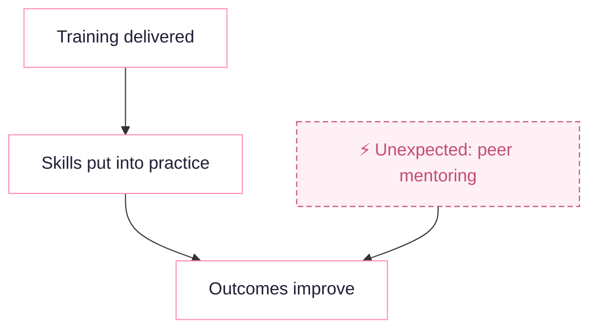
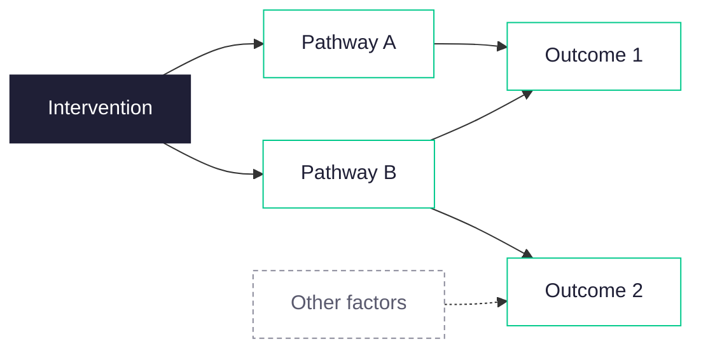

<!--
A gmist version of this page also exists, at:
"10-19 Outreach - marketing - presentations - academic - theory/18 Marketing - all client facing/causal-map-three-uses.md",
kept as a potential deck slide. Keep the two in sync if you change one. That copy uses
inline SVG or top-level mermaid, because gmist cannot render mermaid nested in a panel.
-->

Three different ways to use causal mapping. The workflow is similar for each: import interviews and/or reports and code them (identifying all the causal claims, where someone says that one thing influences another) manually or with AI. 
--- start-multi-column: ThreeUses
```column-settings
number of columns: 2
```

--{.panel}
==General social research==

### What do people think, and what drives what?

Gather open accounts on any topic and map the causal claims people make. No fixed framework: [the drivers](/main-drivers/) emerge from the material, [feedback loops](/feedback-loops/) and all.



*A feedback loop driving polarisation, with a downstream branch.*
--

--- end-column ---

--{.panel}
==Testing a theory of change==

### Does the evidence back your theory of change?

Build a [theory of change](/testing-theory-of-change/) inductively from reports and interviews, or apply a fixed codebook from an existing theory, or mix the two approaches. Either way the map can also surface [outcomes you never expected](/unexpected-factors/). Behind each link are multiple quotes from multiple sources.



*Validating a theory of change*
--

--- end-multi-column

--{.panel}
==As the skeleton for an entire evaluatio==

### Run the whole evaluation from one coded evidence base

Import all your material, code it once, and use the map as the backbone of the study. Express each [evaluation question](/evaluation-questions/) as one or more filters applied to the [complete map](/query-models/).  Then read the answer off the evidence.



**Questions you can answer**

- [What is the evidence our intervention led to a given outcome?](/robustness/)
- [Along which pathways did that change happen?](/path-tracing/)
- [How does the story differ across groups of respondents?](/comparing-groups/)
- [What are the alternative explanations, and how strong are they?](/upstream/)
--
