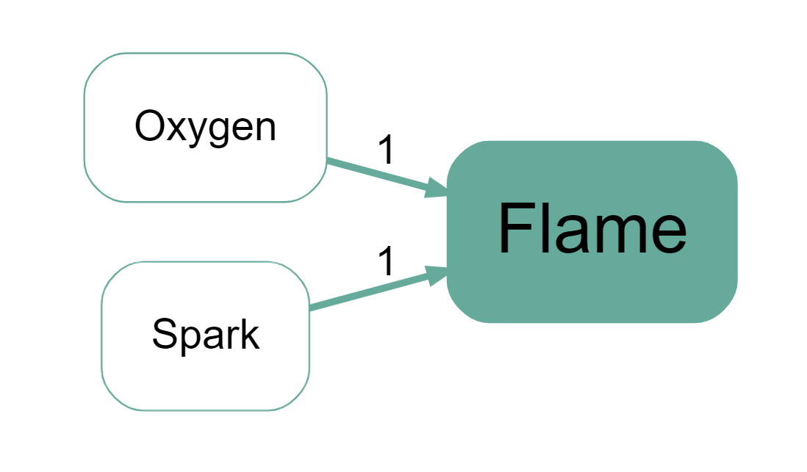

## Summary

In evaluation work, people often make **context-dependent** causal claims:

> “When X holds, A leads to B.”

If you code only “A → B”, you may lose what makes the claim true *in this setting*.

This page is about a simple, practitioner-friendly approach:

- keep the causal map minimalist (links between factors), and
- record context as **tags on links** (so you can filter/compare later).

## The core idea (practical)

Treat context as **metadata** about a claim, not necessarily as another causal factor.

Example claim:

- “When enough oxygen is present, a spark will always cause a flame.”

You might still code the causal link:

- `Spark → Flame`

…but tag it with a context tag, e.g.:

- `Context: oxygen present`

That way you can later:

- show only links tagged with that context, or
- compare “with context” vs “without context” views.

## Using context in the Causal Map app

You can encode context by adding **tags** to links (just like other link tags).

A simple convention that works well is to prefix them, e.g.:

- `Context: oxygen`
- `Context: rainy season`
- `Context: only for village X`

Then you can use the include/exclude tags filters to show only links with particular contexts (or to hide them).

## Formal notes (optional)

One reason context feels different from “just another cause” is that we often do not have (or do not claim) information about what happens when the context is absent.

In the oxygen example, we know how Spark relates to Flame *given* Oxygen, but not what happens without Oxygen. This can be expressed as a partial truth table:

| **Oxygen** | **Spark** | **Flame** |
| --- | --- | --- |
| Yes | Yes | Yes |
| Yes | No | No |
| No | Yes | ? |
| No | No | ? |

This is one motivation for treating “context” as enabling conditions or metadata rather than forcing it into the same causal-factor role as the other nodes.

