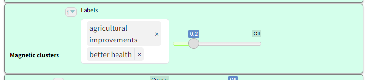

>This is old material but can be re-used

### Summary

### Motivation

Often we have more labels that we really want. People like simple maps with 3-10 factors. 30 is about the maximum number you can possibly squeeze onto a map, and if you do you’ll not want more than 30 or 40 links.

BUT for overview summaries, we want to provide maps with a high link coverage, close to 100%, meaning that nearly all the original links are actually included in the current map. Otherwise, we are just showing a small selection of what people actually said.

One way to do this is with zooming. It’s a way to reduce the number of factors while retaining the link coverage (because we don’t throw away links, we only reroute them to higher level factors).

BUT zooming requires hierarchical factor labelling.

Disadvantages: 

- It is a lot of work
- It means taking a lot of decisions about what hierarchy best fits the data
- It doesn’t help where our coding (manual or auto) has produced parent factors with similar meaning eg Improved Health and Better Health.
- It doesn’t help where our coding (manual or auto) has produced other factors which might fit into the hierarchy but aren’t labelled as such eg Mental health; more optimistic might fit well under Improved Health.

## Solution

The idea of autoclustering is to take all the factor labels and group them into clusters with similar meaning using embeddings.  

Below are questions interesting to ask when you are looking at the list of clusters: 

- Do the clusters make sense to you?
- Are they the labels you would like to see (most of) on the final maps?
- Do you think they do a good job of covering the material?
- Or perhaps you can see one you would like to split into two, or a pair you would like to merge?

To do this, you may also look at the contents of each cluster (the raw labels assigned to them) in case you think any of the cluster labels are missing the point of the main contents or putting a wrong accent on them. But don't worry  at this stage if you see a few raw labels which don't exactly fit the clusters. We can deal with those later. At this stage our focus is only on getting the cluster labels right.

## Labelling

As well as clustering the factors, the app then also tries to choose a good label for them. It chooses the label of one of the factors in each cluster as a label for the whole cluster, picking one which is both typical in meaning but also short. Overall:

- The app usually does a **good job of clustering the factors**, as long as you are careful not to be too permissive; or if you do set a permissive granularity value, be careful how you interpret the results.
- The app does **not do a very good job of finding a suitable label for each cluster without zooming**, however **the top-level parts of the labels are usually good**.
- You can check what factors are included in each cluster by clicking as usual on a factor in the map. You will see that there is now a button called `Recode`  and underneath it, an editable label automatically chosen for the cluster, and a list of the factors included in the cluster.

- The number `N` shows the number of factors in the cluster.
- The clusters are listed in order of descending `N`.
- Here are some **bad things** to look out for. If you see more than a few of them, increase the granularity.
    - Things with positive and negative valence in the same cluster
    - Increases and decreases of the same thing in the same cluster
    - The app has focused on the second level more than the first level, so for example it puts things like Improved health; children, More problems; children, Need for education; children in the same cluster.

You can autocluster at any point in the transform chain, so for example it is also possible to zoom to level 1 *first* and then autocluster just the top-level labels.

### Saving your label sets

It is not possible to reassign factors between clusters, and you probably won’t want to. But for publication and presentation purposes, you may well want to provide nicer labels than those auto generated by the app. 

If you want to make changes to the labels, you can save them in a label set.

The label sets are saved to the server but are separate from the file. So they are not, for example, restored if you restore an earlier version of the file. 

Label sets should get applied correctly if you save a view of your file, using a particular label set, in [**📚 The Library**](%F0%9F%93%9A%20The%20Library%204fe69cfeb7ff479d89d29e8bba6f702b.md). 

Each label set has a unique number.

You can create and edit label sets either from the factor modal which you see either when clicking on a factor or by clicking `Manage`  button in the transforms widget:

As soon as you press the Save icon in either dialog:

- if `Label sets`  is set to `new` , you create a new label set - even if you have only changed one thing.
- if `Label sets`  is set to a number, you are editing an existing label set.

From the Manage dialog, you can even save your changes to a different label set:

- so for example if you were editing set 13, and select `new` , and press the Save icon, you will create a new label set containing your changes.

For each file you can have as many “relabel sets” as you want. 

If you select an existing label set, then the set with the number you selected becomes active, and the factors will be grouped into clusters specified in your selected label set and given the label specified in that label set.  The granularity slider is then ignored.

# Why magnetic labels

You have already coded your dataset, manually or using AI, and now you want to relabel.

Suppose you already know what labels you want to use, perhaps:

- you knew before you even started
- you decided what labels you wanted after reviewing your data and looking at different auto-cluster solutions

Magnetic labels are a really simple solution for these cases.

# How to use them

You simply type the list of magnetic labels you want and decide on the power of the magnets (”magnetism”).

Magnetic labels attract existing labels of similar meaning, essentially relabelling these old labels with the new magnetic label. If an existing label is similar to two or more different labels, it is relabelled with the magnetic label it is most similar to. 

If you use low magnetism, the magnets are weak and only attract existing labels which are very similar to them.

Increasing the magnetism means that more and more existing labels are attracted to the magnetic labels.

Existing labels which are not attracted to any label are unchanged. This means that you can easily see if your magnetic labels cover most of the original content.

Best practice is then, after applying magnetic labels, to then auto-cluster the links in order to pick out important themes which are not covered by the magnetic labels.

> If you want you can even include hierarchical magnetic labels like `Health behaviour; hand washing`.
> 

## Storing your labels

Your magnetic labels are included if you save a bookmark aka saved View. 

You can also store your preferred label set in the Codebook in [The Files tab](https://www.notion.so/The-Files-tab-154b98461eca4b8296e7096c0fc41a6b?pvs=21).

# Use cases

- Drop in magnetic labels which contain the text from the “official” theory of change.
- See how much the existing labels get attracted to the magnetic labels, and what material is left over.
- Conduct “radical zero shot” auto coding with no codebook at all,
    - let the AI decide the best label for each case
    - do some auto clustering until you get a feel for the labels you really want in your story
    - type the labels into the magnetic clusters box

# Tips

## What if you have a *semantically ambiguous label?*

An example: you have some research about animals and you want to look for mentions of the organisation Animal Aid. If you use Animal Aid as a label, it might also pick up any mention of helping animals which have nothing to do with the organisation itself. 

One way to get round this is to use [🔗 The Manage Links tab](%F0%9F%94%97%20The%20Manage%20Links%20tab%2070835b4b20664837870680b7151d4c6e.md) to permanently recode any mention of Animal Aid in your factor labels into something unambiguous like, say, The Archibald Organisation. Choose a meaningless name which is not going to appear in or be related to to the rest of your material.

When doing this “hard recoding” remember to recode AnimalAid, Animals Aid etc as well.

## Attracting unwanted material *away* from your map

You can add an factor into magnetic clusters even if it doesn't appear in the final map. 

For example you might have a lot of material about blood donors and you don’t want material about donating clothes. As well as donating blood you might add the labels donating goods and donating money. You can filter these out later, but they will help restrict donating blood to what you want.

## Increasing coverage with hierarchical magnetic labels

It might just be that your interview material is so heterogeneous that, however you choose your magnetic labels, if you only have say 10 or 20 of them then they are just not going to cover more than say 30% of your links in all of your stories and that's just the way it is because the material is very broad. 

You might have hoped to arrive at a kind of global mind map - but the best you can do is just these most frequently mentioned common factors. You'd have to accept that it isn't in any sense a summary of *all* of the material because there's lots of other stuff that doesn't feature amongst the top 10 or 20 magnetic labels. 

You might then also want to focus on more specific maps for more specific subject areas.

Or maybe you have a sense that in fact much of the material really is held in common but you're struggling to find the right magnetic labels? One way to increase coverage is to use hierarchical magnetic labels, of which you might have even 30 or 60 or even 100, and then zoom out to level one. So you might have, say, magnets like:

Desire for innovation; digital

Desire for innovation; management approaches

....

And then you'd apply a zoom level of 1 in order to bundle these things together.

## Transformation and interpretation rules {.banner}### Transformation rule {.rounded}- **Input:** a links table with existing factor labels, a user-provided list of magnetic labels, and a magnetism threshold.
- **Transformation:** for each existing label, map it to the most similar magnetic label if similarity is high enough; otherwise keep the original label unchanged.
- **Output:** a links table/map with partially transformed labels, updated bundles/counts, and visible uncovered material.### Interpretation rule {.rounded}- Magnetic labels are a soft recoding layer for harmonization and exploration.
- Stronger magnetism usually increases coverage but can also pull in weaker semantic matches.

## Coding named entities

This task is hard because we have to think about on the one hand giving background information to the coding AI and on the other hand what kind of labels we want:

We should probably split our information into two corresponding parts.

### A) General information about the context
### B) Guidance on how to produce labels

We want the coding AI to use the same word or phrase for the same thing, e.g. different ways of talking about the same project or organisation.

Remember the coding AI can actually understand background knowledge and maybe bear it in mind, but the embedder is not genAI, it simply takes a word or phrase or paragraph and gives its numerical location on an incredible global map of meanings.
If you ask for labels in language X, make sure your explanations in this section also refer to language X: our preferred phrase should normally be in the same language as the other labels we ask it to make.

Should we tell the coding AI to use special abbreviations or general language?

It's tricky. on the one hand we like the abbreviations because they are clear and we can easily recode variations of project names into the abbreviations.
if we use an abbreviation for say PFNL, the embeddings algorithm will not know where to position this except close to other phrases with PFNL.
Maybe this is what we want.

### Embeddings are a special problem

(This part is only relevant if you want to use auto clustering or magnetic labels, both of which use embeddings.)
If on the other hand PFNL might be one of several different product types with a whole range of different names, and we want to embed them as similar to one another, then we need to spell out the meaning.

It may be simplest to ask it to use an abbreviation, e.g.
For 'TreeAid', 'Tree Aid', 'TA' 'BB6' and similar, write 'BB6 project'
For 'Dutch International Development', 'Netherlands Development Organisation', 'Stichting Nederlandse Vrijwilligers' 'SNV' and similar, write 'SNV (NGO)'

Remember from a business point of view the overarching priority is often identifying each and every mention of an intervention and related interventions, and distinguishing these from unrelated interventions.

So for coding AI purposes and ordinary causal mapping, it is often simplest just to use abbreviations....
BUT if we do that, we have to understand that non-common abbreviations don't mean anything to the embedder
If we want them to mean something because we want STW and STC to be clustered close together because they stand for Save The Whales project and Save the Cetaceans Project, then we have a problem.

But even here, it might be better to have clear unambiguous abbreviations rather than some phrase because then it is easy to recode with Manage Links

Ideally I think we would tell the coding AI to make labels with both parts, e.g. 'STW (Save the Whales Project)' but I think this is hard for it and it may not be consistent.

