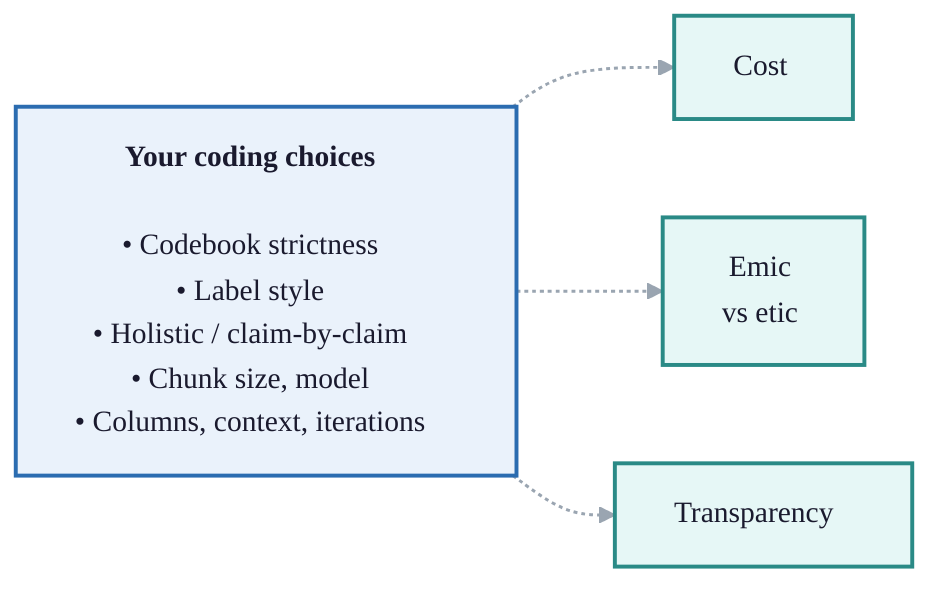

## Summary

> You have a stack of documents or interviews and you want to answer research or evaluation questions rigorously. This is one workflow for getting there: nine steps, from planning through coding to a final judgement. The steps are almost the same whether you code by hand or with AI. This steps presented in this paper match the way we work in the Causal Map app, but the principles should make sense however coding is done. There is a strong focus here on AI-supported coding at scale, as the scale of AI coding requires some additional procedures and checks, but a manual coder follows approximately the same path and can just skip those sections.

Most subscribers to our App have coded manually, and coding manually is great.  But although there's a lot of documentation, we never really did a step-by-step guide to how to do manual coding. 

At Causal Map we've also been using AI for causal coding systematically now for nearly four years in a set of really interesting studies, mostly for clients, and often at considerable scale. Plenty of subscribers have been asking to use AI themselves. We've been reluctant frankly because we've been making it up as we go along and there are a *lot* of different things to think about. But now we've introduced One-Click Coding and it's time that we spilled out something of what we have learned on AI coding for the benefit of others. 

So that is two overlapping reasons for this working paper. It is written so that a manual coder can read straight past the AI-only parts (the AI decisions table, and the model, chunk and iteration parts of Step 4) and still have a complete workflow.

The steps can be divided into three Tasks. **Collect** (Steps 1 to 2): decide what questions you want to answer and gather data that can answer them. **Code** (Steps 3 to 5): turn the text into a checked table of many causal claims, each with a quote and a source. **Query** (Steps 6 to 9): weigh that evidence and use it to answer the questions. The pattern is one or more cheap, wide coding passes to capture the evidence, then steadily narrower judgement, so a thousand raw claims might end as a few dozen well-vouched links and a few strong findings.

The companion piece, [[902 Quality assurance at each step of the causal coding workflow ((quality-assurance))|Quality assurance at each step]], goes through the same steps and asks how to keep each one rigorous. For step-by-step app instructions in the Causal Map itself, see [[030 AI coding ((simple-ai))]].
## About causal mapping

Causal mapping analyses what people say in interviews, focus groups or reports when you want to know what they think causes what. You read the material and code each causal claim ("the rains ruined the harvest", "the training raised her confidence") as a link from one factor to another. Combine the links from many sources and you have a causal map: a network of what people believe drives what. For a fuller introduction see [[0.10 Causal mapping helps make sense of many causal claims from many sources ((make-sense))|this]] and [[0.03 A causal map consists of multiple links where a link from X to Y means someone believes X influences Y ((causal-map-links))|this]].

It is like systems mapping, but instead of modelling how the world works we first record what people claim about it, and only later, if at all, ask what is really going on.

We code in the **minimalist** style: a link records only that "a source says X influenced Y", with a quote. No polarity, no strength, no fitted curves, no counterfactual the speaker never gave. The case for that is in [[005 Minimalist coding for causal mapping ((minimalist))]].

## The nine steps

1. Collect: [Overall planning: questions, methods](#step-1-overall-planning)
2. Collect: [Gather data](#step-2-data-gathering)
3. Code: [Prepare and revise the codebook](#step-3-manage-the-codebook)
4. Code: [Code the claims](#step-4-code-the-claims)
5. Code: [Check links and iterate](#step-5-check-and-enrich-individual-links)
6. Query: [From claims to bundles](#step-6-from-claims-to-bundles)
7. Query: [From bundles to pathways](#step-7-from-bundles-to-pathways)
8. Query: [Judge value and relative contribution](#step-8-judge-value-and-relative-contribution)
9. Query: [Holistic final judgement](#step-9-holistic-judgement)

The steps are not a strict sequence. Sometimes you will iterate. You will revisit the early ones as results come in, and only the last is strictly required; most projects use a handful.

<!--
### What the coding choices trade

Setting up a coding run (Steps 3 and 4) means a cluster of choices: how strict a codebook, holistic or claim by claim, chunk size, model, labels, columns, context, iterations. They are easier to weigh once you see what difference each one makes. At least three things are at stake:

- **Cost.** Time, money and compute. Sampling, model choice, chunk size and iteration count mostly decide how much you spend.
- **Emic vs etic.** Whose concepts the labels use: the source's own words and categories (emic) or your analytic framework (etic). Close-to-text coding and free codebooks stay emic.
- **Transparency.** Whether you can show your working. Claim-by-claim coding leaves a complete reconstructable audit trail; holistic and one-click coding give more freedom to the coder or AI and show less.

Mostly we follow a strategy of *capture now, judge later*. Code cheaply and close to the text first, then consolidate and judge in later steps. Often we start emic, wide and cheap, and tighten afterwards.

The tables sort the decisions this way. The first table applies to all coding; the second only to AI coding, so a manual coder can skip it. A blank cell means that axis is not really at stake for that decision.

| Decision                   | Cost                                                                               | Emic vs etic                                                                                       | Transparency                                                                      | Sensible default                                           |
| -------------------------- | ---------------------------------------------------------------------------------- | -------------------------------------------------------------------------------------------------- | --------------------------------------------------------------------------------- | ---------------------------------------------------------- |
| Label style                |                                                                                    | In vivo (emic) terms vs phrases from a theory of change, or abstract social-scientist terms (etic) |                                                                                   | Close to the text first, abstract later                    |
| Codebook strictness        |                                                                                    | Free lets the source's terms emerge (emic); forced imposes yours (etic)                            | Tighter is more auditable                                                         | Looser and close to the text first, tighten by recoding    |
| Holistic or claim-by-claim |                                                                                    |                                                                                                    | Holistic lets the model pick the story; claim-by-claim keeps every link traceable | Claim by claim for many texts, holistic for one short text |
| Custom columns             | Each extra column makes each run harder or means an additional iteration of coding |                                                                                                    | A sentiment or quality column can help make judgements explicit                   | Off the main pass, add in a later iteration                |
| Recoding                   | A hard recode is the most work                                                     | Consolidating labels abstracts emic into etic                                                      |                                                                                   | Defer; a hard recode gives the best result                 |
*Decisions for all coding*


| Decision                   | Cost                                       | Emic vs etic                                                    | Transparency                                      | Sensible default                                        |
| -------------------------- | ------------------------------------------ | --------------------------------------------------------------- | ------------------------------------------------- | ------------------------------------------------------- |
| Chunk size and sampling    | Smaller chunks and full coverage cost more |                                                                 |                                                   | Smaller chunks for recall, sample first on a big corpus |
| Model                      | Bigger or newer costs more                 |                                                                 |                                                   | Gemini Flash is the default and often enough            |
| One-click or hands-on      | One-click is usually cheapest in effort    |                                                                 | One-click is a black box; hands-on lets you steer | One-click for a single short text, hands-on for more    |
| Context and named entities | Over a page starts to cost recall          | Preferred terms nudge labels to a consistent (etic) house style |                                                   | Brief and specific                                      |
| Iterations                 | Each pass roughly multiplies time and cost |                                                                 | A checking pass makes errors visible              | One good instruction usually beats a second pass        |
*Decisions for AI coding*

The diagram shows the same idea: every choice feeds one or more of the three, and the three are largely independent, so you can turn one without much moving the others.



-->
## Step 1: Collect

Start from the question. Before anything else, write down what you want to be able to say at the end, and to whom. Everything downstream, the data you gather, the labels you allow, the columns you add, the queries you run, follows from that.

Be realistic about what causal mapping can and should answer. It is good at: which factors matter most, what influences or follows from a given factor, how different groups see things, how well the evidence supports a pathway or a theory of change, and the overall structure of the system. It will not give you effect sizes, and on its own it does not prove that X causes Y; that judgement stays with you (see [[902 Quality assurance at each step of the causal coding workflow ((quality-assurance))]]). So pick questions the method can serve, and only as many as the evaluation needs. The menu of question types is in [[010 Individual questions -- introduction ((questions-introduction))|the questions chapter]].

It helps to sketch, before you code, the map or table that would answer your question: which factors, which comparison, which pathway. That sketch is your target.

Treat the question as a first draft. Causal mapping is partly exploratory, so expect to sharpen it once early coding shows you what the sources actually talk about.

### How this fits the wider field

Causal mapping is rarely the whole evaluation. It is an evidence broker: it gathers and organises causal claims so that established approaches can make the judgement. It belongs in the causal pathways family of methods, alongside contribution analysis [@mayneMakingCausalClaims2012], process tracing [@befaniProcessTracingBayesian2017; @collierUnderstandingProcessTracing2011], Outcome Harvesting [@wilson-grauOutcomeHarvestingPrinciples2018; @brittStrengtheningOutcomeHarvesting2025], realist evaluation [@pawsonRealisticEvaluation1997], QuIP [@copestakeAttributingDevelopmentImpact2019] and Most Significant Change [@daviesMostSignificantChange2005]. Most real evaluations combine several, what Apgar and Aston call bricolage: you pick the methods to fit the question [@apgarHowWeDefine2025; @marinaapgarPARTICIPATORYAPPROACHEXPLORING2024]. The nine steps here map onto the four stages they describe for a causal pathways evaluation: design and questions (Steps 1 to 2), methods and data (Step 2), causal analysis (Steps 3 to 7) and assessing the strength of evidence (Steps 6 to 9).

## Step 2: Gather data

The question decides the data. Work out which sources you need, from whom, and covering what, so the comparisons you care about are possible later. If you will want to compare women and men, or staff and clients, or early and late, those groups have to be in the data and recorded in the source metadata, which Step 5 and the query steps lean on.

Narrative material works best: ask people what changed and why, and you get causal claims to code. QuIP-style "stories of change" are gathered in exactly this way [@copestakeAttributingDevelopmentImpact2019].

Gathering data is a subject all of its own and we only touch it here; this focus of this paper is coding and analysis.

## Step 3: Prepare and revise the codebook

This step is the same whether you or an AI does the coding: you decide how tightly the labels are fixed in advance, and you organise and revise them as the work goes on. With AI the choice is an instruction; by hand it is your own discipline, but the trade-offs are identical.

You can start from nothing (free coding), from a fixed codebook such as a theory of change, or somewhere between, and you will often revise it more than once.

How free should it be? Four common choices (read "the model" as "you or the model"):

- **Forced**: only your labels; anything else is dropped.
- **Mostly fixed**: your labels, but let the model add new ones, flagged (for example `[new]`) for review.
- **Hierarchical compromise**: fix the top level, let the model fill in the detail (see [[590 Hierarchical coding ((zoom-filter))]]).
- **Free**: the model invents everything.

Loose coding finds more but leaves more to tidy; tight coding is cleaner but misses links. If you allow too many off-codebook labels you face a lot of recoding; if you allow too few, your maps thin out and you wonder why you bothered finding the links at all.

### Recoding

Recoding is how you revise the codebook after a first run, which is why it belongs here. Whether you coded by hand or with AI, free coding leaves you with many overlapping labels, and consolidating them is the same job either way (see [[905 Different kinds of coding and recoding ((kinds))]]):

- **Hard recode**: rewrite the codebook and code again. Most work, best results.
- **Links or factors recode**: clean up label by label. By hand, edit in the Links or Factors table, use search and replace, or use Bulk Edit; with AI, use AI Answers.
- **Soft recode**: cluster or magnetise labels into a smaller set.

For organising a large codebook, deciding on a labels-plus-tags system, and bulk rewriting, the recoding paper [[905 Different kinds of coding and recoding ((kinds))]] is the detail; the same tools serve manual and AI coding.

## Step 4: Code the claims

By hand, coding means reading the text, highlighting each causal claim, and recording it as a link from one factor to another with its quote and source. The decisions that follow (labels, hierarchy, when to add a column) apply just as much to manual coding; the rest of this step is the AI mechanics for doing the same thing at scale. For a hands-on first manual project see [[100 Manually code your first project ((howto-manual-code))]].

With AI, coding means writing an instruction, much like a chatbot prompt, that you paste into the app. It tells the app the context and what labels and columns you want. You do not need to add the text itself; the app does that.

In a hurry, or coding just one short text? Press **One-click**: the app codes with all defaults (holistic, no codebook), chunks long texts for you, and tidies overlapping labels. Often that is enough. The rest of this step is for when you want control.

The golden rule: test your instruction on a small, varied sample, work out exactly why the output is wrong or thin, change it, and run again, until you are happy. Then scale up.

### Holistic or claim by claim

Holistic coding asks the model for one connected diagram per chunk. You get a cleaner, joined-up story, best for a single short text, but the model has more freedom over what to include. (Oddly, asking for a diagram yields better-connected networks than asking for a list of links; under the hood we ask for a diagram and convert it.) Claim-by-claim coding asks for every link separately. You get fuller coverage, better for many texts, but the links join up less and you rely on recoding to rejoin chains: if the text says A to B to C to D and the model codes A to B and C to D with slightly different middles, a later recode has to spot that they match.

<!--span-cols-->

| Dimension | Holistic | Claim-by-claim |
| --- | --- | --- |
| Main aim | One connected network | Every link in the text |
| AI freedom | More: it picks the story | Less: it just finds links |
| Connectedness | Higher | Lower; needs recoding to rejoin chains |
| Best for | One short text | Many texts, or exhaustive coverage |
| Recall | Often secondary | Usually as important as precision |
| Repeated claims | May miss them | More likely to catch them |
| Quotes | One per link | One per link |
*Holistic versus claim-by-claim coding*

### Chunk size and sampling

The more text you give the model at once, the thinner its coding: one page can yield as many links as five. For better recall use smaller chunks, and do not leave the model to decide what counts as important. On a big corpus, sample first: with 1000 pages, code 100, review, code another 300, and if it holds up finish the rest. Make the sample random, or stratified by the groups you care about, so you do not tune to one untypical slice (see [[080 Sources Bar ((sourcesHeader))|selecting random samples]]).

### Model

Bigger or newer is not always better. Gemini Flash is the default and often enough. More capable models with larger context windows should do better on bigger chunks, though we have not tested that formally.

### Always ask for quotes

Insist on a verbatim quote for every link. Without it you cannot show your working, and the result is not something you could defend as evidence. The app does not enforce this, so put it in your instruction.

### Labels

Decide how labels should read: close to the text (in vivo) or more abstract ("talk like a social scientist"). For client-readable, recode-friendly labels a semi-quantitative house style helps, such as "more income" or "lack of resources" (see [[580 Factor labels -- semi-quantitative formulations can help ((labels-semi-quant))|this]]). Two devices earn their keep:

- **Tags**: bracketed text on a label, such as `patients (before surgery)`, to build labels from parts.
- **Hierarchical labels** with a separator, which let you zoom out later (see [[590 Hierarchical coding ((zoom-filter))]]).

For coding opposites and sentiment, see [[200 !Opposites and sentiment in AI coding ((opposites-sentiment))]].

### Custom columns

Besides the fixed columns (cause, effect, source, quote), you can ask for custom columns: any attribute you can code consistently across links, such as sentiment. (Tags describe factors; columns describe links.) Each extra column costs you some precision or recall, so keep them off the main pass and add them in a later iteration if they matter. Quality columns for checking links, such as conviction and strength, come in Step 5. More on columns: [[410 Adding and using custom columns for your links ((howto-custom-columns))]].

When you free-code without a codebook, a sentiment column is worth adding: the app groups labels by meaning, and "less X" lands right next to "more X", so a sentiment column keeps them apart.

### Context and named entities

Give the model enough background to know the job: the project, the audience, and the names, abbreviations and preferred phrasings specific to your work, so it settles on one consistent label where the text uses several. Keep it short; more than a page of context can start to cost you recall (see [[120 You have to tell the AI what game we are playing right now ((game))]]).

### Iterations

You can run extra passes over the same text (separated by `====`; the app handles this). Use them to check accuracy, mop up missed links, or add a column. Each pass roughly multiplies time and cost, and a better first instruction usually beats a second pass. A follow-up might say:

```
Check for mistakes and correct them.
Delete links with too little evidence, or where you assumed a cause or effect.
```

Only the final pass feeds the app.

## Step 5: Check links and iterate

However careful the coding, some links will be wrong, so check and enrich them before you analyse. You will often see bundles: several links between the same cause and effect, from different sources or different parts of one source (see [[1160 Bundle of Links -- definition ((bundle))]]).

![[map-900-quality-assurance-and-rigour-in-causal-mapping-ensuring-robust-con.jpg]]

Start by tagging. A free tag such as `#doubtful` or `#surprising` records a misgiving you can filter on later.

Then add columns if they help:

- **Conviction**: how sure the source sounds (weak, neutral, strong). Most claims are unmarked, so most are neutral. This records how confident the source is; it does not measure the strength of the link.
- **Strength**: whether the source explicitly calls the influence strong or weak. Again, usually neutral.

Do not read these as scores like 1, 2, 3: neutral means "not mentioned", not "medium". That most people never mention strength does not mean they think it is medium; often the idea simply does not apply (on why we resist coding strength, see [[0130.2 Our approach is minimalist -- we do not code the strength of a link ((no-link-strength))]]).

You can also score sources rather than links, for example reliability or role. Because every link has a source, those scores reach every link for filtering.


## Steps 6 to 9: querying the model

### Your links are a queryable knowledge graph

Your coded, checked links are not a static report; they are a model you can query, over and over, to answer different questions (see [[010 Causal mapping produces models you can query to answer questions ((query-models))]]). The links table is a **knowledge graph**: a network of factors joined by one kind of relation, "influences". Because the relation is always causal, a lot of evaluation questions can be answered almost out of the box, which is what a general-purpose knowledge graph cannot do (see [[750 Causal maps are knowledge graphs, but with wings ((knowledge-graphs))]]).

The way you query it is with **filters**, and the key idea is that **a filter is a question** and **filters chain**. Each filter takes the links table and narrows or rewrites it; stack several and you build up the answer to a sophisticated question, where order usually matters (see [[500 Combining questions ((combining-questions))]]). It helps to picture the analysis as a pipeline, the links table passed through one transform after another:

`Links |> filter to women only |> trace paths from training to income |> zoom to top level |> bundle |> show map`

The same dataset yields very different maps with no contradiction, because each map is just the result of a different chain of filters. The minimalist coding paper develops this pipeline view in full (see [[005 Minimalist coding for causal mapping ((minimalist))]]).

### What you can ask

Many questions answer themselves the moment coding is done, straight off the links. Some examples, each with its own page in [[010 Individual questions -- introduction ((questions-introduction))|the questions chapter]]:

- Which factors and links are mentioned [[104 Which factors and links were most frequently mentioned qq ((most-frequent))|most often]] or by the [[105 Which factors and links are mentioned by the most sources qq ((most-sources))|most sources]]?
- What are the main [[106 Main outcomes. Which factors are mentioned most often as outcomes qq ((main-outcomes))|outcomes]] and main [[106.5 Main drivers. Which factors are mentioned most often as drivers qq ((main-drivers))|drivers]]?
- What [[113.6 Looking upstream. What are the direct and indirect influences on one or more factors qq ((upstream))|leads to]] or [[113.5 Looking downstream. What are the direct and indirect consequences of one or more factors qq ((downstream))|follows from]] a factor you care about?
- How do [[108 Comparing groups -- What factors or links were mentioned more by some groups than others, in the same map qq ((comparing-groups))|groups differ]], and are there [[108 Identifying groups -- Are there different subgroups within the data qq ((identifying-groups))|hidden subgroups]]?
- What is [[109 What are the emerging or unexpected factors qq ((unexpected-factors))|surprising or emerging]]?
- What is the [[192 Properties of the causal map -- What is the overall structure of the network qq ((network-structure))|overall structure]] of the system, and are there [[194 Properties of the causal map -- Are there feedback loops qq ((feedback-loops))|feedback loops]]?

The four steps that follow are for the harder questions that need defensible answers, where you weigh the evidence rather than just count it. Here is where each kind lands.

| Question | Where |
| --- | --- |
| Top factors, drivers and outcomes; what influences or follows from X; group differences; surprises; network structure | straight off the links, from Step 5 |
| [[116.5 Robustness -- How robust is the evidence for that X influences Y qq ((robustness))|How robust is the evidence that X influences Y?]] | Step 6 |
| [[116 Path tracing -- How do one or more causes affect one or more effects, including indirect pathways qq ((path-tracing))|Pathways from X to Y, indirect ones included]], without the transitivity trap | Step 7 |
| [[118 Counting and comparing influences\|Relative contribution]]; rival explanations; [[110 Does the evidence support your theory of change qq ((testing-theory-of-change))\|does the evidence fit the theory of change?]] | Step 8 |
| A [[103 Vignettes -- What is a typical source and what is their story qq\|typical source's story]]; does the whole thing hold together? | Steps 7 and 9 |

## Step 6: From claims to bundles

A bundle is the set of claims that all say the same X influences Y, from different sources or different parts of one source. Whatever else you do, weighing each bundle as a whole is part of quality assurance: how many sources, how convincing, do they agree or pull apart? Always look at your bundles this way before you build on them. This step has its own paper: [[910 Assessing quality or robustness of evidence for a causal link based on a bundle of coterminal causal claims ((assessing))]], and see also [here](/deferred-judgement).

![[map-900-quality-assurance-and-rigour-in-causal-mapping-ensuring-robust-con-2.jpg]]

Once coding and cleaning are done, decide which bundles you will take seriously: the ones that survive your filters, perhaps after zooming to a higher level or restricting to certain sources. There might be five or a hundred. This is the evidence the rest of your analysis rests on.

You can stop there, having weighed the bundles by eye. Or you can record that judgement formally. Causal Map has a newer, optional feature that collapses a bundle into a single **assessed link** between the two factors, carrying your quality scores and, by default, the bundle's citation and source counts. The underlying claims are not deleted: a switch shows either the assessed links or the unassessed bundles, never both at once. Thin bundles can yield no assessed link, or one marked "Passed? = Fail".

![[map-900-quality-assurance-and-rigour-in-causal-mapping-ensuring-robust-con-5.jpg]]

*Creating an assessed link from a bundle, bundle by bundle, in the Causal Map app*

You can do this by hand, or let the AI take a first pass against your rubric and review it. The app will not create assessed links until you have written that rubric down, on purpose. The rubric can be a yes/no, a 1-to-5 scale like the one in Jewlya Lynn's seafood retrospective [@HUSeafoodRetrospective], or several dimensions such as confidence and triangulation.

Either way, formal or by eye, the move is the same: from a mass of raw claims to a smaller set you are willing to vouch for. A project might go from 1000 raw claims to 30 bundles to 25 assessed links, a much cleaner basis for argument.

## Step 7: From bundles to pathways 

This step is about queries to answer more specific and sophisticated questions and is potentially also a move to causal inference.

Now you can ask about pathways, often indirect, from an intervention to an outcome.

![[map-900-quality-assurance-and-rigour-in-causal-mapping-ensuring-robust-con-3.jpg]]

Even with every link well grounded you are not done, because conclusions usually run across a web of indirect links, from B1 and B2 to C via E, F and G. Two tools help.

**Path tracing** keeps only the links on some route between your chosen start and end factors, within a set number of steps (see [[300 Path tracing and source tracing ((path-tracing-filter))]]).

But "A influenced B" and "B influenced C" does not give you "A influenced C": the contexts may not overlap. This is [[The transitivity trap ((transitivity-trap))]], the biggest pitfall of any causal diagram, and the heart of the companion [[902 Quality assurance at each step of the causal coding workflow ((quality-assurance))|QA paper]]. **Source tracing** is the safe move: it keeps only sources whose own account runs all the way from A to C, so every link belongs to at least one complete story and you can review the evidence source by source.

![[map-900-quality-assurance-and-rigour-in-causal-mapping-ensuring-robust-con-4.jpg]]
*Setting up source tracing from Increased Knowledge to Food Consumption Quantity, and reading the narratives.*

![[map-source-tracing-example-map.jpg]]
*The matching map, here showing source IDs and counts for easy checking.*

If you have assessed your bundles, you can trace on the assessed links (clean counts, no quotes) or the raw ones (quotes, busier map); often you will want both.

## Step 8: Judge value and relative contribution

![[screenshot-900-quality-assurance-and-rigour-in-causal-mapping-ensuring-robust-con.jpg]]

Judging how much something mattered, and weighing it against rival explanations, is central to evaluation and well covered elsewhere, not least by John Mayne [-@mayneAssessingRelativeImportance2019]; QuIP has much to say on value (see @powellTheoriesChangeMaking2019). The discipline is to compare your influence against the alternatives on the same map, not in isolation. For counting and comparing influences with path and source tracing, see [[118 Counting and comparing influences ((counting-influences))]]. For example, tracing the single-source narratives from two drivers to two outcomes:

![[map-900-counting-influences-from-to.jpg]]

and counting the sources with a complete narrative between them:

![[map-900-counting-influences-path-matrix.jpg]]

## Step 9: Holistic final judgement

Finally, draw the conclusion. You have checked the claims, assessed the bundles, traced the pathways and weighed the alternatives; now look at all the evidence at once and decide. Behind a single map there may still be hundreds of quotes. Does the claim hold up? Do all the links really belong to the same context?

The AI vignette feature helps: it drafts a commentary on a view, drawing on the underlying paths, links, quotes and source data, and can answer set questions, for example "is each link part of one coherent story from intervention to outcome?".

![[map-automated-vignette-tasked-with-checking-pathway-coherence.jpg]]

*An automated vignette tasked with checking whether the evidence for each pathway is coherent.*

A common use is a source-by-source commentary on the pathways from an intervention to an outcome, judging how coherent each account is. The AI does only what a patient reader could do with the same quotes, so treat its draft as a starting point and edit it.

Then close the loop: does the evidence answer the question you set in Step 1?

<!-- xrefs-v1 -->

## Related

- [[902 Quality assurance at each step of the causal coding workflow ((quality-assurance))]]: the QA companion to this workflow
- [[005 Minimalist coding for causal mapping ((minimalist))]]: the coding stance behind it
- [[010 Individual questions -- introduction ((questions-introduction))]]: the full menu of questions you can ask
- [[030 AI coding ((simple-ai))]]: app docs for the AI Coding panel
- [[190 AI answers panel  ((answers-panel))]]: app docs for AI Answers
- [[910 Assessing quality or robustness of evidence for a causal link based on a bundle of coterminal causal claims ((assessing))]]: detail on the bundle step
- [[050 Just add rigour Three do’s and don’ts ((add-rigour))]]: do's and don'ts for AI text analysis
- [[100 Manually code your first project ((howto-manual-code))]]: a hands-on first project
