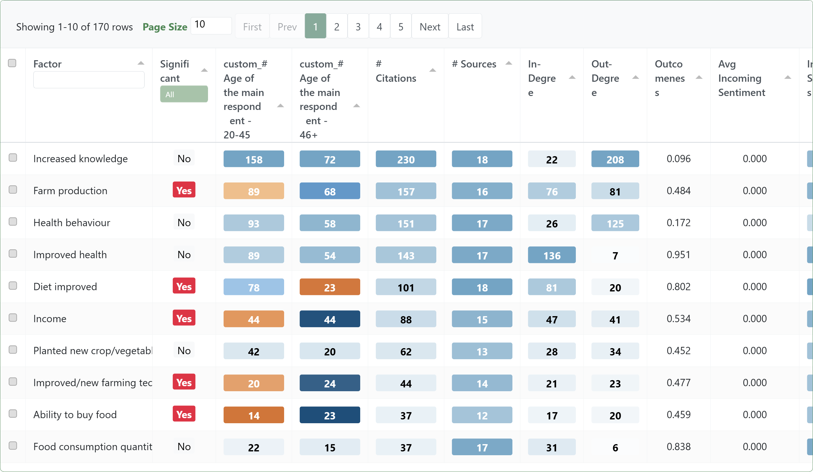
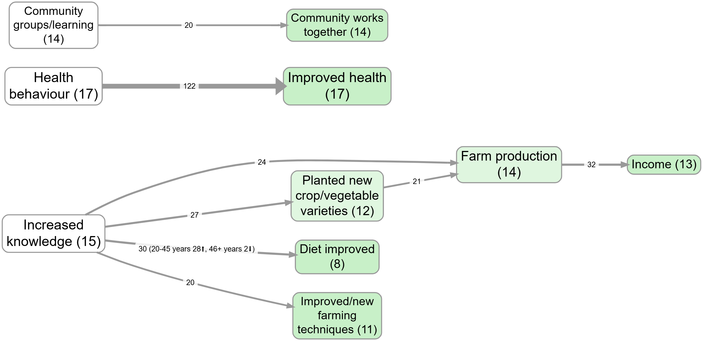

## Summary

The factors table is a **summary view** of your map: it tells you which factors are most prominent in the current view of the data, and how that changes across groups.

- **Input**: the current (already filtered) links table.
- **Output**: the factors table, with one row per factor label, with counts and optional breakdowns.

The key idea: **everything starts from links**. The factors table is created on the fly from the links table. It is not saved separately. In our minimalist causal coding, factors only exist because they are named at each end of causal links.

## When to use this table

- **Orientation**: “what are people talking about most?”
- **Role reading**: “which factors mainly show up as outcomes vs causes?”
- **Comparison**: “what differs by group/context?”

## What the counts actually mean

The factors table is built from “factor mentions” that come from links:

- each link contributes a **cause mention** and an **effect mention**
- totals therefore count **mentions**, not “number of links”

The main fixed columns in the table are:

- `Citation Count`: total mentions of this factor (`Citation Count: In` + `Citation Count: Out`)
- `Source Count`: distinct sources that mention this factor (as cause or effect)
- `Citation Count: In`: citations where this factor appears as an effect
- `Citation Count: Out`: citations where this factor appears as a cause
- `Outcomeness`: `Citation Count: In / (Citation Count: In + Citation Count: Out)`
- `Influence`: Katz-style cause-side influence score on the directed factor graph (cause -> effect), shifted so minimum is 0
- `Avg Incoming Sentiment`: average `sentiment` of links where this factor is the effect (incoming links only)
- `Source Count: In`: distinct sources where this factor appears as an effect
- `Source Count: Out`: distinct sources where this factor appears as a cause

Two evidence units are used repeatedly:

- **Citations** = how often said (mention/citation volume)
- **Sources** = how widely shared (distinct-source breadth)

## Typical views people use

### 1) Overall prominence

Sort by Source count or Citation count to find the “main” factors in the current view.

### 2) Causes vs effects

Use these columns:

- `Citation Count: Out` ("as a cause")
- `Citation Count: In` ("as an effect")
- `Outcomeness` (near 1 = mostly outcome; near 0 = mostly cause)

This helps you read whether a factor is mostly described as a driver, an outcome, or both.

### 3) Group breakdowns (comparisons)

If your sources have metadata (e.g. district, gender, age band), you can break the table down by group to ask:

- “which factors are disproportionately mentioned by group A vs group B?”
- “which outcomes differ by context?”

### 4) Normalised (percent) views

Normalisation is for fair comparison when groups differ in:

- number of sources, or
- overall verbosity.

In practice: percent views are about **relative prominence**, not absolute volume.

### 5) Significance tests (optional)

If you choose exactly one grouping variable, the app adds `Significant` (`Yes`/`No`/`N/A`) per factor using a chi-squared-style comparison against group baselines.

If that grouping variable is numeric-like, the app also adds `Ordinal Sig.` (`Yes`/`No`/`N/A`) from an ordinal trend test.

Use these as **attention guides**, not as definitive proof: always go back to quotes/links to interpret what the difference actually is.

## Examples (from the app)

### Factors table: group differences + tests

Bookmark [#535](https://app.causalmap.app/?bookmark=535)

### Bringing group differences onto the map (as link labels)

Bookmark [#980](https://app.causalmap.app/?bookmark=980)

## Formal notes (optional)

If you want the precise construction, here it is.

**Factor mentions**

Each link row contains a cause label, an effect label, and a `source_id`. From each link row we derive two mention records:

- one mention for the cause label (direction = `out`)
- one mention for the effect label (direction = `in`)

These mention records are the atomic units that the factors table aggregates. This is why totals across factors are totals of mentions (each link yields at least two mentions).

**Label rewrites**

Before aggregating, apply any label-rewrite transforms (collapse, remove bracket text, etc.). These are temporary rewrites for analysis/presentation; they do not change the underlying coding.

**Group breakdown cells**

If \(G\) is a grouping variable on sources (e.g. district), a cell can be computed in citations-mode or sources-mode:

- in **citation** count type, each mention contributes +1 to its factor/group cell
- in **source** count type, each factor/group cell counts distinct `source_id` values

The dynamic group columns are named `*<group value>` in the table header, one per observed value of the selected grouping variable(s).

**Percent-of-baseline intuition**

\[
\text{share}(f,g) = \frac{\text{cell}(f,g)}{\sum_{f'} \text{cell}(f',g)}
\]

**Significance tests (intuition)**

Even if group A has more mentions overall than group B, the `Significant` test asks whether factor \(f\) is still over-represented in one group relative to those baselines.

## Transformation and interpretation rules {.banner}### Transformation rule {.rounded}- **Input:** a links table (optionally with source-group metadata).
- **Transformation:** derive factor mentions from each link endpoint, aggregate by factor label, and optionally aggregate by selected group values.
- **Output:** a factors table with one row per factor plus counts/ratios (and optional group columns/tests).### Interpretation rule {.rounded}- Factor-table counts are mention/source summaries derived from links.
- They describe prominence and role (for example cause-side vs effect-side), not causal effect size.

<!-- xrefs-v1 -->

## Related

- [[000 Tasks 2 & 3 --  Extensions -- Introduction ((extensions))|chapter intro]]
