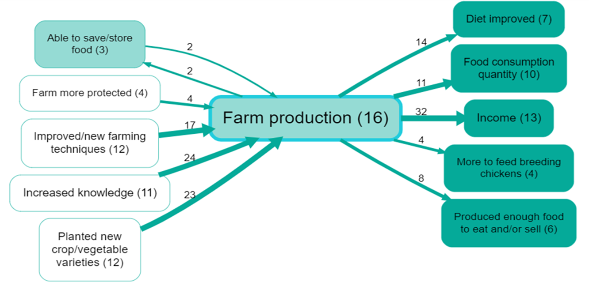
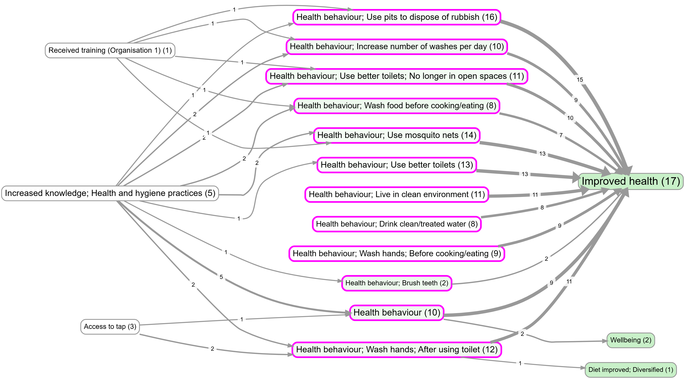
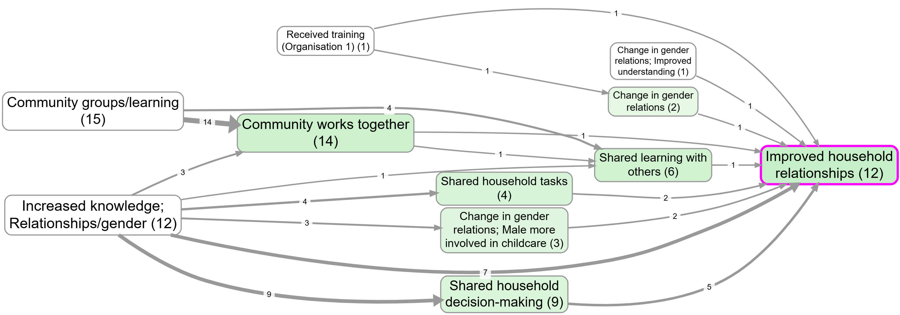
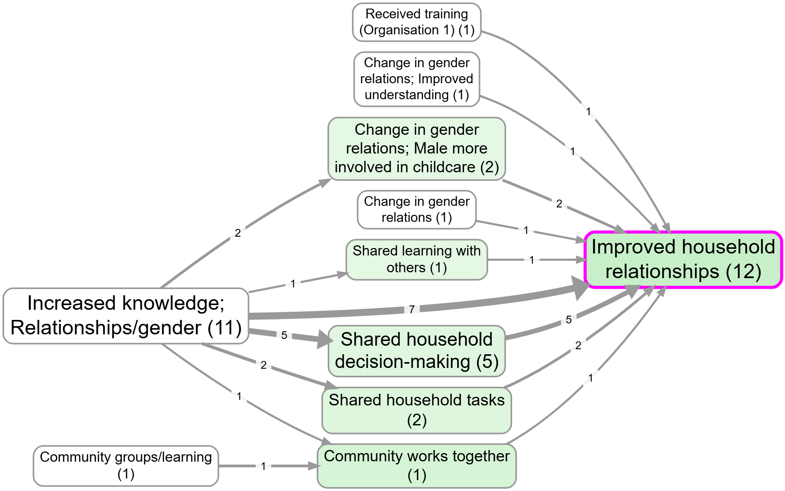

## Summary

This extension is about using **factor labels** to carve out a useful subgraph of your causal map.

Like most extensions, it is best thought of as:

1) **A filter** (a rule that takes one links table and returns another), plus  
2) **An interpretation rule** (what it means to say we are “focusing on” or “excluding” factors).

There are two closely related operations:

- **Focus**: keep the causal neighbourhood around one or more “target” factors (their upstream causes and/or downstream consequences).
- **Exclude**: remove unwanted factors (and therefore remove any links that touch them).

Unlike label-rewrite transforms (collapse synonyms, remove bracket text, zoom hierarchies, combine opposites), focusing/excluding does **not** rename factors. It decides which parts of the existing graph you want to *see and analyse*.

## How to think about it 

### Focus = “show me the neighbourhood around this factor”

You choose one or more target factors (by label search), then choose:

- how far to look **upstream** (causes), and
- how far to look **downstream** (consequences).

The result is a sub-map containing only the links that sit on those upstream/downstream chains.

Focusing is a good way to understand a factor as both:

- an **outcome** (what leads to it?), and
- an **influence** (what follows from it?),

without having to interpret the entire map at once.

**Tip:** In interview-style data, chains longer than ~4 steps are uncommon. Large step counts can create hard-to-interpret “hairballs”.

### Source tracing = “only keep paths that appear within a single source”

Sometimes you want coherent within-source narratives rather than a pathway stitched together across respondents.

With **source tracing** on, the focus result becomes more conservative: it keeps only links that lie on at least one upstream/downstream path that can be realised within a single source.

### Exclude = “remove these factors (and anything touching them)”

Exclude is subtractive: you specify one or more unwanted factor patterns, and the app removes:

- the matching factors, and
- any links that touch them (as cause or effect).

## Interpretation cautions

### Order matters

If you apply label-rewrite transforms earlier (collapse, zoom, remove brackets, combine opposites), then focusing/excluding targets are interpreted in terms of the rewritten labels.

### Focus is a reading strategy (not a claim about reality)

Focusing is a way to make a large map interpretable. It does not claim “only this neighbourhood is relevant”; it claims “within N steps, what do sources connect to this factor?”

## Relationship to “collapse” (different goal)

- Use **collapse/label-rewrite** when you want to treat several labels as *the same concept* while keeping the surrounding structure visible.
- Use **focus** when you want to keep the original labels but restrict attention to the local causal neighbourhood of a concept.

## Examples (contrasts) from the app

### A single-theme focus (one-step neighbourhood)

Bookmark [#982](https://app.causalmap.app/?bookmark=982) is a simple example of focusing on one theme and looking at its immediate neighbourhood.

### Upstream focus with a single-source constraint (“source tracing”)

These two bookmarks are both “upstream influences on wellbeing” views, but one requires within-source narrative coherence:

- Without source tracing: bookmark [#270](https://app.causalmap.app/?bookmark=270)

- With source tracing: bookmark [#534](https://app.causalmap.app/?bookmark=534). Notice how it is more conservative.

## Formal notes (optional)

If you want the precise (link-based) rule, here is the intended definition.

Let \(F\) be the set of focused factor labels, and let \(U\) and \(D\) be the upstream/downstream step limits.

- Keep a link \(x \rightarrow y\) if it lies on any directed path of length \(\le U\) that ends at a factor in \(F\), or any directed path of length \(\le D\) that starts at a factor in \(F\).
- Do not add extra “cross-links” between surviving factors; keep only links that are actually part of the selected paths.

For exclude, let \(E\) be the excluded factor set; remove all links \(x \rightarrow y\) where \(x \in E\) or \(y \in E\).

## Transformation and interpretation rules {.banner}

### Transformation rule {.rounded}

- **Input:** a links table plus either (a) focus targets with upstream/downstream step limits, or (b) exclude patterns for factors.
- **Transformation:** keep links on selected focus paths (optionally with source tracing), or remove links that touch excluded factors.
- **Output:** a links table/map showing a focused neighbourhood or a reduced graph without excluded factors.

### Interpretation rule {.rounded}

- Focus is a reading strategy for mechanism exploration, not a claim that non-focused parts are unimportant.
- Exclude is an analytical scoping choice; excluded links are omitted for the current view, not invalidated.

## See also

- [[250 Formatting your map for what you want to show ((howto-map-formatting))|Formatting your map for what you want to show]] for how this filter sits in a real workflow.
