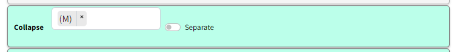

This extension is about **using factor labels to unify many “different-looking” factors into one**.

- **Collapse factor labels**: define one or more search terms, and any factor label that matches is **rewritten to a single shared label** (a “bucket”). This is a quick way to treat near-synonyms and variants as one concept (e.g. *money / income / salary*).
- **Exclude text in brackets** is really the same idea: it’s just a fixed rule for rewriting labels. For example `Education (primary school)` becomes `Education`, so all bracketed variants collapse onto the same base label.

Like the other transform filters, this is a **temporary rewrite** used for analysis and presentation; it doesn’t change your underlying coding.

> In the current app, these text matches are case-insensitive (case doesn’t matter).

All the corresponding factors are collapsed into one factor which is now labelled with the search term.

## Multiple search terms, combining results

You can put more than one search term.
## Multiple search terms with separate results

Or if you want to keep the results separate.  The factors which match the filter are shown with a thicker purple border.

## Multiple search terms with OR and separate results

The previous strategy won’t work if you want two separate *buckets*, like (Food OR Diet) on the one hand and (Income OR Money) on the other.

In the current app, the clean way to do this is to define separate buckets (so each match collapses to the term it matched), rather than relying on case-sensitivity tricks.

Because matching is case-insensitive in the current app, you don’t need separate terms just to capture `Health` vs `health`.

## Excluding brackets (same idea, fixed rule)

If you often code specific labels like `Education (primary school)` and `Education (secondary school)`, excluding bracket text is just a convenient way to collapse them both to `Education` without having to maintain a list of search terms.

## Transformation and interpretation rules {.banner}### Transformation rule {.rounded}- **Input:** a links table with factor labels, plus collapse terms and/or the bracket-exclusion option.
- **Transformation:** rewrite matching labels to shared bucket labels (or remove bracketed suffix text), then re-aggregate links/factors on rewritten labels.
- **Output:** a links table/map with transformed labels, fewer distinct factors, and updated counts/bundles.### Interpretation rule {.rounded}- This is a temporary harmonization of label wording for analysis.
- It combines semantically similar labels but does not change the underlying coded evidence.

## See also

- [[250 Formatting your map for what you want to show ((howto-map-formatting))|Formatting your map for what you want to show]] for how this filter sits in a real workflow.
