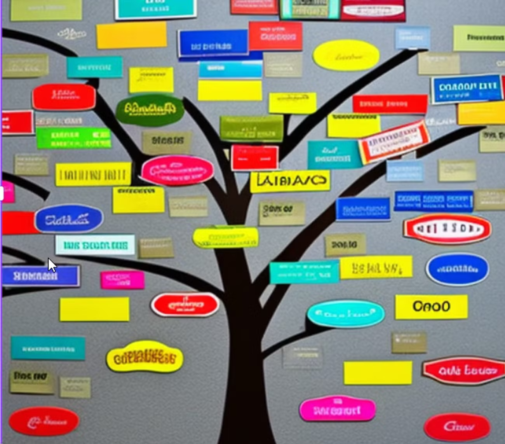
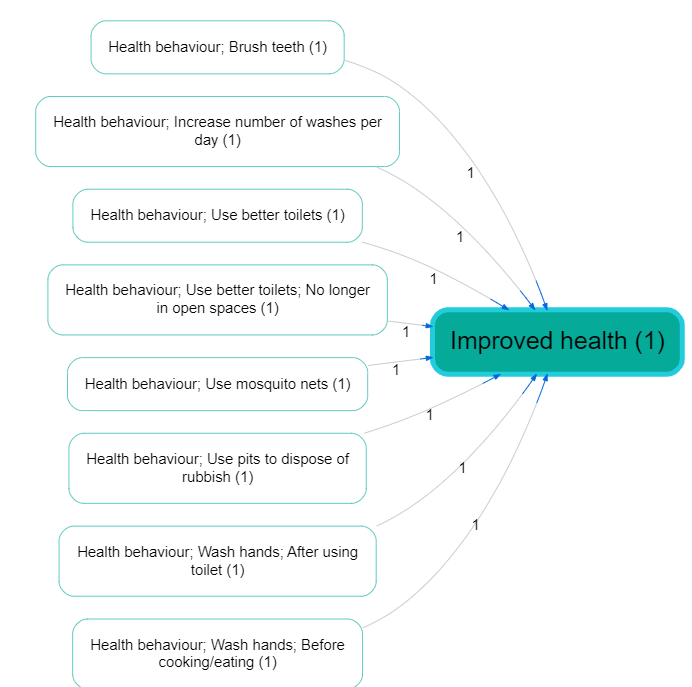
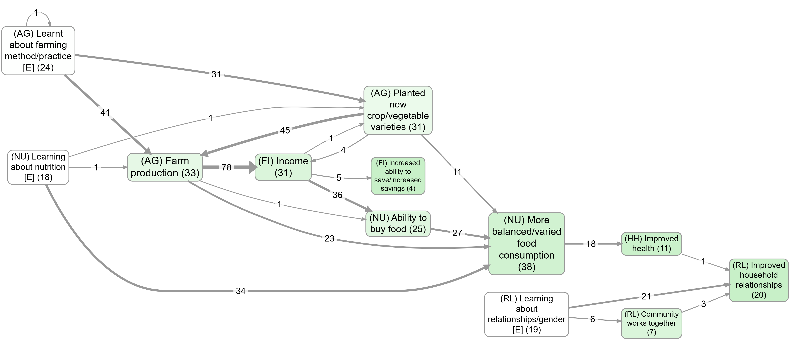
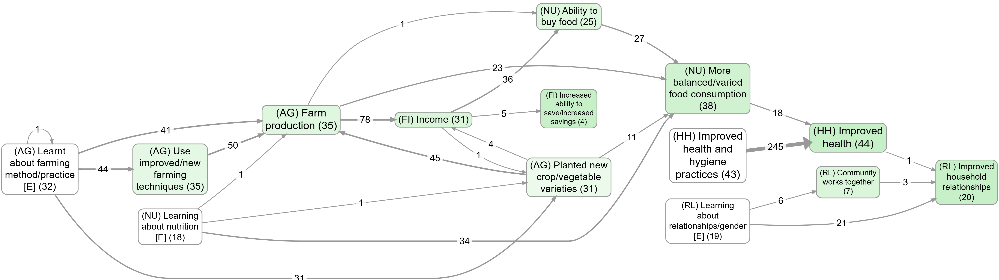

## Simplifying large causal maps with hierarchical labels (zooming)

### Summary

When you code lots of sources, you quickly end up with **too many near-duplicate causes and effects** (and therefore too many nodes on the map). Hierarchical factor labels let you keep the detail *and* produce a smaller “summary map” by “zooming out” to a higher level.

In the Causal Map app we write hierarchies using the separator `;`, but that’s **just one convenient encoding**. The important thing is the meaning: you’re saying “this is a specific case of that, and I’m happy to report it at the higher level if needed”.

Example (using `;` to encode “general; specific”):

New intervention; midwife training ➜ Healthy behaviour; hand washing

Read it as:

- “New intervention, and in particular midwife training”, or
- “Midwife training, which is part of / an example of the new intervention”.

You can extend this to multiple levels:

New intervention; midwife training; hand washing instructions

Crucially, **higher-level labels can also be used directly for coding**. So you can code both detailed links and higher-level links, depending on what the text supports.

## What problem this solves (for practitioners)

If you are coding a handful of interviews, you can “just remember” what all your labels mean. But as soon as you code *dozens* or *hundreds* of sources, a common workflow problem appears:

- **Label explosion**: many detailed, overlapping ways to say similar causes/effects.
- **Unreadable maps**: the map becomes hard to navigate and hard to put into a report or slide deck.
- **A trade-off you don’t want**: either keep the detail and lose the big picture, or merge too early and lose the details you need for auditability (quotes) and later analysis.

Hierarchical labels are a practical compromise: keep the detailed evidence, but still be able to summarise cleanly.

## The idea in one minute

Write detailed factors as:

> General concept **==;==** specific concept

If you code:

New intervention; midwife training ➜ Healthy behaviour; hand washing

…you can later zoom out and treat this as also supporting:

New intervention ➜ Healthy behaviour

This gives you a smaller map that is easier to read and present, without deleting the detailed evidence underneath.

## How to write hierarchical labels (coding convention)

In the app, the convention is:

General concept; specific concept

Two practical conveniences follow immediately:

- Searching for the higher-level label (e.g. `Healthy behaviour`) will also find its nested sublabels.
- Higher-level labels can be created and changed on the fly (they are just the visible prefixes before `;`), without maintaining a separate “parent code” structure.

### A practical heuristic

When you choose a parent label, pick something you would genuinely be comfortable reporting at a higher level. If “rolling up” the specific item into the parent would mislead a reader, don’t put it in that hierarchy.

### AI-assisted coding tip (optional)

If you are using AI to extract candidate links, a simple prompt constraint often helps: ask for factor labels using the template **“general; specific”**, and require a verbatim quote for every link so the evidence remains checkable.

## Zooming out (what it does)

Assuming you have a causal map that uses hierarchical labels (like the small map shown above), you can “zoom out” by rewriting factor labels to a chosen maximum depth and then redrawing the map.

In practice:

- zoom to **level 1** means “keep only the top-level parent”  
  Example: `foo; bar; baz` becomes `foo`
- zoom to **level 2** means “keep the first two components”  
  Example: `foo; bar; baz` becomes `foo; bar`
- if a label already has fewer components than the chosen level, it stays unchanged.

## Examples (contrast) from the app

The easiest way to see what zooming is doing is to compare the same “top factors” view with and without zooming:

- Without zoom: bookmark [#983](https://app.causalmap.app/?bookmark=983)

- With zoom: bookmark [#984](https://app.causalmap.app/?bookmark=984)

### Don’t treat this mechanically: beware the Transitivity Trap

**Warning:** causal mapping here is a *qualitative* process. Zooming is a powerful summarisation tool, but it only makes sense when your hierarchy choices really do preserve the intended meaning.

Looking at a causal map on its own never lets you safely read off coherent narrative stories along long pathways (the “transitivity trap”). If you want pathway interpretations that reflect single-source stories, use **source tracing** first, then apply zooming/collapsing for presentation.

See:

- Path tracing and source tracing: https://garden.causalmap.app/path-tracing-filter
- Collapse filter: https://garden.causalmap.app/collapse-filter

### Zooming out is like a licensed “deduction family”

If you have:

New intervention; midwife training ➜ Healthy behaviour; hand washing

…then (loosely yet informatively, with caveats) you are licensing the summary interpretations:

- New intervention ➜ Healthy behaviour; hand washing
- New intervention; midwife training ➜ Healthy behaviour
- New intervention ➜ Healthy behaviour

This reflects the familiar **granularity** dilemma: how much detail should you code on the cause side and/or effect side? Hierarchies let you keep detail while explicitly stating what higher-level roll-ups are acceptable.

## Why this matters in practice

Hierarchical labels + zooming let you do *both* of these:

- **Keep detail**: stay close to what people said and keep your quotes/provenance attached to the specific factors.
- **Communicate the big picture**: produce a readable summary map for slides, reports, decision meetings, and quick orientation.

Typical payoffs:

- **Readable outputs**: a dense map becomes navigable by rolling up to level 1 or 2.
- **Stable high-level story with drill-down**: you can present the summary and still be able to “show your working”.
- **Better search & navigation**: searching the parent label finds its children.
- **Counts at the right level**: you can say “this broad family came up 10 times” while retaining which specific sub-items were mentioned.
- **Scales to many sources (and to AI assistance)**: you can encourage consistent label shape (“general; specific”) while keeping provenance.

Two common scenarios:

- **Many sources, same idea, different wording**: respondents mention “hand washing”, “washing hands before meals”, “soap use”, “hygiene practices”. Hierarchies let you keep those distinctions while still summarising as `Healthy behaviour`.
- **Programme with many activities/outcomes**: training, distribution, mentoring, outreach, etc. Hierarchies let you keep the specific activity while producing a roll-up map for reporting.

## Guardrails (useful rules of thumb)

Hierarchies work well *when* the hierarchy is meaningful. These guardrails help you avoid misleading roll-ups:

- **You are licensing a roll-up**: writing `A; B` means you are happy (for summary purposes) to treat this as evidence for `A`. If you wouldn’t accept that replacement, don’t use a hierarchy there.
- **A factor can’t belong to two hierarchies**: you can’t have the same specific thing roll up into two different parents at once. If you need cross-cutting grouping, use [[300 Factor label tags -- coding factor metadata within its label ((label-tags))]].
- **Parents should be real causal factors**: higher-level labels should usually be interpretable as causal factors in their own right (often semi-quantitative), not just topics.
- **Don’t mix desirability within one hierarchy**: avoid `Stakeholder capacity; Lack of skills`, because zooming out will treat it as evidence for “Stakeholder capacity”. Use [opposites coding](https://guide.causalmap.app/xopposites#xopposites) and `~` to fix the polarity, e.g. `~Stakeholder capacity; ~Presence of skills`.
- **Mixed-bag exception**: sometimes you really do want a “bucket” parent (e.g. `Politics; ...`). That’s allowed, but interpret zoomed-out links involving that bucket cautiously.

## Label factors as events or changes if you can

Hierarchies work best when the parent labels are themselves meaningful causal factors (often semi-quantitative), not just headings or categories. Good examples:

- Experiencing social problems
- Experiencing social problems; Unemployment
- Experiencing social problems; Addiction
- Experiencing psychosocial stressors
- Experiencing psychosocial stressors; Fear of job losses
- Experiencing psychosocial stressors; Pre-existing mental health issues

Here, `Social problems` and `Psychosocial stressors` are higher-level causal factors in their own right; they are not just themes or boxes to put factors into.

So we might have:

> “The problem of unemployment is a psychosocial stress for many”

Experiencing social problems; Unemployment ➜ Experiencing psychosocial stressors

> “When people get stressed they often turn to drugs“

Experiencing psychosocial stressors ➜ Experiencing social problems; Addiction

These could be combined into this story:

Experiencing social problems; Unemployment ➜ Experiencing psychosocial stressors ➜ Experiencing social problems; Addiction

If we zoom out of the above story, we could focus on the higher-level factors and in this case we would get a vicious cycle:

Experiencing social problems ➜ Experiencing psychosocial stressors ➜ Experiencing social problems

## When not to use a hierarchy (use a tag instead)

Don’t use `;` to express a non-causal *topic theme*. `A; B` explicitly licenses: “for summary purposes, treat this as `A`”, so `A` must be something you would treat as a causal factor, not just a theme label like “Health”.

For theme-style grouping, use tags (hashtags, brackets, or any consistent convention) inside the label, e.g.:

- Vaccinations law is passed #health
- Mortality rate #health

This keeps the causal claim minimalist (X ➜ Y) while still letting you filter/search by theme.

## Hierarchical coding as a way of coping with lots of factors

Analysts are often faced with the quandary of either having too many factors to keep track of, or merging them into a smaller number of factors and losing information. With hierarchies, you can have your cake and eat it: it’s similar to recoding an unwieldy number of factors into a smaller number of less granular items, but with the advantage that the process is reversible. The information can be viewed from the new higher level *and* from the original, more granular level.

For example, you can count that the higher-level component “Healthier behaviour” was mentioned ten times, while retaining the information about the individual mentions of its more granular components.

## Re-usable factor components as hashtags

Sometimes your factors relate to each other in ways which are not just hierarchical. For example:

- Activities completed; Training; Health
- Activities completed; Distribution; Health; First-aid kits
- Outcomes achieved; Health; First-aid skills

These are three (hierarchical) factors in which “Health” appears in different places, and at different levels of the hierarchy.

This is not ideal, but sometimes it’s the best way to organise a tricky set of factors.

In this example, “Health” appears only as a component of other factors. Although on its own it might look like a mere theme rather than a causal factor, it plays a role in differentiating the causal factors in which it participates (e.g. “Activities completed, in particular training, in particular on health”). And because “Health” is used across hierarchies, it can *also* be treated as a [hashtag](https://guide.causalmap.app/link-memos-and-hashtags#xhashtags) and can be used as part of searches, lists and counts of factors.

Isn’t that a contradiction? Didn’t we just say that “Health” is not to be used on its own as a factor because it is just a theme and is not expressed in a semi-quantitative way? No: here the word “Health” is not functioning only as a theme but as a way of differentiating causal factors. The actual factor labels in which it participates are still expressed in a semi-quantitative way. So `Activities completed; Training; Health` is intended as a causal factor about the extent of completion of activities, in particular training activities, and in particular health training activities.

## Formal notes (optional)

One clean way to define “zoom level” is by counting components:

- define the level of a label as (number of `;` separators) + 1
- zoom to level N means “truncate the label to its first N components”

## See also

- [[300 Factor label tags -- coding factor metadata within its label ((label-tags))]]
- [Opposites coding](https://guide.causalmap.app/xopposites#xopposites)

## Transformation and interpretation rules {.banner}

### Transformation rule {.rounded}

- **Input:** a links table with hierarchical factor labels (components separated by `;`) and a chosen zoom level.
- **Transformation:** truncate each label to its first `N` components, then recompute aggregates/bundles on the rewritten labels.
- **Output:** a links table/map with transformed labels, typically fewer distinct factors, and updated counts.

### Interpretation rule {.rounded}

- Zooming is a controlled roll-up from detailed to higher-level labels.
- Use it when parent labels are valid summaries of child labels; otherwise interpretations can drift.

## See also (recipes)

- [[250 Formatting your map for what you want to show ((howto-map-formatting))|Formatting your map for what you want to show]] for how zooming sits in a real workflow.
- [[200 Bulk relabelling factors ((howto-bulk-relabel))|Bulk relabelling factors]] for converting flat labels to hierarchical ones in bulk.
