## Summary

Opposites coding is for when your data naturally contains paired factors like:

- `employed` and `unemployed`
- `good health` and `poor health`
- `fit` and `not fit`

If you treat those as unrelated labels, you can miss half the evidence when you search/filter/analyse. The goal is to **unify evidence across opposite-coded labels** while still preserving which pole was originally claimed.

## Reading a map with combined opposites
## Combining opposites

This section presents a simple, practical approach: keep your map “barebones” (plain links between plain-text labels), and use a convention to mark opposites.

## When to use it

- When you have meaningful opposite pairs and you want analyses to “see both sides”.
- When you want to compare stories like “X leads to improvement” vs “~X leads to deterioration” without maintaining separate label families.

## How to code opposites (two conventions)

### 1) `~` prefix (simple)

Use `~` at the start of a label to indicate “the opposite pole”:

- `Smoking`
- `~Smoking`

This works with hierarchies too (you can put `~` at the start of a component when needed).

### 2) Flexible opposite tags

If you want explicit pairing (and sometimes multiple near-synonyms on one pole), use tags like:

- `High income [27]`
- `Low income [~27]`

The exact wording can differ; the number is what binds the pair.

## What the Combine Opposites transform does

When the app combines opposites, it:

- rewrites opposite-coded labels onto a single “canonical” label, and
- keeps track of which end(s) of each link were flipped, so you can still interpret polarity.

### Example (contrast) from the app

The point of “combine opposites” is not to delete anything, but to unify evidence across opposite-coded labels while still keeping track of which pole was originally claimed.

- Without combined opposites: bookmark [#985](https://app.causalmap.app/?bookmark=985)
- With combined opposites: bookmark [#986](https://app.causalmap.app/?bookmark=986)

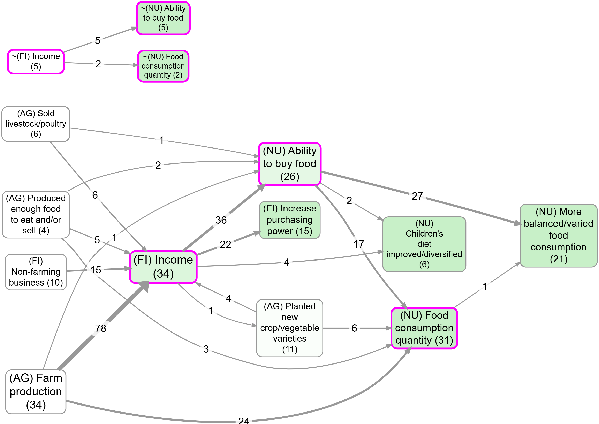

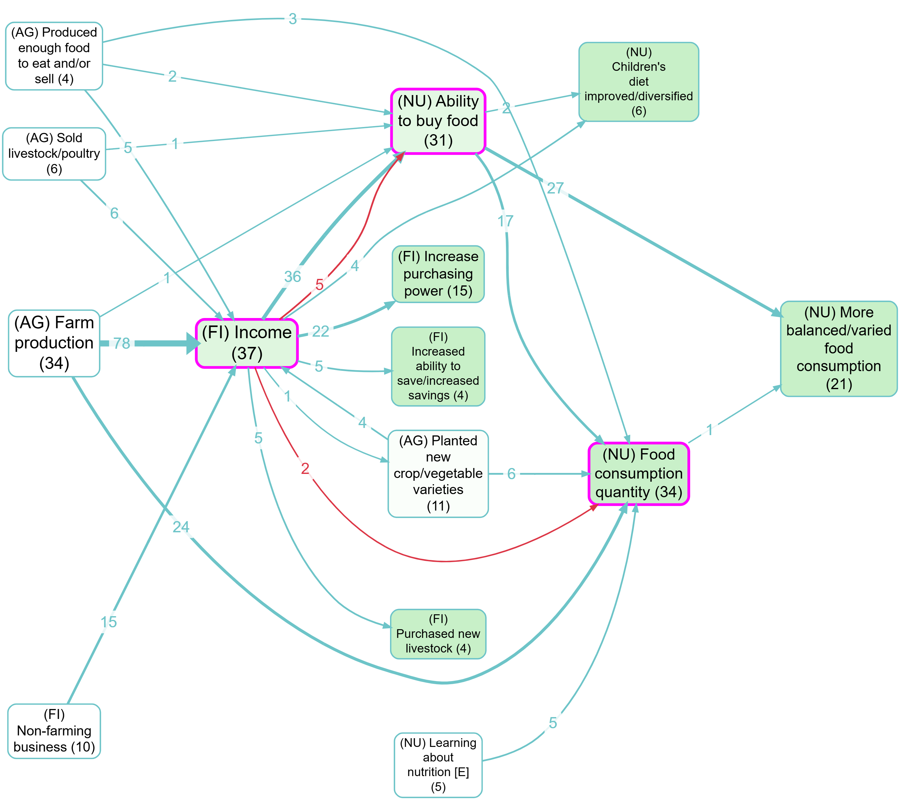

## Formal notes (optional)

Here is an example of quite minimalist QuIP-style coding. There are the beginnings of some ideas about (and issues with) polarity: for example, we have `fit`and `not fit`.

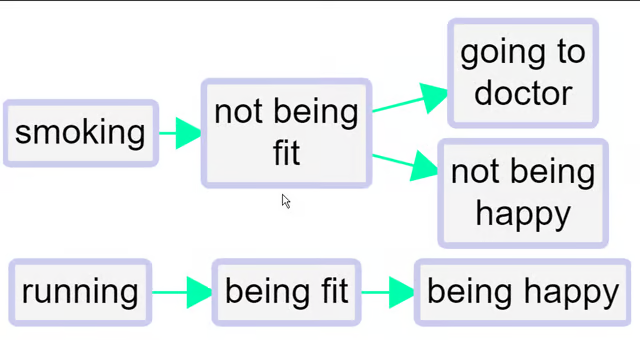

We’ve all done this kind of coding, with classic examples being coding for both employment and unemployment or for both health and illness. This could for example be two different stories about two different people; or it could be different aspects of or periods within one person’s life.

This minimalist style on its own is unsatisfactory. We haven’t told the app that being fit is represented with a somehow positive and somehow negative factor. So can’t join them up. We can’t compare the way that being fit leads to happiness and on the other hand not being fit leads to unhappiness (and to visiting the doctor). **We can’t for example deduce that running might make visits to the doctor less likely.** Also, if we produce a table or do other analyses focused on healthy habits, we might miss data on the closely related unhealthy habits.

The first step forwards is to follow this convention:

> To signal that two factors are opposites we formalise the idea we already instinctively used in the above example, where we used the word “not” for one of each pair. Formally, we will code them in the form “~Y” and “Y.” The ~ may appear at the start of a factor label. This already ensures that when we search for “Y” we will also find “~ Y.”In the Edit Multiple Factors panel, these two factors will be listed next to each other - the alphabetical listing will ignore the ~.
> 

We talk about *opposites* rather than positive/negative or plus/minus because that frees us from any implications about valence or sentiment: smoking is the opposite of not smoking, health is the opposite of not health / ill health / illness.

Where there is some kind of valence or sentiment involved, we do suggest using the `~` sign for the negative member of the pair. But it wouldn’t make any difference to the app.

So the same map would look like this, using

```
~
```

instead of

```
not
```

.


Non-hierarchical coding with opposites is easy:

- Eating vegetables
- ~Eating vegetables
- Smoking
- ~Smoking

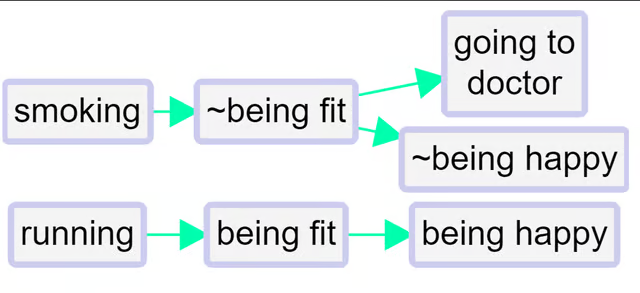

When you use the “combine opposites” filter (switched on), 

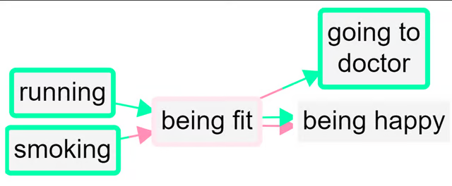


the app tries to combine any pairs of factors which are opposites. It looks at all the factors which begin with a ~ and takes off the ~ where there was one. But it only does this if there is in fact such an opposite already coded in the file as currently filtered, otherwise there wouldn’t be any point.


So now there are for example two factors combined into the “fit” factor and two into the “happy” factor. The “not” factors have their incoming and outgoing links preserved, but when a factor is flipped to match up with its opposite, the part of the link next to that factor are now coloured pink. So the lower link from fit to happy is pink because the factor at each end of the link has been flipped from “~Y” form to “Y” form; the influence factor was originally *not fit* and the consequence factor was originally *not happy*. So there is no danger of thinking that this is really just another case of the other link, i.e. of fitness leading to happiness.

So, a link has two polarities: a *from* polarity and a *to* polarity. If the signs of the two polarities are opposite, then the effect of the influence factor on the consequence factor is reversed. 

Both links from fit to happy have the same overall polarity (normal, not reversed) but they do not represent the same information. 

N**o information is lost when you press the “combine opposites” button; you can still always read off the original map from it.**

## Opposites coding within a hierarchy

When using hierarchical coding, the sign “~” may appear at the start of a factor label *and/or at the start of any component in a factor label*.

Here is a similar story, now coded hierarchically. In this example, we only see `~` at the beginning of the factors, not yet within them.

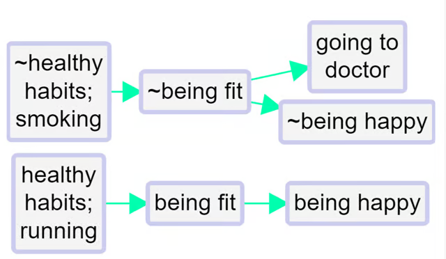
When you press “combine opposites,” the app tries to combine any pairs of factors which are opposites. It looks at all the factors which begin with a ~ and *flips each component*, taking off the ~ where there was one, and inserting one where there was not. But again it only does this if there is in fact such an opposite already coded in the file as currently filtered, otherwise there wouldn’t be any point, because there is nothing to combine.

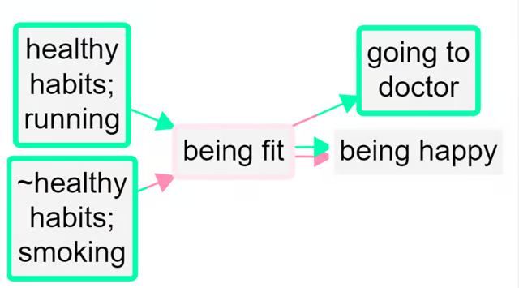


Here is the same example, but also “zoomed out” to the top level.

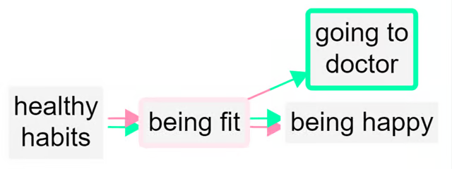

A quantitative social scientist might solve this problem by flipping the polarity of the negative examples, coding them as positive but using minus strengths for the connections. So smoking influences good health but with a minus strength. However this always seems somehow unsatisfactory and is complicated to do. It is particularly unsatisfactory when *both* ends of the arrow are flipped in this way so that we code the influence of being unfit on being unhappy as a green arrow from fitness to health!

By default in print view, links in the same bundle, i.e. with the same from and two factors, are no longer always displayed as one, with the frequency noted as a label. If we were using the quantitative approach, some of the links in the bundle may have minus rather than plus strength, etc, and we would have to somehow form some kind of average to arrive at an overall strength score, which is not at all satisfactory. Now, the links are only counted together if they have the same *from* and *to* polarities. So there can be up to four different links from one factor to another in Print view.

We are deliberately **not** falling Into the trap of somehow trying to aggregate the different *strengths* to say for example “there are 6 plus links from advocacy to compliance and 1 minus link so this is like 5 plus links because 6 - 1 = 5.” We don’t have evidence for an aggregated strength; we have aggregated evidence for a strength. Aggregating different pieces of *evidence* for links with different strengths is not the same as aggregating links with different strengths. So our more conservative approach preserves information.

It’s also possible that someone says “I know this intervention works not only because the intervention made me happier but also because I saw the people who didn’t get it and they are definitely not happier as a result.” In this case, we might code both arrows, intervention ➜ happy and not intervention ➜ not happy.

## Opposites coding *within* components of a hierarchy

Sometimes we need to use the `~` sign *within* the components of a hierarchy.

- ~Healthy habits; ~eating vegetables

is the opposite of

- Healthy habits; eating vegetables

Not eating vegetables, which is an example of unhealthy behaviour, is the opposite of eating vegetables, an example of healthy behaviour.

- ~Healthy habits; smoking

is the opposite of

- Healthy habits; ~smoking

Smoking, which is an example of unhealthy behaviour, is the opposite of not smoking, an example of healthy behaviour.

So here we add one more causal claim to our above example, at the bottom:
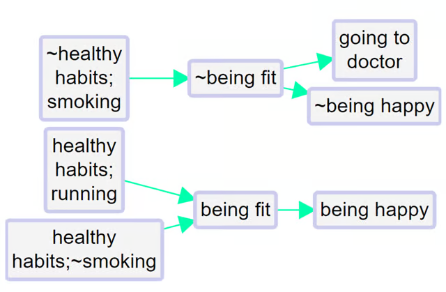


The healthy habit of not smoking leads to being fit.

So the app correctly detects that not smoking is the opposite of smoking:
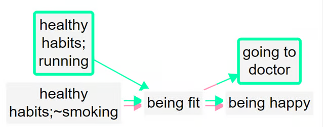

The two arrows at bottom left (one all green, one all pink) show that there is one example of this particular healthy habit leading to fitness, and the complementary example in which the opposite of this habit leads to the opposite of fitness.
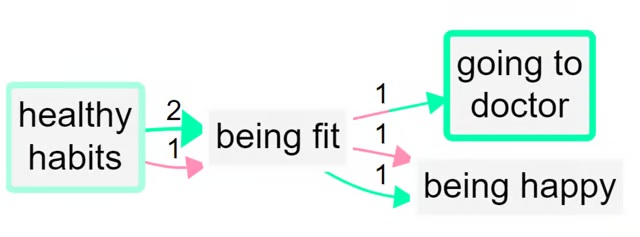
Zoomed out to the top level:

## Bivalent variables?

Note that this is the mutually exclusive condition from classical logic, but we don’t have any mention of an exhaustive condition: for us, it is not the case that everything has to be either wealthy or poor.

We could imagine that in a causal map, even before we even think about which specific factors might be opposites of other specific factors, each and every factor is really a kind of two-value factor like wealthy (as opposed to non-wealthy) or receiving tuition (as opposed to not receiving tuition). This is the quantitative way of thinking, in which every factor is really a variable which takes at least two values. But this is an unnecessary complication for us. The important point is that usually people don’t think of the absence of something as having causal powers (though there are exceptions).  

Suppose we are trying to code someone’s understanding of income. They tell us that if when people are wealthy, they tend do certain things, and when they are poor they tend to do other things. To some extent, these two sets of things are themselves the reverse or contrary of one another. For example wealthy people will probably have the best education and poor people the least. Sometimes the sets of things we associate with the two opposite poles are not obviously a simple reflection of one another. For example, poor people are often hungry whereas non-poor people are not. But in an affluent country, not being hungry is probably not an important feature we would think of to describe being wealthy as opposed to not-wealthy, if we can assume that non-wealthy people are *overall* rarely hungry. We are more likely to think of things like eating often in posh restaurants.

So being wealthy and being poor are a good example of factors which we *should* consider coding as opposites.  We can call the resulting factor, when we press the combine opposites button, *bivalent.*

, we could imagine there was a middle point too:

- Wealthy
- Not-wealthy / Not-poor - a kind of midpoint
- Poor

This is the usual case.  


### Which pairs of factors should we consider for opposites coding?

Short answer: use opposites coding for a pair of factors X and Y (i.e. recode Y as ~X or recode X as ~Y) if both X and Y naturally occur, separately, in the coding, but they can be considered, broadly speaking, as opposites of one another:

- in particular, it wouldn’t normally make sense to apply both of them at the same time in the same situation (you can’t be both wealthy and poor in the same sense at the same time)

If in doubt about which of the pair to recode, we usually pick X as the primary member of the pair if it is:

- usually considered as positive / beneficial / valuable
- and/or usually associated with “more” of something rather than “less” of something.


## Transformation and interpretation rules {.banner}

### Transformation rule {.rounded}

- **Input:** a links table with factor labels which use opposite coding convention (for example `Wealth` and `~Wealth`, or paired tags like `Wealth [27]` and `Poverty [~27]`).
- **Transformation:** rewrite opposite-coded labels to one canonical label (just `Wealth`) while storing, in the links pointing to or from these "flipped" labels, the information that the factor has been "flipped".
- **Output:** a links table with unified bundles/rows that still preserve direction and polarity metadata.

### Interpretation rule  {.rounded}

- Combining opposites merges evidence across poles for analysis convenience.
- It does not erase original meaning; polarity still matters for interpreting link direction/sign.

## See also

- [[250 Formatting your map for what you want to show ((howto-map-formatting))|Formatting your map for what you want to show]] for how this filter sits in a real workflow.
