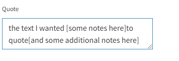

Summary: when coding manually (not using AI) you can add comments and additional material to your quotes by hand if you include them in [square brackets]. This extra text will be ignored by the app when it highlights your quotes in the statement panel. Be sure not to add or delete anything else from the original quote. 
## Summary

When coding manually, you can add short notes inside your saved quote by putting them in **square brackets**.

- Anything inside `[...]` is ignored by the app’s quote highlighter.
- This lets you add context or mark omissions without breaking highlighting.
- Rule of thumb: **do not change the verbatim quote text** outside the brackets.

## Common uses

### Coding your statements in context: referring to evidence from elsewhere

What to do if you want to refer to information from elsewhere when coding a link? 

If the quote is not exactly verbatim in the statement, the app may refuse to display a highlight on the statement text, to ensure your quotes are accurate. However, this rule does not apply for anything between square brackets, a useful feature for this case. 

You can use this technique to add your own comment or a quote from a statement elsewhere in the interview:

> *[this is my note]Neque porro quisquam [here is another note]  est, qui dolorem ipsum quia dolor sit amet, consectetur, adipisci velit, sed quia non numquam eius modi tempora incidunt.*
> 

### Quotes that span more than one statement

Sometimes you may want to quote a section of text which stretches between two or more statements. This is perfectly possible in the Causal Map app, however the highlighting will not appear.

So one solution is to use ellipses to refer to another statement as part of your evidence:

> *[reference to statement 36: The whole village received help from Org X]Thanks to that help we received, we are now growing our own produce.*
> 

When you upload your text, you might want to consider how long your statements should be and where the statement breaks go.

### Coding separate parts of a statement

You can use ellipses to remove sections of text from your quote which are not relevant.

> *Neque porro quisquam est, [… ] tempora incidunt.*
> 

## Practical cautions

- Bracket notes are for small additions. If you rewrite lots of text, it stops being a quote and you lose the audit trail.
- If you need to refer to other evidence, prefer a short bracket reference like `[see statement 36]` and keep the quote itself verbatim.

## Formal notes (optional)

The highlighting rule is effectively: match the quote against the source text after removing `[...]` spans. Anything outside brackets must remain verbatim for reliable highlighting.

## Transformation and interpretation rules {.banner}

### Transformation rule {.rounded}

- **Input:** a quote string that may include analyst notes inside square brackets.
- **Transformation:** ignore bracketed spans during source-text matching/highlighting while requiring non-bracket text to remain verbatim.
- **Output:** a quote that can include concise annotation without breaking highlight alignment.

### Interpretation rule {.rounded}

- Bracketed text is analyst annotation, not evidence from the source.
- The evidential claim remains grounded in the unchanged verbatim quote text outside brackets.
