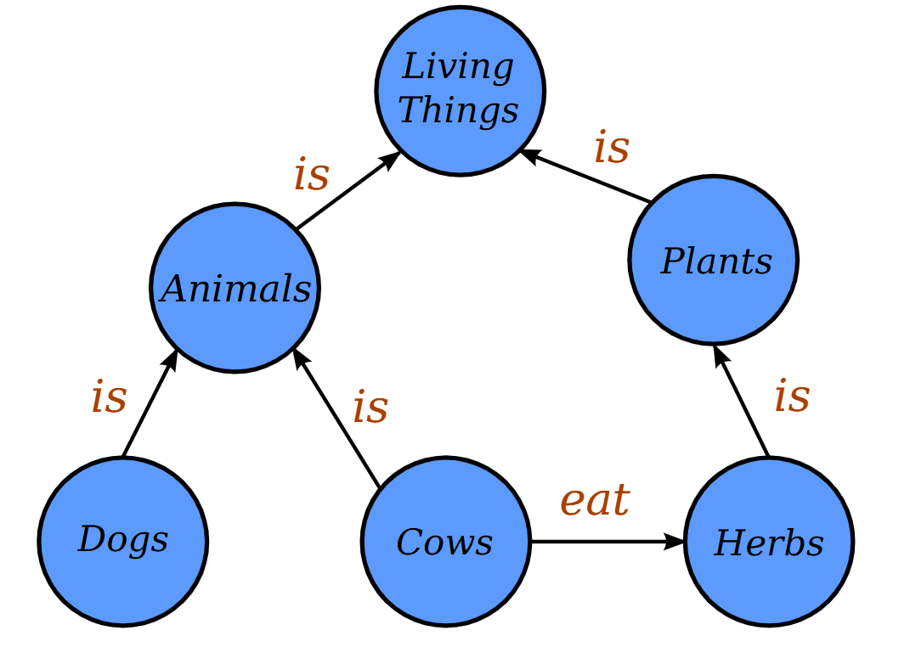
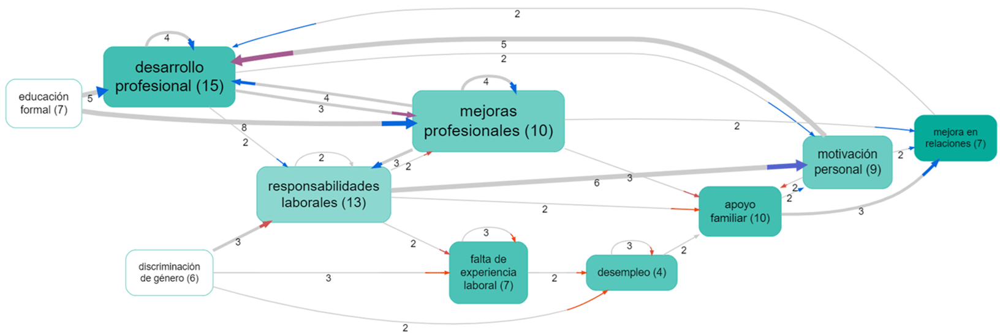

### What is a Knowledge Graph? 🧠

- A knowledge graph is like a **giant mind map for a computer**. It stores information not as text in a document, but as a network of interconnected facts.
- It's built from two main things: **entities** (the "nodes," representing real-world objects, people, or concepts like "Paris" or "Photosynthesis") and **relationships** (the "edges," describing how these entities are connected, like "is the capital of" or "is a process in").
- A single fact has three parts: **(Subject) --- [Relationship] ---> (Object)**. For example: `(Marie Curie) --- [discovered] ---> (Radium)`.
- Why are knowledge graphs specially useful in the age of AI? 💡
- **They create structure from chaos.** AI can read through millions of pages of unstructured text (like news articles or scientific papers) and pull out these factual triplets. This turns a messy sea of words into an organized, queryable database of knowledge.
- **They enable smarter searching and reasoning.** Instead of just searching for keywords, you can ask complex questions that require understanding the relationships between things. For example, "Which scientists who won a Nobel Prize also discovered an element?" A computer can navigate the graph's connections to find the answer.
- **They provide essential context.** A knowledge graph helps an AI understand that "Apple" in a tech article is a company linked to "Steve Jobs," not the fruit. By looking at its connections, the AI gets the right context, which is crucial for accurate understanding and analysis.
    

[_Image_](https://commons.wikimedia.org/w/index.php?curid=37135596) _from Wikipedia by Jayarathina - Own work, CC BY-SA 4.0._

### Why are Knowledge Graphs (KGs) so useful?

A major benefit of KGs is we can then apply network logic like transitivity rules to answer meaningful questions. For example, if the relation is "works in the same company as", then if we know

- **A is related to B**
- and
- **B is related to C,**
- then we can conclude
- **A is related to C (A is in the same company as C).**
    

### Challenges with general-purpose knowledge graphs

The trick in **constructing** knowledge graphs is to know what relationship(s) to look for. "belongs to? " "is capital of?" "challenges/undermines?" This can be very difficult to decide. on the fly.

**Using network logic to answer queries** can be difficult where each different type of relationship may have its own logic. It can be very tricky (though potentially rewarding and useful) to design custom queries to answer specific questions.

### Causal mapping gives knowledge graphs wings

  

A causal map is just a knowledge graph in which there is only one kind of relation: "causes" or "influences".  This means:

- It is **much easier to scan and process text data** as we already know what we are looking for.
- We focus on primarily on **exactly the kind of information which is useful for monitoring and evaluation**: what influences what?
- We can **make use of pre-existing logic and queries to help answer common evaluation questions** almost "out of the box". [Here](https://www.linkedin.com/feed/update/urn:li:activity:7326188688013410306/) we have a whole presentation on [_Questions you can answer with causal mapping_](https://www.linkedin.com/feed/update/urn:li:activity:7326188688013410306/) which gives plenty of suggestions.
    

Can only doing causal mapping answer all the questions you might want to ask about a text? Of course not. But it can help answer a lot of the most interesting and important ones.

## What about social network analysis?

Yes, social networks can also be constructed as knowledge graphs with just one (or a small number of) relationships, such as "works with".

### So can we use causal mapping tools to construct general network graphs?

You might ask if the reverse is also true: can you use causal mapping software like [Causal Map](https://causalmap.app/) to also do your AI-supported knowledge graphing for you? The answer is yes!  

You can code any type of link, not just causal, and you can also guide the AI to do this too.

[[901 Social Network Analysis -- SNA ((SNA))]]