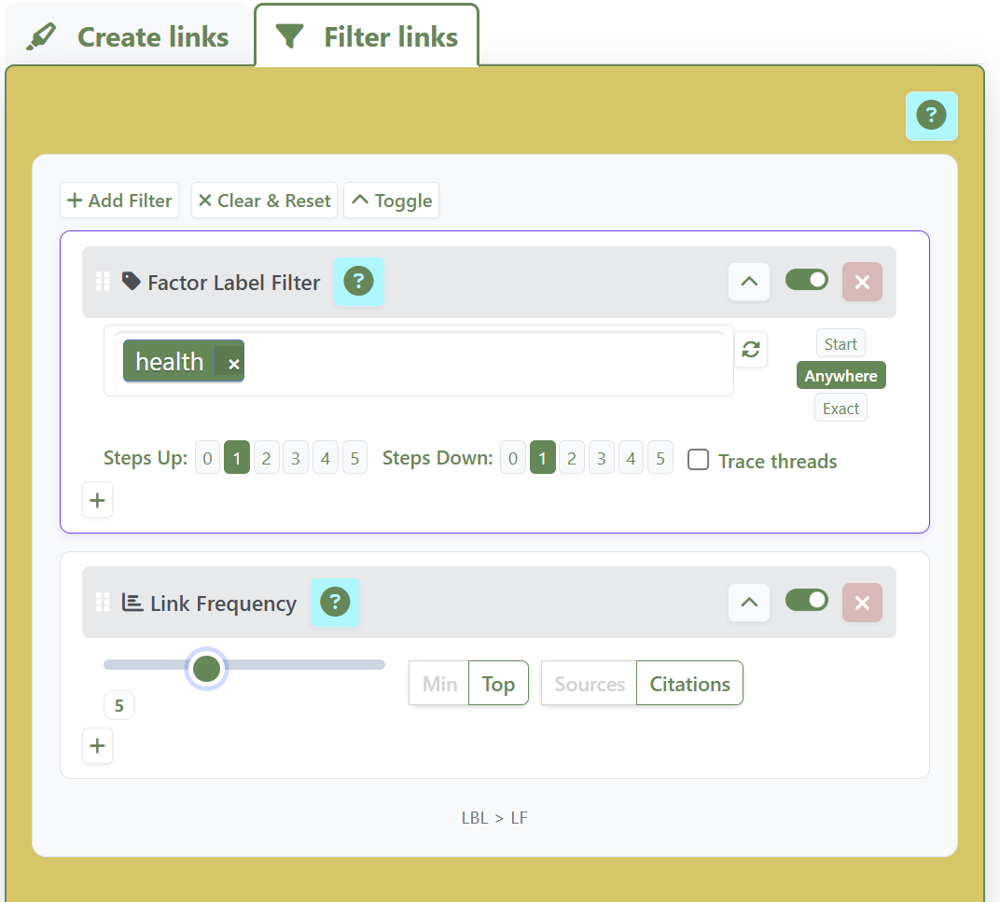

> **SOURCE NOTE (consolidation):** This file is a draft/fragment. The flagship QDA-facing paper is now: [[040 Causal mapping as causal QDA ((causal-qda))]].  
> Companion methods notes: [[900 Magnetisation ((magnetisation))]]; [[900 A simple measure of the goodness of fit of a causal theory to a text corpus ((goodness-of-fit))]].

In the first part of this series [[010 !!Causal mapping is a simple yet powerful form of qualitative coding]], we argued that causal mapping is a simple yet powerful form of qualitative coding. We showed how its focus on identifying causal links reduces and simplifies the analytical task and provides a clear, structured approach which is relatively easy to apply. However, the true strength of causal mapping lies not just in the coding process itself, but in its output: a **query-able qualitative model**.

Qualitative Data Analysis (QDA) most typically produces a written report alongside a deeper understanding in the minds of the researcher or research team, and hopefully also in the readers. It may also provide other outputs like tables of frequencies or co-occurrences. 

We already argued that causal mapping is an especially useful form of QDA because:

 - It produces a **structured graph database of causal claims**. This can be viewed as a table or as a map. 
 - This output isn't a static summary; it's a **dynamic qualitative model** -- a network of interconnected evidence that can be systematically interrogated using standardized, out-of-the-box filters and algorithms.
 - The kinds of questions you can answer with a causal map are **particularly useful** because they are about *what causes what -- as seen by your sources*.

### From a List of Themes to a Network of Evidence

Traditional QDA often produces additional outputs like tables of theme frequencies alongside narrative summaries. It is possible to query these to answer questions like "what themes did the younger respondents most often mention when also talking about the main theme".  

Causal mapping provides a particularly rich output: a **causal network** -- a qualitative knowledge graph where the factors (which can be understood as themes) are nodes and the causal claims are the links connecting them. This structure is inherently machine-readable and ready for analysis.

Thinking of the output as a **model** is key. Just as a quantitative researcher builds a statistical model to explain relationships in their data, a causal mapper builds a qualitative model of the causal beliefs expressed in texts. This is not unique to our Causal Map app: all applications of causal mapping provide, more or less explicitly, this kind of model, going right back to [@axelrodCognitiveMappingApproach1976]. This model can then be used to answer new questions, often without needing to go back to the original source texts, though the underlying quotes and context are always available.

### Some standard ways to answer useful questions 

Because the output is a structured network, we can apply a range of queries to explore the data. This gives us a library of **pre-existing approaches** to ask **practical questions** about the causal landscape described by the participants.

Here are some questions you can answer using causal mapping. 

!toc[[010 Individual questions -- introduction ((questions-introduction))]]

### A corresponding library of filters

The Causal Map app provides about 20 corresponding, ready-to-use filters to answer these kinds of questions, some based on existing causal mapping publications, some new. 

In the list of typical queries above:
- Some queries have matching unique pre-defined outputs: a map with a specific filter applied, or a table.
- For some queries, there are different ways to answer them and/or the answer requires more than one filter.
- For a few queries we do not yet have a specific way to answer them in Causal Map. 

There are two types of filter: 
- simple filters which select a subset of the links like [links frequency](https://app.causalmap.app/help-docs.html#link-frequency-filter), [factor label filter](https://app.causalmap.app/help-docs.html#factor-label-filter); and [path tracing](https://app.causalmap.app/help-docs.html#path-tracing-filter) 
- "transform filters" like [zoom](https://app.causalmap.app/help-docs.html#zoom-filter), which temporarily rewrite the cause and/or effect labels. 

Here as reference are more details: [[000 Documentation of individual filters from the Causal Map app ((help-filters))]].

#### Chaining filters together

Most importantly **we can chain filters together**, to answer corresponding, composite questions like: *what are the most frequently mentioned upstream influences on these key outcomes, according to the younger respondents?* 

{style="height:500px; width:auto"} 

Most of the core filters have nothing to do with AI or large language models. They are straightforward, transparent and deterministic. In the Causal Map app, they are available at a click and can be rearranged with drag and drop. But most of them are simple to reconstruct in a spreadsheet or a graph database, without using Causal Map at all. 

## Cutting to the chase with causal queries

This ability to systematically query **causal** evidence is what allows causal mapping to **cut to the chase**. For evaluators and researchers, **the core questions are very often about causation**: "Did the program work?" and "How did it work?". Causal mapping structures the evidence provided in the texts to help researchers answer these types of questions.

### A Model of Causal Evidence, Not Causal Facts

It's crucial to be clear about one thing: Causal mapping is **not a method of causal inference**. It does not, on its own, tell you what truly causes what in the real world.

Instead, it creates a qualitative model of **causal claims**. The map organizes what people _said_ about causation, allowing the researcher to weigh, compare, and synthesize this evidence. The logic we apply is one of evidence management:

- How much evidence is there for a link between X and Z?
- Is that link direct or indirect?
- Do different subgroups of people agree on this causal pathway?

**Calling these causal claims "evidence" does not mean that anyone should necessarily believe it or that it has been verified[^1].** It is simply raw material which we organise and inspect before drawing any conclusions. Researchers can choose to also code additional properties for each link and/or source such as "doubtful" or "reliable" or "verified" and include or exclude links by filtering on those properties.

If the researcher wants to make a causal judgement, they must interpret the map in context, examine the quotes and consider the source of the claims. The map is a powerful tool for structuring and clarifying that judgment.

In any case, **many colleagues use causal mapping not to make causal inferences but simply to understand** *what people think causes what*, and how, for example as a crucial prerequisite for planning policy, communications or interventions. 

See also the other caveats we listed in the previous post: [[010 !!Causal mapping is a simple yet powerful form of qualitative coding]].

## Conclusion

The real power of causal mapping as a QDA method is that it produces a query-able, qualitative model of causal evidence. This structured output allows researchers and evaluators to apply a range of standardized algorithms to answer practically relevant questions about the causal mechanisms at play, as seen by the sources.

Many researchers and evaluators like using causal mapping to explore their data. In the third part of this series, we will explore how these properties -- a simplified coding task and a structured, query-able output -- make causal mapping especially suited for transparent and verifiable automation with AI.

[^1]: Thanks to [Stève Duchêne](https://www.linkedin.com/in/steve-duchene/overlay/about-this-profile/) https://www.linkedin.com/in/steve-duchene/ for reminding us to clarify this.
