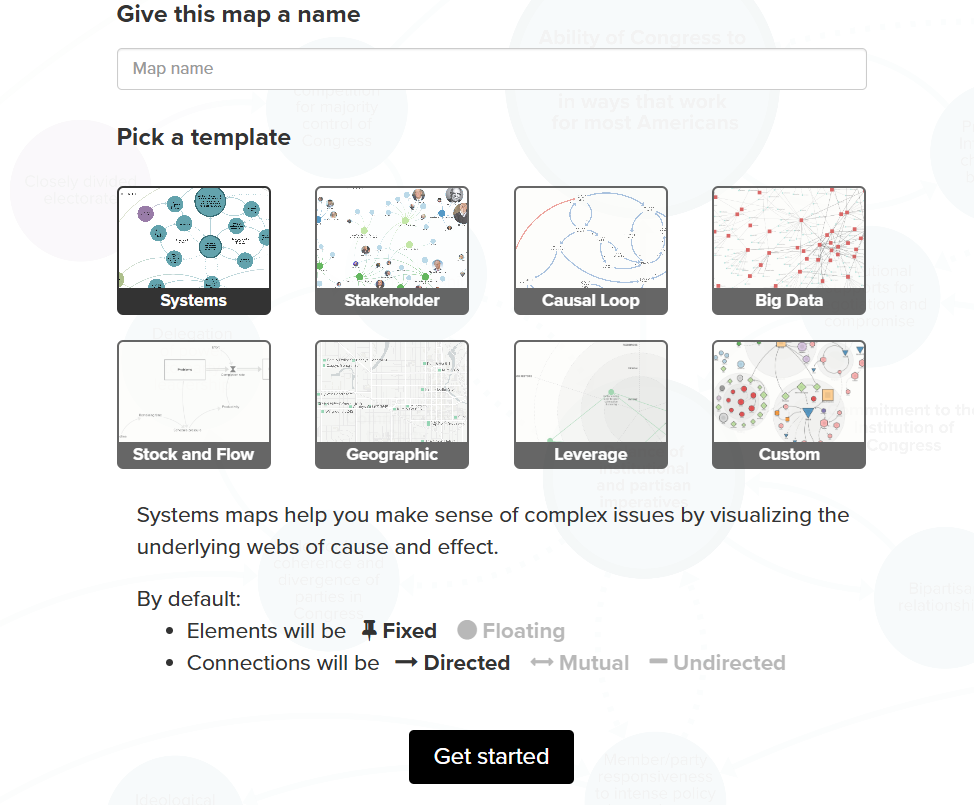
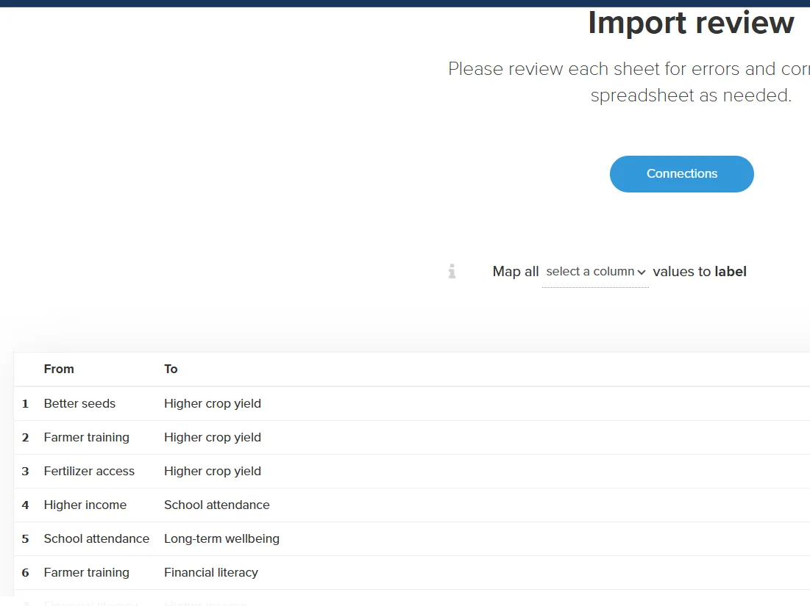

### Summary

This guide shows how to create a simple causal map in **Kumu.io** using a spreadsheet. It includes:

- Spreadsheet structure for causal links
- Step-by-step import into Kumu
- An 8-link example
- Brief comparison with Excel and the Causal Map app

### Why Use Kumu.io?

**Kumu** is a web-based platform for visualizing relationships, such as networks, systems, and causal maps. It supports importing data from spreadsheets and is suitable for small to medium-sized projects. The free tier allows public projects.

Kumu isn’t a dedicated causal mapping tool—it doesn’t handle coding, source tracking, or evidence—but it’s excellent for quickly building and sharing interactive diagrams.

### Prepare Your Spreadsheet

Kumu reads causal links from a two-column spreadsheet

```
| From | To |
|---|---|
| Better seeds | Higher crop yield |
| Farmer training | Higher crop yield |
| Fertilizer access | Higher crop yield |
| Higher crop yield | Higher income |
| Higher income | School attendance |
| School attendance | Long-term wellbeing |
| Farmer training | Financial literacy |
| Financial literacy | Higher income |

```

Each row represents a directional link (cause → effect). Save your file as `.csv` or `.xlsx`. Optional columns like `Description`, `Type`, or `Strength` can be added to enrich the data, but they’re not required.

### Set Up and Import in Kumu

1. **Create a new project** → choose the **Systems Mapping** template.



1. In the canvas, click the green **+** button → **Import** → **Excel/CSV**.

.png)

1. Upload your file. Kumu will preview the data and highlight recognized connections.



1. Confirm and complete the import.

Kumu creates one node per unique item and draws arrows from each `From` to each `To`. It also builds a basic layout, which you can adjust.


### Viewing and Adjusting the Map

- Drag nodes to improve clarity.
- Click nodes or links to edit labels or metadata.
- Arrows represent causal direction.
- Use the layout and style tools for better organization.

Kumu saves changes automatically. You can continue editing manually or re-import updated spreadsheets (note: importing the same nodes again may create duplicates).

### Comparison: Kumu, Causal Map App, Excel

Kumu is ideal for quick, visual exploration of causal structures. It’s easy to set up and looks good out of the box, making it suitable for presentations or early-stage thinking. But it doesn’t track sources, code text, or provide analysis tools.

The **Causal Map app** is designed for qualitative research. It lets you link each causal connection to evidence, filter by source, and analyze sub-maps. It’s more powerful for analytical work but has a steeper learning curve. [**Excel**](%F0%9F%A7%AE%20Coding%20with%20Excel%20f5d2ea5542004d28882f67613bef1850.md) is useful for initial data structuring and small-scale mapping, but without visualization it’s limited for sharing or exploring the map structure.

Use Kumu for small maps, Causal Map for rigorous analysis, and Excel for flexible data handling.

