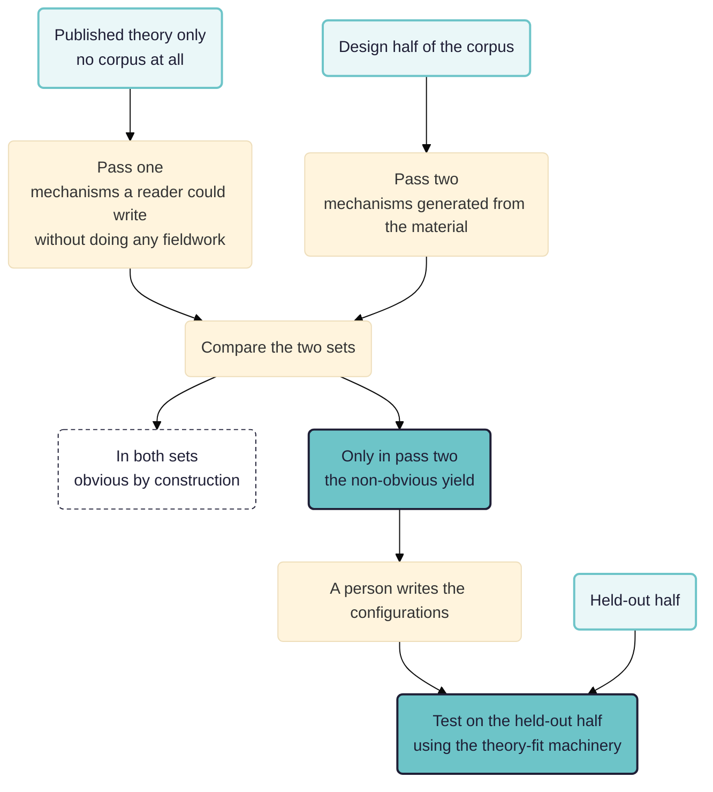

> **Work in progress.** A design sketch rather than a finished study. Nothing here has been run: the workflows are written and validated against the engine, and no result is reported because there is none yet. Parts of the literature search are still owed and are marked where they bite. Comments welcome.

The sibling of [[010 Testing rival theories over a corpus ((theory-fit))|the theory-fit paper]], and its mirror image. That one takes theories somebody else published and asks which the material supports. This one starts with a corpus and no theory, and asks whether a machine can produce mechanisms worth having: powerful, plausible, and not obvious. Realist evaluation is the tradition with the strongest account of what a mechanism is, and the weakest account of where one comes from.

See also: [[000 Working Papers ((working-papers))]]; [[010 Testing rival theories over a corpus ((theory-fit))]]; [[900 A simple measure of the goodness of fit of a causal theory to a text corpus ((goodness-of-fit))]].

**Intended audience:** evaluators doing realist or theory-based work who have a pile of interviews and need configurations out of it, and who suspect that what a model hands back will be fluent, true and useless.

**Contribution.** As in the sibling paper, separated into what may be new and what is merely how this is built.

Possibly new:

- **An obviousness control that is actually run.** Generate mechanisms from the published theory alone, generate again from the material, and subtract. What survives is the non-obvious yield, measured rather than asserted.
- **Scoring the specific-against-general trade by compression.** A middle-range theory earns its place by covering many configurations in less text than restating them, and by predicting one in a part of the corpus it was not built from.
- **A three-tier access rule for generation**, where pre-registration attaches to the procedure rather than to the output, because generation cannot be done blind and pretending otherwise is the commonest dishonesty in this kind of work.

Not new:

- Retroduction, and its own discipline of generating several candidates and writing down what would distinguish them. That is Pawson and Tilley's, and everything here is machinery for doing it at scale.
- The resource-plus-reasoning definition of a mechanism, which is Dalkin and colleagues'.
- Middle-range theory as the standard a configuration is held to, which is Pawson's, after Merton.
- Held-out validation.

The subtraction is the whole idea. What a competent reader could have written without the fieldwork is not worth reporting as a finding, however well the material happens to support it.

## The question

Give a model fifty interviews and ask for the mechanisms. It will produce a dozen, each fluent, each supported by quotations that really are in the text, and almost all of them worthless. They will be worthless in three specific ways, and the three are worth separating because they need different fixes.

- They will be **activities rather than mechanisms**. "Attending the youth club reduces isolation." Nobody thought anything; that is a description of a service.
- They will be **unfalsifiable**. "In supportive environments, supportive processes produce positive outcomes."
- They will be **obvious**. True, well evidenced, and already written in the programme's own theory of change, or already published by somebody in 1973.

The third is the hardest, because obvious mechanisms pass every quality check. They are real, they are supported, a participant would recognise them. They are simply not worth the money, and no test of truth will catch them.

## What a mechanism actually is

The definition everything turns on, and the one most published configurations mangle. A mechanism is not what the programme does. Training is not a mechanism. A helpline is not a mechanism. Those are resources, and a resource on its own causes nothing.

The mechanism is what people do with the resource in their heads: the programme offered X, recipients in this situation reasoned Y about it, therefore Z. The reasoning is where the causal power sits, which is why the same offer produces different results among people in the same room.

Three tests, which Ruby already applies.

- **Could it have happened without anybody thinking anything?** If yes, it is an activity.
- **Does it name a response rather than a provision?** "Gained the confidence to challenge a senior colleague" is a response. "Received coaching" is a provision.
- **Would the person it describes recognise it?** If the sentence would puzzle them, it is the evaluator's theory about them rather than an account of what they did.

Context is not the setting. Rural or urban, one borough or another: those are labels for places, and a configuration built on them says only that things differ from place to place. Context is the feature of a situation that lets the mechanism fire or stops it. The discipline is to say, for each candidate feature, how it enables or blocks the specific reasoning. Where that sentence cannot be written, the feature is background rather than context.

## Powerful, plausible, non-obvious

Three words that sound like taste. Each can be made checkable, and the third is the interesting one.

**Powerful** means it accounts for a lot of the pattern and names something that could be different. Two components, both measurable: the share of units the configuration bears on at all, and whether its context feature is a switch somebody could throw. A mechanism whose context is "having been born in 1998" explains and offers nothing. One whose context is "whether there is anywhere to sit that costs nothing" explains and offers a great deal.

**Plausible** means two things that pull apart, and both are needed. It survives the recognition test above, and it is consistent with the whole corpus rather than only with the passages that produced it. The second is the one machines fail. A model will build a mechanism from eight passages and never notice the ninth that contradicts it, because it was never asked to look. So plausibility has to be scored by a pass that goes looking for the disconfirming case, separately, over the whole corpus.

**Non-obvious** means it is not recoverable without the material. This is normally left to the reader's impression, and it does not have to be.

## The obviousness control

Run the generator twice on different inputs, and subtract.

- **Pass one reads only the published theory**, with none of the corpus: for the loneliness study, the five accounts from the sibling paper, and for a programme evaluation, the theory of change and the programme documents. Ask for the mechanisms this theory would predict in a population like this one. This is what a competent reader could have written without doing any fieldwork.
- **Pass two reads the design half of the corpus** and generates without seeing pass one.
- **Then compare.** Anything appearing in both sets is obvious by construction, however well evidenced it turns out to be. What appears only in pass two is the non-obvious yield, and it is the thing the fieldwork bought.

That comparison is a number, reportable as a fraction: of the mechanisms generated from the material, how many could have been had for nothing. On most projects the answer will be uncomfortable, which is the point of measuring it rather than asserting it.

Two cautions. Matching the two sets is a judgement, not a string comparison, and it must be made by asking whether the two would make the same prediction in the same context rather than whether they use the same words. And a mechanism appearing in both sets is not thereby false: it is confirmed and unremarkable, which is worth reporting as such rather than deleting.

## Generating variance on purpose

A model asked for mechanisms produces variations on one idea. Variance has to be forced, and the ways of forcing it are not equally good.

- **Vary the tradition.** Ask for the mechanism a social psychologist would write, then an economist, then somebody working on stigma and identity, then somebody in political economy. This produces the widest spread for the least effort, because it changes what counts as an explanation rather than changing the words.
- **Vary the level.** The individual's history, the household, the immediate group, the institution, the wider system. A configuration that puts everything at one level usually misses where the switch sits.
- **Vary the pole.** Generate mechanisms for the outcome happening and, separately, for it failing to happen among people who look as though it should have. Negative cases are where realist evaluation earns its living and where a generator left to itself never goes.
- **Force rivals for one pattern.** Take a single demi-regularity and require three mechanisms that would each produce it, and that differ in what else they imply. This is retroduction's own discipline and it is the one that makes the output testable.
- **Vary the seed material**, over different subsets of sources, then compare what different subsets produced.

Then deduplicate, and carefully. Two mechanisms that look alike are often not one mechanism: if they differ in the context feature that switches them, merging them destroys the finding. The rule is to merge only where two candidates would make the same prediction in every context named by either, and to record every merge.

## The playoff between the specific and the general

This is the part that decides whether the output is a theory or a filing system.

At one extreme, a configuration per person. Fit is perfect, reach is nil, and what you have is a description with realist vocabulary on it. At the other, a handful of general statements that fit everybody loosely and forbid nothing. Pawson's requirement is that a configuration be an instance of something more abstract that other programmes could also instantiate, and the useful arrangement is a small number of middle-range theories, each with a family of specific configurations under it.

Two ways to score the trade, and both should be reported.

**Compression.** A general theory earns its place if stating it, plus a short context clause per configuration, takes less than restating the configurations. Where the general version needs a full restatement each time, it is a label rather than a theory. This is a description-length argument by analogy and not a formal one, and it is still the most useful single question to ask of a candidate generalisation.

**Prediction into unexamined material.** The stronger test. A general theory built on part of the corpus should predict a specific configuration in a part it never saw: name the context feature, and say what reasoning should be found where that feature is present. Then go and look. A general theory that cannot generate one such prediction is a summary of what has already been read.

So the deliverable is two-layered: a small set of middle-range theories, each with its own held-out prediction and the result of testing it, and beneath each one the specific configurations it covers, each with its context, its reasoning, its outcomes in respects, and its own evidence.

## How much of the material Ruby may see

The sibling paper answers this cleanly, because testing can be done blind. Generation cannot. Nobody retroduces a mechanism from an empty room, and a paper claiming its mechanisms were produced without looking at anything would be describing a different activity.

So the protection moves. What gets registered in advance is the **procedure** rather than the output: how many candidates, generated from what material, at what levels and in what traditions, ranked by which criteria, with the losers kept. Fix that before generating and the results cannot be produced by trying eleven approaches unrecorded and reporting the one that worked.

Three tiers of access, declared before anything runs.

1. **Published theory and programme documents only.** Used for the obviousness control, and read in full. In Rubicon these are already background sources, never coded and never in a denominator.
2. **The design half of the corpus.** Read freely, and revised against as often as the analyst likes. This is where the mechanisms come from.
3. **The held-out half.** Never seen during generation, used only to test the configurations and the middle-range theories once they are fixed and dated.

There is a further protection specific to this method, and Ruby's own notes insist on it: **a person writes the final configurations** from the generated material rather than registering the model's output directly. The act of rewriting is where a human judgement about plausibility enters, and it is the step that keeps a name on the work.

Realist evaluation also changes what registration is for. Rubicon's version trail was built to prove a standard did not move, which is what process tracing wants. Realist evaluation wants the opposite: a configuration that survived a whole evaluation unaltered was probably never tested, and the trail from initial theory to refined theory is the deliverable. The same versioned, immutable, dated rubric serves both. For one it proves nothing moved; for the other it shows every move, when, and on what evidence.

## The circularity, which is the main danger

A model reads the corpus, proposes mechanisms, and is asked whether the corpus supports them. It says yes. The mechanisms were extracted from those passages, so finding them there measures nothing at all. Every part of this design exists to interrupt that loop, and the loop is strong enough that a study can look rigorous at every step and still be a machine agreeing with itself.

The defences, in order of how much they matter.

- **Hold material back before any generation pass**, and test on that. Not optional, and currently a convention rather than something the app asserts.
- **Have a person write the configurations**, rather than registering the model's output.
- **Generate more than one candidate per pattern, and write down what would distinguish them before looking.**
- **Score plausibility with a separate pass that hunts the disconfirming case** over the whole corpus, rather than reading back the passages that produced the mechanism.

## What the workflow looks like

The generation half is a fan-out over traditions and levels, each prong producing candidate configurations from the design half. The testing half is the sibling paper's machinery, unchanged: each configuration becomes a set of tests, each test states what the material would look like if the mechanism were not operating, and the tests run over the held-out half.

The three CMO elements are coded separately, one pass each for context features, reasoning and outcomes, each with its own role, because no single passage carries a whole configuration. Two columns are worth their cost in the reasoning pass, and both come from Ruby's own notes.

- `prompted_by_interviewer`, because a respondent who volunteered a piece of reasoning is stronger evidence than one who agreed with a suggestion, and in a corpus somebody else gathered this is the only way to tell realist interviewing from leading.
- `first_or_second_hand`, because an implementer's account of why participants responded is the implementer's theory, and is data about the implementer.

## What Rubicon cannot do yet

Four gaps, and the first is the one that matters.

- **A configuration has no home as an asset.** Context, reasoning and outcome are coded separately and come together only inside a judgement's rationale, which reads well and cannot be queried. Nobody can ask which context passages support which configuration without reading prose. Rubicon's own open questions call this composite markup and record it as wanted by more of the work than any other item. This paper is the strongest case for building it.
- **Version comparison is manual.** For a method whose deliverable is the trail between versions, there is no report that diffs two versions of a configuration set or runs one workflow against both.
- **Held-back material is a convention.** Nothing stops a workflow testing a refined theory on the sources that produced it, and nothing in the output shows that is what happened. The runner records which sources an earlier run read, so this could be asserted.
- **The unit is a source.** A demi-regularity is a pattern across sites or people, and Rubicon counts documents.

One limit is not a gap and should be stated as such. Realist evaluation's data requirement is a way of interviewing that puts the emerging theory to the respondent. A corpus gathered before the theory existed cannot supply that, and no analysis recovers it. Where an evaluation is still running, the better use of all this is the reverse of analysis: produce configurations from the material so far, then take them into the next round of interviews as the propositions to put to people.

## Next steps

- Pick the corpus. The loneliness interviews make the two papers compose, and give the obviousness control a ready-made input in the five published accounts. A live evaluation would be the better test of whether any of this is useful, and would need the fieldwork loop above.
- Write the generation procedure down and date it before generating anything.
- Run the obviousness control first. It is the cheapest step, it needs no corpus access beyond the published theory, and if the non-obvious yield is near zero the rest of the study is not worth running.
- Build the candidate set, forcing variance by tradition, level and pole, and keep the losers.
- Have a person write the configurations, then register them.
- Only then test, on the held-out half, using the sibling paper's machinery.
