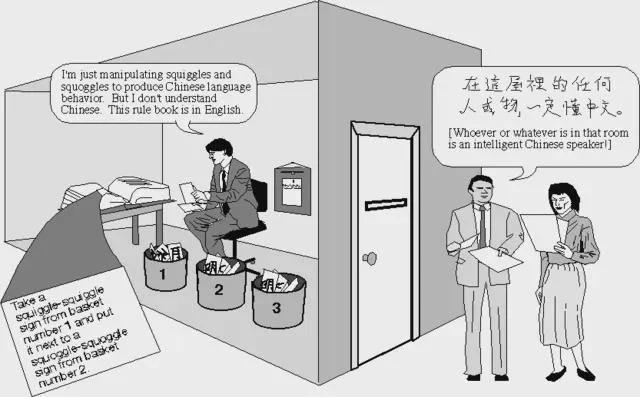

Who said philosophy was a waste of time? When I was studying philosophy in the 80s, I was fascinated by [John Searle’s Chinese Room Argument](https://home.csulb.edu/~cwallis/382/readings/482/searle.minds.brains.programs.bbs.1980.pdf), and by Douglas Hofstadter's fantastic book "Gödel, Escher, Bach" which is, amongst other things, a refutation of it.

This 40-year-old debate is more relevant than ever now, and Bender's recent “stochastic parrot” argument brought all that back for me. It’s so intuitive: a machine that only shuffles symbols can’t possibly have a mind, and most people agree because the alternative -- an emergent mind at a higher level of description -- is hard to picture.

But as far as the *mind* part goes, Searle is still wrong.

  

## Story 1: Searle's Chinese Room argument

  

Imagine you’re locked in a room with a slot in the door. Through the slot come pages covered in Chinese characters. You don’t speak Chinese. To you, they’re just squiggles.

But you have a huge rulebook written in English. It tells you exactly what to do: “When you see a page that looks like this, copy this character from drawer A, and that character from drawer B, and return the result through the slot.”

Outside the room are native Chinese speakers. They slide questions in, you follow the rules perfectly, and the answers you send back are so good that, from the outside, the room looks like it understands Chinese.

  

Inside, though, you never understand a word; you’re just following formal rules, which is Searle’s point: syntax isn’t semantics, symbol manipulation isn’t meaning, and a program can simulate understanding without actually understanding.

  

The Chinese Room is persuasive because it invites you to identify with the operator: *you* don’t understand Chinese, so the system doesn’t understand Chinese.

  

### The trap: looking for the mind in the operator

Here’s the sneaky trick: Searle looks for understanding in the part that’s easiest to empathise with -- the person doing the symbol pushing -- and then declares victory when the person reports “I understand nothing.”

  

But “I understand nothing” is not the end of the story. It’s the beginning of a question about *where the understanding would have to be*, if it exists at all. To see that, you need a second story.

  

## Story 2: Aunt Hillary the anthill

Douglas Hofstadter imagines a conversation with an ant colony -- “Aunt Hillary” (see his “Prelude… Ant Fugue” in [*The Mind’s I*](https://bert.stuy.edu/pbrooks/fall2014/materials/HumanReasoning/Hofstadter-PreludeAntFugue.pdf)).

  

No individual ant is smart. An ant follows local signals: pheromones, bumps, simple rules. It doesn’t know what the colony is doing, any more than a single neuron knows what *your* sentence means.

In Hofstadter’s telling, you can have a perfectly sensible conversation with Aunt Hillary, but not by “speaking ant” to one insect at a time; you do it by treating the whole colony as a system with inputs and outputs. You watch large-scale patterns (flows, trails, clusters, rhythms), learn what changes in the pattern correspond to what “answers”, and then you nudge the colony -- perhaps by adding food here, blocking a trail there, disturbing the surface a bit -- so that the colony’s next global configuration carries its reply.

  

That’s what it means for the colony to have a “voice”: not a tiny mouth on a small ant, but an interpretable system-level output that a conversational partner can read, and a system-level input channel that can change what it does next. In that sense you can ask Aunt Hillary what she’s doing, and she’ll tell you: “I’m building a bridge.”

  

Then you pick up one ant and ask, “What are you building?” Of course the ant has no idea; at best it is reacting to local cues. If you insist that the ant’s blankness proves there is no “bridge-building” happening, you’ve made a category mistake about the level at which the explanation lives.

And yet the colony can do things that look like intelligence: build, adapt, remember, respond. The “mind” (if we want to use that word) is not located inside any one ant; it’s a pattern at the level of the colony.

If you try to find the colony’s understanding inside a single ant, you’ll never find it, not because the colony has no understanding, it’s because you’re looking at the wrong level.

Hofstadter sometimes marks this sort of mistake with the Zen answer “Mu” -- which roughly means “unask the question”. “Does the ant understand the conversation?” is a bit like asking “Where is the bridge in this particular ant?”, or “Which water molecule is wet?”; the question engages at the wrong unit of analysis, so answering “no” (or “yes”) just keeps you trapped at the wrong level.

  

## The "systems" reply

  

The Chinese Room argument misses the point because **the chatbot is not the person in the room; it is the system**.

  

If you insist that the operator must feel the meaning of the symbols, you’re making the anthill mistake: demanding that the ant understand the colony’s conversation.

  

It’s like demanding that a single water molecule be wet. Wetness is something that happens at the level of many molecules in the right kind of organised interaction; similarly, whatever “understanding” amounts to, it needn’t be something you can point to inside the smallest part of the mechanism.

  

Once you allow that minds can be system level patterns, a “virtual mind” reply just means that the operator can be clueless, while the system they implement instantiates an agent that is not identical to the operator.

  

## Why “stochastic parrots” feels like Searle again (and why it isn’t the end)

  

Emily Bender and colleagues call large language models “stochastic parrots” (see [“On the Dangers of Stochastic Parrots”](https://s10251.pcdn.co/pdf/2021-bender-parrots.pdf)): systems that stitch together text by statistical regularities rather than grounded understanding. Whatever you think of the broader argument, the label hits the same nerve as Searle’s room: “it’s just symbol shuffling.”

  

Yes: at the lowest level, it is, in the same way that ants follow pheromones, neurons pass signals, and computers do maths.

  

But “just” is doing all the work -- the whole question is whether *some organisations of those low-level moves* amount to the emergence of an agent with something like beliefs, inferences, and (at least) a functional grasp of meaning, even if none of the individual steps feels like meaning from the inside.

  

## Shanahan’s “simulacra” as a useful way to talk about it

  

Murray Shanahan’s way of talking about LLMs -- simulacra, personas, agent-like patterns you can temporarily instantiate in interaction (see [“Talking About Large Language Models”](https://arxiv.org/abs/2212.03551)) -- helps keep our heads straight. It discourages a naïve anthropomorphism (“the model is literally a little person”) while still letting you say the important thing: systems can realise higher-level agents that are not present in any individual component operation.

  

You can be cautious about hype and still accept the systems level point. The room can be a place where a mind exists even if the operator doesn’t notice it.

  

## Of course, humans are more than minds

  

Of course there is a lot more to being a human (or an animal) or what we call "personhood" than being a mind: being embodied, sensing, acting, being part of a community, being shaped by care and constraint. “Mind” is not the whole story of what we are.

  

But Searle wasn’t arguing about warmth, touch, upbringing, or social life; he was arguing that *mind*, as such, can’t arise from formal processes, and that inference doesn’t follow.

  

## The final irony

  

The final irony of the Chinese Room is that Searle himself looks a lot like a Chinese Room.

  

His neurons don’t understand English; they pass electrochemical signals and follow local rules, and yet at the level of the organised system a mind appears -- one that writes philosophy papers about how organised systems can’t have minds.

  

If “understanding” can emerge from the organised activity of billions of individually mindless parts in a brain, then it’s at least coherent that it could emerge from the organised activity of many individually mindless parts in some other substrate; and if that still feels hard to grasp, that’s exactly why the Chinese Room argument keeps working as an intuition pump, a sleight of hand, that even though it’s wrong.

<!-- xrefs-v1 -->

## Related

- [[000 Intro ((wider-world-intro))|chapter intro]]
