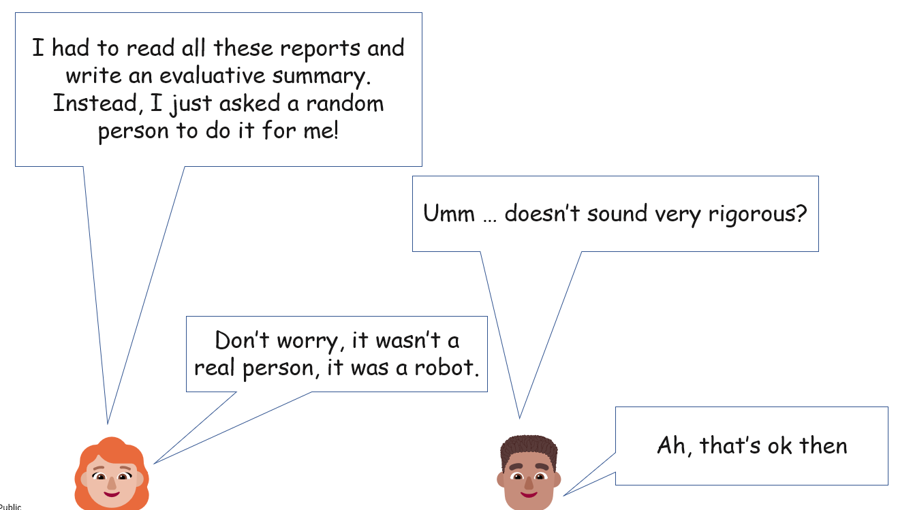

How to guard against some important threats.

Steve Powell, Causal Map Ltd, 2023-10-13 

(With thanks to Rick Davies for some comments)
## Summary

As evaluators and researchers we often give instructions to an AI to process a set of texts. We want to create instructions which are likely to produce valid results. But if we don’t have precise knowledge in advance of what “the right” result would be, we can’t assess the accuracy of the results in the usual way. But at least we can borrow the idea of “rigour” [(Coryn, 2007; Leung, 2015; Lynn & Preskill, 2016)](https://www.zotero.org/google-docs/?C0SKkU) from qualitative sciences. I suggest a series of simple tests for AI instructions. These are not supposed to be any kind of performance measure, but tests of rigour. Following them doesn’t guarantee good results, but if your instruction fails any of them you should rewrite it. You can summarise the tests like this: 

Would humans’ answers to the same task be similar to one another, and if so do the AI’s answers fall within that range of answers, and if so, are they spread randomly around that range?

  

Most of us by now probably use AI for tasks like making a quick summary of a bunch of documents to see what they are about. This post is not about that, or about other kinds of useful tips for working with AI: it is specifically about scientific rigour in the formal use of AI in social or evaluation research. 

## 

## The problem: anything goes?

Evaluators and social researchers have been using large language models (LLMs) for text analysis for a good few months now. It’s high time to say goodbye to “anything goes”, method-wise. How can we recognise and ensure quality using these tools? What counts as a good use of them, what counts as a poor use? With some of these tasks, there isn’t an obvious right answer so it’s hard to talk about “accuracy”. This is a problem which qualitative researchers are very familiar with. Even without a clear external criterion for judging accuracy, we can still try to assess the rigour of the process: for example, don’t measure distances with a stretchy ruler, and don’t evaluate the success of a project by only talking to the men. Using rigid rulers, and talking to women as well as men, doesn’t guarantee perfect results. But it is a prerequisite for them. The tests given here check some prerequisites for using AI for text analysis.

### Evaluative judgements

In particular, solving higher-level tasks often involves making evaluative judgements which explicitly or implicitly concern the value or worth of something. This is an activity we would really prefer not to leave to an AI without checking the rigour of the process. 

We can weave evaluative rubrics [@astonContributionRubrics2019; @kingEvaluativeRubricsMethod2013] into the instructions we give to an AI in order to make the criteria for judgements more explicit.

## ![[500 AI in qualitative social science/img/screenshot-using-generative-ai-for-text-analysis-rigorously.png]]

  

Asking for "a summary" is asking for an evaluative judgement about what is most important.

Asking "what are the main issues concerning X in this text" is asking for an evaluative judgement about what is most important.

Evaluators are starting to do this all the time. They should think twice about it.

The tests suggested here apply to evaluative judgements but also to any other kind of judgement.

## The tests

Suppose you are giving an instruction to an AI to process a set of texts. (If you in fact only have one text, imagine you had a range of similar texts at your disposal.) You would like to use the AI's response, the output, as part of your social or evaluation research. 

  
  

Ask yourself these questions. Each is a prerequisite for the next. If any one of these tests fails, you can stop. You could try making the instruction more explicit or breaking it down into smaller pieces.

  

You probably don’t need to actually carry out these tests: a “thought experiment” should be enough.

  

1) convergent: give the instruction to a range of different humans (we will call them the Processors) and collect their answers. Then ask another group of humans (the Judges) to assess whether the range of answers which the Processors give for each task is sufficiently narrow as to be useful. If this group nearly always agrees, the instruction is answerable.

Who are these Judges and Processors? They should at least have the relevant expertise. Their composition (cultural background etc) will affect our tests, for example test 4. 

The criteria "sufficiently narrow" and "useful" obviously depend on context, the set of input texts, etc. If the humans' answers don't even overlap, the task we are giving them is maybe interesting or creative but probably isn't relevant for social or evaluation research. We can perhaps improve this convergence by making the instruction more detailed and more explicit. 

  

If your instruction fails either of these tests, the last thing you should be doing is giving the task to a robot. If it passes, continue with these tests. Keep hold of the human responses to test 1. 

  

2) reliability of AI answers: when you give the AI the instruction and apply it to a range of similar texts, are its answers adequately similar?  Alternatively, give the AI the same instruction and the same set of texts on different occasions: are the answers adequately similar? If the AI fails either test, it won't be able to succeed on the next tests. Reliability is a necessary criterion (or "hoop test") for any more stringent test of rigour.

3) concordance of AI answers with human answers: when you give the AI the instruction, does its answer for each text fall within the range of answers given by the humans?  HOWEVER it is possible that this test fails but on inspecting the AI’s answers you see that it has paid attention to or uncovered something in the texts or the instruction and which you now realise the human Processors missed: a human bias.  In this case, you should reword the instruction to explicitly draw attention to these aspects and start again at test 2. See also below, “superhuman”. 

4) neutrality or lack of bias of AI answers: If so, do its answers fall somewhere random within that range or are they falling regularly to one side of it (perhaps the answers are most similar to the answers the men gave, or perhaps the answers mention some specific topic surprisingly often)? [@ashwinUsingLargeLanguage2023] find that LLMs sometimes do indeed pay differential attention to texts depending on the source.

  

## Examples for each test

Example 1a) If our instruction is "read this text and output any one of the words in the text" their answers might be useful for some specific purpose but the range of answers won't be in any sense narrow; we don't have convergence and fail the second test.

Example 1b) Pretty much the same thing will happen if your instruction is "read this text and say what is the one most important message in it". At least with some texts, the range of answers is likely to be wide. Perhaps you can improve your results by asking for the most important five messages, perhaps there will be more overlap.

  

Example 2) You can easily fail test 2 by setting a high "temperature". This can produce a variety of "creative" results, but creativity does not sit well with rigour -- it certainly has a role to play in more fundamentally qualitative research, but not to the kind of more mundane text analysis I am dealing with here.  (When using ensemble techniques as described by Rick Davies (2023), the individual results within the ensemble will differ but if we repeat several such ensembles we should get similar results across ensembles.)

  

Example 3) AIs can fail surprisingly on some tasks which seem simple to humans, such as counting the number of times a word appears in a text or doing simple arithmetic or some kinds of logical reasoning. On the other hand, AIs can for example do well on "sentiment analysis", an old staple of NLP research: listing the words within texts with positive or negative emotional tone. 

  

Example 4) Ask an AI to read some stories about family interactions and list those which behaviours are particularly praiseworthy. I haven't done this, but I'm guessing that it will be likely to pick those behaviours which are praiseworthy from a liberal Northern perspective. Whether this seems neutral or not depends of course on the makeup of your group of human Processors. You can probably change the AI’s responses quite a lot by simply alerting it to the fact that different behaviours seem praiseworthy for different cultures.

  

## Superhuman abilities

It’s perfectly possible that AIs can, (untrained, out of the box), robustly carry out tasks which ordinary humans fail on or don’t even understand. For example, perhaps an AI might be able to detect subconscious motives within a text. Or to guess the age of an interview respondent by looking for subtle linguistic clues better than any available human Processors. That’s all fine but to use these kinds of results we have to carry out additional validation studies, as we would when using AIs which have been trained for specific tasks.

These kinds of issues should be considered when judging the results of tests 3 and 4: has it seen something we missed?

## So what?

### What we shouldn’t do

We shouldn't be asking the AI to do tasks which we don't even really agree on ourselves. Take the task "identify the most important message in this document". With some texts it will be easy to pass test 1. But with other texts, there will be many different opinions about what is the single most important message. In this case, it’s pointless and wrong - as a formal research strategy - to ask the AI to step in. The worst thing is that when we do set the AI such a task, it will happily give us an answer. But that doesn't make the answer valid and it doesn’t mean the question had a definitive answer in the first place.

### What we should do

Tasks which pass all these tests are likely to be simple, drudge tasks. The AI can help us improve our research immensely with these kinds of tasks because it can do them quickly, cheaply, reliably and at scale. 

The challenge we face as researchers is to break down hard tasks into simple ones. That's how we at Causal Map use AI for causal mapping. We don’t ask it “what are the main causal stories in this text?” We ask it to identify all the passages in the text where a causal link is mentioned and then aggregate and combine these links ourselves. If you are analysing long texts, LLMs tend to cherry pick sections of interest, which means it is making implicit evaluative judgements. Mitigating this may mean you have to break your text into many short fragments. This may mean a lot of housekeeping, keeping track of different sections of text. It also means writing down explicit rules on how you are going to recombine the responses in order to answer higher-level questions.

As Rick Davies points out [@daviesEvaluatingThematicCoding2023] another way to ensure that the LLM pays more attention to more of your text is to iterate, for example to submit follow-up queries to the LLM retaining only the parts it ignored, or by submitting the previous query and the results together and asking it to find more. But the trouble with iteration is that it is more stochastic and therefore less reproducible: it is more likely to initiate chains of queries which are particularly sensitive to the starting conditions.

  

## Finally

Finally, let's reflect that there is never a definitive list to all the factors we need to consider when assessing the rigour of a research procedure. This is true for quantitative as well as qualitative procedures, although quantitative researchers are less likely to admit it. Eternal vigilance is required.

  
  
  
  
  

[Ashwin, J., Chhabra, A., & Rao, V. (2023). Using Large Language Models for Qualitative Analysis can Introduce Serious Bias (arXiv:2309.17147). arXiv. https://doi.org/10.48550/arXiv.2309.17147](https://www.zotero.org/google-docs/?RyAOac)

[Aston, T. (2019). Contribution Rubrics. https://media.licdn.com/dms/document/media/C4D1FAQE1laRi0vrFrQ/feedshare-document-pdf-analyzed/0/1620553059516?e=1687996800&v=beta&t=bFr7dhpZ-slluV8ne1cERFelwINIaEzsQN8fiF_75gQ](https://www.zotero.org/google-docs/?RyAOac)

[Coryn, C. L. S. (2007). The ‘Holy Trinity’ of Methodological Rigor: A Skeptical View. Journal of MultiDisciplinary Evaluation, 4(7), 26–31. https://doi.org/10.56645/jmde.v4i7.7](https://www.zotero.org/google-docs/?RyAOac)

[Davies, R. (2023, August 31). Evaluating thematic coding and text summarisation work done by artificial intelligence (LLM). Rick On the Road. http://mandenews.blogspot.com/2023/08/evaluating-thematic-coding-and-text.html](https://www.zotero.org/google-docs/?RyAOac)

[King, J., McKegg, K., Oakden, J., & Wehipeihana, N. (2013). Evaluative rubrics: A method for surfacing values and improving the credibility of evaluation. Journal of MultiDisciplinary Evaluation, 9(21), 11–20.](https://www.zotero.org/google-docs/?RyAOac)

[Leung, L. (2015). Validity, reliability, and generalizability in qualitative research. Journal of Family Medicine and Primary Care, 4(3), 324–327. https://doi.org/10.4103/2249-4863.161306](https://www.zotero.org/google-docs/?RyAOac)

[Lynn, J., & Preskill, H. (2016). Rethinking Rigor. https://www.fsg.org/resource/rethinking-rigor/](https://www.zotero.org/google-docs/?RyAOac)

**

<!-- xrefs-v1 -->

## Related

- [[000 Intro ((wider-world-intro))|chapter intro]]
