The public **`example-original`** project in the Causal Map app is a real, anonymised QuIP-style dataset. It is useful when you want to see what a **busy** map looks like after serious coding, and how filters change the picture. Screenshots below are exported from **saved bookmarks** (stable image files in this vault; open the matching bookmark in the app to reproduce the exact filter state).

<!--**Generate or refresh the PNGs** (from the `causal-map-extension` repo): see the Technical section *Export bookmark images for documentation (Garden)* in the app README. Output folder: `img/bookmarks-example-original/`.-->

## Getting oriented: main factors

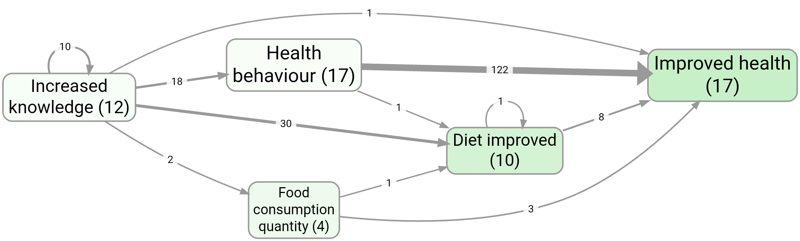

*Bookmark #266 — factor-frequency style view: main factors map. [Open in app](https://app.causalmap.app/?bookmark=266)*

## A focused consequence story

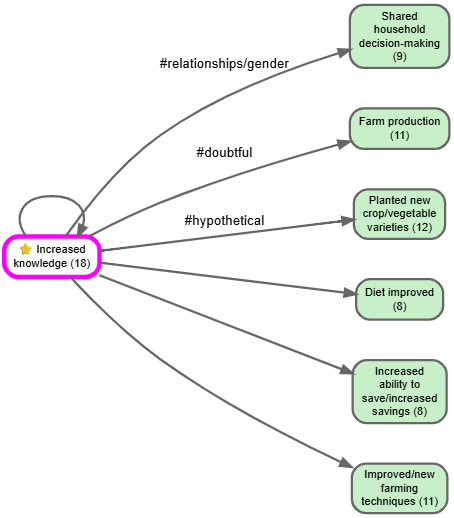

*Bookmark #262 — consequences of increased knowledge. [Open in app](https://app.causalmap.app/?bookmark=262)*

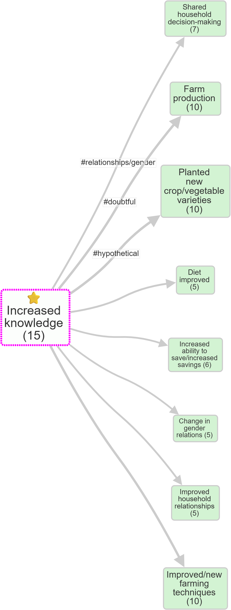

*Bookmark #272 — immediate consequences of Increased Knowledge in the interactive map. [Open in app](https://app.causalmap.app/?bookmark=272)*

## Frequency filters (links vs factors)

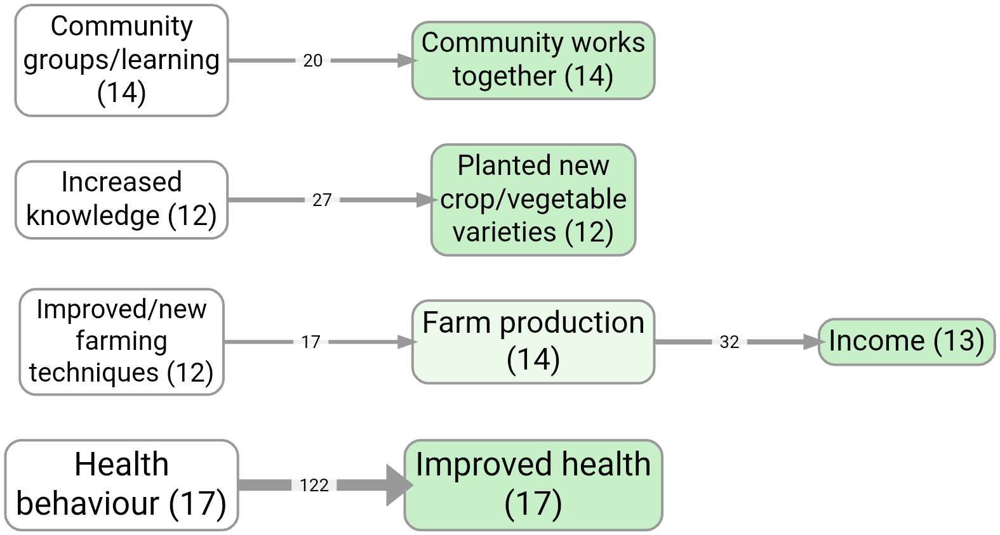

*Bookmark #1124 — link frequency style example. [Open in app](https://app.causalmap.app/?bookmark=1124)*

## Factor emphasis and zoom

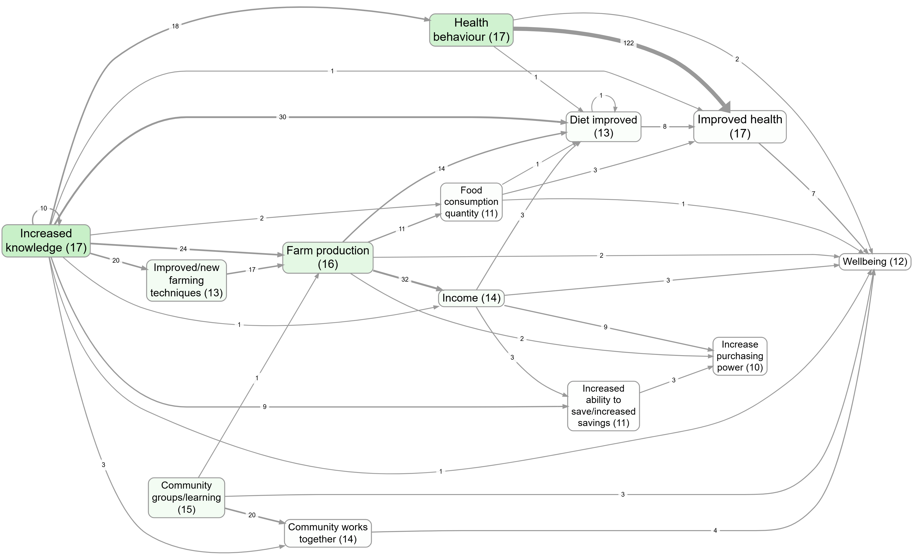

*Bookmark #1063 — factor importance colouring. [Open in app](https://app.causalmap.app/?bookmark=1063)*

## Factor Label filter and zoom contrast

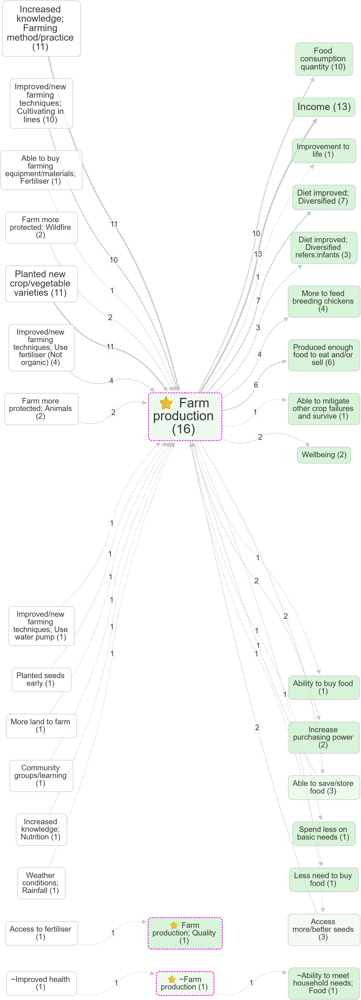

*Bookmark #805 — factor label focus, no zoom. [Open in app](https://app.causalmap.app/?bookmark=805)*

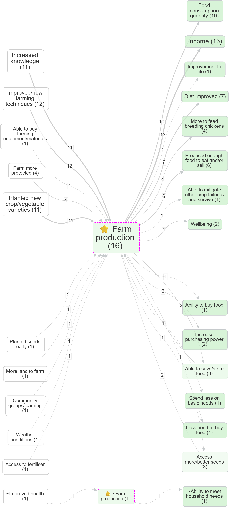

*Bookmark #806 — same focus with zoom. [Open in app](https://app.causalmap.app/?bookmark=806)*

## Group comparisons

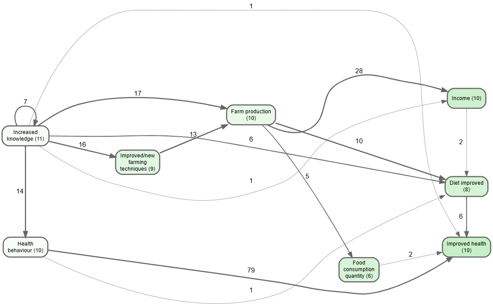

*Bookmark #259 — splitting by group: are different groups impacted in different ways? [Open in app](https://app.causalmap.app/?bookmark=259)*

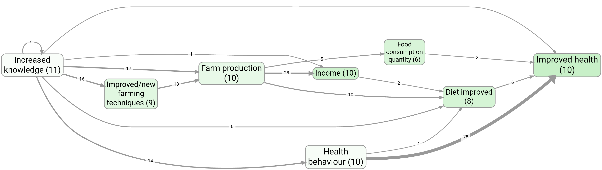

*Bookmark #260 — the same question, filtered to one village. [Open in app](https://app.causalmap.app/?bookmark=260)*

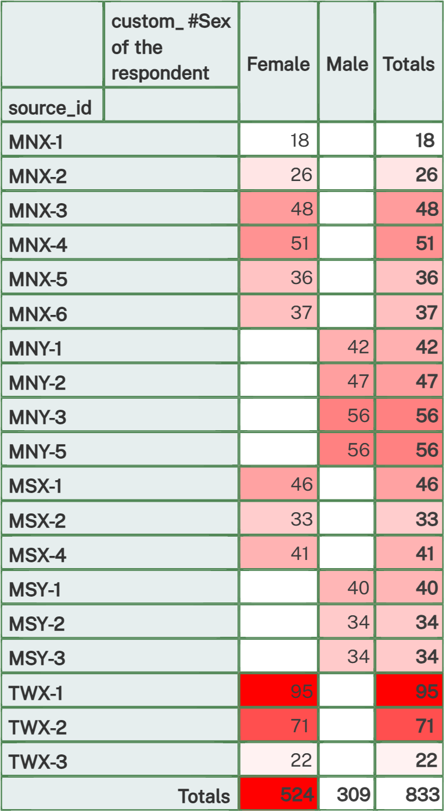

*Bookmark #267 — comparing groups with a heatmap rather than a map. [Open in app](https://app.causalmap.app/?bookmark=267)*

## Tags on the map

*Bookmark #1126 — hypothetical / doubtful style tags on links. [Open in app](https://app.causalmap.app/?bookmark=1126)*

## Path tracing and source tracing

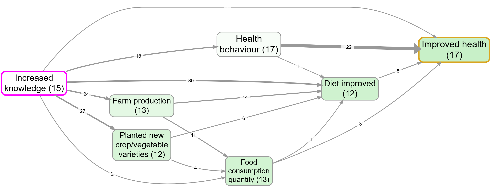

*Bookmark #1129 — path tracing from Increased knowledge to Improved health, without source tracing. [Open in app](https://app.causalmap.app/?bookmark=1129)*

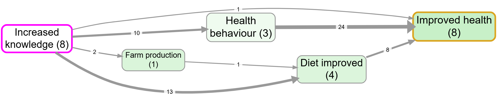

*Bookmark #981 — path tracing with source tracing. [Open in app](https://app.causalmap.app/?bookmark=981)*

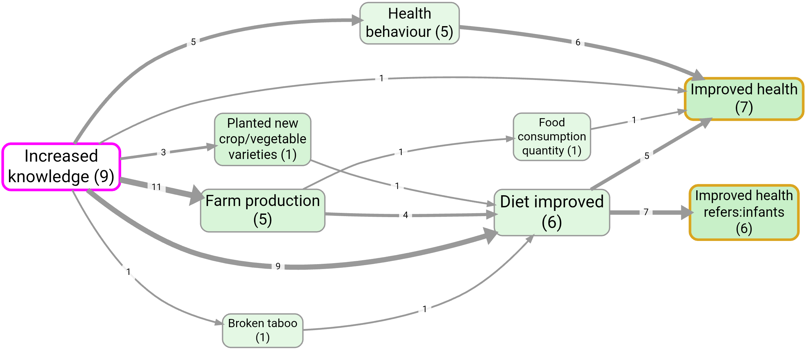

*Bookmark #1125 — pipeline order (tracing then zoom). [Open in app](https://app.causalmap.app/?bookmark=1125)*

## Links, bundles, and evidence

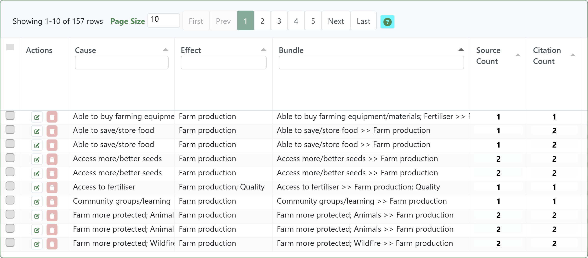

*Bookmark #1143 — links table sorted by bundle, showing that one visible map edge can contain several links. [Open in app](https://app.causalmap.app/?bookmark=1143)*

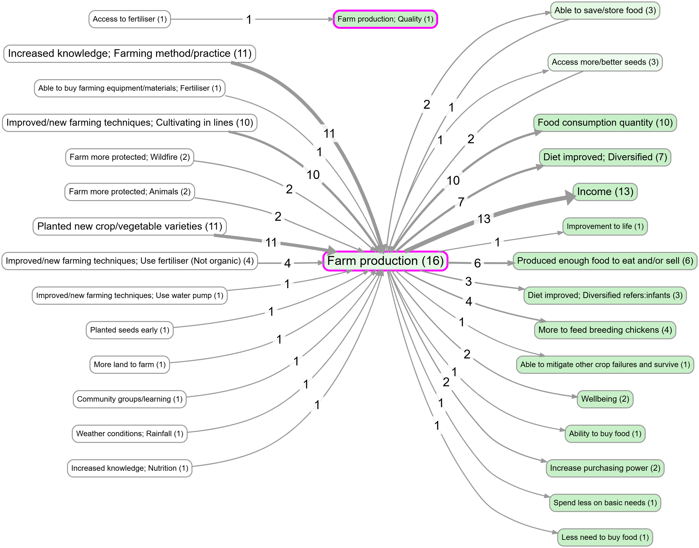

*Bookmark #1144 — the map corresponding to #1143. [Open in app](https://app.causalmap.app/?bookmark=1144)*

*Bookmark #1185 — print view of links with context, useful for narrative evidence. [Open in app](https://app.causalmap.app/?bookmark=1185)*

## Soft recode examples

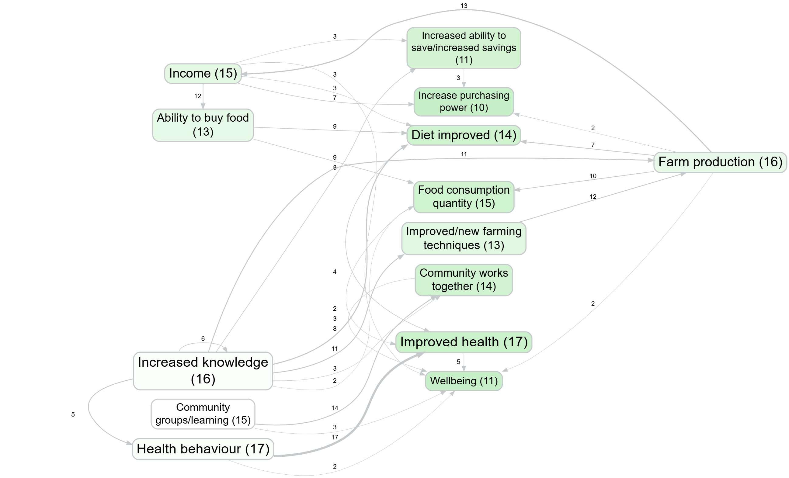

*Bookmark #493 — soft recode using top-level labels from the human-coded file. [Open in app](https://app.causalmap.app/?bookmark=493)*

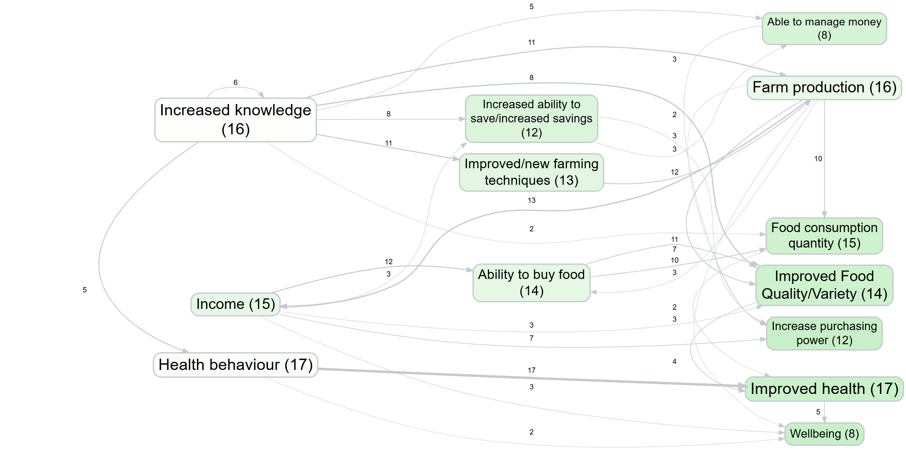

*Bookmark #494 — same soft recode setup, with weak matches recycled. [Open in app](https://app.causalmap.app/?bookmark=494)*
