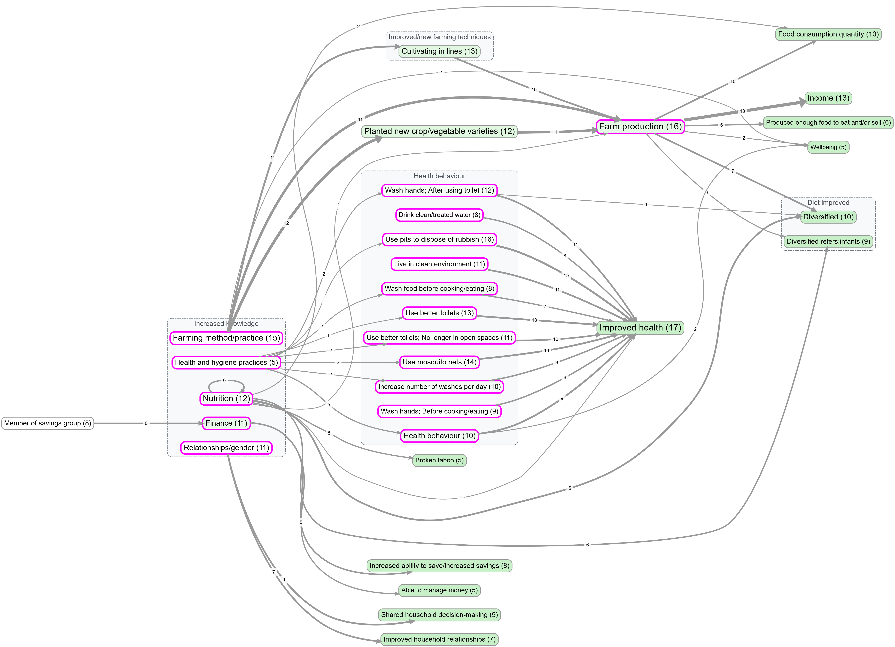
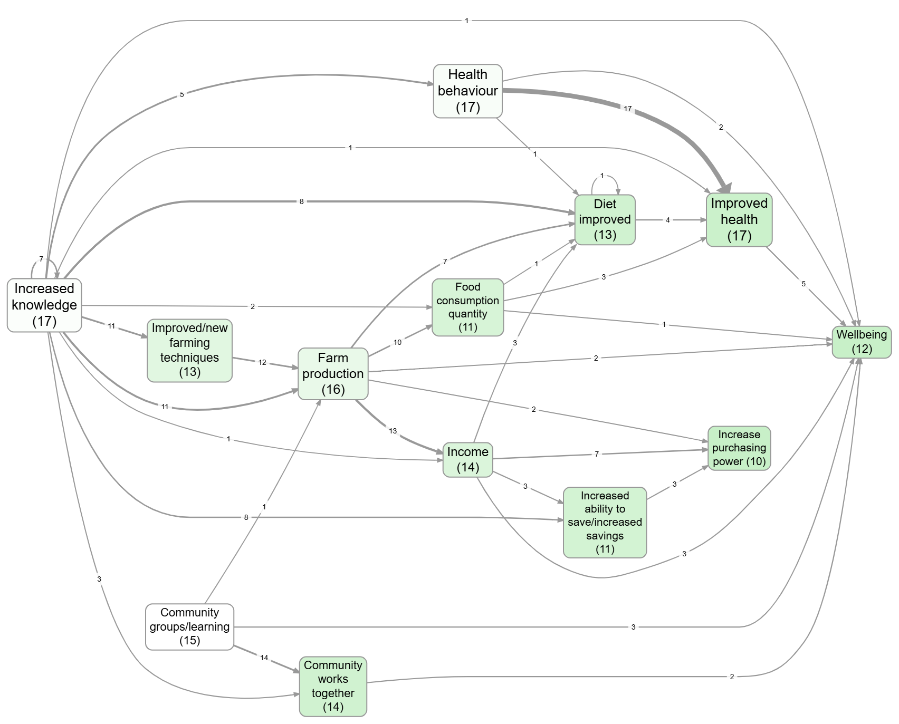

A causal map is meant to make a point, not to be a faithful echo of the data. This page covers the controls that decide what shows up on the map and how each thing looks, organised by the question you're trying to answer rather than by which widget does what. The widget-by-widget reference lives in [[130 Map Panel ((map-panel))|the Map Panel page]] and [[100 Filter Links tab ((filter-link-tab))|the Filter Links tab page]].

## Watch first

<iframe width="100%" height="420" src="https://www.youtube.com/embed/-rXsL47V6XQ?list=PLSCKdSxlLlfGfcab5njcT57xzU0hOURc-" title="Maps in cm4" frameborder="0" allow="accelerometer; clipboard-write; encrypted-media; gyroscope; picture-in-picture; web-share" allowfullscreen></iframe>

<iframe width="100%" height="420" src="https://www.youtube.com/embed/fVJ4g2SxChY?list=PLSCKdSxlLlfGfcab5njcT57xzU0hOURc-" title="Interacting with your maps" frameborder="0" allow="accelerometer; clipboard-write; encrypted-media; gyroscope; picture-in-picture; web-share" allowfullscreen></iframe>

## Two-step mental model: filter, then format

There are two distinct sets of controls in the app, and almost every problem with a map's appearance comes from confusing them.

The **Filter Links tab** decides what gets onto the map at all. It runs the links through a pipeline: frequency, focus, path tracing, opposites, zoom, and so on. Anything excluded by a filter is invisible to everything else.

The **Map Formatting card** (on the right of the Map panel) decides how the things that survived the filter pipeline are drawn: which encoding goes on factor size, colour, link width, link label, and so on. It changes nothing about the data; it just changes how the same data is presented.

Almost all the answers below say "use this filter" or "use this Map Formatting setting", and the two routes are not interchangeable. If you can't find the lever you want under one, try the other.

## Decide what's on the map

### "My map is too crowded"

By far the most common problem. Five different cuts:

- **Top N most-cited.** The Link Frequency and Factor Frequency filters keep only the top N by citation count or source count. This is the first thing to try; "top 10 factors" usually halves your map. See [[200 Simplification - factor and link frequency ((frequency))|frequency filtering]].
- **Zoom out hierarchical labels.** If your labels use the `general; specific` convention, zooming to level 1 or 2 collapses the detail without losing the evidence. Best for projects that have grown deep. See [[590 Hierarchical coding ((zoom-filter))|hierarchical coding]].
- **Focus on one factor.** Show only causes and effects within N steps of a chosen factor. Great when you want to talk about one thing in particular. See [[260 Focus or exclude factors ((factor-label-filter))|focus or exclude factors]].
- **Trace paths between two factors.** If your question is "how does A lead to B", path tracing keeps only the links on a route between them, and ignores everything else. See [[300 Path tracing and source tracing ((path-tracing-filter))|path tracing]].
- **Collapse synonyms or strip brackets.** If the clutter is really just the same thing under several near-duplicate labels, the Collapse filter merges them on the fly without altering your data. See [[270 Collapsing factor labels and excluding brackets ((collapse-filter))|collapsing labels]]. For a permanent tidy-up, use [[200 Bulk relabelling factors ((howto-bulk-relabel))|bulk relabelling]] instead.

If none of those is enough, you probably need to ask a narrower question, not show a busier map.

For example, these two saved views of `example-original` show two first-pass simplifications: top factors by factor frequency, and top factors by link frequency.

*Bookmark #266 — main factors map, top 5 by factor frequency.*

*Bookmark #1124 — same map, top 5 by link frequency. Note how the surviving factors and links differ.*

### "I want to compare groups on the map"

Two related routes, and they answer different questions.

If the question is "do men and women paint different maps?", filter to one group at a time using the Source Groups filter, save each as a bookmark, and put them side by side. The Statistics panel does the equivalent in tabular form (see [[160 Statistics panel ((pivot-panel))|the Statistics panel]]).

If the question is "on this single map, where do the groups disagree about a given link?", use **Label by Group** (the Custom Links Label filter). It writes per-group counts directly onto each map link: Tally mode shows raw counts, Percentage mode shows shares, Chi-square mode highlights links where the difference is statistically significant. The chi-square arrows ⬆/⬇ pair nicely with the **Links highlight: Significant** option in Map Formatting, which thickens the significantly different links and dims the rest.

*Bookmark #535 — chi-square breakdown for factors mentioned by different age groups.*

You can also switch to a table or heatmap when the comparison is the point:

*Bookmark #267 — gender comparison as a Statistics-panel heatmap, an alternative to a map for the same question.*

### "I want to follow one source's story"

Path tracing has a Source Tracing option that constrains the trace to chains within a single source. This stops you reading off transitive stories that nobody actually told. See [[300 Path tracing and source tracing ((path-tracing-filter))|path tracing]].

## Decide how each thing on the map looks

The Map Formatting card has roughly twenty dropdowns. Most of the time you want one of three encodings.

### "Show me at a glance what's important"

Factor sizes are already driven by citation count by default. The two other things worth turning on:

- Set **Factor colours** to **Source count** or **Citation count** if outcomeness (the default) isn't telling the story you want. Outcomeness is "how much like an outcome is it?", which is great for theory-of-change views and confusing for almost everything else.
- Set **Link widths** to **Source count** if you have a few prolific respondents, so width reflects breadth of agreement rather than just how often people repeated themselves.

For a stronger visual cue:

- **Links highlight: Significant** puts a "halo" on links that the chi-square test flagged as group-different (works only when Label by Group is set up).
- **Links highlight: Feedback loop** (2 / ≤3 / ≤4 factors) highlights links that participate in a cycle of that length. Useful when feedback is the point you want to make.

This example colours factor backgrounds by causal importance:

*Bookmark #1063 — Factor colours set to Influence: factors that influence many onward-important factors are darker.*

### "I can't tell positive from negative"

Two layers, both already on by default.

Arrowhead colour reflects the mean **sentiment** of that link bundle: muted blue for `+1`, grey for `0`, muted red for `-1`. Factor border colour reflects the mean incoming sentiment, so factors that are mostly the result of bad things get red borders and mostly-good ones get blue.

If your project has lots of `~`-prefixed opposites (positive and negative versions of the same factor), turn on the [[630 Opposites ((combine-opposites-filter))|Combine Opposites filter]]. It folds the two poles together into one node and uses arrowhead colour to show how often the link goes "as expected" versus "flipped". See also the broader writeup on opposites coding in chapter 007.

If you'd rather see the number than the colour, set **Link labels** to **Sentiment** and the mean appears on each edge.

### "I want to display a metric I coded myself with a custom links column"

If you have a custom link column (e.g. `confidence`, `mechanism`, `time_horizon`), the **Map Custom Columns** filter feeds that column into one of three Map Formatting outputs: **Custom label**, **Custom width**, or **Custom colour**. You also pick how multiple links in a bundle get aggregated (Unique, Tally, All, Average, Sum, Mode). The full pattern is on the [[410 Adding and using custom columns for your links ((howto-custom-columns))|custom columns page]].

This is also how you put source IDs, tag tallies, or per-bundle sentiment in the link label, by switching **Link labels** in Map Formatting.

### "The labels make the map look fragmented or repetitive"

Three small switches, in order of effort:

- The **Groups** dropdown wraps top-level groupings in a box on the map. Choose how the group is identified: hierarchy level 1 (the part before the first `;`), the part before the first colon, what's in square brackets, or what's in round brackets. Quick way to show structure when zooming would lose too much detail.

[[600 How to -- in the Causal Map app/img/4ebc92f94957039c7465233c8b85b24d_MD5.jpg|Open: Pasted image 20260428164109.png]]
![[600 How to -- in the Causal Map app/img/map-250-formatting-your-map-for-what-you-want-to-show-howto-map-formatting.jpg]]

*Top-level groupings shown as boxes on the Interactive map via the Groups dropdown.*

*Bookmark #1178 — same grouping in Print/Graphviz layout for a report-ready figure.*

- **Factor colours = Label segment** colours each factor by its group using the same patterns as Groups. Use it on its own for a softer visual hierarchy, or pair it with Groups for both shape and colour.
- For deeper tidying, [[200 Bulk relabelling factors ((howto-bulk-relabel))|bulk relabelling]] is the right tool. Don't fight the Map Formatting card if the underlying labels are the problem.

### "I want a quick visual marker on certain factors"

In the Print/Graphviz layout, if a factor label starts with an emoji, the app pulls that emoji out of the inline text and renders it as a larger symbol at the top of the node. So labelling a factor `🌱 New farming method` puts a clear sapling icon on the node and `New farming method` underneath. The Interactive layout keeps the emoji inline. This costs nothing, looks good in reports, and is a fast way to mark up a few key factors (interventions, outcomes, ones to flag) without setting up a custom column.

### "I want my factors to sit in a specific place on the map"

Add a tag of the form `(N,M)` (or `[N,M]`) anywhere in the factor label, where N is the rank position (along the main flow direction) and M is the perpendicular position. Both numbers are integers; the tags are stripped from the label when displayed.

For an intervention-to-outcome map with **Direction = LR**, you might want activities at the far left (rank 0), intermediate steps in the middle (rank 1, 2), and outcomes at the right (rank 3). Tag those factors `(0,1)`, `(1,1)`, etc., and they're locked into those columns; everything else floats freely between them.

Partial tags work: `(N,)` sets only the rank, `(,M)` sets only the perpendicular (only meaningful in Interactive layout; in Print/Graphviz the perpendicular is a best-effort hint within a rank). The grid toggle in Map Formatting disables grid behaviour without removing the tags, useful when you want the structured view for one bookmark and a free layout for another.

## Useful contrasts to save as bookmarks

Some map-formatting choices are easiest to understand as a pair. Save both views as bookmarks so you can compare them later.

### Focus with and without zoom

*Bookmark #805 — Focus filter on `farm production`, no zoom. Detailed labels remain.*

*Bookmark #806 — same focus, zoomed to level 1. Detailed labels collapse to their top-level parents.*

### Path tracing before and after source tracing

*Bookmark #1129 — path tracing from Increased knowledge to Improved health: every link on a route between them, across all sources.*

*Bookmark #981 — same trace with Source tracing on: only paths actually told within a single source survive.*

## Make it report-ready

For a static image to drop into a deck or a paper:

- Switch **Layout** to **Print/Graphviz**. The interactive layouts are good while you're working but produce shapes that look improvised in print.
- Hit the **camera** button (top-right of the map controls) to copy a high-quality PNG to your clipboard. The resolution multiplier (1×, 2×, 3×) lives in the Account panel, not on the Map panel.
- The **Copy legend** button puts the legend text in your clipboard separately, which is what you usually want in a figure caption.

For a reproducible view to come back to, or to share with a colleague:

- **Save as a bookmark.** Bookmarks store the entire state of the view: filter pipeline, sources selected, every Map Formatting dropdown, custom column setup, layout, the lot. Send the bookmark URL and the recipient sees exactly what you saw. See [[180 Bookmarks and Reports ((bookmarks-reports))|Bookmarks and Reports]].
- For multi-slide reports (e.g. one map per region), the Report Builder takes a bookmark plus a "variants" custom column and generates an HTML or PDF output with one slide per variant. Same page.

*Bookmark #1361 — Report Builder variants in action.*

## A few caveats

The Filter Links pipeline runs in order, and each filter sees the output of the previous one. If you have Soft Recode or Combine Opposites running, the labels you see in the Factors panel are transformed labels

## See also

- [[050 Example views (example-original) ((howto-example-original-views))|Example views]] for a saved-bookmarks gallery using `example-original`.
