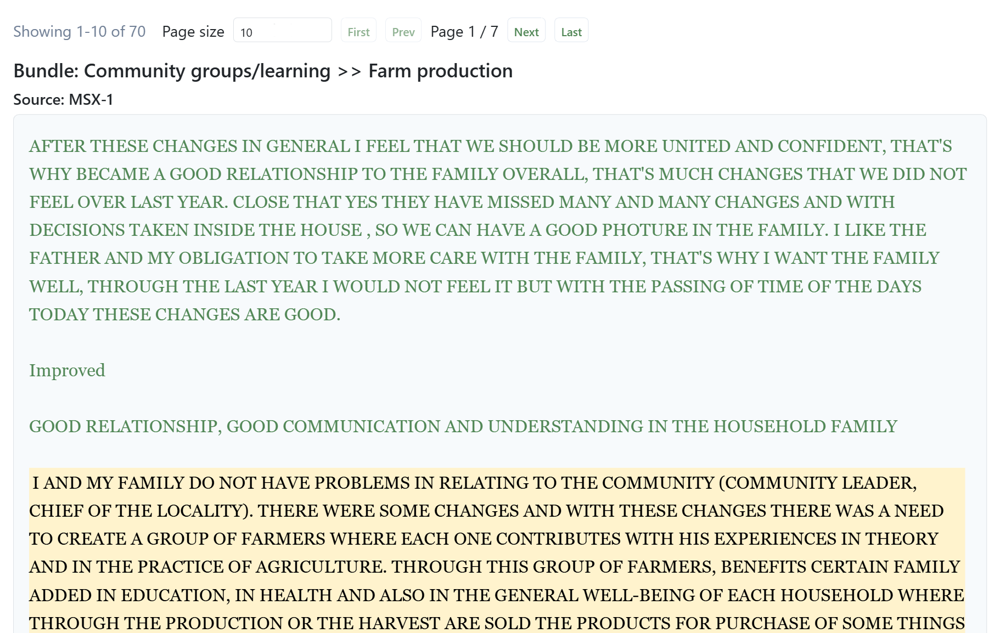

## 1) What are vignettes and why use them?

Some people love just staring at a map and clicking the links to view the quotes behind them. Other people are like "No, what does it say, tell me in actual words already!"

Vignettes turn your coded causal map into readable prose. The Causal Map AI can draft a narrative that names themes, tensions, and patterns in your material -- or whatever else you want. You stay in control: you write the prompt (tone, audience, structure), and you can edit the text afterwards. You can choose which AI model to use. It's a good idea to include a "Checking" phase, where another AI instance checks the work of the first one. As usual, your Account Settings determine where the model is run, e.g. in the EU.

For a non-AI alternative, the **narrative print view** of links shows quotes with surrounding context, which can be enough on its own:

*Bookmark #1185 — narrative print view; see [[300 Print view of links ((howto-print-links))|Print view of links]] for the recipe.*

## 2) Whole-map Vignettes

Use this when you want a bird’s-eye story of everything that is currently in the map (respecting your current filters and source selection). The app sends a compact summary of factors and bundled links (with sentiment), evidence snippets (quotes and source IDs from highlighted bundles where available), and up to 30 “typical” sources scored by how much they represent common bundles, each with bundles, link-level quotes, and a small metadata preview (title, filename, and simple custom fields). If you want the narrative to emphasise particular edges, set Map Formatting → Links highlight to Significant or Feedback loop first; that snapshot is included so the model can focus there. 

## Typical-source  

Use this when you want a single-respondent case study: the app picks the most “typical” source for the current map view (using link counts and coverage of bundles, with a correction to make sure very long documents do not always win). It sends that source’s full text plus its links with quotes and sentiment, so the model can write as if telling one story. Do not ask it to generalise across the whole project in this mode: the prompt and data are scoped to that one source.

# Example: Vignette for "Lonely in London"

See [[986 Causal mapping of loneliness interviews ((lonely-causal2))]]

**The Gravity of Isolation**  
The data reveals a profound and interlocking narrative about modern isolation, where the ultimate destination for many pathways is the crushing sensation of **Feeling Like a Nobody**. This central experience acts as a gravitational pull, drawing in various social and internal struggles. It was observed by 38 sources that this profound emptiness becomes a self-fulfilling prophecy, feeding back into itself in a devastating loop that traps individuals in a state of profound disconnection.

>   
> "with the experience of loneliness, the first thing that came to my head was darkness, and I just felt like, people feel lonely, usually find like a dark place" — PANT32  
> "It makes me feel upset because I feel like I haven’t changed like everyone around me is changing, moving away to better themselves and I feel like I’m still stuck in the same place that I haven’t changed, and then maybe it’s me that’s like the problem" — PANT35

  
  
**The Social Fracture**  
A major catalyst for this darkness is the **Breakdown of Friendships**. 41 sources noted that the fracturing of social bonds directly led to feeling like a nobody. This breakdown often spirals; 24 sources observed that losing friends triggers further social withdrawal, creating a feedback loop where the breakdown of friendships simply leads to more broken ties.

>   
> "I think that, the feeling of the void that someone leaving leaves can make you feel lonelier than you probably are" — VIEW1M  
> "And that's where you start to question yourself about oh I cannot be bothered to go to gym or I cannot to go work. Because you're lonely because the fact that you broke up with someone, um, yeah." — VIEW43

  
  
Compounding this social fracture is a **Total Lack of Support**, which 23 sources linked to feeling entirely invisible and alienated. When individuals feel they have no one to lean on, it breeds a deep sense of inadequacy and isolation.

>   
> "the specific kind of loneliness that comes from being connected to people because of common factors, but feeling lonely because of there not being certain deeper things that you think are important. So… do you, are you in… are you just around each other, but not in actual support of each other? Or you might not truly believe in each other." — VIEW18

  
  
**The Pressure to Fit In**  
The modern pressure cooker of the **Social Media Popularity Contest** was highlighted by 18 sources as a direct pathway to feeling like a nobody. The constant, curated comparison leaves individuals feeling inadequate and left behind.

>   
> "nowadays people just do things because it's like, I need to look like I'm doing something on, on Instagram, otherwise I'm just a nobody, that's another form of loneliness, do you know what I mean?" — VIEW11

  
  
Similarly, the exhausting act of **Conforming to the Crowd** was cited by 24 sources as a driver of profound emptiness. Trying to fit into molds that don't match one's true self leads to a **Disassociation from Identity** (noted by 16 sources). Conversely, **Being Singled Out** for being different was reported by 35 sources to plunge individuals into feeling like a nobody, creating a painful paradox where both fitting in and standing out lead to the same dark place.

>   
> "you pick out the worst in yourself but the best in everyone else and it makes you feel like you don’t want to be around anyone else- because you haven’t got the same quali-qualities as them." — VIEW37  
> "others not understanding you, you, just being misunderstood, you know, leads to loneliness." — VIEW11

  
  
**The Internal Prison**  
These external pressures inevitably seep inward, creating a landscape of **Internal Mental Blocking**. 21 sources described how this mental paralysis leads straight to feeling like a nobody, while 17 sources noted that this mental blocking feeds into itself, trapping the individual in their own head with their self-doubt.

>   
> "if I ignore it and I focus on the feeling of loneliness and emptiness, and existence, that's when I could stay in the state of loneliness, when I ignore my longing for more" — VIEW3M  
> "my way of thinking is not like, it’s like I’m basically like kind of restricted myself from like, for reaching a high level" — VIEW11

  
  
This internal trap frequently transitions into **Built-up Frustration** (mentioned by 13 sources as stemming from mental blocks) and **Crippling Mental Anxiety**. 13 sources observed that feeling like a nobody generates severe anxiety, which in turn—according to 15 sources—reinforces the feeling of being a nobody, creating a suffocating cycle of panic and isolation.

>   
> "And if you have more worries and that makes you feel... It makes you feel like you, you can't be heard, because it's like, even if you're screaming or shouting, it's like being in space" — VIEW11  
> "if you fail and then like obviously you have a whole class of 50 people watching you crumble and burn and then just after that you just feel like you shouldn't even be there, you know, you'll, you're not worthy of being at that place anymore" — YPART1

  
  
**The Search for Connection**  
In an attempt to escape the void, many turn to **Keeping Busy**. 20 sources described how staying occupied becomes a self-sustaining loop. However, the effectiveness of this strategy is highly mixed. While 19 sources found that keeping busy successfully led to **Finding Matching Human Energy**, 26 sources reported that merely filling time ultimately still resulted in feeling like a nobody, as the underlying void remained unaddressed.

>   
> "I feel lonely if I stay in my house for too long ... if I stay at home then, and if I don’t have anything to do, then I’ll watch films and I’ll feel like I’m really bored" — VIEW34  
> "making stuff makes me feel like this is my role in this world" — VIEW11

  
  
Genuine **Face-to-face Interaction** was highlighted by 22 sources as a vital pathway to finding that matching human energy. Yet, even the pursuit of connection is fraught; 17 sources warned that finding matching human energy can sometimes paradoxically lead to a breakdown of friendships if old bonds are neglected, or if the energy turns out to be mismatched, plunging them back into the cycle of isolation.

>   
> "when I read those quotes, you feel… not happy, what makes you happy. Like think positive, so think positive, and stay around positive people to make you feel better." — VIEW34  
> "they kind of understand what I'm trying to do, so it's like, it's easier to be around people like that, yeah." — VIEW11

Model: gemini-3.1-pro-preview

Bookmark

[#1410](https://app.causalmap.app/?bookmark=1410) — https://app.causalmap.app/?bookmark=1410
