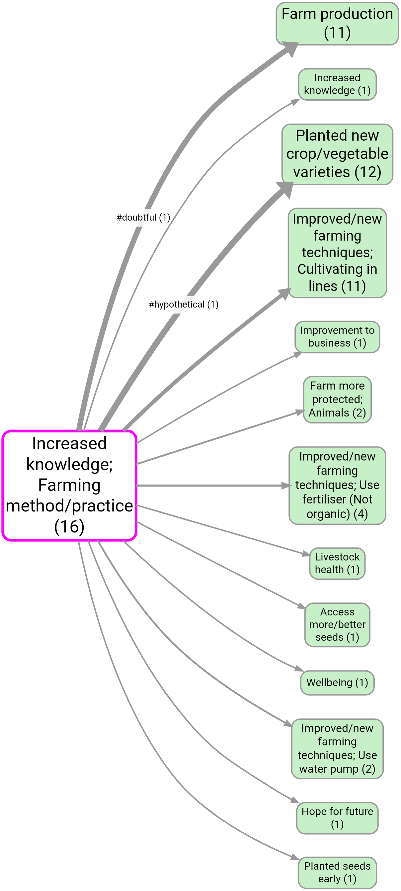

Custom link columns let you store extra information on each causal claim, beyond the standard fields like **sentiment** and **tags**.

They are useful when you want to capture something more specific or more structured, for example:

- a confidence score
- a policy area
- a mechanism type
- whether the claim is based on lived experience, hearsay, or observation
- a time horizon such as short / medium / long term
- a project-specific code that only matters in this study

## Why use custom columns?

Tags are quick and flexible, and sentiment is built-in for direction of effect. But sometimes that is not enough.

Use **tags** when:

- you want a quick label like `#uncertain` or `#important`
- a link may need several labels at once
- you mainly want fast searching and filtering

For example, this saved map shows `#hypothetical` and `#doubtful` tags displayed directly on the links:

Use a **custom column** when:

- you want a named field with a clear purpose, such as `confidence`
- you want one value per link for that field
- you want to sort, group, break down, or visualise links using that field
- you want a coding scheme that other people can understand and reuse consistently

So the short version is:

- **tags** are loose and many-per-link
- **custom columns** are structured and field-based

## Two ways to create a link custom column

### 1. From Manage Link Custom Columns

[[600 How to -- in the Causal Map app/img/ac8004f6aff62d70a64294bcc9668a16_MD5.jpg|Open: Pasted image 20260417113128.png]]
![[600 How to -- in the Causal Map app/img/screenshot-410-adding-and-using-custom-columns-for-your-links.jpg]]

This is the best route when you already know the field name you want to add across the project. It works the same as for adding custom columns in the *sources* tab.

1. Open the **Links** tab.
2. Open **Manage Link Custom Columns**.
3. Type the new field name.
4. Apply the change.

That creates the field for the project, so it is available across your links.

### 2. Directly from the Link Editor

![[600 How to -- in the Causal Map app/img/map-410-adding-and-using-custom-columns-for-your-links.jpg]]

This is useful when you are coding and realise, in the moment, that you need a new field.

1. Open an existing link or create a new one.
2. Open the **Custom fields** panel in the Link Editor.
3. In the field picker, type a new field name.
4. Confirm that you want to create it for the project.

The editor stays open, and you can carry on coding.

## How to fill in values

Once a link custom column exists, you can edit its values in two main places:

- in the **Link Editor**, by opening the **Custom fields** panel and choosing the fields you want to see
- in the **Links Table**, by showing the custom columns and editing cells there

This is useful because some people prefer to code while reading evidence in the editor, while others prefer to review many coded links side by side in the table.

## How to use custom columns in the Links Table

Once you have filled in some values, custom columns become useful immediately in the table.

For example, you can:

- sort links by that column
- filter to one value
- group rows by that column
- use breakdowns based on that column

This is often the easiest way to answer questions like:

- Which mechanisms appear most often?
- Which claims were coded as high confidence?
- How do links differ by policy area?

In other words, custom columns make your links table more like an analysis table, not just a coding log.

## How to use custom columns in map visualisation

Custom columns can also drive map display.

[[600 How to -- in the Causal Map app/img/1fddc86a620895eddd9b12e644d574a4_MD5.jpg|Open: Pasted image 20260417113532.png]]
![[600 How to -- in the Causal Map app/img/screenshot-410-adding-and-using-custom-columns-for-your-links-2.jpg]]

The basic idea is:

1. Use the **Map Custom Columns** filter to choose a link custom column.
2. Tell the filter whether that column should feed **Custom label**, **Custom width**, or **Custom colour**.
3. Choose how values should be aggregated when several links are bundled into one visible edge.
4. In **Map Formatting**, choose **Custom label**, and/or **Custom width**, and/or **Custom colour**. These should be selected automatically.

This matters because the map often shows one visible edge which actually represents several underlying links. So the app needs a rule for combining their values.

Typical label aggregation options are:

- **Unique**: show distinct values only
- **Tally**: show counts by value
- **All**: list all values
- **Average**: for numeric columns
- **Sum**: for numeric columns

Typical width aggregation options are numeric summaries such as:

- **Average**
- **Sum**
- **Max**

Typical colour aggregation options are:

- **Mode**: most common value
- **First**: first value encountered

## Simple examples

### Example 1: confidence

Create a custom column called `confidence` and fill it with values such as `1`, `2`, `3`.

You can then:

- sort the links table by confidence
- break the table down by confidence
- use average or max confidence to control map edge width

### Example 2: mechanism

Create a custom column called `mechanism` and fill it with values such as `cost`, `motivation`, `trust`, `access`.

You can then:

- group the links table by mechanism
- filter to one mechanism
- show edge labels on the map using unique values or tallies

### Example 3: policy area

Create a custom column called `policy_area` and fill it with values such as `health`, `education`, `agriculture`.

You can then:

- compare bundles in the links table by policy area
- use map labels to show which areas are contributing to each connection

## A practical tip

Keep the field names simple and stable.

Good examples:

- `confidence`
- `mechanism`
- `policy_area`
- `time_horizon`

Less good examples:

- `misc`
- `other2`
- `new field`

If you choose a clear field name early, the rest of the coding and analysis is much easier later.

## In short

Custom link columns are for structured coding that goes beyond sentiment and tags.

They help when you want to:

- create project-specific coding fields
- analyse links more systematically in the table
- drive map labels, widths, or colours from your own coding

That makes them especially useful once your project moves from simple coding into comparison and analysis.
