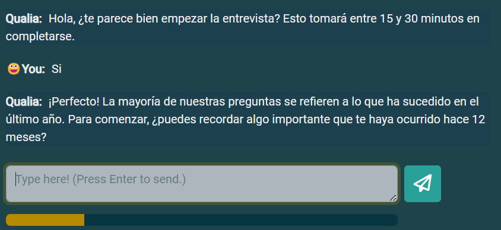
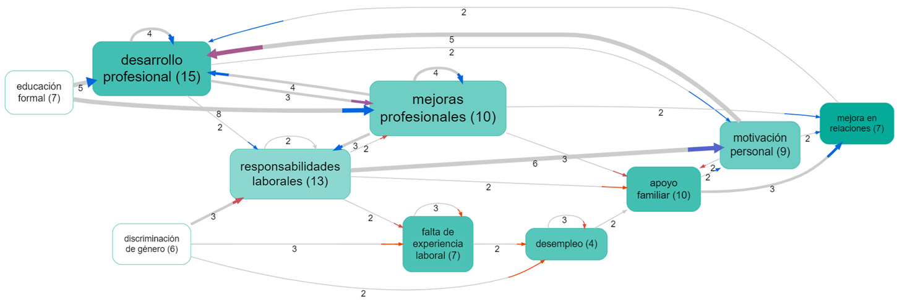

> Automating chat interviews with **Qualia**. Then using **Causal Map** to make sense of them. In-depth research was never this easy! A case study from Chile.

At Causal Map we're thrilled because our [seamless AI-supported workflow](https://causal-map.bullet.site/resources/from-qualia-to-causal-map/) is finally coming together. Recently we helped colleagues at a University in Chile to complete a qualitative, explorative evaluation of the impact of a programme, using our automated interviewer **Qualia** to conduct the interviews and **Causal Map** to make sense of them. 

This workflow means you can do **in-depth research** so much more **quickly** and **cheaply** than before while maintaining depth and quality, opening up new possibilities for understanding complex social issues.

### Background

DuocUC, a higher education institution in Chile, hired our consultancy to conduct QuIP-style interviews with Qualia and analyse them using the Causal Map app.  The interviews were motivated by concerns about the gender gaps faced by women pursuing STEM careers at the university. 

This study has been developed in the quality assurance department, as part of the institutional evaluation strategies, led by Felipe Rivera, Head of Academic Quality Evaluation.

We had a first meeting to understand what they wanted to find out, their research questions and the scope of the study and to determine the domains in which the interviews would be conducted.

After this, we started writing the instructions for Qualia to conduct the interviews, having a few iterations with the client’s team to come up with an interview structure that would suit them. 

## The process
### Step 1: Setting up the interview in Qualia

- The instruction for the AI interviewer was similar to the instructions you could give to a human interviewer. And both the interview instructions and the interviews itself were conducted in Spanish.
- The AI asked questions about changes in 3 domains: educational experiences, professional development and relationship dynamics.
- We used GPT-4o which is the best AI model to date.

### Step 2: Collecting stories with Qualia

- We sent the interview link to 50 people and were able to collect 32 interviews.
- We created special individual links to be able to track the interviews:
    - At Qualia, we don’t store personally identifying information at all. But we can add a personalised key like &key=0003 to the end of the URL for each individual invitation.
    - And this allowed the researchers to keep track of who they sent which invitation to, so that they knew that e.g. key 0003 belongs to Claudia.
- We downloaded the interview results from Qualia and uploaded them into Causal Map.

### Step 3: Analysing stories with Causal Map

- We used AI (GPT-4o) to identify each and every causal link in the interviews, and for each link, to label the cause and effect.
- We used a “radical zero-shot” approach in which the AI is given no codebook and is simply told to invent its own codes (in Spanish). We gave the AI context about the project.
- We found **251** causal links mentioned by the respondents
- Then we also auto-coded the sentiment of each link in order to show which contributions were “positive” (blue arrowheads) and which were "negative" (red arrowheads).

### Step 4: Answering research questions with Causal Map

- Once the coding was done, we used the filters in the app to create different maps that answered their research questions:
    - “What was the immediate impact on the respondents’ lives because of gender discrimination?”
    - “What is the causal network from gender discrimination?”
    - “What are the most mentioned factors by the sources?”
    
    
    
- We also used the ‘AI Answers’ feature to help us understand more about the interviews
    - This functionality allows you to ask questions about all the text in your file.
    - It is completely independent of causal coding. It will work just as well without causal coding.

### See what Javiera Cienfuegos, Senior Researcher of the evaluation project, has to say:

--{.tip}
<aside>
👥 "The type of questions that were asked "what causes what", were equally linked to methodological innovation. The results were able to portray how gender barriers are intertwined in domains ranging from higher STEM education to the performance of new professionals and technicians once they enter the labour market, reaching deeper explanations and social impact.”

</aside>
--

<!-- xrefs-v1 -->

## Related

- [[010 Background on data collection with Qualia ((qualia))|chapter intro]]
