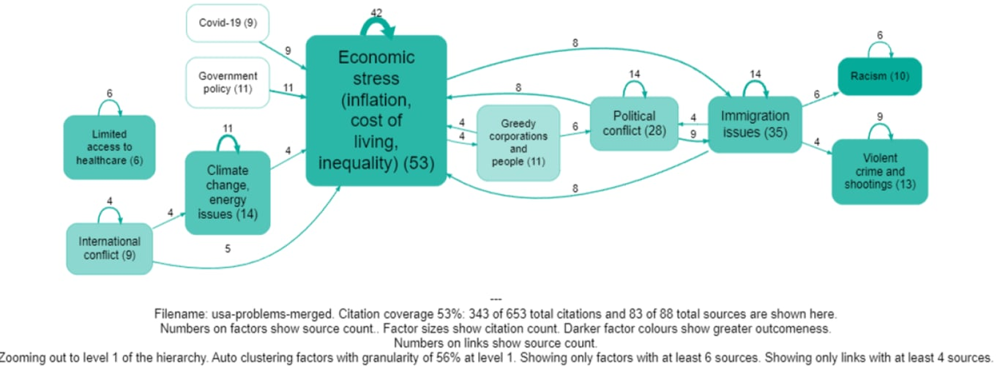

2023-09-19
## Summary{.banner}

A proof of concept study about using AI to collect and analyse data in complex systems.

[See the paper here](https://drive.google.com/file/d/11uma3PuZ91dTBX0otRXp431cID4weTTV/view)

<!-- xrefs-v1 -->

## Related

- [[000 Some Case Studies ((case-studies))|chapter intro]]
