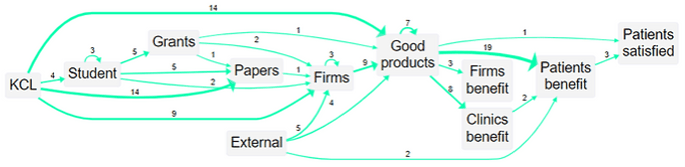

2022-09-19
## Summary{.banner}

An analysis of the long-term impact of the scientific work of a University Department, required for the UK REF process. We carried out some interviews and combined this information with existing documentation, publication lists etc to make a causal map of the impact. The study combined data from different sources to trace the impact of the original academic research, into a robot massage system intended to assist medical professionals and patients. Additional interviews were conducted with manufacturers and clinics "downstream" of the research in order to enrich information about the "ripple effect" of the original research via different pathways right across the globe.

The REF is the UK's framework for evaluating research work carried out by universities. One department at King's College London (KCL) engaged Cactus Communications to provide evidence to support an impact case study to be submitted for REF 2021. Cactus in turn engaged Causal Map to collect and synthesise the evidence.

The findings were able to demonstrate a wealth of evidence for research impact. For example there are 15 completely separate threads of evidence from KCL research to benefits to patients. The study also showed the influence of the research in the context of other contributions from other researchers and organisations.

[Cactus Communications](https://cactusglobal.com/)

<!-- xrefs-v1 -->

## Related

- [[000 Some Case Studies ((case-studies))|chapter intro]]
