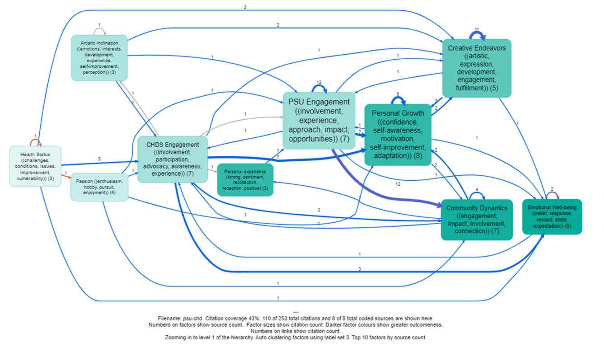

2024-03-22
## Summary{.banner}

Creative Home Delivery service is an arts and health project to alleviate loneliness and isolation and improve wellbeing through creative arts. Designed and facilitated by People Speak Up (PSU), in partnership with Connecting Carmarthenshire, Carmarthenshire County Council and Hywel DDA Health Board. Working with 12 creative artists (movement, singing, creative writing, storytelling, visual arts, spoken word).

In March 2024, PSU commissioned Causal Map to identify the project's impact pathways by analysing interviews with the project's key informants.

The CM team used AI to identify each and every causal link in the interviews to create causal maps.

[Check out the project's page here](https://peoplespeakup.co.uk/creative-home-delivery-service.html)
[See Causal Map's findings presentation here](https://drive.google.com/file/d/1UsfirwPQB-U9VP4nDL-7hZHBz_Hb114O/view?usp=sharing)

<!-- xrefs-v1 -->

## Related

- [[000 Some Case Studies ((case-studies))|chapter intro]]
