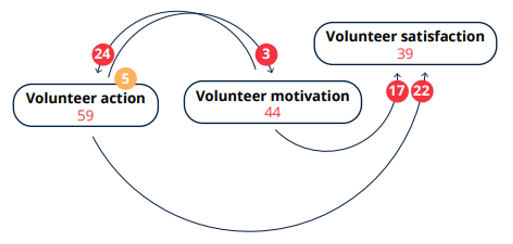

2023-01-04
## Summary{.banner}

--- start-multi-column: everyoneColumns
```column-settings  
number of columns: 2  
```

**Background:** The IFRC is a worldwide humanitarian aid organization that reaches 160 million people each year through its 192-member National Societies. "Everyone Counts" is an annual flagship publication of the IFRC. Chapter 6 of the Covid Edition presents causal maps which summarise the experience of volunteers during the pandemic. Work on the chapter was led by Steve Powell who was also lead consultant for the whole report.

--- end-column ---

**Approach:** The Solferino Academy invited volunteers around the world to submit their stories. The stories were translated into English and analysed using causal mapping: a kind of qualitative data analysis in which analysts identify passages of text where people talk about how one thing influenced another, rather than looking for general themes as in traditional qualitative data analysis.

--- end-multi-column



[See the full report here](https://www.ifrc.org/sites/default/files/2023-01/2023_everyone-counts-report-covid_EN.pdf)

<!-- xrefs-v1 -->

## Related

- [[000 Some Case Studies ((case-studies))|chapter intro]]
