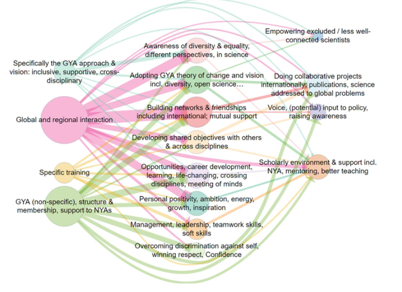
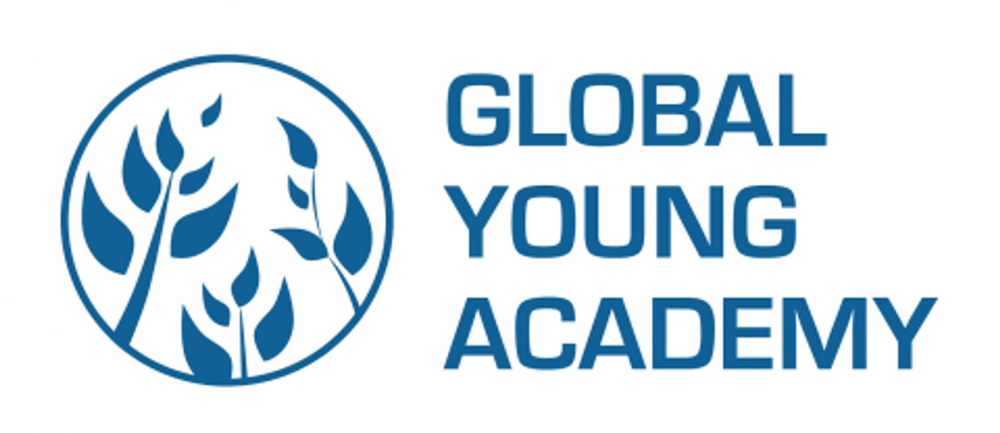

2022-09-19
## Summary{.banner}

This report used a very early version of Causal Map.

--- start-multi-column: gyaColumns
```column-settings  
number of columns: 2  
```

**Background:** The Global Young Academy supports young scientists around the world to connect with other young scientists, develop their careers and work towards solving global problems with science. GYA's 10-year anniversary was an opportunity to reflect on what has been accomplished so far and to inform the strategic plan to increase impact for the next 10 years. An impact evaluation was commissioned to understand personal narratives of impact and to generate data to inform the development of the next 5-year strategic plan.

--- end-column ---

**Approach:** We asked over 100 people to tell us stories about positive changes which had happened because of GYA activities. Of the 683 people reached, 103 completed the survey. We analysed the stories looking for examples of where people had said that one thing leads to another. Then all the causes and effects were grouped into themes to create a Theory of Change for GYA. All the individual stories were synthesised into one story using a pre-defined set of analysis steps.

--- end-multi-column





[See the full report here](https://globalyoungacademy.net/wp-content/uploads/2019/04/GYA-Impact-Analysis-2018_Final.pdf)

<!-- xrefs-v1 -->

## Related

- [[000 Some Case Studies ((case-studies))|chapter intro]]
