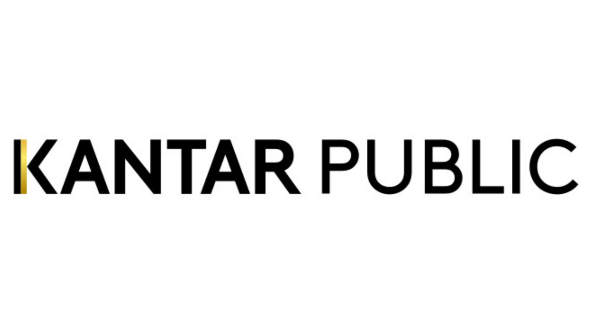

2022-09-19
## Summary{.banner}

Kantar Public works with clients around the world, providing rigorous evidence, insights and advisory services to inspire the next generation of public policy and programmes. Causal Map app was used in their SWaN (Strengths, Weaknesses and Needs) QuIP study, with coding and analysis carried out via [Bath SDR](https://bathsdr.org/).

<!-- xrefs-v1 -->

## Related

- [[000 Some Case Studies ((case-studies))|chapter intro]]
