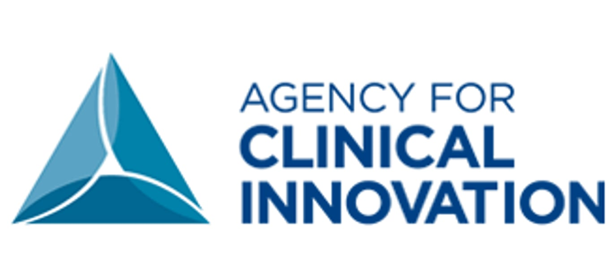

2023-07-05
## Summary{.banner}

The Partner Ring was created in 2022 by the Agency for Clinical Innovation (ACI), which is part of the public health infrastructure in New South Wales, Australia. The initiative aimed to enhance the ability of staff to engage effectively. As a consumer-driven project, it served as an example of authentic consumer leadership within the healthcare system and sought to bridge the divide between staff knowledge and practical application in engagement.

The ACI worked with Causal Map to design the interview instructions for Qualia (formerly known as StorySurvey) to collect qualitative data from the Partner Ring's members and then analyse the impact pathways of the programme in Causal Map, using AI in both processes.

[See the full paper here](https://bmjopen.bmj.com/content/14/5/e080495.full)

<!-- xrefs-v1 -->

## Related

- [[000 Some Case Studies ((case-studies))|chapter intro]]
