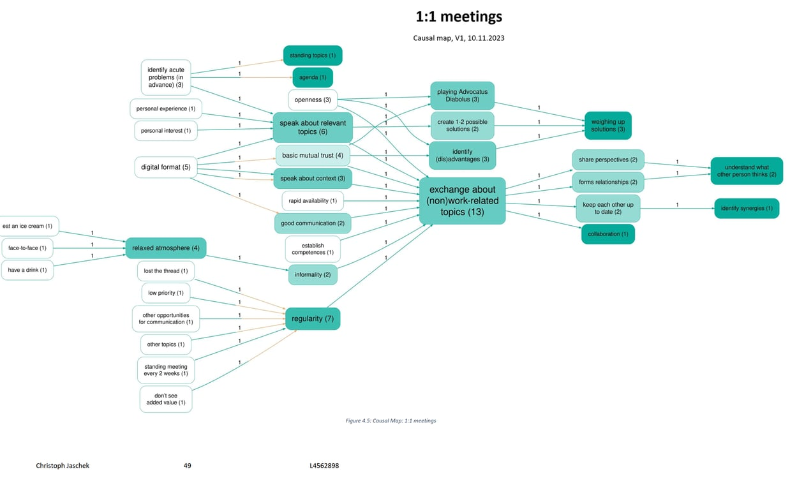

2024-02-06
## Summary{.banner}

Christoph Jaschek, a student at the MSc in Systems Thinking in Practice at The Open University, used Causal Map to analyse semi-structured interviews for his Masters thesis.

The research was based on an exemplar case study conducted in August and September 2023 in a German non-governmental organisation. It employed a qualitative research design and included ten semi-structured interviews with the staff of the case study organisation. The aim of the research was to generate recommendations for the Management Team of the case study organisation to improve existing social learning spaces and to create a new social learning space.

Using a dialectical approach, the dissertation examined the interview material not only systematically but also systemically by means of causal mapping.

[See the full thesis here](https://drive.google.com/file/d/13lHR5LYSKBAd3yuCO41rgV1bwud_fK43/view)

**Reference:** Jaschek, C. (2024). Thinking together within and beyond Communities of Practice (T802-23B: Research project, M.Sc. in Systems Thinking in Practice). The Open University.

[See the full thesis here](https://drive.google.com/file/d/13lHR5LYSKBAd3yuCO41rgV1bwud_fK43/view?usp=sharing)

<!-- xrefs-v1 -->

## Related

- [[000 Some Case Studies ((case-studies))|chapter intro]]
