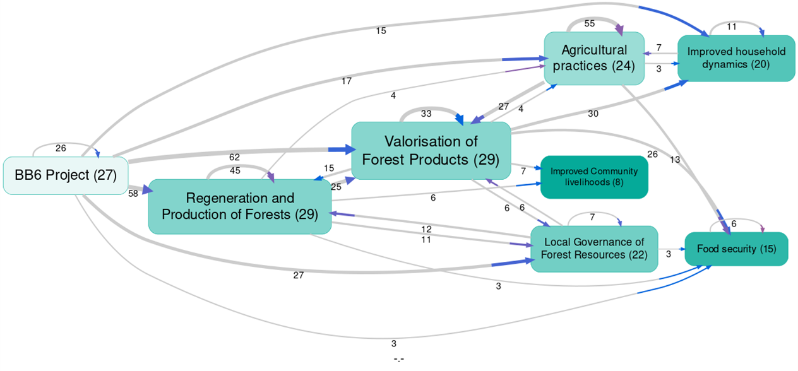

2025-12-12
11/12/2025

## Summary{.banner}

--- start-multi-column: myColumns
```column-settings  
number of columns: 2  
```

**Background:** Causal Map partnered with [Tree Aid](https://www.treeaid.org/) to evaluate their Local Governance of Forest Resources (WEOOG PAANI) project in Burkina Faso. We used [QuIP](https://bathsdr.org/about-the-quip/) to collect the data and [AI-assisted causal mapping](https://www.tandfonline.com/eprint/5HC4P3MMEM3GMXXNN2VM/full?target=10.1080/13645579.2025.2591157) to ==assess the project’s impact== on forest governance, household and food consumption amongst project beneficiaries in two communes.

--- end-column ---

**Findings:** The study revealed how integrating forest management with economic empowerment and sustainable agricultural practices, has contributed to community-driven environmental conservation. And it also demonstrated how combining qualitative research with analysis tools (Causal Map app) can provide insights into community development projects.

--- end-multi-column

## The partner{.banner}
Between February and August 2024, Causal Map has worked with Tree Aid to conduct a comprehensive evaluation of their BB6 project in Burkina Faso, focusing on 2 communes (Toécé and Gomponsom). Tree Aid is an international NGO dedicated to protecting dryland forests and supporting communities in the African drylands.

### The challenge
The WEOOG PAANI project (known as BB6) aimed to improve forest governance, household incomes, and food consumption across two communes, Toécé and Gomponsom. Tree Aid needed to understand ==the project's complex impact pathways,== specifically, how integrating forest management with economic empowerment influenced community-driven conservation.

They faced the challenge of synthesising diverse qualitative narratives to answer specific research questions, such as:
- How do impact pathways differ between the two communes?
- What is the specific impact of the intervention on women’s lives?
- Why is the project directly related to increased crop yield?
- Are there unexpected outcomes?
## The Causal Map solution{.banner}
Causal Map provided extensive support throughout the evaluation process.
### Training
To be able to conduct quality Qualitative Impact Protocol ([QuIP](https://bathsdr.org/about-the-quip/)) interviews, training sessions were held with the evaluation team:

1. **QuIP Lead Evaluator:** the main researchers participated in the training held by [Bath SDR](https://bathsdr.org/) to learn how to design and manage a [QuIP study](https://bathsdr.org/about-the-quip/).
2. **Causal Mapping training:** A 2-day immersive training in Bristol focused on understanding causal mapping, developing interviewing skills, and preparing research deliverables.
3. **Field researchers training:** Causal Map prepared the training script. Tree Aid staff who completed the first two trainings then trained the field research team in Burkina Faso, applying concepts and techniques from the previous sessions.
4. **Causal Map app training:** After data analysis, Causal Map introduced Tree Aid analysts to use the Causal Map app, enabling deeper dives into the data.

### Research Design and Data collection
We helped the Tree Aid team to develop the research design, including the research questions and the interview guides.

During the data collection phase, we provided ==ongoing support and feedback== to the Field Researchers team. This ensured:
- Consistency in interview techniques
- Adherence to QuIP methodology
- Quality and depth of collected data
- Timely addressing of any challenges encountered in the field

### Analysis
The evaluation employed the QuIP methodology, which involved:
- 31 interviews, including household interviews, focus group discussions, and key informant interviews;
- ==Causal mapping analysis using AI-assisted coding== in the Causal Map App;
- Examination of outcomes across four domains: food consumption, income, forest management, and household dynamics.

## Results{.banner}
Using the Causal Map app we were able to find 1288 causal claims (links) made by the respondents and we also autocoded the sentiment of each link in order to show which contributions were "positive" (blue lines) and which were "negative" (red lines).

Through the different filters in the app, many maps and tables were created to support the quantitative data collected by Tree Aid, including:
- **Comparing** maps by commune
- **Splitting** and comparing data by type of interview and domain
- **Focusing** on specific themes, such as ‘Impact on women’s lives’
- **==Unpacking** unexpected outcomes== and **==answering** research questions==, i.e. ‘Why BB6 project is directly related to increased crop yield?’

The evidence strongly suggests that Tree Aid BB6 project has demonstrated significant **positive impacts** on the communities in Toécé and Gomponsom. By integrating forest management with economic empowerment and sustainable agricultural practices, the project has created a model for community-driven environmental conservation. The strengthened local governance structures and improved household dynamics suggest that these positive changes may be sustainable in the long term.

  ![[800 Case studies/img/screenshot-tree-aid-empowering-communities-through-forest-management-in-burkina-f.png]]

Using the [“soft recoding”](https://guide.causalmap.app/transforms-filters-magnetic-labels/) feature in the Causal Map app allowed us to create ==maps showing different perspectives of stakeholders' stories==. This innovative approach enabled us to compare narratives against the project’s Theory of Change and verify the project's impacts across various domains.



<!-- xrefs-v1 -->

## Related

- [[000 Some Case Studies ((case-studies))|chapter intro]]
