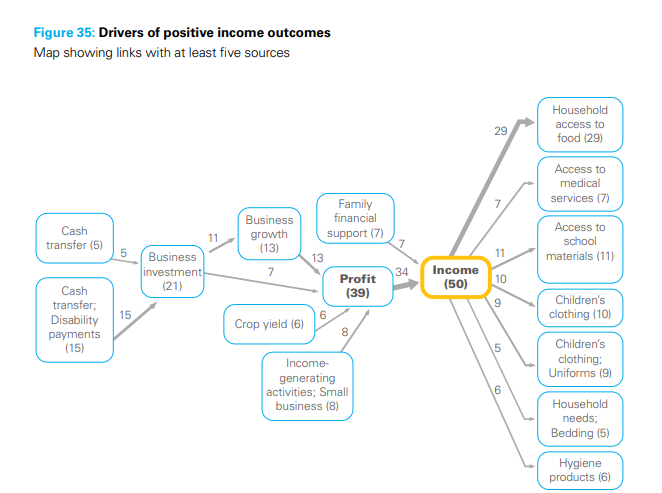
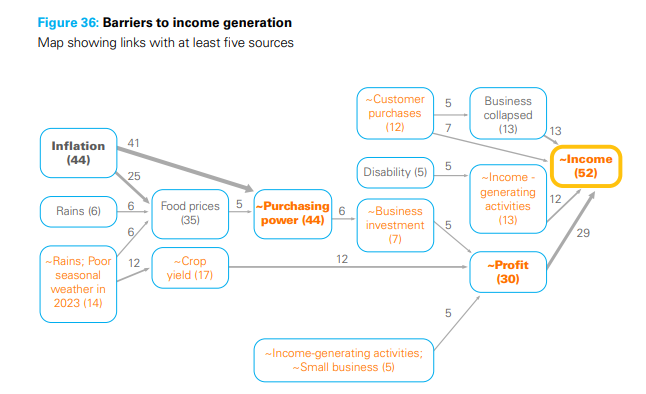

2025-04-16
## Summary{.banner}

The Social Cash Transfer (SCT) programme in Zambia is a poverty-targeted social protection intervention. It's the country's largest and most important programme of its category and it was established with the main purpose of reducing extreme poverty and intergenerational transfer of poverty. It targeted 5 categories of households, providing cash payments.

## The study{.banner}

[BSDR](https://bathsdr.org/) has conducted a study (using QuIP, Qualitative Impact Protocol) based on interviews with 96 cash transfer recipients to assess the impact of the programme, focusing on the main changes experienced by beneficiary households in urban, periurban and rural areas as a result of their participation in the programme. Causal Map was used to analyse the interviews and generate causal maps.

[Check the report here](https://www.unicef.org/innocenti/reports/qualitative-study-social-cash-transfer-programme-urban-zambia)

<!-- xrefs-v1 -->

## Related

- [[000 Some Case Studies ((case-studies))|chapter intro]]
