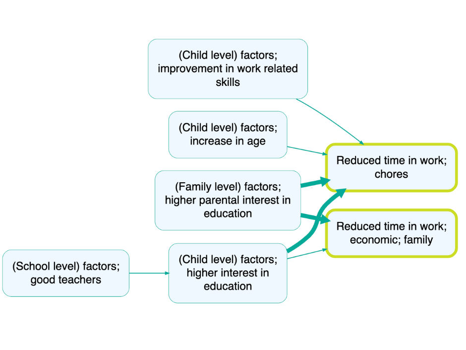

2025-06-18## Summary{.banner}

We are pleased to see how the UNICEF Innocenti team, in collaboration with [Bath SDR](https://bathsdr.org/) and Young Lives India, has used Causal Map to analyse and unpack the complex issue of child work and schooling in India. Their recently released research provides an example of how our software can help synthesise qualitative data into clear, actionable insights.

## The study{.banner}

The research team conducted the Qualitative Impact Protocol methodology in interviews with children and their caregivers in Bihar and Telangana and analysed them using Causal Map. By using Causal Map, the team was able to move beyond a simple list of factors to create a dynamic model of the system behind child work and schooling.

Many respondents made causal connections between education and child work. For example, according to some respondents in both locations, leaving school led to adolescents starting paid work. Children and young people often left education due to financial difficulties or absence, illness or death of a family member. Parents reported that school closures due to COVID-19 also led to school dropout.

The study's results provided clear insights into children's daily lives, leading the research team to recommend a multi-sectoral approach. They proposed changes to both policies and programs to improve school engagement and address the effects of child labour.

For more information on this study, please see [Bath SDR's blog post](https://bathsdr.org/) and check out the briefs and full reports.

<!-- xrefs-v1 -->

## Related

- [[000 Some Case Studies ((case-studies))|chapter intro]]
