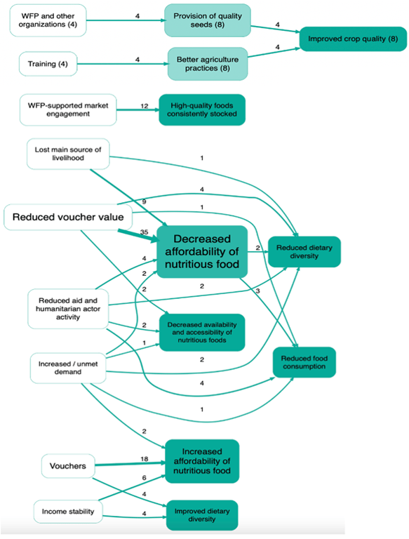

2024-09-26
Alexandra Priebe (WFP), interviewing Ashley Hollister and Sarang Mangi (DeftEdge)

## Summary{.banner}

Earlier this year, the World Food Programme finalized the "Thematic Evaluation of WFP's Contribution to Market Development and Food Systems in Bangladesh and South Sudan from 2018 to 2022", which used the Qualitative Impact Assessment Protocol (QuIP) for primary data collection. Alexandra Priebe sat down with members of the evaluation team, Ashley Hollister and Sarang Mangi, from DeftEdge Corp., to talk about their experience with using Causal Map.

## Using Causal Map to analyse QuIP data{.banner}

Overall, I would say using the Causal Map app to analyse the QuIP data was a positive experience. The software itself was quite intuitive and helpful in providing us with an option to visualize the causal linkages in the pathways that emerged from the qualitative data collected from different types of respondents. It was particularly useful in allowing us to visualise how different factors influence each other. The strength of the links in the map is represented by the thickness of the lines, which increases depending on how many people indicated the same cause and effect relationship. The app also has the option to display the total counts as a label, which was quite helpful.

## Learning curve{.banner}

It does have a learning curve. The application becomes more efficient and easier to use if you have the notes and database set up in a format that's compatible with uploading. It is really useful to consider this as far back as the planning stage of the evaluation and understanding how the application is going to be used and how it functions, even when you're developing the QuIP protocols and the analysis plan. Which questions do you want to ask? How are you going to code responses? Is it going to be at the individual level or at the focus group level? How are you going to record notes? All of that should be decided in the beginning because all of that has to be done with the mindset of how this will go into this application.

## The coding process{.banner}

We did face some issues with the Causal Map app itself, but to resolve them, we reached out to the support team who were very much helpful and responsive. There is a WhatsApp group, which is actually quite useful. You can see the types of questions other people are asking and they resolve them quite quickly, getting back to you within an hour or two.

You can either open the application and import your data using an Excel or Word file, then go through your notes and create the codes within the application itself. We initially piloted having all of the data in the app first and tried coding in situ. However, in any results chain, you sometimes have a situation where an effect is also a cause, or you need to use the same terminology in both cause and effect to draw multiple links. We found it difficult to go back and search for what had been previously coded under "effect" if we then wanted to use it under "cause".

In the end, we prepared the data in Excel and uploaded it into Causal Map because that allowed us to quality control and make those large changes more efficiently.

## Strengths and advantages of QuIP with Causal Map{.banner}

There are benefits and limits to QuIP as a method. A benefit is getting a more nuanced perspective on the causal factors of changes experienced and how participants perceive what caused them. The double-blind aspect is the most unique but also the most complex aspect of QuIP in terms of maintaining it in its truest form.

Causal Map provides a structured way to integrate and visualize all the findings collected through QuIP. It allows you to see all the linkages or set parameters for, say, the top 15 strongest linkages. The app offers features like filtering data based on specific criteria and merging similar codes.

However, from a methodological perspective, the causal maps generated in Causal Map are not as scientifically robust as maps that might be created using more quantitative techniques, such as structural equation modelling (SEM). The causal maps in Causal Map are based more on the subjective perceptions and experiences of the respondents, as interpreted by the researcher.

## Advice for other evaluators{.banner}

First, be very clear on the intention of using QuIP and Causal Map and integrate this clearly into the evaluation matrix and data analysis plan. Make sure that the team has the necessary capacity, and check this in the evaluation timeframe.

Another lesson learned is that having fewer, broader questions and interviewing more people would probably be more advantageous. This approach allows more time to dig into what changes are happening and why, while also simultaneously gathering enough information to have links drawn in the Causal Map.

[Check the report here](https://www.wfp.org/publications/evaluation-wfp-contribution-market-systems-south-sudan-and-bangladesh-2018-2022)
[See more details here](https://www.conftool.pro/ees2024/index.php?page=browseSessions&form_session=579&mode=table)

<!-- xrefs-v1 -->

## Related

- [[000 Some Case Studies ((case-studies))|chapter intro]]
