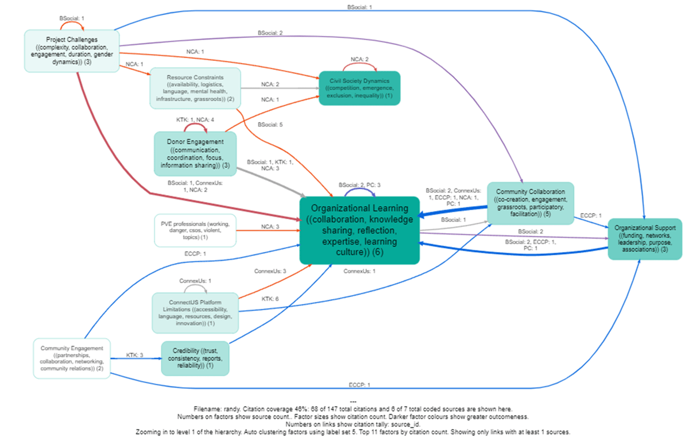

2023-03-10
## Summary{.banner}

Causal Map was commissioned in March 2024 to analyse excerpts from thematic summaries made for each of 7 case studies about conditions that foster and hinder group learning in an international development setting, focusing on INGOs.

<!-- xrefs-v1 -->

## Related

- [[000 Some Case Studies ((case-studies))|chapter intro]]
