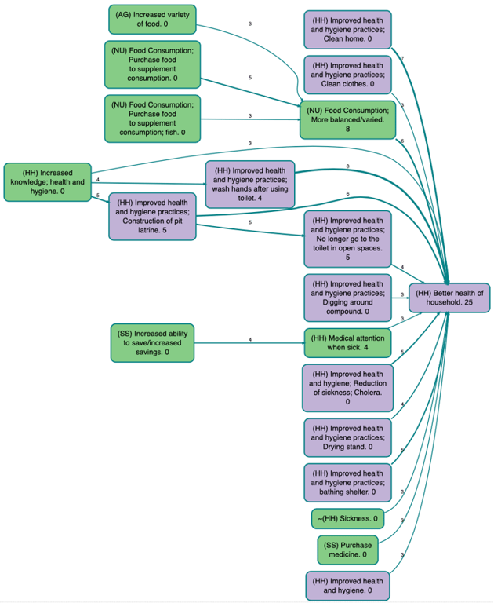
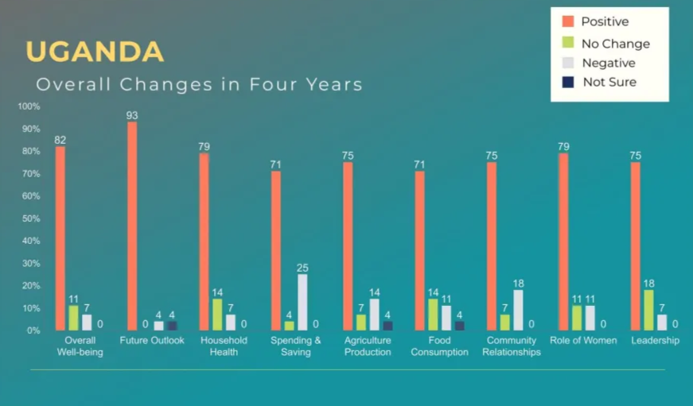
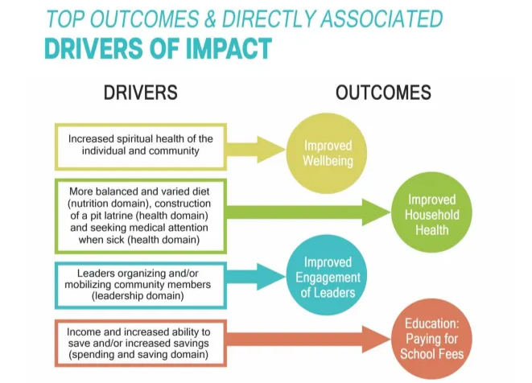

2025-05-09

## Summary{.banner}

--- start-multi-column: wcColumns
```column-settings  
number of columns: 2  
```

**Background:** World Concern, a non-profit serving neglected communities in Africa, Asia, and Haiti, used qualitative causal mapping to evaluate their One Village Transformed (OVT) initiative. OVT uses a holistic strategy that evaluates the physical and spiritual needs of communities while also recognising and building on their unique strengths, available resources, and core values.

--- end-column ---

**Findings:** By applying QuIP methodology and causal mapping to data from Uganda and South Sudan, they uncovered the pathways of change, key drivers, and outcomes shaping community transformation. The findings have shaped the way OVT and other programs are designed and implemented.

--- end-multi-column

## The partner{.banner}

World Concern engaged Edessa Research Consultants (ERC) to design and carry out a Qualitative Impact Protocol (QuIP) study in Uganda and South Sudan.

## The Causal Map solution{.banner}

Causal Map was used to analyse the data collected with QuIP and causal maps for each source and region were generated, including the top 20 most cited causal links, the most frequent drivers and outcomes and domain-specific maps.



The [Bath SDR](https://bathsdr.org/) and Causal Map teams advise caution when using percentages with small sample sizes, like in this study. In situations like this, we prefer to use simple response numbers in charts instead. We also recommend keeping individual interviews and focus groups separate in aggregate maps to prevent ambiguity regarding the significance of each source.



## Results{.banner}

Causal maps were used to identify pathways of change, drivers and outcomes, both positive and negative.



In a blog post written by EIG Insights and World Concern to [Bath SDR](https://bathsdr.org/), the researchers mentioned that the findings of this study have shaped the way OVT and other programs are designed and implemented, seeking to address gaps that were identified while also building on what was shown to be working well.

[Check the summarised version of the report here](https://worldconcern.org/assets/docs/wc_2022-23-report.pdf)
[See a detailed blog post about the study](https://bathsdr.org/using-quip-to-evaluate-a-holistic-community-development-program/)

<!-- xrefs-v1 -->

## Related

- [[000 Some Case Studies ((case-studies))|chapter intro]]
