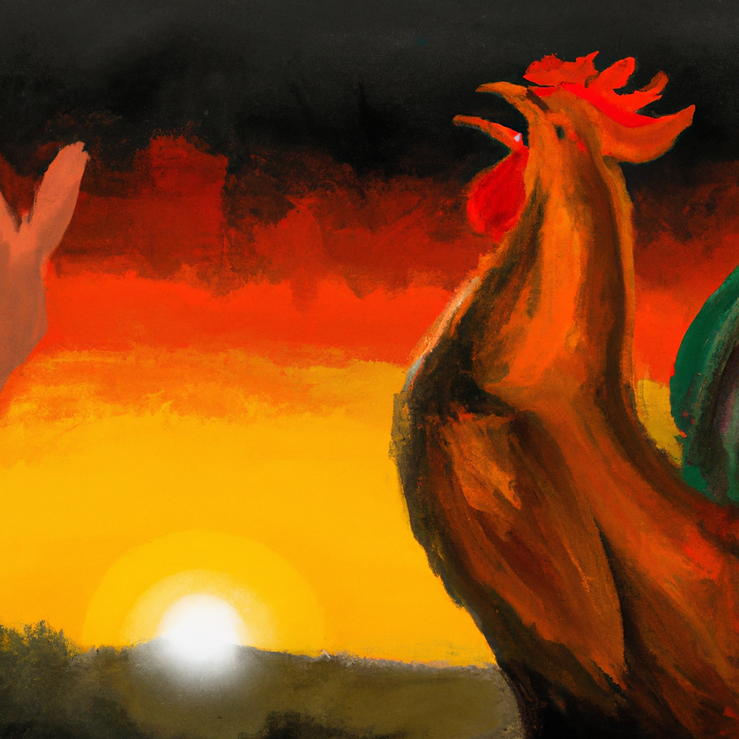
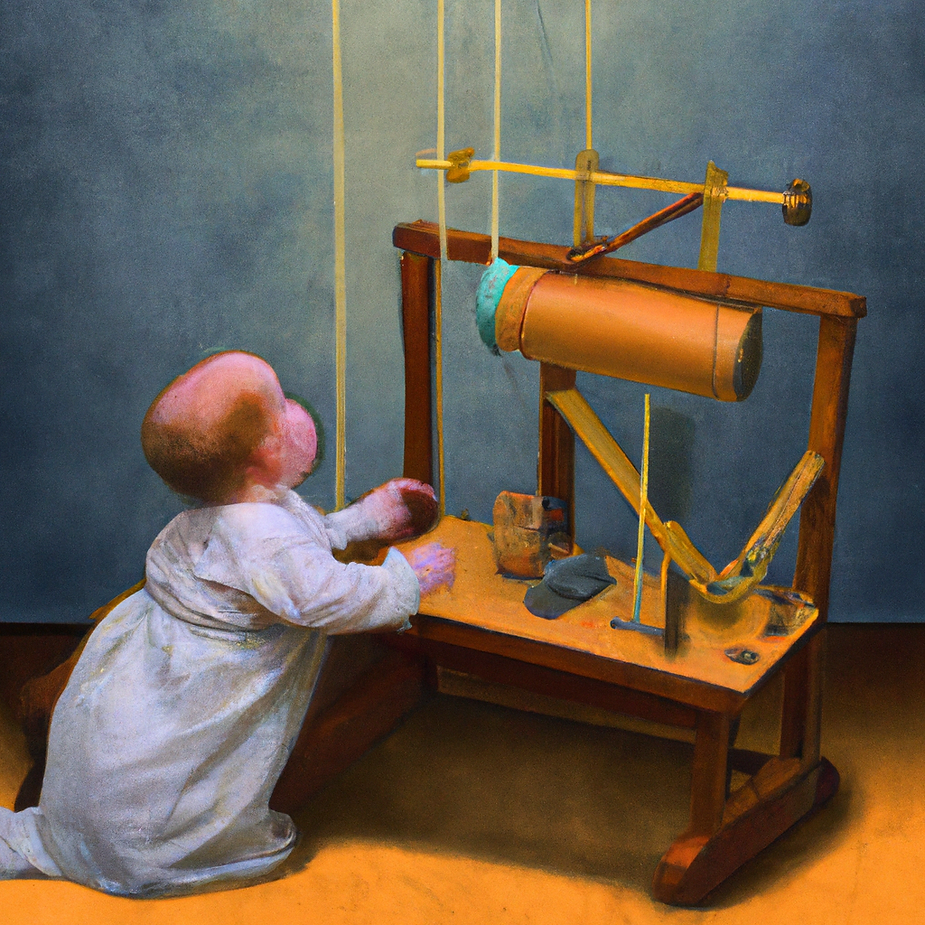
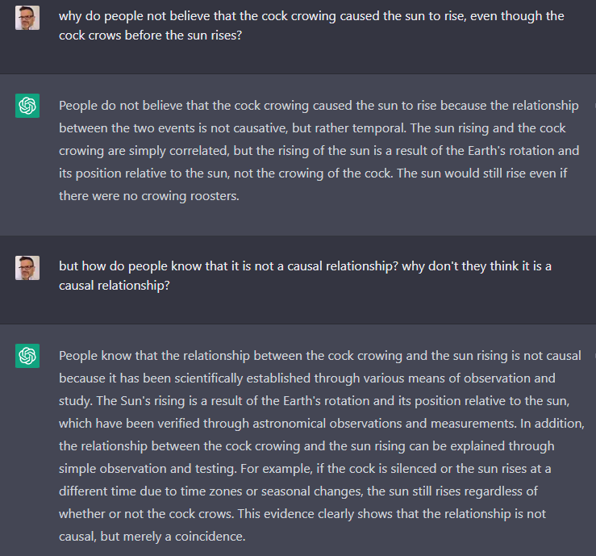
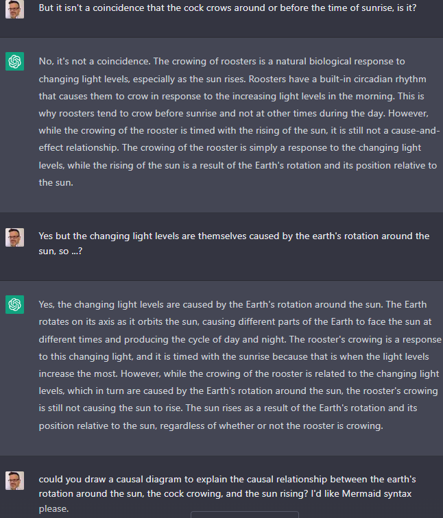
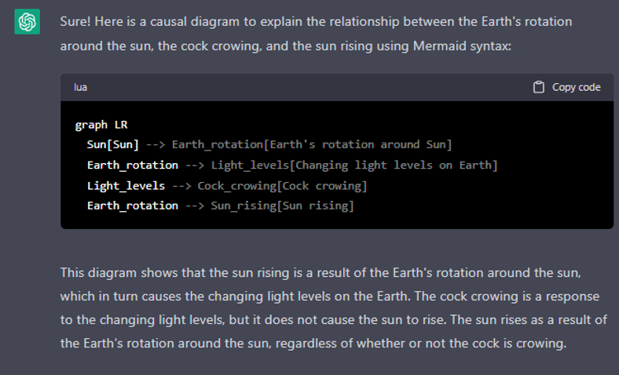
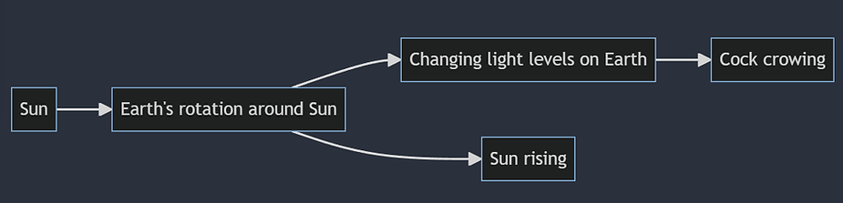

We can thank [Judea Pearl](http://bayes.cs.ucla.edu/WHY/) for promoting the insight that if you want to thrive in this world, you have to understand causality natively. We humans make causal connections [from an early age](http://bayes.cs.ucla.edu/WHY/jmde-why-review2018.pdf). We wouldn't survive long if we didn't.

ChatGPT has been a hit recently for several reasons, but one of them is (like other recent, related models like [davinci](https://platform.openai.com/playground/p/zUf68zBlohJfvPL5c80p7fsq?model=davinci)) it is much [better](https://github.com/amit-sharma/chatgpt-causality-pairs) than previous models at understanding causal connections within text.

Our understanding of the world is drenched with causal understanding: information and hypotheses about how things work (mostly accurate enough, sometimes not). It's really hard for us to *not* think causally: the concept of correlation is much harder to understand than the concept of causation.

openai.Image.create(prompt="painting in the style of Vermeer of a baby doing a physics experiment with pulleys and springs")

So, all the stuff we write on the internet (which is what ChatGPT sucks in to understand the world) is similarly drenched with causal claims. And ChatGPT is now really good at understanding this information.

That means you can ask it to extract the causal links within documents and interviews -- a process we call "causal QDA". It's pretty good at it. This ability is going to make causal mapping much easier and cheaper and therefore of renewed interest for evaluators, amongst others.

At Causal Map we're hard at work harnessing this ability to help automate, or semi-automate, the process of extracting causal maps from medium and large quantities of text data in a useful way. Watch this space!

So, ChatGPT is good at extracting causal information, but does it also have explicit knowledge about causation (meta-cognition) and can it explain it? Here's a chat I had this morning.

ChatGPT can't actually draw yet but it knows a range of syntaxes for drawing graphs. So when you paste the code into [Mermaid Live](https://mermaid.live/edit#pako:eNp1kLGOwjAQRH9ltc018AMprgE6qqOMUbSKTWyR2Giz5nRC_DtrByQorrA0M3qza_uGfbIOGxyYLh72PyYCHHJs9Rxhvf6GHbH4jpOQhBTbar9meAVAnHK0pXMs3U-8TtiHwUs3uqsb53bjKQ4hDjCWFJYUlKzFOuKdrwM2qT93Padf7bXFwNP8t1Ev03GYC64SFqkwrnByPFGw-uJbKRsU7yZnsFFpic8GTbwrly-WxO1skMTYCGe3QsqSDn-xf_mF2QbSz5uwOdE4u_sDPEt3zg), it looks like this. Not bad for a robot. (Not sure you could say the sun causes the earth's rotation, though.)

<!-- xrefs-v1 -->

## Related

- [[000 Intro ((wider-world-intro))|chapter intro]]
