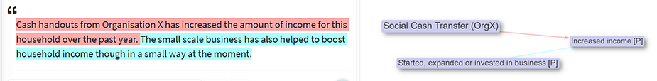
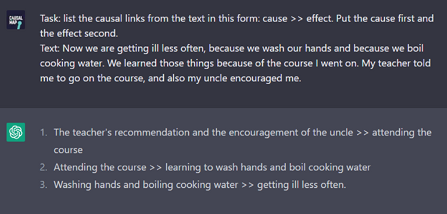

**Causal mapping** – the process of identifying and synthesising causal claims within documents – **is about to become much more accessible to evaluators**. At Causal Map Ltd, we use causal mapping to solve evaluation problems, for example to create “empirical theories of change” or to trace evidence of the impact of inputs on outcomes.

The first part of causal mapping has involved human analysts doing “causal QDA”: reading interviews and reports in depth and highlighting sections where causal claims are made. This can be a rewarding but very time-consuming process.

**Natural Language Processing (NLP) models like ChatGPT (1) can now do causal mapping pretty well**, causally coding documents in seconds rather than days. And they are going to get much better in the coming months.

**👄More voices:** It is now possible to identify causal claims within dozens of documents or hundreds of interviews or thousands of questionnaire answers. We can involve far more stakeholders in key evaluation questions about what impacts what; and it is possible to work in several natural languages simultaneously.

**🔁More reproducibility:** To be clear: humans are still the best at causal coding, in particular at picking up on nuance and half-completed thoughts in texts. But NLP is good at reliably recognising explicit information in a way which is less subject to interpretation.

**🍒More bites at the cherry:** With NLP we can also do things that were practically impossible before, like saying “that’s great but let’s now recode the entire dataset using a different codebook, say from a gender perspective”.

**❓Solving more evaluation questions:** we hope to be able to more systematically compare causal datasets across time and between subgroups (region, gender, etc).

**🤯New challenges**

We’re hard at work addressing the new challenges which NLP is bringing to causal coding:

- Processing **many large documents** simultaneously.
- Using existing pre-coded datasets to **train models** which are specialised for causal coding and/or for specific subject areas.
- Developing a **common grammar** for causal coding, building on our existing work. For example, what to do when some claims are about an *increase* in income and others are about a *decrease* in income?
- **Optimising the prompts** we give to the NLP models (this is not only a technical challenge but also has a substantive element: we have to explain to the machine *in ordinary language* what we actually mean by a causal claim or a causal link).
- **Grouping, labelling and aggregating** similar causal factors.
- After examining a coded dataset and further developing the "causal codebook", telling the NLP to completely recode the same dataset with the **new codebook** – something which has been prohibitively time-consuming up to now.
- Developing **human/NLP workflows**. For example, a human codes a sample of the text and tells the NLP to “continue like this”.
- **Monitoring bias** against specific groups and guarding against possible blind spots in identifying causal information.

**What we already offer at Causal Map**

We have developed a [grammar and vocabulary for causal mapping](https://guide.causalmap.app/), and a [set of open-source algorithms](https://github.com/stevepowell99/CausalMapFunctions) for processing and visualising causal map databases. We help evaluators do things like this:

- **Trace the evidence** for different causal pathways from one or more interventions to one or more outcomes. How many individual sources mentioned one or more of these paths?
- Consolidate causal factors into a **causal hierarchy**
- **Examine and display differences** between causal maps for different groups or different time points

**We see a lot of potential (as well as risks and pitfalls) in leveraging this functionality to help evaluators get more out of data which is currently more difficult to analyse - and we’d interested in sharing ideas and collaborating with others interested in exploring where we go next.**

- **--**

(1) Actually we use the related model GPT3 via its API, as ChatGPT does not yet have its own API.

<!-- xrefs-v1 -->

## Related

- [[000 Intro ((wider-world-intro))|chapter intro]]
