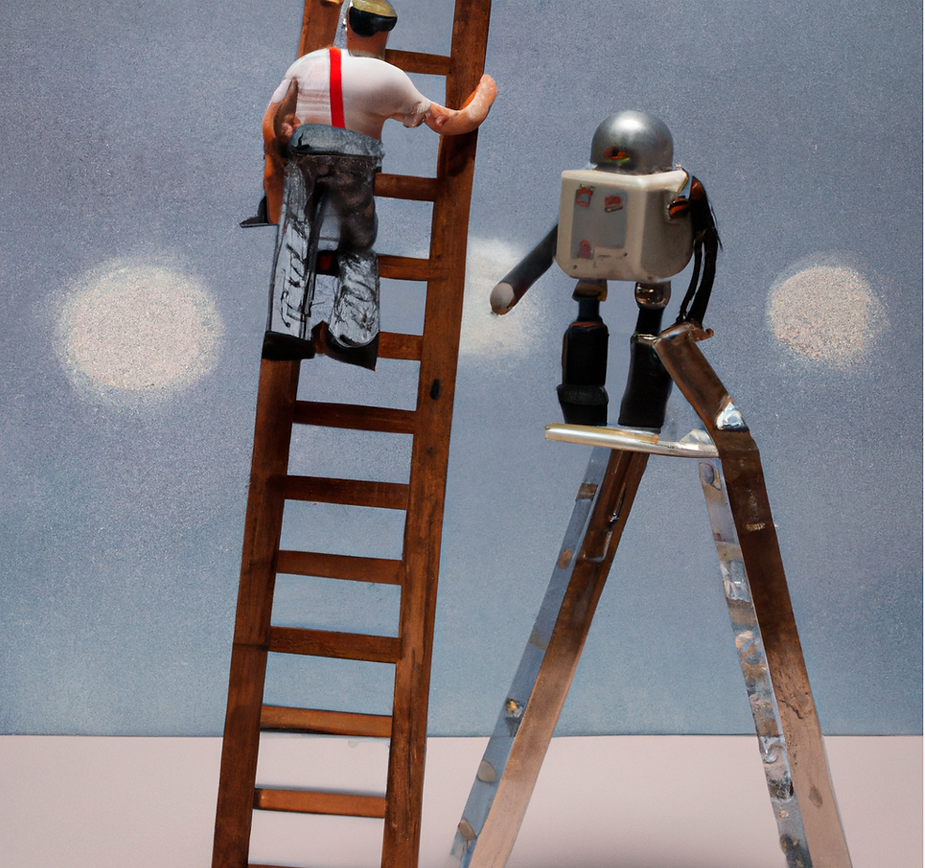
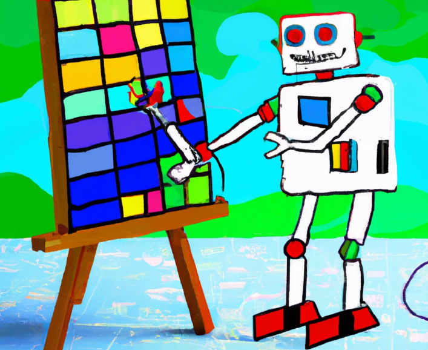

🏭 When machines replaced much manual labour, white-collar workers thought "I'm ok, my job is much harder to mechanise".

🖥 And then when computers came for clerical jobs, university-educated white-collar workers thought "I'm ok, my job is much harder to automate. I'm not just applying a template, my job is just harder, it requires actual intelligence".

🤖 Then came Large Language Models like GPT, and suddenly it turns out that large parts of many tasks which have needed university-level education are actually just the application of a template. Or applying a template to choose between templates, and then combining the results of the application of templates. And the same probably goes for large parts of entertainment and the arts. This is what Stephen Wolfram argues in this [really interesting post](https://writings.stephenwolfram.com/2023/02/what-is-chatgpt-doing-and-why-does-it-work/?utm_source=pocket_saves), and I think he's probably right. **ChatGPT has shaken up our hierarchy of what tasks count as hard.**

If you don't agree as an evaluator that a lot of your job is just the application of high-level and lower-level templates, you might at least agree that this is true of writing those accursed proposals we sweat over so much.

Maybe the stuff we thought of as hard in evaluation, like selecting and applying a "method", suddenly looks easier. Whereas the stuff which has been neglected, like establishing a rapport, knowing which question to ask and when, or reading an undercurrent, does not look very much easier.

Most importantly, whatever happens, it's still someone's job to say "I declare that this is the right kind of method to apply in this situation and I believe it has been applied in the right way and I vouch for these findings and these evaluative conclusions ... and just as I'd have had previously to vouch for the work done by an intern, I'm now going to vouch for the work done by some algorithms, and the selection of those algorithms".

What do you think? How hard is evaluation really?

<!-- xrefs-v1 -->

## Related

- [[000 Intro ((wider-world-intro))|chapter intro]]
