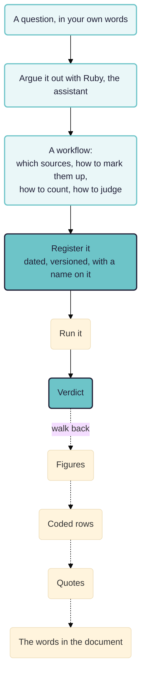

Rubicon is an experiment in making AI-assisted evaluation checkable. You state a question, argue out a workflow with an assistant before any analysis runs, register it, and only then let it read the documents. The agreement is the product, and every number it reports leads back to a passage somebody can read.

> **Work in progress.** Rubicon is an experimental wing of the Causal Map code base and the working name may not survive. The pages in this chapter are drafts, published early so people can argue with them. Nothing described here has been run on a real evaluation.

## The problem it is built for

The reader of an ordinary evaluation report cannot see four things: which passages were counted and which were passed over; what rule set the threshold at "more than half"; whether that rule was written before or after somebody knew how the numbers fell; and whether a second coder would have marked the same passages.

AI makes that worse, because a model reads a thousand pages overnight and nobody can check its working. Used well it raises the quality of work on narrative material more cheaply than anything before. Used badly it produces junk just as fast, and on the page the two look alike: both fluent, both quoting a few passages that fit. The difference falls on whoever acts on the report.

AI also makes it fixable, because a machine that reads can be made to show every step.

The walk back is the test. If it breaks anywhere, nothing else about the run counts.

## Five things it holds to

- **The standard is registered before the evidence is read**, with a version, a date and a named person.
- **Every claim points at a quote.** Verdict to figures, figure to rows, row to quote, quote to the span in the source. A quote the machine cannot find in the document is thrown away rather than stored.
- **The evaluative method is written out**, usually as a rubric. The machine runs it and a person checks it.
- **A method can be tested before it meets real material**, on synthetic texts with known verdicts, some good and some bad.
- **The assistant builds a workflow out of general parts** rather than picking a named method off a menu.

We claim no determinism and no full reproducibility. AI coding varies between runs, and machine agreement with human coders is well short of perfect. What survives is auditability: a reader who disagrees can find out exactly where.

## Iteration, and the people in it

Registering a standard in advance sounds like a machine that runs once and hands down a verdict. That is not the intention and would not be much use.

Real evaluation iterates. The question turns out not to fit the material, an unexpected distinction forces a new coding column, a first pass comes back obviously wrong. And real evaluation has other people in it: the ones who know the setting and can say which distinctions will not survive contact with it, the ones being described who should get to say whether the description is right, and the group who read the results together and decide what they mean.

Both belong here, and we are trying to mark the places they go rather than leave them to chance: agreeing the question, checking the coding instruction before it runs, reading the first pass and fixing it, substantiation and member checking, sense-making on the results, and overriding a verdict.

**This is in tension with registration and we do not pretend otherwise.** Iterating means changing the standard after seeing something, and registration exists to stop exactly that. The reconciliation is that registration records the *ordering* rather than commanding fixity. Every version is dated and never rewritten, and every run records which version was in force, so a reader can see whether a threshold moved before or after the numbers arrived and judge it accordingly.

So the rule is narrow: revise as often as the work needs, and never revise a version in place. What registration forbids is not change but silent change. A method whose theory is meant to move, as realist evaluation's is, uses the same machinery to show every move that process tracing uses to show that nothing moved.

Marking those points in a workflow is not built yet. The engine can stop at a named step and pick up from it, so the mechanism half exists; nothing yet says "a person is meant to look here".

## Where else to look

- **[The Rubicon site](https://rubicon.causalmap.app)** is the short version of the argument, for somebody meeting it for the first time. Not live yet.
- **[Rubicon in the Causal Map app](https://dev--causal-map.netlify.app/rubicon.html)**, on the development deployment. It shares the app's login and reads a Causal Map project's documents. Being a development build, expect it to change under you and occasionally to break.
- **[The Causal Map app](https://app.causalmap.app)** itself, which is where the projects Rubicon reads actually live.

## Where the detail is

- [[005 Rubicon principles ((rubicon-principles))]] is the long version: what it does, the words it uses, what it refuses, and where it sits in the literature.
- [[010 Testing rival theories ((theory-fit))|Testing rival theories over a corpus]] takes several published theories and asks which a body of interviews actually supports, borrowing process tracing's diagnostic tests.
- [[020 Realist mechanisms ((realist-mechanisms))|Generating realist mechanisms]] is the mirror: start with a corpus and no theory, and try to generate mechanisms that are powerful, plausible and not obvious.
- [[030 Contribution analysis ((contribution))]] starts from the theory of change the programme already wrote down, and asks what the evidence does to each link of it.
- [[040 Outcome harvesting ((outcome-harvesting))]] asks which of the questions commissioners put to a harvest a machine should touch at all, and argues that most of the method belongs to people.
- [[045 A draft outcomes table ((outcomes-table))]] is its small companion: the workflow that drafts an outcomes table from interview narratives for a workshop to argue with, and what such a draft leaves out.
- [[050 Theory-based evaluation ((theory-based))]] steps back to the family the other papers belong to, and reports the first run to produce a theory of change with the evidence hung on it.

Three of them compose. The realist paper generates candidate explanations, the theory-fit paper tests them on material that played no part in producing them, and the contribution analysis paper does the same job for a theory somebody has already committed to in writing. The outcome harvesting paper sits apart from that chain and asks a different question: given a method that is mostly a conversation between people, which two steps in the middle should a machine touch at all.

## How this relates to causal mapping

Rubicon is not causal mapping and does not replace it. Its projects are Causal Map projects, so it reads the same documents and the same map, and it answers a different kind of question.

- Causal mapping builds one model of what people say causes what. See [[005 Minimalist coding for causal mapping ((minimalist))]] for the coding style and [[203 Task 3 -- Analysing data, Answering questions ((task3-analysing))]] for what you do with the result.
- Rubicon answers one stated question at a time, with a standard fixed in advance. A project holds as many codings as it has questions.
- The two meet on evidence. [[902 Quality assurance at each step of the causal coding workflow ((quality-assurance))]] sets out how we check causal coding, and [[705 Ways to causal inference ((ways-to-inference))]] places process tracing and its neighbours among the other routes to a causal claim.
- [[900 A simple measure of the goodness of fit of a causal theory to a text corpus ((goodness-of-fit))]] measures fit a different way, by asking how much of a coded map a theory's own vocabulary can express. Coverage rewards breadth; the diagnostic tests reward discrimination. Running both and reporting where they disagree is more informative than either alone.
- [[0133 Causal mapping differs from related approaches - epistemic, less predictive, unsophisticated, many links, many sources, unclear boundaries ((differs-from-related))]] explains why causal mapping takes many links from many sources where process tracing takes few links very seriously. Rubicon is an attempt to get some of the second at the scale of the first.

## Whose work this builds on

Nothing here is invented from nothing, and the debts are worth naming.

- **Process tracing.** The four evidence tests are Van Evera's, restated by David Collier. Derek Beach and Rasmus Brun Pedersen supply the account of a mechanism as entities engaging in activities, and the within-case discipline the corpus work has to depart from. Tasha Fairfield and Andrew Charman argue that confirmation is a matter of degree rather than of type, which is the warrant for treating a test result as graded.
- **Bayesian process tracing in evaluation.** Barbara Befani and John Mayne combined process tracing with contribution analysis; Barbara Befani and Gavin Stedman-Bryce named the result Contribution Tracing. Their method asks an analyst to estimate how likely evidence would be if the hypothesis were false, and our theory-fit paper argues that quantity could be measured on synthetic material instead of elicited. That is either a useful shortcut or a category error.
- **Taking process tracing past one case.** Derek Beach, Gabriela Camacho and Markus Siewert's Comparative Process Tracing is the nearest existing work to what we are attempting.
- **Realist evaluation.** Ray Pawson and Nick Tilley for the framework, Nick Emmel and colleagues and Sonia Dalkin and colleagues for the resource-plus-reasoning reading of a mechanism, and Robert Merton behind the requirement that a configuration instantiate something more general.
- **Contribution analysis** is John Mayne's, and **outcome harvesting** Ricardo Wilson-Grau's. **Qualitative comparative analysis** is Charles Ragin's. **Evaluative rubrics** are E. Jane Davidson's, Julian King's and Judy Oakden's, and Julian King's objection that AI should not be making evaluative judgements about human affairs is one we accept: nothing inside a scale makes it evaluative, so the standard has to come first, from somebody who put their name to it.
- **Quality of evidence rubrics** are Thomas Aston and Marina Apgar's.

**We would like to work with people on this.** If any of the above is your field and the argument looks wrong, or looks right and worth building on, we would rather hear it now than after we have published a result. Steve Powell, Causal Map Ltd, Bath.

## Where it has got to

The engine runs. The workflows in these papers validate against it. No study described in this chapter has produced a result, the literature searches behind them are incomplete in places we have marked, and several things the design assumes are recorded as gaps rather than smoothed over. That is the state, and publishing it early is the point.
