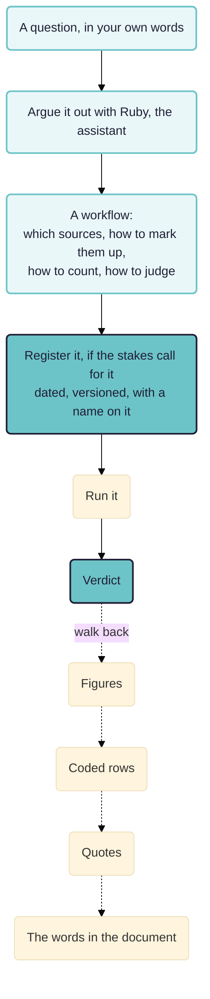

Rubicon is an experimental app from Causal Map Ltd for evaluators who use AI on interviews and reports. You break an evaluation question into steps somebody else could check (which documents to read, what to mark, how to count, and what standard turns a count into a verdict), argue them out with an assistant before any analysis runs, and every figure it reports leads back to a passage somebody can read.

What Rubicon is, how a piece of work goes and how it compares with other tools are on [rubicon.causalmap.app](https://rubicon.causalmap.app). The case for an open reporting format, from which anyone can rebuild an analysis and run it again, is on its [open format page](https://rubicon.causalmap.app/open-format). What is too long for that site is here: the principles in full, a survey of existing standards, and working papers that put Rubicon to particular evaluation methods, some with runs to report.

> **Work in progress.** Rubicon is in beta and has not yet been used on a live evaluation. The papers here are drafts, published early so people can argue with them.

The walk back is the test. If it breaks anywhere, nothing else about the run counts.

## In this chapter

- [[005 Rubicon principles ((rubicon-principles))]]: the principles Rubicon works to, in full. Who declares what counts as good, why every claim points at a quote, what a finding is compared against, what to say about what was not read, and what it refuses.
- [[007 Is there already a standard qq ((rubicon-standards))|Is there already a standard?]]: what we found when we looked for an existing standard for AI text analysis in evaluation.
- [[008 Theory-based evaluation ((theory-based))]]: what commissioners want when they ask for a theory-based evaluation, and a run that hangs the evidence on each link of a theory of change.
- [[030 Contribution analysis ((contribution))]]: a programme's own theory of change put link by link to a select committee's evidence, with a blind check of what the write-up got wrong.
- [[010 Testing rival theories ((theory-fit))|Testing rival theories over a corpus]]: five published explanations of loneliness, and a design for asking which of them fifty interviews support.
- [[020 Realist mechanisms ((realist-mechanisms))|Generating realist mechanisms]]: generating mechanisms from a corpus, with a control for the ones anybody could have written without it.
- [[040 Outcome harvesting ((outcome-harvesting))]]: which parts of an outcome harvest a machine should touch at all, and a draft outcomes table for a workshop to argue with.

The method papers fit together. The realist paper generates candidate explanations, the theory-fit paper tests rival ones on material that played no part in producing them, and the contribution analysis paper does the same job for a theory somebody has already committed to in writing. Theory-based evaluation is the family all three belong to. Outcome harvesting sits apart, because most of that method is a conversation between people.

## How this relates to causal mapping

Rubicon is not causal mapping and does not replace it. How the two products relate is in the [Rubicon FAQ](https://rubicon.causalmap.app/faq). How the two methods relate is below.

- Causal mapping builds one model of what people say causes what. See [[005 Minimalist coding for causal mapping ((minimalist))]] for the coding style and [[203 Task 3 -- Analysing data, Answering questions ((task3-analysing))]] for what you do with the result.
- Rubicon answers one stated question at a time, with a standard fixed in advance. A project holds as many codings as it has questions.
- The two meet on evidence. [[902 Quality assurance at each step of the causal coding workflow ((quality-assurance))]] sets out how we check causal coding, and [[705 Ways to causal inference ((ways-to-inference))]] places process tracing and its neighbours among the other routes to a causal claim.
- [[900 A simple measure of the goodness of fit of a causal theory to a text corpus ((goodness-of-fit))]] measures fit a different way, by asking how much of a coded map a theory's own vocabulary can express. Coverage rewards breadth; the diagnostic tests in the theory-fit paper reward discrimination. Running both and reporting where they disagree is more informative than either alone.
- [[0133 Causal mapping differs from related approaches - epistemic, less predictive, unsophisticated, many links, many sources, unclear boundaries ((differs-from-related))]] explains why causal mapping takes many links from many sources where process tracing takes few links very seriously. Rubicon is an attempt to get some of the second at the scale of the first.

## Whose work this builds on

- **Process tracing.** The four evidence tests are Van Evera's, restated by David Collier. Derek Beach and Rasmus Brun Pedersen supply the account of a mechanism as entities engaging in activities, and the within-case discipline the corpus work has to depart from. Tasha Fairfield and Andrew Charman argue that confirmation is a matter of degree rather than of type, which is the warrant for treating a test result as graded.
- **Bayesian process tracing in evaluation.** Barbara Befani and John Mayne combined process tracing with contribution analysis; Barbara Befani and Gavin Stedman-Bryce named the result Contribution Tracing. Their method asks an analyst to estimate how likely evidence would be if the hypothesis were false, and our theory-fit paper argues that quantity could be measured on synthetic material instead of elicited. That is either a useful shortcut or a category error.
- **Taking process tracing past one case.** Derek Beach, Gabriela Camacho and Markus Siewert's Comparative Process Tracing is the nearest existing work to what we are attempting.
- **Realist evaluation.** Ray Pawson and Nick Tilley for the framework, Nick Emmel and colleagues and Sonia Dalkin and colleagues for the resource-plus-reasoning reading of a mechanism, and Robert Merton behind the requirement that a configuration instantiate something more general.
- **Contribution analysis** is John Mayne's, and **outcome harvesting** Ricardo Wilson-Grau's. **Qualitative comparative analysis** is Charles Ragin's. **Evaluative rubrics** are E. Jane Davidson's, Julian King's and Judy Oakden's, and Julian King's objection that AI should not be making evaluative judgements about human affairs is one we accept: nothing inside a scale makes it evaluative, so the standard has to come first, from somebody who put their name to it.
- **Quality of evidence rubrics** are Thomas Aston and Marina Apgar's.

**We would like to work with people on this.** If any of the above is your field and the argument looks wrong, or looks right and worth building on, we would rather hear it now than after we have published a result. Steve Powell, Causal Map Ltd, Bath: hello@causalmap.app.
