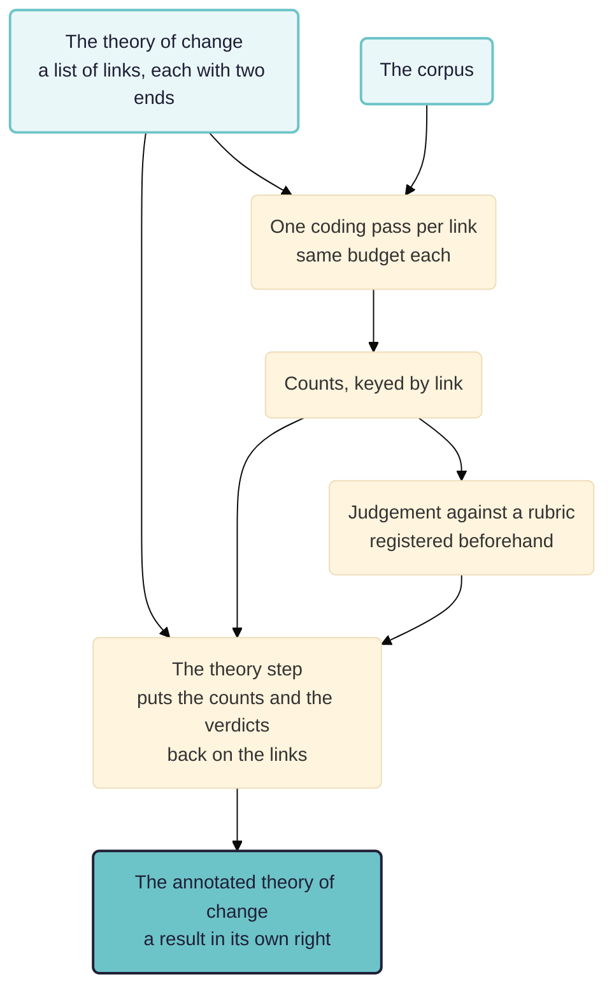

The family the other method papers belong to. Contribution analysis, realist evaluation and process tracing all state a theory in advance and then put it to the material. Commissioners ask for that in general terms far more often than they ask for any one of them by name. This paper is about what comes back at the end, and it reports a run.

> **Work in progress.** Rubicon's theory-of-change step has run on the app's own example project, and not yet on an evaluation. Every figure below is from that run. Comments welcome.

## In short

An evaluator who wrote a theory of change as a diagram wants the answer back as one.

- **Theory-based evaluation is the family and the papers here are its members.** [[030 Contribution analysis ((contribution))]] starts from the theory the programme committed to. [[020 Realist mechanisms ((realist-mechanisms))]] generates one where nobody has written it yet. [[010 Testing rival theories ((theory-fit))]] adjudicates between several. All three do the same thing first: write the theory down, then read.
- **Testing a theory produces a table, and a table is not the theory.** One coding pass per link comes back as counts keyed by link, without the branch structure the evaluator drew in the first place.
- **A `theory` step puts the links back in their places.** It invents nothing: the structure comes from the list of links the workflow declares, the numbers from the counting step and the verdicts from the judging step.
- **The run.** Eight links, nineteen household interviews, 590 coded passages, and two branches of the theory converging on wellbeing, which the table could not show.
- **What it does not do.** There is no held-out half here and no synthetic contrast set, and a per-link verdict appears only where a rubric criterion was named after a link.

See also: [[000 Rubicon ((rubicon))]]; [[005 Rubicon principles ((rubicon-principles))]]; [[900 A simple measure of the goodness of fit of a causal theory to a text corpus ((goodness-of-fit))]].

**Intended audience:** evaluators who have been asked for a theory-based evaluation without being told which one, who have a theory of change and a pile of documents, and who must show the result to the people who drew the theory.

## What commissioners are asking for when they ask for this

Terms of reference say "theory-based" far more often than they say "contribution analysis" or "realist evaluation", and usually without saying which. That vagueness is not carelessness. What the commissioner wants is the family resemblance rather than any member's apparatus. There is a theory about how this was supposed to work. Somebody wrote it down. The question is what the evidence does to it.

Three of the members are in this chapter. They differ in where the theory comes from.

- **Somebody already committed to it in writing.** That is contribution analysis. The theory of change is the programme's own. Arguing with it is part of the job.
- **Nobody has written it yet.** That is realist evaluation's retroduction. The theory has to be generated from the material before anything can be put to it.
- **Several people have written rival ones.** That is the process tracing case. The job is adjudication rather than confirmation.

What they share is the ordering, and the ordering is the whole of the discipline. The theory is fixed, dated and named before the reading starts, so a reader can tell a proposition that survived contact with the evidence from one written afterwards to fit it. The machinery for making that ordering visible is the same whichever member is being run, which is why Rubicon's assistant builds a workflow out of general parts instead of picking a named method off a menu.

They share a deliverable too. The product is not a verdict. It is the theory of change with what the evidence said hung on each link of it, so a programme manager can see which parts of their own account the material bears out and which parts it never touched.

## The table and the diagram are not the same result

Put eight propositions to nineteen documents and the result arrives as a table: one row per link, with how many passages bore on it, how many supported it, how many contradicted it. That is the truthful form of the finding. It is the wrong form for the person who has to read it.

An evaluator wrote the theory as a diagram. A programme committed to it as a diagram. The workshop that argues about the result will argue in front of a diagram. A table keyed by link cannot show that two branches converge, that one arm of the theory rests on a great deal of material while the other rests on almost none, or that a whole limb went unexamined. Those are findings about the theory rather than about any of its links, and they only exist once the links are back in their places.

So what was missing is not a picture of the same information. It is information the table never held.

The theory of change goes in twice: once to say what to look for, once to say where to put what was found.

## What the step does, and what it refuses

Asked to test a theory of change, Rubicon's assistant writes each link with a `from` and a `to` beside its proposition, so the graph is already in the workflow. The `theory` step reads that list, the counts and any verdicts, and files the assembled graph as a result of its own. It calls no model and cites nothing of its own. Every number on it came from a result it was handed, so the walk from a link to the passages behind it is the walk that already existed: link to figure, figure to coded row, row to quote, quote to the words in the document. The list of links is written once, in the workflow, so the copy that gets drawn is the copy that was coded.

It refuses three drawings that would be wrong in a way the reader cannot see.

- **A link with one end missing.** A theory of change is a graph, and an arrow pointing nowhere is not a weaker version of an arrow.
- **A list of links that does not exist**, or a step that did not test one link per pass.
- **A theory with nothing hung on it.** Given neither a table nor a judgement, what would be drawn is the workflow read back rather than a result.

The distinction it works hardest to keep is between absent and nought. A figure that never covered a link is not a link the material ignored, so an uncounted link is stored as empty, with a flag saying which of the two it is. That distinction is the first casualty of any drawing, and an evaluator cannot recover it from anywhere else.

The drawing then has to keep three findings apart: supported, contradicted, and addressed by nobody. Why the third matters, and why it usually means unexamined rather than unsupported, is set out in [[030 Contribution analysis ((contribution))|the contribution analysis paper]]. A diagram that shows a faint arrow and a contradicted arrow alike loses it without anybody noticing, because both look like bad news and they are opposite findings. A fourth reading, "counted, not judged", marks a link the run counted under a figure name the drawing does not recognise: the drawing may say it cannot tell what the material concluded, and it may not say nobody looked.

## The run

The workflow was run on 6 September 2026 against the app's own example project: nineteen household interview transcripts, anonymised, from two provinces. The theory of change runs from training through farming and health knowledge to wellbeing, in eight links.

The coding went over all eight links in all nineteen documents and produced **590 coded passages**, each quoting a passage that was then located in its document: 588 matched exactly and two matched with a gap. All nineteen documents are quoted somewhere in the result. The coding cost $4.05; the run reported here reused it and cost nothing.

Per link, the count of supporting passages runs from 56 on each of the two training links to 100 on "better health practices lead to improved family health". The two health links are the best evidenced of the eight, at 94 and 100 against 73 for the next highest. All eight links were counted and none came back empty.

The graph the step assembled has eight factors and eight annotated links, and **two branches converge on wellbeing**: one through better nutrition, one through improved family health. That convergence is what a table keyed by link could never show, and it changes how the result should be read, because a weak link in one branch is not fatal where the other reaches the same outcome.

The judgement is one verdict for the whole theory, fully supported, against a rubric with a single criterion: that all eight links have at least two supporting sources. 572 supporting passages clear that without effort, so the verdict is close to uninformative. What does the work here is the annotation, link by link, with the rubric a coarse gate in front of it.

Two cautions from the run, which generalise.

- **A figure's name can misdescribe it.** The per-link figure was called `supporting-sources-count` and counted passages rather than sources: its eight values sum to 572 over a corpus of nineteen documents. The arithmetic is right and the name is wrong. Whoever writes the workflow names the figures, and an annotated diagram puts that name next to the arrow it describes, which is the likeliest place anybody will notice.
- **A drawing can report a negative it never earned.** The first version of the drawing decided a link's colour by looking for four particular figure names. This workflow used none of them, so every count read as zero and the diagram drew all eight links as addressed by nobody, over 572 supporting passages. Saying nobody looked at a link the run counted is worse than saying nothing, because a programme manager would act on it. A counted link is now held as addressed whatever its figures are called.

## What this does not do

- **There is no held-out half here and no synthetic contrast set.** A theory was put to a corpus and the result reported. Nothing establishes that the same machinery would have found a different answer had the theory been wrong.
- **A per-link verdict only appears where a rubric criterion was named after a link**, which is the only correspondence the record holds. Here the rubric had one criterion covering the whole theory, so every link's colour comes from the counts alone.
- **The counts are of passages rather than of people or documents**, unless a workflow says otherwise.
- **Nothing here judges worth.** A theory of change every link of which is well evidenced can still be a theory about something not worth doing. That is a judgement for a rubric somebody registered and put their name to.
- **One run, on an example project.** No evaluation has used this.

## Next steps

- Run it on a real theory of change, with a rubric whose criteria are named after the links, so the per-link verdicts appear and the annotation says what was judged rather than only what was counted.
- Put a contradicted link and an unaddressed link into the same run on purpose, so the three findings are seen apart rather than asserted to be.
- Put the whole-outcome rival pass from [[030 Contribution analysis ((contribution))]] on the same picture. A theory whose every link is supported is still consistent with the programme having contributed nothing.
