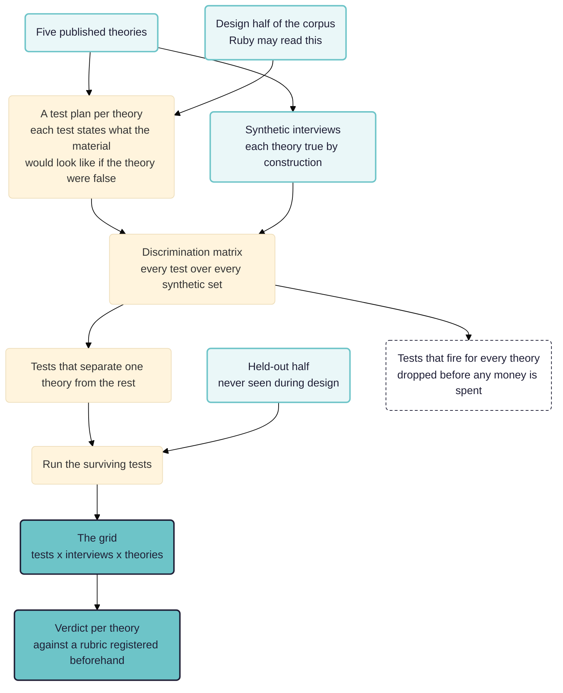

> **Work in progress.** A design sketch rather than a finished study. Nothing here has been run: the workflows are written and validated against the engine, and no result is reported because there is none yet. Parts of the literature search are still owed and are marked where they bite. Comments welcome.

A sketch for a study. Take a corpus of interviews and several published theories that claim to explain the phenomena in the interviews. Have Ruby, the assistant in Rubicon, write a fit test for each theory before she has read the material, run every test over every interview, and see which theory the material actually supports. The method leans a little on process tracing.

Note this is not a causal mapping study.

See also: [[020 Realist mechanisms ((realist-mechanisms))|Generating realist mechanisms]], the sibling paper, which starts with no theory and generates mechanisms where this one tests theories somebody else published; [[000 Working Papers ((working-papers))]]; [[900 A simple measure of the goodness of fit of a causal theory to a text corpus ((goodness-of-fit))]]; [[902 Quality assurance at each step of the causal coding workflow ((quality-assurance))]]; [[986 Causal mapping of loneliness interviews ((lonely-causal2))]].

**Intended audience:** evaluators and applied researchers who want to know whether a theory of change, a programme logic or a published explanation is borne out by narrative evidence, or vice versa, with the test written down before anybody sees how it comes out.

**Contribution.** Split into what may be new to the field and what is merely how this study is built, because the two get confused and only the first is worth defending.

Possibly new, on the evidence of the search reported below:

- **Measuring a test's discriminating power in text**, by generating synthetic interviews in which each theory is true by construction and reading the resulting matrix. The idea that these probabilities should be produced rather than elicited is not ours: Befani, Elsenbroich and Badham put simulated probabilities forward as a third way beyond expert elicitation and empirical frequencies, in health policy, using social simulation [@befaniDiagnosticEvaluationSimulated2021]. What is left to us is the domain and the instrument. Their simulation models a system; ours generates documents, so the thing being estimated is how often a coding instruction fires on text where the theory is false. Whether that is a real extension or a restatement in another medium is the first question to put to them.
- **Aggregating a test result across a corpus by counting.** The nearest existing work, Comparative Process Tracing, scales past the single case by checking each further case for the presence or absence of one key signature, then aggregating by eliminating or bounding scope conditions rather than by counting how many cases showed it [@beachGoingBeyondSingle2022]. Counting appears to be unoccupied, with the qualification that this is measured against one preprint rather than against the whole field.
- **Sorting each part of each theory by whether it expects a respondent to be able to report it**, and writing that part's tests at the level it predicts.

Not new, and stated here only because the study depends on them:

- **Registering the tests before the material is read.** Ordinary pre-registration, already what Rubicon's versioned rubric does, and already published practice in evaluation as Contribution Tracing [@befaniProcessTracingBayesian2017].
- **Treating a hoop result as a matter of degree rather than a gate.** Fairfield and Charman got there first, and on stronger grounds: inside a Bayesian framework, confirmation is always a matter of degree rather than of type [@fairfieldExplicitBayesianAnalysis2017]. What is left to us is the aggregation, not the softening.
- **Holding out half the corpus.** Ordinary held-out validation, borrowed from prediction.
- **The four evidence tests**, which are Van Evera's, restated by Collier, and used here unchanged [@collierUnderstandingProcessTracing2011].



The two halves of the corpus are the point. Ruby reads the design half while writing the tests and never sees the held-out half, so the verdict is computed on material that played no part in producing the instrument.

## The question

Suppose you have fifty interviews with young people about loneliness, and five published accounts of why young people are lonely. Each account is respectable, each has adherents, and we prefer theories which can be stated in a paragraph. Which one does the material support?

The obvious approach is to hand the corpus and the five paragraphs to a model and ask. That produces the thing Rubicon exists to replace: a fluent answer, no stated standard, a few well-chosen quotations, and no way for a reader to disagree with any particular part of it. Worse, a model asked "which of these fits?" might report that all of them fit, because every one of these theories might be compatible with almost anything a lonely person might say.

So the work is to turn "does this theory fit?" into a set of questions that could come out either way, written down before the material is read, with a rule fixed in advance for how their answers combine into a verdict.

## Why an evaluator should care

The same problem, wearing evaluation clothes, is: **is the theory of change borne out?**

Not the logframe version, with forty nodes and a hundred arrows, where nobody could test it and nobody tries. The version that matters is the one or two central mechanisms the programme rests on, stated at the level where a part of the mechanism could fail on its own. Three worked examples, each carrying the clause that makes it testable:

- A cash transfer paid to the woman rather than to the household head changes **who is in the room when a spending decision is made**, and it is the change in who is present that shifts her say, rather than the extra money. The rival is that the money alone does it, in which case paying either partner would work as well.
- Putting researchers and civil servants in a room produces **a relationship that outlives the meeting**, and it is the relationship that gets evidence used later, rather than the evidence having become better or more accessible. The rival is that the convening improves the product, in which case a good report posted to the same people would do the same work.
- A community space reduces isolation because it gives people **a reason to be there other than wanting company**, so a tie can form without anybody having to declare they were lonely. The rival is that what matters is the hours and the location, in which case any open room in the right place would serve.

Each of those is a proposition. Each could be false. Each names what the material would show if the rival were right instead, which is the part a theory of change almost never writes down.

Evaluators have to choose a method. Contribution analysis builds a contribution story and asks whether it holds up [@mayneMakingCausalClaims2012]. Process tracing weighs individual pieces of evidence by how much work they do [@collierUnderstandingProcessTracing2011; @befaniProcessTracingBayesian2017]. Both were designed around a small number of cases and a great deal of analyst time. Whether either has a worked account of fifty transcripts is a question for the literature rather than an assumption, and the section on process tracing beyond the single case reports what the search found.

The loneliness study is a rehearsal on material where the theories are published, the stakes are nil and nobody is paying us to reach a particular answer.

## What Ruby already knows

Rubicon's knowledge base carries five pages on process tracing: the method itself, how to decompose a mechanism into parts that can each fail, the evidence tests, thirteen failure modes, and how the whole thing maps onto Rubicon's step types. It also carries the argument this paper depends on, which is worth quoting because it is the reason process tracing is the method Rubicon serves best:

> Process tracing rests on one methodological claim: the predictions were fixed before the search, so the evidence could have come out the other way. Published work almost never demonstrates that claim. A reader sees a register and has no way to know when it was written, whether predictions were tightened after a first pass, or which ones were dropped when nothing turned up.

Rubicon's rubric is a register of exactly that kind: named, versioned, immutable, dated, with every run recording which version was in force. A judgement carries a field, `standard_fixed_before_the_evidence`, comparing the rubric's freeze time against the run's start. So the pre-registration half of this study needs nothing built.

Four gaps in that mapping bite this study, three of them hard.

- **A negative finding is hard to store, and this method is built on them.** A failed hoop test is the most informative result process tracing produces. `note` and `judge` write a search record when there is no quotable evidence, carrying what was looked for, where, and how much was read. Whether that is enough to carry a corpus-wide negative is the first thing this study will find out.
- **Nothing checks that we looked as hard for the rival as for our own theory.** This is the gap most likely to decide the study without anybody noticing, so it is worth spelling out.

    A test only counts for anything because the evidence would have been unlikely if the theory were false. That "if it were false" is always shorthand for "if one of the rivals were true instead". So the strength of every test in the register is set by how well the rivals were searched for, and not by anything about the theory being tested.

    Now suppose the searches are uneven. The hypervigilance tests get a careful instruction, worked examples and three passes; the political economy tests get one thin instruction written late in the afternoon. Hypervigilance then wins, and it wins on every criterion at once, because each of its tests looks unique against a rival nobody went looking for. Nothing in the output shows this. The quotes are real, the proportions are correct, the walk back to the source works. The finding is an artefact of attention, and it is invisible in exactly the form a reader would inspect.

    Rubicon can already see part of the problem. `align` takes two codings of the same text and reports whether they ran with the same chunk size, the same segment quota and the same coverage, so a comparison of two instructions can say whether the effort behind them matched. What does not exist is the same check across a fan-out of twenty tests, which is how this study is arranged. So for now symmetric effort is enforced by construction, by giving every prong an identical budget over identical text, and it is asserted by nothing. That is a real hole and this study should either close it or report having run with it open.
- **The workflow cannot say what a unit is.** Our corpus has fifty files from forty-eight people, because two participants have their second interview in a separate file, so every proportion in this study has a base of fifty rather than forty-eight unless something says otherwise. The storage half exists: units and their members are many-to-many, two sources can sit under one unit, and a column records which rule put them there. What is missing is any way to say it in a workflow. The rule has to be written into the database by hand, which means the YAML does not carry it, the run does not record it, and a rubric registered against a base of forty-eight is registered against a claim the workflow never made. So this study either merges the two files before it starts, or states the unit rule outside the trail it is meant to demonstrate.

The fourth recorded gap, that nothing marks two pieces of evidence as non-independent, matters less here and more in the single-case work the method came from.

## The material

The corpus is the one behind our earlier loneliness papers: fifty interview files from forty-eight participants aged 18 to 24, recruited to a quota across four of London's most deprived boroughs, interviewed in the summer of 2019 [@fardghassemiQualitativeOutputData2022]. Interviews average about nine thousand words. Sex, age and borough are in the filenames, so units can be stratified. The corpus is coded in the app as `lonely-in-london`, with 3,393 causal links, and Rubicon reads a project's map alongside its documents.

Two features of the corpus bear on the design.

- **The interviews predate the pandemic and predate TikTok's rise.** Any account that turns on a recent change in platform use is being asked about a period before the change it names. That does not disqualify it, but a test written for it must not rely on material the corpus cannot contain.
- **The interview opened with a free-association task about "the experience of loneliness".** That framing may supply respondents with the vocabulary of shortfall and comparison. A theory predicting that people describe loneliness as a gap between the wanted and the achieved is then partly predicting the interview schedule. A test has to be written so that the schedule's own words do not count as evidence.

## Five theories

Five, chosen so that they come from different traditions, make different predictions, and are not restatements of one another. Each is stated here in roughly the paragraph Ruby would receive.

Two of the five carry sources and a verdict on where they stand. The discrepancy, political economy and displacement accounts do not, and their citations are still to be supplied. Those three also carry the worst date problem, since the corpus is from 2019 and much of the argument about phones and loneliness happened afterwards.

**The hypervigilance loop.** Loneliness is an aversive signal, like hunger, that evolved to push a social animal back towards the group. Where it persists it turns on itself: the lonely person becomes watchful for social threat, reads ambiguous behaviour as rejection, and pulls back or guards themselves in ways that produce the coolness they feared. The mechanism is a loop inside the person rather than a shortage of people.

Cacioppo and Hawkley put it as an evolved signal, "an aversive signal that evolved to motivate one to take action", alongside physical pain (2009, *Trends in Cognitive Sciences* 13(10): 447-454). The review-form statement is Hawkley and Cacioppo (2010, *Annals of Behavioral Medicine* 40(2): 218-227), which spells out the loop: perceived isolation "sets off implicit hypervigilance for (additional) social threat", unconscious surveillance produces cognitive biases, and negative expectations "tend to elicit behaviors from others that confirm the lonely persons' expectations". The book-length statement is Cacioppo and Patrick (2008).

*Standing: the theory is mainstream, the hypervigilance limb is contested.* Spithoven, Bijttebier and Goossens (2017, *Clinical Psychology Review* 58: 97-114) conclude that lonely people show "an increased attention for social threatening stimuli", but it is a narrative review that pools no effect size, and no meta-analysis was found. The best-matched test is Bangee and colleagues (2014, *Personality and Individual Differences* 63: 16-23), eye-tracking 85 UK undergraduates aged 17 to 19, almost our corpus's age band. They found the effect was quadratic rather than dose-response, confined to the top quartile of loneliness, present only in the first two seconds, and absent across the extended viewing period after that. Later work qualifies it further, and postdates the fieldwork.

**Two loneliness, not one.** Emotional loneliness follows the absence of a particular attachment figure and is not relieved by company. Social loneliness follows the absence of a network and is not relieved by intimacy. Neither substitutes for the other, so a person surrounded by friends can be desolate, and a person with one close tie can still be adrift.

Weiss (1973, *Loneliness: The Experience of Emotional and Social Isolation*, MIT Press) is the source, drawing on Bowlby. The standard operationalisation is de Jong Gierveld and Van Tilburg's six-item scale (2006, *Research on Aging* 28(5): 582-598), which defines the pair as "missing an intimate relationship (emotional loneliness) or missing a wider social network (social loneliness)".

*Standing: partially supported, and its dimensionality is open.* The classic test, Russell and colleagues (1984, *Journal of Personality and Social Psychology* 46(6): 1313-1321), found the two forms distinguishable as subjective experiences while sharing "a common core of experiences", supported Weiss on their determinants, and found the predicted differences in consequences only partly. Since then van Tilburg (2021, *The Gerontologist* 61(7): e335-e344), a co-author of the scale, recovered five factors rather than two on data using it. So a study treating the distinction as settled would be overstating it.

**The discrepancy is with the expected.** Loneliness is the gap between the social life someone wants and the one they have, so the amount of contact predicts nothing on its own. What has changed is the standard: the comparison class is everyone's edited evening rather than the street.

**Loneliness is manufactured.** Loneliness is not a private failure but a product of how social life is organised: hours that make regular company impossible, rents that force people away from everyone they know, the closure of the places people used to meet for nothing, and platforms that sell connection back as a product.

**Displacement.** Mediated interaction takes the time and attention co-present interaction used to have, and the substitute does not do the same work. The rival within the same tradition is stimulation, which holds that online interaction augments existing friendship rather than replacing it.

The fourth of these carries a complication the others do not, and it is worth stating before the method rather than after.

## Some theories do not expect to be avowed

A test that asks whether respondents describe a mechanism assumes the mechanism is the sort of thing a respondent could describe. The five accounts differ on this as a matter of doctrine rather than by accident, so before writing any test, sort each part of each theory into one of three levels.

1. **Avowable.** The respondent is aware of the mechanism and can put it into words. The test may ask more or less directly, and a passage where they say it counts.
2. **Not avowed, still traceable.** The respondent cannot report the mechanism, and it leaves marks anyway: in what they mention in passing, in what they treat as unremarkable background, in the order they put things, in what they do not think needs explaining. The test reads those marks and must never require the speaker to have made the connection.
3. **Out of reach of this instrument.** No interview of this kind could evidence it, whatever the respondent says. A test written at this level measures only whether the speaker has met the theory. It should be declared out of scope rather than asked badly.

Where the five sit:

- **Attachment** is level 1 throughout. People do say that they have plenty of friends and still miss one particular person. An interview is close to the ideal instrument for it, which is an advantage the theory earns from the method rather than from the world.
- **Discrepancy** is level 1, and carries the extra risk that the interview schedule hands respondents its vocabulary. Its tests have to exclude the free-association task's own words.
- **Hypervigilance** is level 1 for the reading, level 2 for the loop, and level 3 for the mechanism as its own literature measures it. People can report having read a silence as rejection. They cannot report the loop, because the loop is what makes the reading feel like perception rather than interpretation. And the attentional bias itself, as Bangee and colleagues measure it, is an orienting effect in the first two seconds of looking at an image, in the top quartile of loneliness, gone by the time viewing continues. Nothing anybody says in an interview can evidence a two-second eye movement. So a test asking respondents to describe their own vigilance is testing a folk rendering of the theory rather than the theory, and the paper has to say which of the two it is examining. This one finding did more to change the design than anything else in the search, and it was found by asking after a theory's current standing rather than after its statement.
- **Political economy** is level 2 by doctrine. Its own claim is that the arrangement is invisible from inside it and that a structural condition is experienced as a personal failing, so a hoop test requiring respondents to name material constraint as a cause is rigged against the theory predicting they will not. Its tests read traces instead: shift patterns, rent, commuting, moving for work, the absence of anywhere free to sit, all present as background circumstance and not joined up by the speaker. Harder to write and easier to check, because the thing looked for is concrete. Parts of it are level 3, and should be marked so: whether platforms extract sociality as unpaid labour is not a question a 2019 interview about loneliness can answer.
- **Displacement** is level 1 for the substitution and level 3 for the causal claim. Respondents describe the swap readily. Whether the swap caused the loneliness is precisely what they are not in a position to know, so a test asking them is measuring folk theory. What can be tested at level 2 is whether the loneliness in an account tracks a change in device use rather than a change in circumstances.

The general rule: **for each theory, state the level of each part before writing its tests, and write each test at the level its part sits on.** A method ignoring this will find that the theories most flattering to introspection fit best, which is a finding about interviews rather than about loneliness. It also gives the study an obligation it would otherwise dodge: to say plainly which parts of which theories this corpus was never going to reach, before seeing which way the results fell.

## What process tracing offers, and what a corpus changes

Beach and Pedersen sort evidence on two properties, and Ruby's knowledge base states them this way.

> **Certainty.** How sure we are the evidence would be found if the hypothesis is true. High certainty means the mechanism could hardly have run without leaving this.
>
> **Uniqueness.** How unlikely the evidence would be if the hypothesis is false. High uniqueness means the rivals struggle to account for it.

Low uniqueness with low certainty gives a straw in the wind. High uniqueness with low certainty gives a smoking gun. High certainty with low uniqueness gives a hoop test. Both high gives a doubly decisive test, which is rare, and rarer still in interview material.

One naming collision has to be settled before any of this reaches a coding instruction. Rubicon's workflows can already use a column called `certainty` for how sure the *speaker* sounds that what they describe happened, on a scale of speculative, reported and evidenced. That is not Beach and Pedersen's certainty, which is a property of a test rather than of a speaker. This paper keeps the house column and calls the process-tracing pair **expectedness** and **uniqueness**, and any workflow built from it should do the same.

What makes any of these a test rather than a search is uniqueness, the part about what you would expect if the hypothesis were false. That is where the whole discriminating power sits, and it is the part that gets dropped when a method is described informally. A test whose evidence is as likely under every rival account tells you nothing however often it fires.

Two things change when the tests run over fifty accounts rather than one case.

- **A hoop test becomes a proportion rather than a gate.** In a single-case study, evidence that must be present and is not present eliminates the hypothesis. In interview material, absence means the thing did not come up in a conversation of about an hour, which is weak evidence that it does not exist. One interview failing a hoop test is noise. Nineteen of twenty failing it is a finding. So a hoop test's result is the share of units where it fires, and the threshold that matters is written into the rubric in advance.
- **Equifinality stops being a caveat and becomes the expected result.** Fifty people are not one case with fifty pieces of evidence. Different accounts may be right about different people, and the useful output is a table showing which holds where. Where a theory fits twelve accounts strongly and thirty-eight not at all, "it came second" would misdescribe a real result.

## Where this sits in the process tracing literature

The sources here are secure for the process tracing canon and for the question of taking it past one case. The section on AI methods is thinner than it should be, and three of the five loneliness theories are still stated from memory.

**The four tests are Van Evera's, and Collier is the exposition everyone cites.** Collier restates them on two axes, whether passing is necessary and whether it is sufficient for affirming the hypothesis [@collierUnderstandingProcessTracing2011]. His hoop cell reads: "Passing: Affirms relevance of hypothesis, but does not confirm it. Failing: Eliminates hypothesis." That is the gate this paper departs from. Collier himself calls the typology a useful heuristic that "should not be taken rigidly", so the departure is smaller than it first looks.

**The gate has already been challenged, and not by us.** Fairfield and Charman regard the four named tests as unnecessary inside a Bayesian framework, on the grounds that "evidentiary confirmation is always a matter of degree, not type", and that discrete pass or fail tests stay close in spirit to frequentist thinking [@fairfieldExplicitBayesianAnalysis2017]. They would have us evaluate likelihoods under named rivals directly. So the warrant for treating a hoop result as graded rather than eliminating is published, and this paper should cite it rather than claim it. The field is split: Bennett, Collier, Mahoney and the applied evaluation side keep the typology, and we keep it too, because the four names are a usable interface for an evaluator even where the underlying quantity is continuous.

Two of their requirements bear directly on our design, and one of them we currently fail.

- **Rivals must be concrete and specified in advance**, rather than a hypothesis against its own negation, because the probability of the evidence under "not H" cannot be assessed when "not H" is an ill-defined amalgam. Our five named theories satisfy that. What we do not satisfy is their further requirement that the set be mutually exclusive: the discrepancy account is arguably a mechanism inside the hypervigilance account, so a passage can support both. Either the paper reports the overlap and drops the language of a winner, which is the course taken here, or it reduces the five to a set of distinguishing propositions that genuinely exclude one another. That choice should be made before the run and not after.
- **Testimonial evidence should be written as "source S stated X", not as X**, because the reliability of a source cannot be judged in the absolute. That is a rule about interviews and it turns out to be the handle for our absence problem: on this formulation a silence in an interview is a fact about the interview rather than about the world, which is precisely why a failed hoop test over one transcript proves so little. Fairfield and Charman do not develop the point, and they do not say anything about combining such likelihoods across fifty transcripts. That gap is where this paper sits.

**The move from eliciting probabilities to producing them has already been made, by the same author.** Befani, Elsenbroich and Badham propose simulated probabilities for exactly this problem, saying that as policy makers ask for more rigorous assessments of evidence strength the estimation of the probabilities becomes the difficulty, and offering simulation "as an alternative to empirical frequencies or subjective elicitation techniques" [@befaniDiagnosticEvaluationSimulated2021]. Their application is health policy and their machinery is social simulation, both co-authors being agent-based modellers.

So this paper's synthetic contrast sets are a text-domain instance of an argument already in the literature, rather than a new argument. The difference worth defending is what gets simulated. An agent-based model simulates the system the evidence comes from; generating interviews simulates the evidence itself, which is the only route available when the thing being coded is what somebody said. Whether that difference earns a paper is a fair question and one we would rather have put to us early.

There is also a standing critique of the whole apparatus worth reading alongside it. Zaks argues that Bayesian process tracing as practised "introduces more bias than it corrects for on numerous dimensions", auditing four claims its proponents make, among them that it forces full engagement with rival explanations (Zaks 2021, *Political Analysis* 29(1): 58-74). We have read the abstract rather than the article, so we say only that the verdict is negative and that the rival-explanations claim is one of the four. Reading the design here as a repair of that particular promise is our reading and not his.

**Bayesian process tracing in evaluation is established practice, not a new idea.** Befani and Mayne combined it with contribution analysis on the grounds that both rest on generative causality and read evidence probabilistically [@befaniProcessTracingContribution2014], and Befani and Stedman-Bryce named the resulting method Contribution Tracing [@befaniProcessTracingBayesian2017]. Their stated benefits include reducing confirmation bias and giving data collection more predictability, achieved by writing down what evidence would count before going to look for it. Wadeson, Monzani and Aston report the same ordering across six evaluations. Our design borrows that ordering and changes it in one respect worth naming: their pre-specification comes before data collection, ours comes before reading a corpus that already exists and that we have published on three times. Those are not the same protection, and the paper should not pretend otherwise.

**On scaling past the single case, the nearest neighbour is Comparative Process Tracing** [@beachGoingBeyondSingle2022]. Beach, Camacho and Siewert argue that the usual route to generalisation, inferring from one traced case to similar ones, wrongly assumes that homogeneity at the level of cause and outcome implies homogeneity at the level of process. Their answer is an extensive phase of "process tracing light", in which each further case is checked only for whether a key empirical signature from a critical phase is present or absent.

That is structurally close to a hoop test tallied case by case, and they stop one step short of taking it. Their aggregation eliminates or bounds scope conditions rather than counting: find a similar process and the difference between cases can be eliminated, find a different one and it bounds the cases into homogeneous subsets. A full-text search of the paper does not turn up hoop, smoking gun, straw in the wind, frequency or percentage, and the single instance of "proportion" refers to electoral systems. So counting across cases appears to be unoccupied ground, with two qualifications: this is a conference preprint rather than a peer-reviewed article, and our verification could not run an independent survey of the whole literature, so the absence is established against this paper rather than against the field.

Their design also contains the objection to ours. They select cases for diversity rather than sampling them, so a proportion over their cases would mean nothing. A proportion is only worth computing over a base that stands for something, which is the one thing our corpus has going for it: forty-eight participants recruited to a quota across four boroughs, rather than a set chosen to be different from one another.

**The question underneath all of this, and the paper's real exposure:** is a corpus of fifty interviews fifty cases, or one case with fifty sources of evidence? Nothing in the literature settles it. If they are fifty cases, the within-case constraint is engaged and a proportion is the right statistic. If it is one case, the proportion is a description of the evidence base rather than a finding about the world, and Fairfield and Charman's rule about restarting when a new hypothesis appears bites much harder. The study should answer this in writing before it runs, and the likeliest answer is that loneliness is fifty cases while a programme evaluation with fifty stakeholder interviews is one, which would mean the method transfers to evaluation less directly than the opening of this paper implies.

## What is known about letting a model do the coding

The design rests on a model finding, in a transcript, the evidence a test asks for. A second search on 5 September went looking for what is known about that. The results are worse for this design than we expected, in ways worth writing down before the study rather than after.

**Agreement on codebook-driven coding can be decent and does not transfer.** Dunivin (2024, arXiv 2401.15170) found GPT-4 at Cohen's kappa of 0.6 or better on eight of nine socio-historical codes, where GPT-3.5 on identical prompts managed a mean of 0.34. Balt and colleagues (2025, *Frontiers in Public Health* 13:1512537) got 0.84 mean accuracy and kappa 0.68 from an offline Llama 3 70B against consensus human coding of 2,666 segments from 38 interviews. Xiao and colleagues (IUI '23 Companion, arXiv 2304.10548) got kappa 0.61 on a binary dimension and 0.38 on a four-category one, where their human experts agreed at 0.88 and 0.90 on the same data. A scoping review of 75 studies reports agreement anywhere from 36 to 99 per cent (Kempny and colleagues, *BMC Medical Research Methodology* 26:137, 2026). So kappa in the 0.6 to 0.8 band is reachable on a well-specified codebook, is not guaranteed, and cannot be borrowed from somebody else's paper.

**The failures are structured, and the structure is against us.** Two results matter more than the headline numbers.

- **Locating is much harder than classifying, and our task is locating.** Balt and colleagues report 0.84 accuracy when the model classifies a segment it is handed, and 0.67 when it has to find the matching segments in the transcript itself. Every coding step in this study is the second kind: read nine thousand words and find the passages bearing on a proposition. So 0.67 is our number, and the 0.84 that gets quoted in AI-for-qualitative-research talks is not.
- **Aggregate accuracy hides constructs the model is not measuring at all.** Pangakis, Wolken and Fasching (arXiv 2306.00176) replicated 27 annotation tasks from recent social-science articles: median accuracy 0.850, and yet nine of the 27 had precision or recall below 0.5. Chew and colleagues (RTI International, arXiv 2306.14924) found human-model agreement above 0.76 on most codes and 0.18, 0.36, 0.50 and 0.58 on four of them, where the human coders agreed with each other at 0.96, 0.93, 0.79 and 1.00 on those same four. The model failed hardest exactly where the humans found the task easiest.

For a study whose whole point is comparing five theories, that last pattern is the danger. A theory whose evidence happens to sit in the codes a model handles badly loses, and the loss is invisible in an aggregate figure.

**Two devices from this literature go straight into the design, and we should adopt both.**

- **A test of randomness that uses no human labels.** Chew and colleagues formalise a check on the model's own output distribution, a two-sided binomial for binary codes and a chi-squared against an equal-probability multinomial for categorical ones, reasoning that a model that has not grasped a construct is reduced to assigning codes at random. On their data the four codes that failed this test were exactly the four where agreement with humans later collapsed. That is a diagnostic we can run over each test's output before anybody looks at the results, and it is a natural pre-registered gate: discard a test whose output cannot be told apart from guessing. It has a known blind spot, a false negative when the true base rate sits near half, which is worth stating because a theory's prior is often near even.
- **Repeated sampling, where consistency tracks correctness.** Pangakis and colleagues classify each sample at least seven times and take the modal label; accuracy runs 19.4 percentage points higher on the samples where all runs agreed. Rubicon already reruns a coding with reuse turned off, so this costs nothing new. One caution the authors carry themselves: 85 per cent of their samples were fully consistent, so most errors sit inside the consistent group, and consistent must never be read as correct.

**Cohen's kappa is the wrong instrument here.** Chew and colleagues report Gwet's AC1 instead, because their codes are rare and kappa suffers the high-agreement, low-reliability paradox when they are. Smoking-gun evidence is rare by construction, which is what makes it a smoking gun, so any reliability figure this study reports on a sufficiency test should be AC1 or an explicit likelihood ratio, and never a kappa.

**The judge step has its own known biases.** Zheng and colleagues (NeurIPS 2023 Datasets and Benchmarks, arXiv 2306.05685) name four in LLM-as-judge: position, verbosity, self-enhancement and limited reasoning, and say themselves that they mitigate only some of them. Verbosity is the one that bites here, because a theory whose tests happen to surface longer passages could score better for that reason alone. The mitigation available to us is cheap: the judge reads figures computed by arithmetic rather than prose, wherever a criterion can be settled that way.

**Nobody can rerun our run, and the field has stopped pretending otherwise.** Three quarters of the 75 studies in the Kempny review report no model parameters at all. Chew and colleagues put the reason plainly, that generative models are stochastic and the same output cannot be reproduced later, and propose publishing prompts, model details, texts, codes and the model's own reasons instead of promising reproducibility. That is Rubicon's position already, and it is the strongest argument for the pre-registration half of this design: when the computation cannot be rerun, the auditable object is the sealed plan plus the full record of what was sent and what came back.

Two gaps to state. This search found nothing on LLMs used for process tracing, contribution analysis or theory-of-change testing specifically, so the application is unexplored rather than established. And every figure above is bound to a model vintage between GPT-3 and Llama 3, which is the same argument Dunivin's own GPT-3.5 to GPT-4 gap makes: these numbers describe the past, not the model we would run.

## Writing a test so it can fail

A test in the plan Ruby produces is a record with these fields, and the third does the work.

- **Proposition.** What the theory says should be true of this person, in a sentence. Following Beach and Pedersen, an entity doing something, so that the part can be false on its own.
- **Evidence sought.** What in an interview would show it, concretely enough that two coders would mark the same passages.
- **What the material would look like if the theory were false.** Written against each named rival rather than in the abstract. "Under the discrepancy account the same event is described as falling short of an expectation rather than as a signal about the self. Under the political economy account the event does not arise, because the obstacle is hours or fares."
- **Test type**, which follows from the field above rather than being chosen first.
- **What a failure means**, over one unit and over the corpus.

Ruby is refused a test with the third field empty. That single requirement is what stops the exercise producing five theories that all fit, because a test whose author cannot say what would count against it is a search and should be recorded as one.

This is the Bayesian requirement without the Bayesian arithmetic. The likelihood ratio that formal process tracing asks you to estimate [@befaniProcessTracingBayesian2017; @befaniLettingEvidenceSpeak2020] is the ratio of how likely the evidence is if the theory holds to how likely it is if the theory does not. We are not going to ask anybody to put a number on the denominator, because nobody could defend it. We are going to measure it.

## Measuring discrimination instead of asserting it

Rubicon already has the machinery: a `synthesise` step that generates documents to a known expected verdict and hands them on as an ordinary source set, with the rest of the workflow run over them unchanged. It refuses a document set carrying no decoy unless the author writes down why, and it refuses to default the generating model, because that model must differ from the one that judges.

The existing worked example uses four documents, and the third and fourth are the point:

1. Clearly strong.
2. Clearly weak.
3. Superficially strong, substantively empty. Warm, admiring, full of praise, describing nothing anybody did differently.
4. Superficially weak, substantively strong. Grudging, critical, badly expressed, describing real changes in detail.

Separating one from two shows very little, because any method scoring nothing but enthusiasm passes that pair. A method also placing three below four is reading evidence rather than sentiment.

For this study the same step does more. Write a synthetic interview in which one theory is true by construction, do it for each of the five, and run all the tests over all five sets. Then read the matrix.

- A test firing only against its own theory's set is discriminating, and the matrix says how strongly.
- A test firing against all five is measuring something every account of loneliness implies, and should be dropped before the real run.
- A theory whose tests fire against nothing, its own set included, has been written up in a way the method cannot reach, and the fault is in the test rather than the theory.

That matrix estimates how often the evidence appears when the theory is false, obtained by making it false and looking, rather than by asking an analyst to guess. It answers the objection that a theory fits everything, and it answers it before money is spent on the real corpus, which matters because the real run is twenty tests over each held-out interview, each interview about nine thousand words and so several chunks per test.

Two constraints carry over from the existing design and both apply with more force here. The texts must be generated from more than the tests, or a text written to satisfy a test uses the test's own vocabulary and the coder finds the words planted for it. And the decoys have to be present, which for this study means an interview in which somebody who is not lonely talks fluently about loneliness in general, and one in which somebody who is describes it badly, in few words, with no vocabulary for it.

There is a limit worth stating plainly. A synthetic interview is written by a model that has read the theory, so it contains what the theory's adherents would say, which is not what the theory predicts a real person would say. The matrix tests whether the tests tell the theories apart as written. It does not test whether the theories are true.

## How much of the material Ruby may read

Two failure modes pull in opposite directions.

- Writing the tests from the theory paragraph alone, Ruby will ask for evidence nobody would produce in an hour of conversation about their own life.
- Writing them having read the corpus, she will write to the corpus's own idioms, and every theory will pass, because she will have chosen the evidence she already knows is there.

So: split the fifty interviews in two, stratified by borough and sex, and record the split as a source column, fixed and dated before anything runs.

- Ruby reads the **design half** while writing the tests, and may revise them against it as often as she likes.
- The verdict is computed only from the **held-out half**, which nothing in the design process has seen.

That is the ordinary discipline, and it is also a small experiment worth running for its own sake. Write three test plans for the same five theories: one from the theory paragraphs alone, one from the paragraphs plus the design half, one from the paragraphs plus the whole corpus. Run all three over the held-out half. If the third plan's tests fire much more often than the first two on material none of them was allowed to see, we have measured overfitting rather than asserting it. If the first plan's tests fire almost never, we have measured the cost of designing blind. Either result tells us how to run the next study.

The theory papers themselves are handled by existing machinery: flagged as background sources, they are read in full by Ruby while the workflow is written, and no step ever codes them or counts them.

## Variants

Five theories chosen by us is a small and biased sample of the space of possible explanations, and the winner may simply be the one we stated best. So for each theory, generate three variants sharing its core commitment, differing from it in at least one prediction, and differing from all the other theories.

- Generated from the theory paragraph alone, before any interview is read, by a different model from the one writing the tests.
- Each variant must state in writing one thing it predicts that the original does not, and one thing it predicts that each of the other four theories does not. A variant unable to produce those sentences is a paraphrase, and is refused.
- The variants go through the synthetic discrimination matrix along with the originals. Twenty formulations rather than five is a stiffer test of whether the method can tell anything apart at all.

Where a variant beats its original on the held-out half, the finding is about the formulation rather than the tradition, and saying so is more useful than announcing that psychodynamics won.

## The two measures of fit, and why they can disagree

We already have a different way of asking whether a theory fits a corpus. [[900 A simple measure of the goodness of fit of a causal theory to a text corpus ((goodness-of-fit))|Coverage]] asks how much of the coded causal evidence can be expressed in a theory's own vocabulary: recode the map onto the theory's terms and count the links, citations and sources landing somewhere.

Coverage and the diagnostic tests measure different things and can come apart.

- Coverage rewards **breadth**. A theory with capacious categories covers nearly everything, which is the failure mode that started this paper.
- The diagnostic tests reward **uniqueness**. A theory can pass tests no rival passes while accounting for a small fraction of what people talk about.

A theory scoring high on both is well supported. A theory high on coverage and low on uniqueness is the one fitting everything. A theory low on coverage and high on uniqueness explains a little and explains it well, which for an evaluator is often the more useful result. So run both, and report the disagreement rather than resolving it.

One caution about the existing map. `lonely-in-london` has 3,393 links and 3,155 distinct cause labels, so nearly every link carries a unique factor and the map cannot be queried directly for a theory's terms. Coverage there needs magnetisation onto each theory's vocabulary first, which is the procedure that paper sets out.

## The workflow

One workflow per theory, all reading the same held-out sample. The fan-out is over tests rather than theories, so every test gets its own pass over the whole interview with the same budget. That is worth a note, because Rubicon's `x-versus-y` workflow makes the opposite choice: it searches both rival readings in a single pass so that neither is looked for harder than the other. With twenty tests a single pass would mean twenty columns, and a model given twenty columns finds a few and stops. The fan-out preserves symmetric effort a different way, by giving every prong an identical budget over identical text, which is checkable from the run record rather than promised.

```yaml
id: theory-fit-hypervigilance
version: 1
project: lonely-in-london
question: >
  Does the hypervigilance account fit these interviews, and does it fit them
  better than the four rival accounts?

steps:
  - id: frame
    type: sample
    spec:
      method: stratified
      n: 25
      seed: 5
      stratify_by: [s_borough, s_sex]
      where:
        s_split: held_out
      frame_description: >
        the twenty-five interviews held back from the design set, stratified by
        borough and sex, the split fixed and dated before any test was written
    outputs:
      - name: sources
        role: source_set
        type: source_set

  - id: run_tests
    type: code
    inputs: [sources]
    for_each:
      - id: reads-ambiguity-as-rejection
        theory: hypervigilance
        test_type: hoop
        proposition: >-
          the speaker reads an ambiguous social event as a signal about being unwanted
        evidence_sought: >-
          a passage where an unanswered message, an empty room or a busy friend is
          described as being about the speaker rather than about circumstance
        if_false: >-
          under the discrepancy account the same event is described as falling short
          of what they expected, and under the political economy account it does not
          arise because the obstacle named is hours or fares
      - id: withdrawal-known-to-be-self-defeating
        theory: hypervigilance
        test_type: smoking_gun
        proposition: >-
          the speaker describes pulling back from company while knowing it makes
          things worse
        evidence_sought: >-
          a passage naming a particular occasion when they declined or cut short
          contact, together with their own recognition that this deepened it
        if_false: >-
          the other four accounts predict withdrawal explained by an external
          obstacle, by a missing particular person, or by comparison, and none of
          them predicts the speaker describing the withdrawal as self-defeating
    spec:
      model: gemini-3.5-flash
      chunk_size: 3000
      min_per_segment: 1
      instruction: >
        One test, run over one interview. Twenty tests run over this interview
        with the same budget each, so do not decide first which account you believe.

        PROPOSITION: {item.proposition}

        WHAT WOULD SHOW IT: {item.evidence_sought}

        WHAT THE SAME MATERIAL WOULD LOOK LIKE IF THIS ACCOUNT WERE FALSE:
        {item.if_false}

        Mark every passage bearing on the proposition. For each, say whether it
        separates this account from the rivals just described, or whether it sits
        as comfortably with them.
      columns:
        - name: fires
          type: ordinal
          means: how far the passage supplies the evidence the test asks for
          levels:
            - name: absent
              means: >
                the passage bears on the proposition and does not supply what the
                test asked for
            - name: ambiguous
              means: >
                consistent with the proposition and equally consistent with the
                ordinary alternative
            - name: present
              means: >
                supplies what the test asked for, in particulars rather than in
                general terms
        - name: uniqueness
          type: category
          means: >
            whether this passage separates the account under test from the rivals
            named in the instruction
          values:
            - name: separates
              means: >
                fits this account and not the rivals as stated, so it would have
                been unlikely had this account been false
            - name: shared
              means: >
                fits this account and at least one rival equally well, so it
                distinguishes nothing
        - name: certainty
          type: ordinal
          means: >
            how sure the speaker sounds that what they describe actually happened,
            which is a different question from whether it supports the account
          levels:
            - name: speculative
              means: >
                the speaker is imagining, hoping or generalising: would, might,
                people tend to
            - name: reported
              means: >
                the speaker states it as something that happened, without saying
                how they know
            - name: evidenced
              means: >
                the speaker gives the particulars that show they were there: an
                occasion, a person, what was said, what followed
        - name: what_it_shows
          type: text
          means: in one sentence, what this passage shows about the proposition
    outputs:
      - name: test_results
        role: test_evidence
        type: quotes

  - id: per_test
    type: compute
    inputs:
      - {role: test_evidence}
      - sources
    spec:
      figures:
        # A hoop test's result is a share of units, not a gate. The base is the
        # units read, so an interview opened and found empty stays in it.
        share_firing:
          reduce: share
          over: {group: item}
          where:
            fires: present
            uniqueness: separates
            certainty: {at_least: reported}
        # The same tests counted without the uniqueness filter. Where these two
        # figures are far apart the test is firing on material every account
        # predicts, and the difference is the thing to report.
        share_firing_any:
          reduce: share
          over: {group: item}
          where:
            fires: present
    outputs:
      - name: test_table
        role: unit_table
        type: table

  - id: verdict
    type: judge
    execution: agentic
    inputs: [test_table, test_results]
    spec:
      rubric: theory_fit
      model: gemini-3.5-flash
      max_turns: 6
      max_cost_usd: 2.00
      quotes_shown: 60
    tools: [look]
    outputs:
      - name: theory_verdict
        role: judgement
        type: judgement
```

That workflow is not a sketch. Extracted from this page and put through `python -m rubicon.cli plan` it validates, and its four steps resolve in order, sample then code then compute then judge, exactly as the repo's own fan-out workflow does. What that proves is narrow and worth having: the design can run. It says nothing about whether the answers would be any good.

The rubric is a separate file, registered by name and version before the run, so the judgement can record that the standard predates the evidence. Five criteria, four settled by arithmetic over the figures above and one that cannot be.

- **Hoop survival.** In what share of the held-out units do the theory's hoop tests fire? Thresholds stated in advance.
- **Smoking gun.** Is there at least one unit where a uniqueness test fires with evidenced certainty and the passage separates this account from the rivals?
- **Discrimination.** What share of the firings separate rather than being shared? A theory whose tests fire often and separate rarely is reported as fitting everything, whatever it scores elsewhere.
- **Reach.** For how many units does this account do any work at all?
- **Does the material bear on it?** Judged rather than computed. Where the corpus cannot distinguish this account from a rival, the judge says so and refuses a band, because a band gets quoted and the doubt does not.

The artefact the workflow must produce, beyond the verdicts, is the grid: twenty tests by twenty-five units by five theories, every cell filled, every filled cell walking back to a marked passage. That is what an evaluator would want in front of them, and it is a step the workflow needs anyway.

## What counts as a result

Not a league table. The outputs, in order of how much we would trust them:

- **The grid**, showing which accounts do work for which people, which is the durable product.
- **The discrimination matrix from the synthetic sets**, saying how much any of the tests could have told apart, and worth having even if the real run never happens.
- **The three-arm comparison** of blind, half-sighted and fully sighted test design, which is a finding about the method rather than about loneliness and generalises to every study run this way.
- **Per-theory verdicts**, last, and hedged by the fact that the theories are not independent. A passage supporting the discrepancy account often supports the hypervigilance account too, because one is a mechanism inside the other. Report the overlap rather than netting it off.

## What this study is not doing

- **No Bayesian arithmetic.** No priors, no posterior odds, no elicited likelihoods. The concept is kept, the numbers are not, and the synthetic contrast sets stand in for the one quantity that would have mattered. Adding the arithmetic is a separate paper, and probably a better one with a co-author who has done it.
- **No claim about loneliness.** Fifty interviews from four London boroughs in 2019 support no general claim about young people. The study is about whether the method can tell theories apart.
- **Not a finished literature search.** The process tracing canon, the multi-case question and what is known about model-assisted coding are sourced. The discrepancy, political economy and displacement accounts are stated from memory and need sources, and so does the UK evidence on how lonely young adults actually are, a number the paper takes for granted and has never checked.
- **No synthetic-validation precedent found either way.** Whether anybody has generated documents in which a theory is true by construction, to measure whether a method can discriminate, is unanswered. The paper's first novelty claim rests on that ground being unoccupied, and it has not been shown to be.

## Where the people go

The design above is the most registration-heavy of the three papers, so it is the one where the room to iterate has to be marked rather than assumed.

- **Choosing the five theories** is a judgement about the field, not a technical step, and the paper argues elsewhere that having the authors choose them is a leak no split can close. This is the first place another person belongs.
- **Reading the first test plan** before it runs. Somebody who knows the material should say which tests ask for evidence nobody would ever produce in an interview.
- **The design half exists to be iterated on.** Revise the tests against it as often as the work needs. That freedom is bought by the held-out half, which is what makes the iteration safe rather than circular.
- **Reading the grid together** rather than being handed a verdict. The grid is the artefact precisely so that a group can argue with it.
- **Overriding a verdict**, recorded beside the machine's version rather than replacing it.

None of that conflicts with registering the tests first, because registration here records ordering rather than forbidding change. What it forbids is revising a version in place. Iterate as much as the work needs, date every version, and let the reader see which side of the evidence each change fell on.

## Next steps

- Finish the literature search: the three remaining theories, the UK loneliness figures, and the synthetic-validation precedent. The last of those decides whether the paper's main claim survives.
- Check whether Beach, Camacho and Siewert's Comparative Process Tracing has a peer-reviewed version, since the novelty argument here is measured against a 2022 preprint.
- Settle in writing whether fifty interviews are fifty cases or one case with fifty sources, before anything runs.
- Decide whether to reduce the five theories to a set of propositions that really do exclude one another, which is what Fairfield and Charman's framework asks for, or to keep the five and report the overlap.
- Write the variants, three per theory, before anybody reads an interview.
- Decide whether the two duplicate part-two files are merged, so that the base is forty-eight people rather than fifty files.
- Fix and date the design and held-out split as a source column on `lonely-in-london`.
- Build the synthetic contrast sets and run the discrimination matrix. Cheapest step, most likely to change the design, so it goes first.
- Only then write the test plans, in three arms, and run them over the held-out half.
