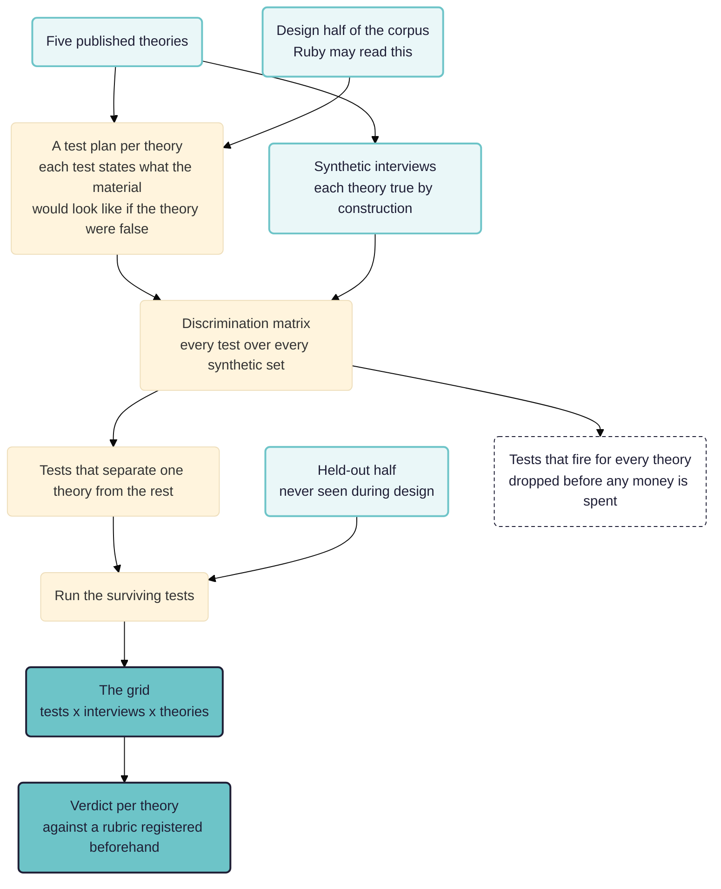

> **Work in progress.** A design for a study rather than a finished one. One theory of the five has been put through the machinery on the real corpus, and what that produced is under *A first run*. The study itself has not been run: there is no held-out half, no synthetic contrast set and no three-arm comparison, so nothing here says yet whether the method can tell theories apart. Three of the five theories still need sources. Comments welcome.

## In short

We take five published explanations of loneliness and ask which of them a body of interviews actually supports.

- **The material.** Fifty interview files from forty-eight people aged 18 to 24, recruited to a quota across four of London's most deprived boroughs and interviewed in 2019.
- **The theories.** Five accounts from different traditions, each written out as a paragraph, each with three variants written before anybody reads an interview, so a result cannot turn on one lucky wording.
- **The tests.** Each account becomes a set of diagnostic tests in process tracing's four types: straw-in-the-wind, hoop, smoking gun and doubly decisive. Each test states what the material would look like if the account were wrong, and the set is registered before the corpus is read.
- **Discrimination measured before the real corpus.** Synthetic interview sets in which one account is true by construction show which tests can tell the accounts apart. A test that fires on every set is dropped rather than reported.
- **A split corpus.** Tests are written against a design half and run against a held-out half, so the material that produced a test never scores it.
- **The output.** A table of which account holds for whom, not a single winner, because different accounts may be right about different people. Every figure walks back to coded rows, to quotes, to the words in the transcript.

See also: [[020 Realist mechanisms ((realist-mechanisms))|Generating realist mechanisms]], which starts with no theory and generates mechanisms where this one tests theories somebody else published; [[000 Working Papers ((working-papers))]]; [[900 A simple measure of the goodness of fit of a causal theory to a text corpus ((goodness-of-fit))]]; [[902 Quality assurance at each step of the causal coding workflow ((quality-assurance))]]; [[986 Causal mapping of loneliness interviews ((lonely-causal2))]].

**Intended audience:** evaluators and applied researchers who want to know whether a theory of change, a programme logic or a published explanation is borne out by narrative evidence, with the test written down before anybody sees how it comes out. This is not a causal mapping study.

**Contribution.** Possibly new, on the evidence of the search reported below:

- **Measuring a test's discriminating power in text**, by generating synthetic interviews in which each theory is true by construction. The idea that these probabilities should be produced rather than elicited is not ours: Befani, Elsenbroich and Badham put simulated probabilities forward as a third way beyond expert elicitation and empirical frequencies, using social simulation [@befaniDiagnosticEvaluationSimulated2021]. What is left to us is the domain and the instrument. Their simulation models a system; ours generates documents.
- **Aggregating a test result across a corpus by counting**, where Comparative Process Tracing aggregates by eliminating or bounding scope conditions [@beachGoingBeyondSingle2022].
- **Sorting each part of each theory by whether it expects a respondent to be able to report it**, and writing that part's tests at the level it predicts.

Not new, and used here unchanged: pre-registering the tests, already published practice in evaluation as Contribution Tracing [@befaniProcessTracingBayesian2017]; treating a hoop result as a matter of degree, where Fairfield and Charman got there first [@fairfieldExplicitBayesianAnalysis2017]; holding out half the corpus; and the four evidence tests themselves, which are Van Evera's, restated by Collier [@collierUnderstandingProcessTracing2011].

The two halves of the corpus are the point. Ruby, Rubicon's assistant, reads the design half while writing the tests and never sees the held-out half, so the verdict is computed on material that played no part in producing the instrument.

## The question

Suppose you have fifty interviews with young people about loneliness, and five published accounts of why young people are lonely. Each account is respectable, each has adherents, and each can be stated in a paragraph. Which one does the material support?

The obvious approach is to hand the corpus and the five paragraphs to a model and ask. That produces a fluent answer, no stated standard, a few well-chosen quotations, and no way for a reader to disagree with any particular part of it. Worse, a model asked "which of these fits?" might report that all of them fit, because every one of these theories is compatible with almost anything a lonely person might say.

So the work is to turn "does this theory fit?" into a set of questions that could come out either way, written down before the material is read, with a rule fixed in advance for how their answers combine into a verdict.

## Why an evaluator should care

The same problem, wearing evaluation clothes, is: **is the theory of change borne out?**

Not the logframe version, with forty nodes and a hundred arrows, where nobody could test it and nobody tries. The version that matters is the one or two central mechanisms the programme rests on, stated at the level where a part of the mechanism could fail on its own. Three worked examples, each carrying the clause that makes it testable:

- A cash transfer paid to the woman rather than to the household head changes **who is in the room when a spending decision is made**, and it is the change in who is present that shifts her say, rather than the extra money. The rival is that the money alone does it, in which case paying either partner would work as well.
- Putting researchers and civil servants in a room produces **a relationship that outlives the meeting**, and it is the relationship that gets evidence used later, rather than the evidence having become better or more accessible. The rival is that the convening improves the product, in which case a good report posted to the same people would do the same work.
- A community space reduces isolation because it gives people **a reason to be there other than wanting company**, so a tie can form without anybody having to declare they were lonely. The rival is that what matters is the hours and the location, in which case any open room in the right place would serve.

Each of those is a proposition. Each could be false. Each names what the material would show if the rival were right instead, which is the part a theory of change almost never writes down.

Contribution analysis [@mayneMakingCausalClaims2012] and process tracing [@collierUnderstandingProcessTracing2011; @befaniProcessTracingBayesian2017] were both designed around a small number of cases and a great deal of analyst time. The loneliness study is a rehearsal for fifty transcripts, on material where the theories are published, the stakes are nil and nobody is paying us to reach a particular answer.

## The material

The corpus is the one behind our earlier loneliness papers: fifty interview files from forty-eight participants aged 18 to 24, recruited to a quota across four of London's most deprived boroughs, interviewed in the summer of 2019 [@fardghassemiQualitativeOutputData2022]. Interviews average about nine thousand words. Sex, age and borough are recorded, so units can be stratified. Two participants have their second interview in a separate file, so every proportion has a base of fifty rather than forty-eight unless the files are merged first.

Two features of the corpus bear on the design.

- **The interviews predate the pandemic and predate TikTok's rise.** Any account that turns on a recent change in platform use is being asked about a period before the change it names. A test written for it must not rely on material the corpus cannot contain.
- **The interview opened with a free-association task about "the experience of loneliness".** That framing may supply respondents with the vocabulary of shortfall and comparison, so a theory predicting that people describe loneliness as a gap between the wanted and the achieved is partly predicting the interview schedule. A test has to be written so that the schedule's own words do not count as evidence.

## Five theories

Five, chosen so that they come from different traditions, make different predictions, and are not restatements of one another. Each is stated here in roughly the paragraph Ruby would receive. The first two carry sources and a verdict on where they stand; the discrepancy, political economy and displacement accounts still need citations.

**The hypervigilance loop.** Loneliness is an aversive signal, like hunger, that evolved to push a social animal back towards the group. Where it persists it turns on itself: the lonely person becomes watchful for social threat, reads ambiguous behaviour as rejection, and pulls back or guards themselves in ways that produce the coolness they feared. The mechanism is a loop inside the person rather than a shortage of people. Cacioppo and Hawkley put it as an evolved signal (2009, *Trends in Cognitive Sciences* 13(10): 447-454), and Hawkley and Cacioppo spell out the loop (2010, *Annals of Behavioral Medicine* 40(2): 218-227).

*Standing: the theory is mainstream, the hypervigilance limb is contested.* Spithoven, Bijttebier and Goossens (2017, *Clinical Psychology Review* 58: 97-114) conclude that lonely people show "an increased attention for social threatening stimuli", but it is a narrative review that pools no effect size. The best-matched test is Bangee and colleagues (2014, *Personality and Individual Differences* 63: 16-23), eye-tracking 85 UK undergraduates aged 17 to 19. They found the effect confined to the top quartile of loneliness, present only in the first two seconds, and absent across the extended viewing period after that.

**Two lonelinesses, not one.** Emotional loneliness follows the absence of a particular attachment figure and is not relieved by company. Social loneliness follows the absence of a network and is not relieved by intimacy. Neither substitutes for the other. Weiss (1973, *Loneliness: The Experience of Emotional and Social Isolation*, MIT Press) is the source, and de Jong Gierveld and Van Tilburg's six-item scale (2006, *Research on Aging* 28(5): 582-598) the standard operationalisation.

*Standing: partially supported, and its dimensionality is open.* Russell and colleagues (1984, *Journal of Personality and Social Psychology* 46(6): 1313-1321) found the two forms distinguishable while sharing "a common core of experiences", and van Tilburg (2021, *The Gerontologist* 61(7): e335-e344) recovered five factors rather than two on data using the scale. A study treating the distinction as settled would be overstating it.

**The discrepancy is with the expected.** Loneliness is the gap between the social life someone wants and the one they have, so the amount of contact predicts nothing on its own. What has changed is the standard: the comparison class is everyone's edited evening rather than the street.

**Loneliness is manufactured.** Loneliness is not a private failure but a product of how social life is organised: hours that make regular company impossible, rents that force people away from everyone they know, the closure of the places people used to meet for nothing, and platforms that sell connection back as a product.

**Displacement.** Mediated interaction takes the time and attention co-present interaction used to have, and the substitute does not do the same work. The rival within the same tradition is stimulation, which holds that online interaction augments existing friendship rather than replacing it.

## Some theories do not expect to be avowed

A test that asks whether respondents describe a mechanism assumes the mechanism is the sort of thing a respondent could describe. The five accounts differ on this as a matter of doctrine rather than by accident, so before writing any test, sort each part of each theory into one of three levels.

- **Avowable.** The respondent is aware of the mechanism and can put it into words. The test may ask more or less directly, and a passage where they say it counts.
- **Not avowed, still traceable.** The respondent cannot report the mechanism, and it leaves marks anyway: in what they mention in passing, in what they treat as unremarkable background, in the order they put things, in what they do not think needs explaining. The test reads those marks and must never require the speaker to have made the connection.
- **Out of reach of this instrument.** No interview of this kind could evidence it, whatever the respondent says. A test written at this level measures only whether the speaker has met the theory. It should be declared out of scope rather than asked badly.

Where the five sit:

- **Attachment** is avowable throughout. People do say that they have plenty of friends and still miss one particular person. An interview is close to the ideal instrument for it, which is an advantage the theory earns from the method rather than from the world.
- **Discrepancy** is avowable, and carries the extra risk that the interview schedule hands respondents its vocabulary.
- **Hypervigilance** is avowable for the reading, traceable for the loop, and out of reach for the mechanism as its own literature measures it. People can report having read a silence as rejection. They cannot report the loop, because the loop is what makes the reading feel like perception rather than interpretation. And the attentional bias itself, as Bangee and colleagues measure it, is an orienting effect in the first two seconds of looking at an image, in the top quartile of loneliness. Nothing anybody says in an interview can evidence a two-second eye movement. So a test asking respondents to describe their own vigilance is testing a folk rendering of the theory, and the paper has to say which of the two it is examining. This one finding did more to change the design than anything else in the search, and it was found by asking after a theory's current standing rather than after its statement.
- **Political economy** is traceable by doctrine. Its own claim is that the arrangement is invisible from inside it and that a structural condition is experienced as a personal failing, so a hoop test requiring respondents to name material constraint as a cause is rigged against the theory predicting they will not. Its tests read traces instead: shift patterns, rent, commuting, moving for work, the absence of anywhere free to sit, all present as background circumstance and not joined up by the speaker. Whether platforms extract sociality as unpaid labour is out of reach of a 2019 interview about loneliness, and should be marked so.
- **Displacement** is avowable for the substitution and out of reach for the causal claim. Respondents describe the swap readily. Whether the swap caused the loneliness is precisely what they are not in a position to know. What can be traced is whether the loneliness in an account tracks a change in device use rather than a change in circumstances.

The general rule: **for each theory, state the level of each part before writing its tests, and write each test at the level its part sits on.** A method ignoring this will find that the theories most flattering to introspection fit best, which is a finding about interviews rather than about loneliness. It also obliges the study to say plainly which parts of which theories this corpus was never going to reach, before seeing which way the results fell.

## What process tracing offers, and what a corpus changes

Beach and Pedersen sort evidence on two properties. **Certainty** is how sure we are the evidence would be found if the hypothesis is true. **Uniqueness** is how unlikely the evidence would be if the hypothesis is false. Low on both gives a straw in the wind. High uniqueness with low certainty gives a smoking gun. High certainty with low uniqueness gives a hoop test. Both high gives a doubly decisive test, which is rare, and rarer still in interview material. (Rubicon's workflows already use a column called `certainty` for how sure the *speaker* sounds, so this paper calls the process-tracing pair **expectedness** and **uniqueness**.)

What makes any of these a test rather than a search is uniqueness, the part about what you would expect if the hypothesis were false. That is where the whole discriminating power sits, and it is the part that gets dropped when a method is described informally. A test whose evidence is as likely under every rival account tells you nothing however often it fires.

Two things change when the tests run over fifty accounts rather than one case.

- **A hoop test becomes a proportion rather than a gate.** In a single-case study, evidence that must be present and is not present eliminates the hypothesis. In interview material, absence means the thing did not come up in a conversation of about an hour, which is weak evidence that it does not exist. One interview failing a hoop test is noise. Nineteen of twenty failing it is a finding. So a hoop test's result is the share of units where it fires, and the threshold that matters is written into the rubric in advance.
- **Equifinality stops being a caveat and becomes the expected result.** Different accounts may be right about different people, and the useful output is a table showing which holds where. Where a theory fits twelve accounts strongly and thirty-eight not at all, "it came second" would misdescribe a real result.

## Where this sits in the process tracing literature

**The gate this paper departs from is Collier's.** His hoop cell reads: "Passing: Affirms relevance of hypothesis, but does not confirm it. Failing: Eliminates hypothesis" [@collierUnderstandingProcessTracing2011]. Collier himself calls the typology a useful heuristic that "should not be taken rigidly", so the departure is smaller than it first looks.

**The gate has already been challenged, and not by us.** Fairfield and Charman regard the four named tests as unnecessary inside a Bayesian framework, on the grounds that "evidentiary confirmation is always a matter of degree, not type" [@fairfieldExplicitBayesianAnalysis2017]. We keep the four names anyway, because they are a usable interface for an evaluator even where the underlying quantity is continuous. Two of Fairfield and Charman's requirements bear directly on this design.

- **Rivals must be concrete, specified in advance and mutually exclusive.** Our five named theories satisfy the first two and not the third: the discrepancy account is arguably a mechanism inside the hypervigilance account, so a passage can support both. So the paper reports the overlap and drops the language of a winner, and that choice is made before the run.
- **Testimonial evidence should be written as "source S stated X", not as X.** On this formulation a silence in an interview is a fact about the interview rather than about the world, which is precisely why a failed hoop test over one transcript proves so little. Fairfield and Charman say nothing about combining such likelihoods across fifty transcripts, and that gap is where this paper sits.

**Bayesian process tracing in evaluation is established practice.** Befani and Mayne combined it with contribution analysis [@befaniProcessTracingContribution2014], and Befani and Stedman-Bryce named the result Contribution Tracing [@befaniProcessTracingBayesian2017], whose benefits include writing down what evidence would count before going to look for it. Their pre-specification comes before data collection; ours comes before reading a corpus that already exists and that we have published on three times. Those are not the same protection. Zaks argues that Bayesian process tracing as practised "introduces more bias than it corrects for on numerous dimensions" (2021, *Political Analysis* 29(1): 58-74); we have read the abstract rather than the article.

**On scaling past the single case, the nearest neighbour is Comparative Process Tracing** [@beachGoingBeyondSingle2022]. Beach, Camacho and Siewert check each further case only for whether a key empirical signature is present or absent, which is structurally close to a hoop test tallied case by case, and then stop one step short: their aggregation eliminates or bounds scope conditions rather than counting. So counting across cases appears to be unoccupied ground, measured against this one conference preprint rather than against the whole field. Their design also contains the objection to ours. They select cases for diversity rather than sampling them, so a proportion over their cases would mean nothing. A proportion is only worth computing over a base that stands for something, which is what a quota sample across four boroughs offers.

**The question underneath all of this:** is a corpus of fifty interviews fifty cases, or one case with fifty sources of evidence? Nothing in the literature settles it. If fifty cases, a proportion is the right statistic. If one case, the proportion describes the evidence base rather than the world. The likeliest answer is that loneliness is fifty cases while a programme evaluation with fifty stakeholder interviews is one, which would mean the method transfers to evaluation less directly than this paper's opening implies. The study should answer it in writing before it runs.

## What is known about letting a model do the coding

The design rests on a model finding, in a transcript, the evidence a test asks for, and the published record is less encouraging than the headline figures suggest. Agreement with human coders in the 0.6 to 0.8 kappa band is reachable on a well-specified codebook and does not transfer between tasks or models. **Locating is much harder than classifying**: Balt and colleagues report 0.84 accuracy when a model classifies a segment it is handed and 0.67 when it has to find the segments itself (2025, *Frontiers in Public Health* 13:1512537), and every coding step here is the second kind. And **aggregate accuracy hides constructs the model is not measuring at all**: in Chew and colleagues' replication the model failed hardest on exactly the codes the human coders found easiest (arXiv 2306.14924). A theory whose evidence happens to sit in such a code loses, invisibly.

Two devices from that literature go into the design. Chew and colleagues' test of whether a code's output can be told apart from random assignment needs no human labels and can gate a test before anybody sees the results. Repeated coding, which Rubicon already does with reuse turned off, gives a consistency measure, bearing in mind that consistent is not the same as correct. Any reliability figure on a rare code should be Gwet's AC1 rather than a kappa.

## Writing a test so it can fail

A test in the plan is a record with these fields, and the third does the work.

- **Proposition.** What the theory says should be true of this person, in a sentence. Following Beach and Pedersen, an entity doing something, so that the part can be false on its own.
- **Evidence sought.** What in an interview would show it, concretely enough that two coders would mark the same passages.
- **What the material would look like if the theory were false.** Written against each named rival rather than in the abstract. "Under the discrepancy account the same event is described as falling short of an expectation rather than as a signal about the self. Under the political economy account the event does not arise, because the obstacle is hours or fares."
- **Test type**, which follows from the field above rather than being chosen first.
- **What a failure means**, over one unit and over the corpus.

A test with the third field empty should be refused. That single requirement is what stops the exercise producing five theories that all fit, because a test whose author cannot say what would count against it is a search and should be recorded as one.

This is the Bayesian requirement without the Bayesian arithmetic. The likelihood ratio that formal process tracing asks you to estimate [@befaniProcessTracingBayesian2017; @befaniLettingEvidenceSpeak2020] is the ratio of how likely the evidence is if the theory holds to how likely it is if the theory does not. We are not going to ask anybody to put a number on the denominator, because nobody could defend it. We are going to measure it.

## Measuring discrimination instead of asserting it

The general idea, running a workflow over synthetic documents that should score well and badly before it meets the real material, is on the [Rubicon open format page](https://rubicon.causalmap.app/open-format) under validating the workflow. For this study it does more. Write a synthetic interview in which one theory is true by construction, do it for each of the five, run all the tests over all five sets, and read the matrix.

- A test firing only against its own theory's set is discriminating, and the matrix says how strongly.
- A test firing against all five is measuring something every account of loneliness implies, and should be dropped before the real run.
- A theory whose tests fire against nothing, its own set included, has been written up in a way the method cannot reach, and the fault is in the test rather than the theory.

That matrix estimates how often the evidence appears when the theory is false, obtained by making it false and looking, rather than by asking an analyst to guess. It answers the objection that a theory fits everything, and it answers it before money is spent on the real corpus.

Two constraints apply. The texts must be generated from more than the tests, or a text written to satisfy a test uses the test's own vocabulary and the coder finds the words planted for it. And there have to be decoys: an interview in which somebody who is not lonely talks fluently about loneliness in general, and one in which somebody who is describes it badly, in few words, with no vocabulary for it.

There is a limit worth stating plainly. A synthetic interview is written by a model that has read the theory, so it contains what the theory's adherents would say, which is not what the theory predicts a real person would say. The matrix tests whether the tests tell the theories apart as written. It does not test whether the theories are true.

## How much of the material Ruby may read

Two failure modes pull in opposite directions. Writing the tests from the theory paragraph alone, Ruby will ask for evidence nobody would produce in an hour of conversation about their own life. Writing them having read the corpus, she will write to the corpus's own idioms, and every theory will pass.

So the fifty interviews are split in two, stratified by borough and sex, and the split is fixed and dated before anything runs. Ruby reads the design half while writing the tests, and may revise them against it as often as she likes. The verdict is computed only from the held-out half.

That is the ordinary discipline, and it is also a small experiment worth running for its own sake. Write three test plans for the same five theories: one from the theory paragraphs alone, one from the paragraphs plus the design half, one from the paragraphs plus the whole corpus. Run all three over the held-out half. If the third plan's tests fire much more often than the first two on material none of them was allowed to see, we have measured overfitting rather than asserting it. If the first plan's tests fire almost never, we have measured the cost of designing blind.

## Variants

Five theories chosen by us is a small and biased sample of the space of possible explanations, and the winner may simply be the one we stated best. So for each theory, generate three variants sharing its core commitment, differing from it in at least one prediction, and differing from all the other theories. Each variant must state in writing one thing it predicts that the original does not, and one thing it predicts that each of the other four does not; a variant unable to produce those sentences is a paraphrase. Where a variant beats its original on the held-out half, the finding is about the formulation rather than the tradition.

## The two measures of fit, and why they can disagree

[[900 A simple measure of the goodness of fit of a causal theory to a text corpus ((goodness-of-fit))|Coverage]] asks how much of the coded causal evidence can be expressed in a theory's own vocabulary. It rewards **breadth**, so a theory with capacious categories covers nearly everything, which is the failure this paper started from. The diagnostic tests reward **uniqueness**, so a theory can pass tests no rival passes while accounting for a small fraction of what people talk about. A theory high on both is well supported. A theory high on coverage and low on uniqueness is the one fitting everything. A theory low on coverage and high on uniqueness explains a little and explains it well, which for an evaluator is often the more useful result. So run both, and report the disagreement rather than resolving it.

## The gap most likely to decide the study

A test only counts for anything because the evidence would have been unlikely if the theory were false, and "if it were false" is always shorthand for "if one of the rivals were true instead". So the strength of every test is set by how well the rivals were searched for, and not by anything about the theory being tested.

Now suppose the searches are uneven. The hypervigilance tests get a careful instruction, worked examples and three passes; the political economy tests get one thin instruction written late in the afternoon. Hypervigilance then wins, on every criterion at once, because each of its tests looks unique against a rival nobody went looking for. Nothing in the output shows this. The quotes are real, the proportions are correct, the walk back to the source works. The finding is an artefact of attention, and it is invisible in exactly the form a reader would inspect.

Rubicon can check that two codings of the same text ran with the same settings and read the same share of it. It cannot yet make that check across twenty tests at once. So for now symmetric effort is enforced by construction, by giving every test an identical budget over identical text, and asserted by nothing. The study should either close that hole or report having run with it open.

## The workflow

One workflow per theory, all reading the same held-out sample, in four steps: draw the sample, run one coding pass per test over every interview, count, and judge. The passes are per test rather than per theory, so every test gets its own reading of the whole interview with the same budget. A single pass carrying twenty tests as twenty columns would be cheaper, and a model given twenty columns finds a few and stops.

Each coding pass marks every passage bearing on the proposition, says whether it supplies what the test asked for, whether it separates the account from the named rivals or sits as comfortably with them, and how sure the speaker sounds that what they describe happened. The counting step gives, for each test, the share of units where it fired with a separating passage, and the same share without the separating filter; where the two are far apart, the test is firing on material every account predicts.

The rubric is registered by name and version before the run. Five criteria, four settled by arithmetic and one that cannot be.

- **Hoop survival.** In what share of the held-out units do the theory's hoop tests fire? Thresholds stated in advance.
- **Smoking gun.** Is there at least one unit where a uniqueness test fires with evidenced certainty and the passage separates this account from the rivals?
- **Discrimination.** What share of the firings separate rather than being shared? A theory whose tests fire often and separate rarely is reported as fitting everything, whatever it scores elsewhere.
- **Reach.** For how many units does this account do any work at all?
- **Does the material bear on it?** Judged rather than computed. Where the corpus cannot distinguish this account from a rival, the judge says so and refuses a band, because a band gets quoted and the doubt does not.

The artefact the workflow must produce, beyond the verdicts, is the grid: twenty tests by twenty-five units by five theories, every cell filled, every filled cell walking back to a marked passage.

## A first run

A test of Weiss's two lonelinesses ran twice on 5 September 2026 against a copy of the loneliness corpus held in the app. That copy holds fifty-one documents: the fifty interview files, and one newspaper article about lobbying that has no business in a test of Weiss and was left in the frame. Twenty were drawn at random with a fixed seed, coded for the two patterns, counted, and judged against a standard registered before the coding began, with the weakest criterion deciding. The pair cost 58 pence.

The coding returned 65 passages across the twenty interviews. Sixty-one showed emotional loneliness, three showed social loneliness, and one showed both. Fifteen of the twenty people showed the emotional pattern and three showed the social one. The standard asked two things: whether each pattern appears at all, and whether at least a quarter of the people read show one of them.

**The two runs returned different verdicts on identical coding.** The first said the theory was not supported and the second said it was. The same 65 passages sat behind both. What moved was a comparison inside the app, which had been matching filter values case-sensitively, so one figure came back as nought and the prevalence criterion failed on a count that was really fifteen. The fix belonged to the engine rather than to the workflow, and it was made between the two runs.

That is worth more to this paper than the verdict is. A theory-fit study rests on the claim that a standard fixed in advance decides the answer, and here a fault nowhere near the standard decided it instead. Nothing in the run's own record would have shown it. Only re-running after an unrelated repair did.

So what has been shown is narrow. The design runs end to end on real material, it produces the grid's smallest possible cell, and the walk from the verdict back to the passages behind it holds. What has not been shown is anything the study is actually for: one theory is not five, twenty interviews read once are not a held-out half, and no synthetic set has yet said whether these tests could tell one account from another.

The 61 against 3 is the open question. Either these young Londoners overwhelmingly describe the loss of a particular person rather than the loss of a wider circle, which would be a finding, or the instruction for one pattern fires on almost anything and the instruction for the other fires on almost nothing, which would be an artefact. The discrimination matrix exists to tell those apart.

## What counts as a result

Not a league table. The outputs, in order of how much we would trust them:

- **The grid**, showing which accounts do work for which people, which is the durable product.
- **The discrimination matrix from the synthetic sets**, saying how much any of the tests could have told apart, and worth having even if the real run never happens.
- **The three-arm comparison** of blind, half-sighted and fully sighted test design, which is a finding about the method rather than about loneliness and generalises to every study run this way.
- **Per-theory verdicts**, last, and hedged by the fact that the theories are not independent. A passage supporting the discrepancy account often supports the hypervigilance account too. Report the overlap rather than netting it off.

## Weaknesses not yet addressed

- **There is no placebo theory.** Every safeguard is aimed at the tests, and nothing tests the whole apparatus. A sixth account, written to be vacuous but plausible and run alongside the five, would show whether the method rewards any fluent story.
- **The number of tests per theory is uncontrolled.** A theory with six tests has more chances to fire than one with three. Either fix the count per theory, or report a rate with the count as its base.
- **Firing and separating are judged in the same call.** A model that has decided a passage supports the theory will tend to call it separating. Two passes, or a second model rating uniqueness on the passages the first marked, would also give an agreement figure worth reporting.
- **There is no minimum difference worth interpreting.** With twenty-five units, twelve and fifteen are not different, and a reader of a table of proportions will treat them as though they were. State the threshold before the run and print it on the grid.
- **The run-to-run reliability of the tests is unmeasured**, and it bounds everything else. If two runs of the same test disagree more than the theories differ from each other, no verdict here means anything.
- **The authors have read the held-out half.** We chose these five theories after publishing on this corpus three times, and no split can close that leak. The answers are to say so, or to have somebody outside the project choose the theories.
- **Interviewer turns are not excluded.** A passage can fire because the interviewer put the idea into the room, and the free-association opening makes that likely for the discrepancy account in particular.
- **Overlap between accounts is asserted, not measured.** If one account fits twelve people and another eleven, a reader will ask whether they are the same twelve. The overlap statistic should be declared before the run, not computed afterwards on a result already seen.

## What this study is not doing

- **No Bayesian arithmetic.** No priors, no posterior odds, no elicited likelihoods. The concept is kept, the numbers are not, and the synthetic contrast sets stand in for the one quantity that would have mattered.
- **No claim about loneliness.** Fifty interviews from four London boroughs in 2019 support no general claim about young people. The study is about whether the method can tell theories apart.
- **Not a finished literature search.** Three of the five accounts need sources, and so does the UK evidence on how lonely young adults actually are. Whether anybody has already generated documents in which a theory is true by construction, to measure whether a method can discriminate, is unanswered, and the paper's first novelty claim rests on it.

## Where the people go

- **Choosing the five theories** is a judgement about the field rather than a technical step, and the first place another person belongs.
- **Reading the first test plan** before it runs. Somebody who knows the material should say which tests ask for evidence nobody would ever produce in an interview.
- **Reading the grid together** rather than being handed a verdict. The grid is the artefact precisely so that a group can argue with it.

The design half exists to be iterated on, and that freedom is bought by the held-out half. How revising a registered plan is recorded is on the [Rubicon open format page](https://rubicon.causalmap.app/open-format), under pre-registering the workflow.

## Next steps

- Build the synthetic contrast sets and run the discrimination matrix first: the cheapest step, and the one most likely to change the design.
- Settle in writing whether fifty interviews are fifty cases or one case with fifty sources, and whether to reduce the five theories to propositions that really do exclude one another.
- Write the variants, three per theory, before anybody reads an interview.
- Only then write the test plans, in three arms, and run them over the held-out half.
- If you know of work that generates documents with a theory true by construction, or a peer-reviewed version of Comparative Process Tracing, we would like to hear from you.
