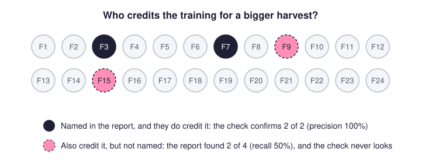
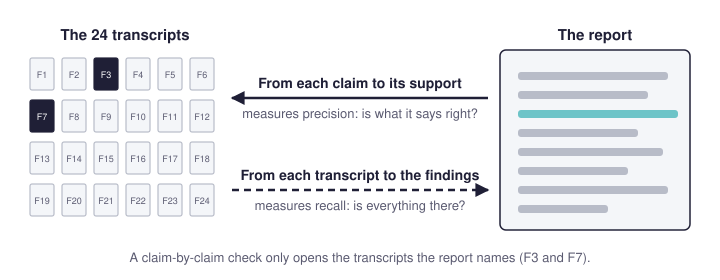
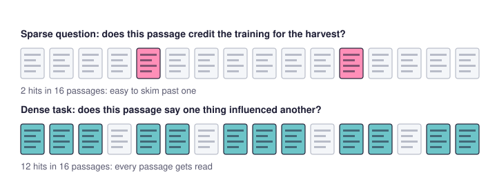
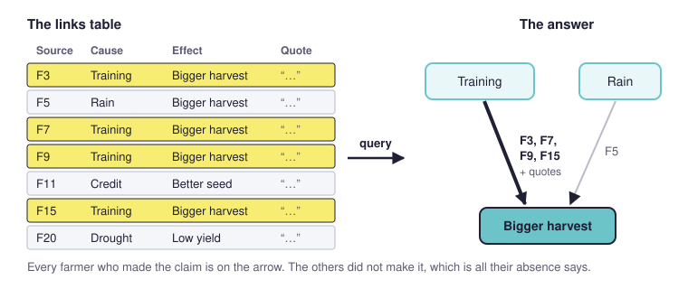

*For evaluators and applied social researchers who use AI in qualitative analysis, or use or assess work that does.*

## Summary

- A frontier AI can turn a terms of reference and a pile of transcripts into a convincing evaluation report. A second AI checking it will usually find few errors.
- That check reads from the report to the transcripts, so it measures **precision** (is what the report says right?) and misses **recall** (did the report include everything that belongs in it?).
  - It rewards reports that commit to little: "some farmers" passes, "only two of 24" can fail.
  - Left to itself, the AI drifts towards findings that are easy to verify, which are not always the ones the commissioner needed.
- **Recall** is measured the other way round, from each transcript to the findings. That needs explicit coding of *all* the relevant material, in a format that shows for every finding who is in it, who goes against it and who said nothing, so a checker can test a random sample of sources.
- Causal mapping does this kind of exhaustive coding for causal claims: it codes every claim in every passage, answers questions by querying the result, and lets you check recall a chunk at a time. And it means you only have to do one lot of coding which can then help answer many of your evaluation questions. 
- The professional evaluator stays. Somebody has to choose the method with a view to who is going to use it and why, know what it did in order to be able to check it, and vouch for it to its users.

## The freestyle evaluation promise

Anyone who cares about getting valid, useful and accurate information about social programmes will have encountered what we can call the **freestyle evaluation promise**. In the second half of 2026 you can give a frontier AI model (Claude Opus, GPT-6 Sol, Gemini 3.1 Pro) the evaluation questions from a terms of reference, together with the interviews and reports you have collected. Answer a few clarifying questions, perhaps a discussion of a coding strategy, and it returns what looks like an excellent evaluation report: detailed, and often very accurate.

That is the **soft version** of the freestyle route. Its weakness is that you cannot really tell what method it used or how it did anything that might be called coding. If you ask, it may well make up an account of what it did. The **hard version** uses an agent with tools, such as Claude Code, which can run Python in a sandbox and start sub-agents. Here you can [[060 Trust the algorithm, not the AI ((trust-algorithm))|agree a coding plan first]]. The agent then carries out the coding, consolidates the results and writes the report from them, instead of writing something that merely resembles the outcome of a coding task. We would not recommend the soft version except for very simple tasks. The hard version can produce very convincing and somewhat defensible results.

## The freestyle checking illusion

In either case you can **hand the report to another AI**, or to the same one, to [[910 AI coding experiments synthesis ((coding-experiments))|check its accuracy]]. Checking is much easier than producing. Both versions usually score well, with few important errors. 

## Is the AI gorilla going to destroy professional evaluation?

>Problem solved for a desk officer tasked with commissioning evaluation. They can just put the material and the request into a freestyle chatbot and [[How hard is evaluation actually ((how-hard-evaluation))|never engage a professional evaluator ever again]].

The one thing which can slow down the gorilla is this: These reports are written to produce accurate text, so they pass accuracy checks well. That sounds like a virtue, but it hides a bias. Unless the evaluation question has been specified tightly and the way of answering it agreed in detail (which the hard version partly allows and the soft version does not), the AI selects the claims it can make that are probably true and hard to falsify. It steers away from questions and sub-questions whose answers are more equivocal or harder to check, and towards the workflow that yields verifiable answers. The report can therefore score very well without exactly answering the questions the commissioner needed answered in the most valid way. The result is a strong skew towards one kind of evaluation workflow, often quite different from the one you would construct if you took seriously the task of [[005 Rubicon principles ((rubicon-principles))|operationalising the evaluation questions accurately]].

The rest of this page looks at which kinds of finding this favours and what to do about it, starting with an example.

## The problem: checking an AI evaluation report with a lazy checker

An evaluator, Jo, has 24 interview transcripts. She asks an AI to answer an evaluation question, freestyle. The final report includes sentences such as 

> Some farmers credit the training for their bigger harvest (see farmers F3 and F7)

To check it, Jo gives the report and the transcripts to a second AI, or to a colleague, and asks for every sentence to be verified. The checker does what it is asked. It takes each sentence, finds F3 and F7 in the transcripts and confirms that they credit the training. It might catch a wrong name or a misquotation. Otherwise it passes the report as "zero errors" and Jo congratulates herself.

Usually it does not read every transcript for farmers the report left out, so it passes the sentence even though maybe F9 and F15 credit the training too. A report full of weak claims like this can pass the accuracy test with 100%.

A stronger version might have been to ask for findings like this:
> Two farmers credit the training for their bigger harvest (farmers F3 and F7)

or even like this, making it explicit that the other 22 farmers did not make such a claim:
> Only two out of 24 farmers credit the training for their bigger harvest (farmers F3 and F7)

These claims are stronger because it is clearer how to refute them. But it's more work to refute them, because you have to explicitly plough through all the other transcripts to make sure. People are lazy, and AIs are lazy. 

It's the same with "Nobody in the northern district mentions drainage as a factor affecting harvests": it's a strong claim, but it's more work to check.

There are lots of different overlapping ways of thinking about this problem. In the terms used to evaluate search engines and classifiers, the easy check measures **precision**: of the things the report says, how many are right. It does not measure **recall**: of the things in the transcripts that belong in the report, how many the report includes. A report can be precise and still leave out half of what it should have counted.

## What to do about it

So Jo's checker gives the weak report full marks. Now suppose Jo asks her AI for strong claims instead, and gets

> Only two out of 24 farmers credit the training for their bigger harvest (farmers F3 and F7)

The same checker now has something to catch. If it happens to read F9's transcript it finds a third farmer, and the report loses a mark. **The report that says more does worse**. A check that measures only precision rewards mostly bland reports that commit to little. 

And without adding some serious additional machinery, an AI checker (or a lazy human) is still substantially less good at actually finding omissions than it is at checking what has been reported.  This is compounded with larger corpora (more, longer documents) because thorough checking is expensive, and our usual tricks for dealing with larger corpora like RAG don't help us as much. It's effort, and AIs and humans don't like making that effort.

On top of that, in our experience, freestyle AI checkers treat a wrongly named farmer as a serious error and a missing one as a minor slip. So even when an undercount is caught, it counts less.

And this is not really about AI checking AI. Jo's colleague would do exactly the same: read the report and look up each claim. **The trouble is the direction of the check. Any check that starts from the report and looks for support in the transcripts measures precision well but recall poorly, whoever does it**.

## Making recall measurable

To measure recall you have to work the other way round: start from each transcript and ask which findings that farmer belongs in. Does F9 credit the training? Does F15? Done for every farmer and every finding, and that needs plain old-fashioned [[040 Causal mapping as causal QDA ((causal-qda))|explicit coding]]. It's hard to instruct a consumer chatbot, or even a tool like Claude Code, to do this for you well. You can ask it to make sure every finding has a small report in a standard format, something like this:

> Credits the training for a bigger harvest: F3, F7, F9 and F15 say so. F12's account goes against it: the harvest fell despite the training. F20 says it only of the neighbours. The other 18 do not mention it.

Every count in the report then has to come from a format like this, so "only" and "nobody" become statements about the format, and anyone can check them; it makes laziness in checking a bit harder to defend. 
The format does not guarantee good recall: whoever filled it in can still miss F9. What it does is make the misses findable without ploughing through every transcript. The checker picks four transcripts at random, reads each one in full, places each of those farmers on every finding without looking at the format, and compares. If one placement in ten is missed in the sample, expect roughly the same across all 24. Auditors do the same with a sample of invoices.

**To go beyond this**, for analysis and checking, you have to move away from [[050 Just add rigour Three do’s and don’ts ((add-rigour))|just dumping your source texts into a chatbot]] and playing with the prompt. You might want to move to a more systematic coding tool -- but then of course you lose the amazing flexibility of frontier models to dream up a freestyle method to produce a perfect-looking report with good precision (but dodgy recall). 

## Sparse and dense tasks

In this kind of task we can distinguish between sparse and dense text coding tasks. A dense task is one in which there are multiple possible hits in a small amount of text whereas with a sparse one you have to search through pages to find even one possible hit. Dense tasks can be expensive to do, but it can be easier to write the codebook. Sparse tasks seem cheaper but that might be because you are skipping loads of text which might in fact contain a hit. 

## Why causal mapping is a good fit

Causal mapping turns a sparse question into a dense task. Jo's question, who credits the training for a bigger harvest, is sparse: most passages in 24 transcripts say nothing about it, and a reader hunting for it skims. Causal coding does not hunt. It codes every causal claim in every passage, whatever it is about, as a link from a cause to an effect, with the verbatim quote behind it and the source it came from ([[005 Minimalist coding for causal mapping ((minimalist))|minimalist coding]]). In interviews about change that is a dense task, because nearly every paragraph has something to code. The codebook is also basically short: every claim that one thing influenced another. Another big advantage: we create just one model of all the causal narratives instead of running one coding over the same text for each and every question.

The finding then comes from a query rather than from the model's reading of the question. "Who credits the training for a bigger harvest?" becomes "which sources mention a chain from `Training` to `Bigger harvest`?" The answer lists every such source with its quotes, which is the standard format from the previous section, produced by the coding instead of written on request. A farmer whose harvest fell despite the training appears as a contrary link ([[016 Despite-claims ((despite-claims))|despite-claims]]). "The other 18 do not mention it" is a statement about the links table: we [[0130.1c A minimalist approach to coding does not code absences ((minimalist-absences))|do not code absences]], so it says only that those farmers did not make the claim. The model never chose which findings to report, so it could not drift towards the easy ones. The analyst chooses the questions. The [[030 Causal mapping is an interesting QDA approach which is very suitable for scaling with AI ((causal-mapping-qda-ai))|AI does one narrow extraction job]].

Recall becomes measurable a chunk at a time. The AI reads one short chunk of text per request, never the whole corpus, so each piece of its work is small enough for a person to recode by hand and compare. [[902 Quality assurance at each step of the causal coding workflow ((quality-assurance))|Precision and recall]] are the two things we check at the coding step, on a small, varied sample, before the whole corpus is coded. Our [[910 AI coding experiments synthesis ((coding-experiments))|coding experiments]] show why chunking matters. Given a whole 89,000-character document in one request, a model returned 6 links where chunked runs returned 114: over a large context, extraction behaves like drawing a sample. The bias described at the top of this page showed up in miniature too. The most expensive model we tested made few errors but missed over half the real content, because it avoided faint or debatable claims rather than selecting better. What lifted recall was an accounting contract: every numbered segment of a chunk had to yield its claims or an argued "none". That builds the check from the transcripts towards the findings into the coding itself.

Causal mapping covers only claims about what causes what, which covers a big part of many terms of reference but not all. For those the same discipline has to be built question by question.

## So is the gorilla going to win?

No, because even the best-built workflow needs somebody to choose it, to know what it did **and to vouch for it**. A commissioner who receives a report needs to know which method was actually used, what was read and what was left out, and whether that method fits the question they needed answered. A chatbot can suggest and describe a method. Somebody has to [[How hard is evaluation actually ((how-hard-evaluation))|declare that this is the right kind of method]] for this question, know what it did in practice, and put their name to it. As the Rubicon principles have it, [[005 Rubicon principles ((rubicon-principles))#Worth is declared by a person|worth is declared by a person]].

That is not only a technical job. Evidence is used by people: a programme team, a board, a funder, a community. Each needs different evidence and trusts different sources. Knowing who needs what evidence, and why they would believe it, comes from relationships and from understanding the setting, built up over time by a person the users of the evaluation can hold to account. The more of the analysis a machine can do, the more the professional's value lies in these parts: choosing and operationalising the questions, vouching for the method, and [[902 Quality assurance at each step of the causal coding workflow ((quality-assurance))|taking responsibility for the conclusions]].

## Punchline

A freestyle AI report can pass an accuracy check with full marks and still not answer the question. Checking it by reading the report tells you how much of what it says is right. It cannot tell you what the report left out. Worse, it rewards the report that commits to least: a vague report looks accurate and a committed one looks careless. Recall is measured the other way round, from the transcripts towards the findings. That needs findings built on explicit coding of the whole corpus, in a format that shows for each count who is in it, who goes against it and who said nothing, so that a checker can sample the sources and compare. Causal mapping does this for causal claims: it codes every claim in every passage, answers questions by querying the links, and checks recall chunk by chunk. [[000 Rubicon ((rubicon))|Rubicon]] is our attempt to do the same for evaluation questions of any kind, with each question broken into steps somebody else could check and every count [[005 Rubicon principles ((rubicon-principles))#Say what you did not read|stated out of what was read]]. Whatever the tool, somebody still has to choose the method, know what it did and vouch for it to the people who will use the findings. That stays the evaluator's job.

------

## What the literature calls it

We did not find a single established name for this. Several literatures describe parts of it.

**Precision without recall.** FActScore, which scores a long AI answer claim by claim, "considers precision but not recall, e.g., a model that abstains from answering too often or generates text with fewer facts may have a higher FActScore" ([Min et al. 2023](https://arxiv.org/abs/2305.14251), section 3.1). Wei et al.'s F1@K adds recall, measured against a preferred number of supported facts ([2024](https://arxiv.org/abs/2403.18802)), which rewards quantity rather than completeness against the source. In summarisation research omission is an error type of its own; Zou et al. built a dataset of omission labels because none was available ([2023](https://aclanthology.org/2023.acl-long.798/)).

**Omission blindness in AI judges.** Zheng et al.'s study of models used as judges examined position, verbosity and self-enhancement bias ([2023](https://arxiv.org/abs/2306.05685)); omission is not among them. A recent preprint names it. Fox et al. call it omission blindness: eight judge designs reading clinical notes against the transcript told a flawed note from its correct twin at 0.79 to 0.94 for added or altered content and 0.50 to 0.63 for omissions, where 0.5 is a coin flip ([2026](https://arxiv.org/abs/2608.31016)). Restructuring the task partly recovered detection, and the restructured task runs from the source: "list the facts the transcript establishes, then check the note for each". AbsenceBench found the same weakness in language models generally ([Fu et al. 2025](https://arxiv.org/abs/2506.11440)). A second model may also share the first model's blind spots: Goel et al. found mistakes growing more similar as models become more capable, "pointing to risks from correlated failures" ([2025](https://arxiv.org/abs/2502.04313)).

**Auditing: the direction of the test.** Auditors separate the claim that recorded items are real (the existence or occurrence assertion) from the claim that everything that should be recorded is (the completeness assertion) ([PCAOB AS 1105](https://pcaobus.org/oversight/standards/auditing-standards/details/AS1105), para .11). They are tested in opposite directions: for completeness, "the procedure should start from the underlying documents and check to the entries in the relevant ledger to ensure none have been missed" ([ACCA](https://www.accaglobal.com/gb/en/student/exam-support-resources/fundamentals-exams-study-resources/f8/technical-articles/assertions.html)). Checking from the record back to the evidence is often called vouching; checking from the evidence forward to the record is tracing ([Vero 2025](https://trullion.com/blog/guide-to-audit-tracing-and-vouching/)). A claim-by-claim review vouches. Where full tracing costs too much, auditors sample and "project the misstatement results of the sample to the items from which the sample was selected" ([PCAOB AS 2315](https://pcaobus.org/oversight/standards/auditing-standards/details/AS2315), para .26). One limit: an invoice is either in the ledger or not, while deciding that someone "said X" is itself coding.

**Why checkers let undercounts go.** Klayman and Ha's positive test strategy is the tendency to test cases expected to have the property in question ([1987](https://pages.ucsd.edu/~mckenzie/KlaymanHaPsychReview1987.pdf)). When the hypothesised set sits inside the true set, as when a report names F3 and F7 and F9 also qualifies, people using only positive tests "can never discover that their rule is incorrect" (p. 214). A tester "may simply be more concerned that all chosen cases are true than that all true cases are chosen" (p. 216). Their subjects were testing their own hypotheses, which a checker is not. Behind this sits the feature-positive effect: adults learn a discrimination more easily when the presence of a feature marks the answer than when its absence does, which the authors take as evidence of "the difficulty organisms experience in using 'nonoccurrence' as a cue" ([Newman, Wolff and Hearst 1980](https://doi.org/10.1037/0278-7393.6.5.630)). Two terms fit less well. Satisfaction of search, missing a second abnormality once one is found ([Adamo et al. 2021](https://doi.org/10.1186/s41235-021-00318-w)), assumes a search for further cases that a checker is never asked to make. Omission bias, judging harmful omissions less bad than harmful commissions ([Spranca, Minsk and Baron 1991](https://doi.org/10.1016/0022-1031%2891%2990011-T)), concerns people's actions.

**Qualitative method and information retrieval.** Negative case analysis, one of Lincoln and Guba's techniques for credibility, is "the constant reworking of hypotheses in light of disconfirming evidence" ([Phillips et al. 2014](https://doi.org/10.1186/s12913-014-0559-4), tabulating Lincoln and Guba): the analyst's discipline of reading beyond the claim. Information retrieval meets the counting problem head on: missed items are absent from the results, so recall is estimated "by assessing a random sample of documents", including documents the search did not return ([Webber 2012](https://arxiv.org/abs/1202.2880)).

## Sources

- Adamo, S. H., Gereke, B. J., Shomstein, S. and Schmidt, J. (2021). [From "satisfaction of search" to "subsequent search misses": a review of multiple-target search errors across radiology and cognitive science](https://doi.org/10.1186/s41235-021-00318-w). *Cognitive Research: Principles and Implications*, 6.
- ACCA. [The audit of assertions](https://www.accaglobal.com/gb/en/student/exam-support-resources/fundamentals-exams-study-resources/f8/technical-articles/assertions.html). Technical article for ACCA students.
- Fox, S., Markham, L., Lail, R. and Karotsieris, M. (2026). [LLM judges verify presence, not absence: omission blindness in AI clinical notes and what recovers it](https://arxiv.org/abs/2608.31016). arXiv preprint 2608.31016.
- Fu, H. Y., Shrivastava, A., Moore, J., West, P., Tan, C. and Holtzman, A. (2025). [AbsenceBench: language models can't tell what's missing](https://arxiv.org/abs/2506.11440). arXiv 2506.11440.
- Goel, S. et al. (2025). [Great models think alike and this undermines AI oversight](https://arxiv.org/abs/2502.04313). arXiv 2502.04313.
- Klayman, J. and Ha, Y.-W. (1987). [Confirmation, disconfirmation, and information in hypothesis testing](https://pages.ucsd.edu/~mckenzie/KlaymanHaPsychReview1987.pdf). *Psychological Review*, 94(2), 211–228.
- Min, S. et al. (2023). [FActScore: fine-grained atomic evaluation of factual precision in long form text generation](https://arxiv.org/abs/2305.14251). EMNLP 2023.
- Newman, J., Wolff, W. T. and Hearst, E. (1980). [The feature-positive effect in adult human subjects](https://doi.org/10.1037/0278-7393.6.5.630). *Journal of Experimental Psychology: Human Learning and Memory*, 6(5), 630–650.
- PCAOB. [AS 1105: Audit Evidence](https://pcaobus.org/oversight/standards/auditing-standards/details/AS1105).
- PCAOB. [AS 2315: Audit Sampling](https://pcaobus.org/oversight/standards/auditing-standards/details/AS2315).
- Phillips, C. B., Dwan, K., Hepworth, J., Pearce, C. and Hall, S. (2014). [Using qualitative mixed methods to study small health care organizations while maximising trustworthiness and authenticity](https://doi.org/10.1186/s12913-014-0559-4). *BMC Health Services Research*, 14.
- Spranca, M., Minsk, E. and Baron, J. (1991). [Omission and commission in judgment and choice](https://doi.org/10.1016/0022-1031%2891%2990011-T). *Journal of Experimental Social Psychology*, 27, 76–105.
- Vero, Y. (2025). [Audit tracing and vouching: a complete guide](https://trullion.com/blog/guide-to-audit-tracing-and-vouching/). Trullion blog.
- Webber, W. (2012). [Approximate recall confidence intervals](https://arxiv.org/abs/1202.2880). arXiv 1202.2880; later in *ACM Transactions on Information Systems*.
- Wei, J. et al. (2024). [Long-form factuality in large language models](https://arxiv.org/abs/2403.18802). arXiv 2403.18802.
- Zheng, L. et al. (2023). [Judging LLM-as-a-judge with MT-Bench and Chatbot Arena](https://arxiv.org/abs/2306.05685). NeurIPS 2023 Datasets and Benchmarks Track.
- Zou, Y., Song, K., Tan, X., Fu, Z., Zhang, Q., Li, D. and Gui, T. (2023). [Towards understanding omission in dialogue summarization](https://aclanthology.org/2023.acl-long.798/). *Proceedings of ACL 2023*, 14268–14286.
